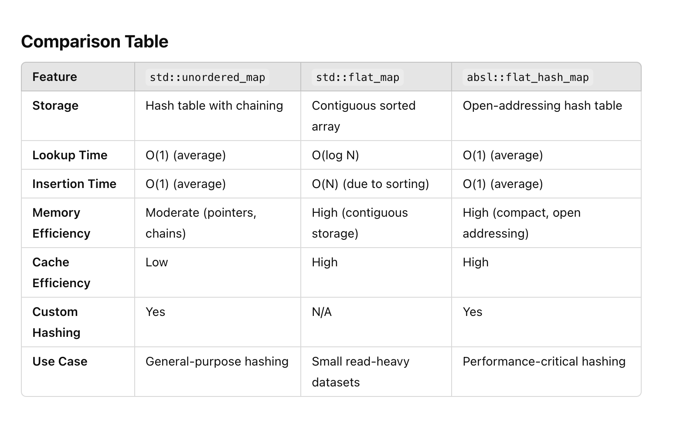

# hashtable vs flat_map vs swisstable(flat_hash_map)

### **Recommendations**

1.  Use **std::unordered_map** for general-purpose tasks where hashing is preferred, and memory locality isn’t critical.

2.  Use **std::flat_map** for small datasets, read-heavy workloads, or when you care about cache efficiency.

3.  Use **absl::flat_hash_map** for high-performance, large-scale applications where memory usage and speed are critical.
