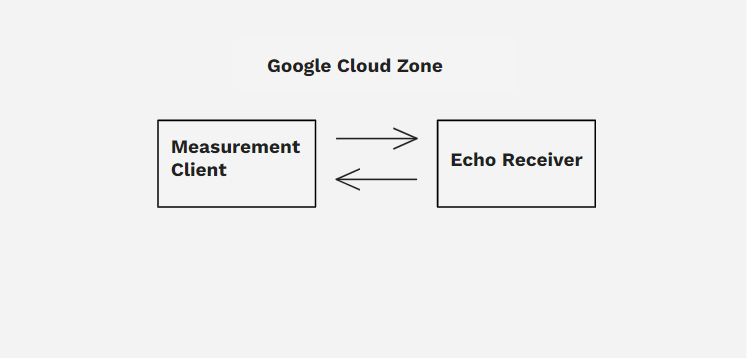
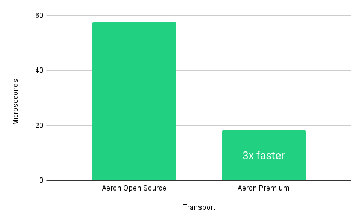
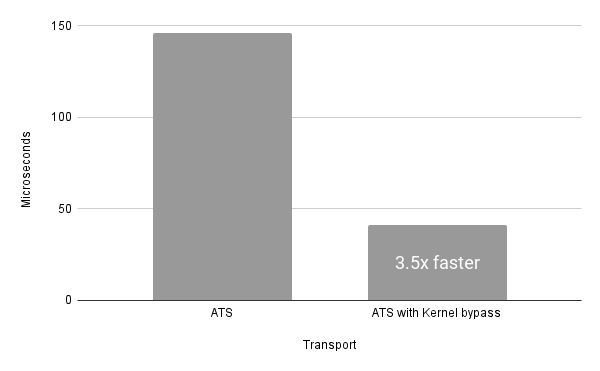
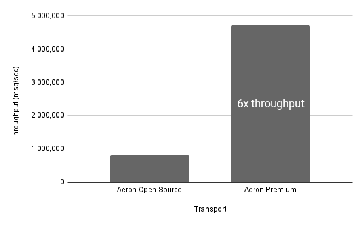
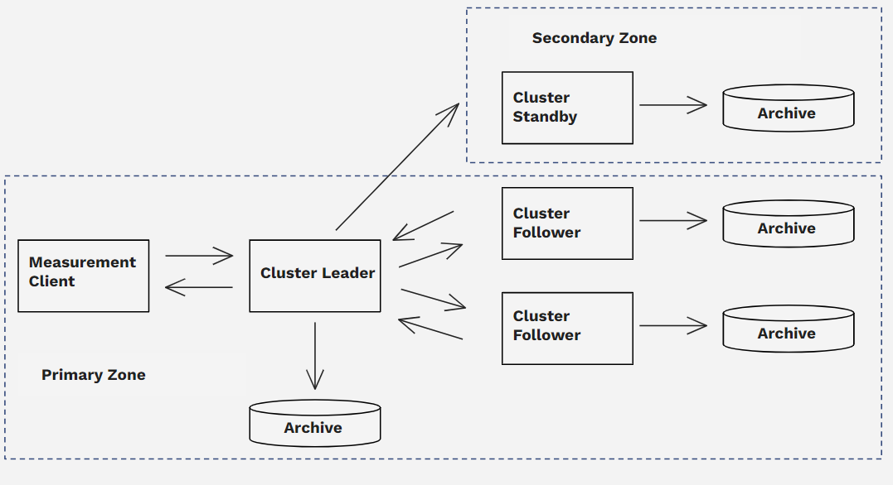
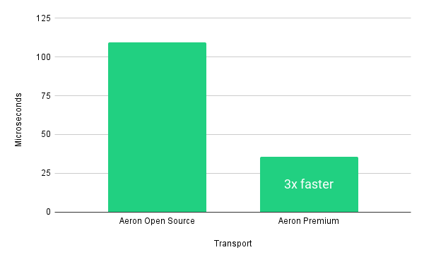
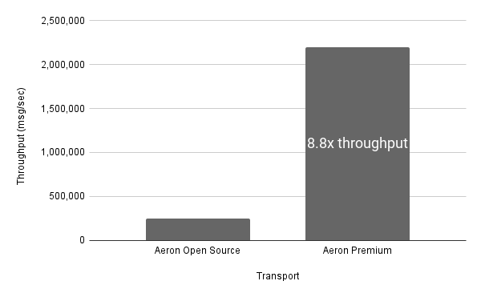
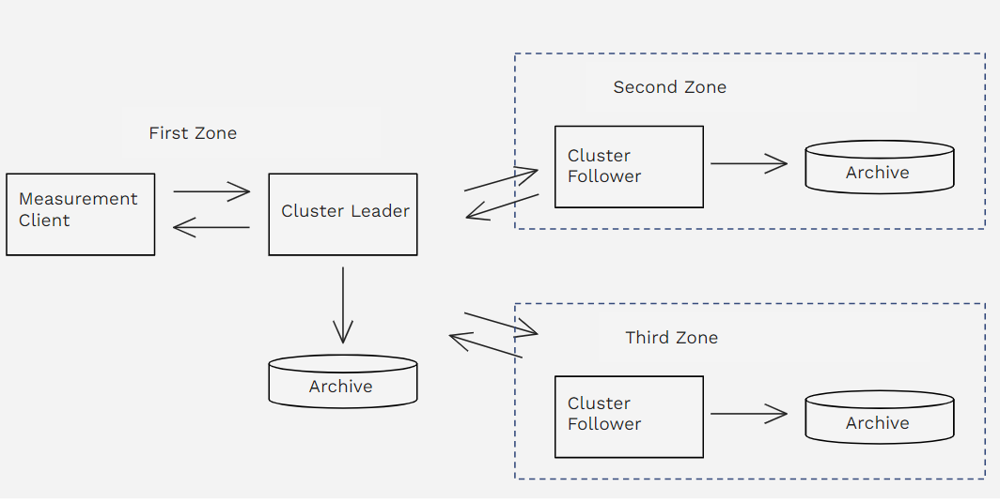
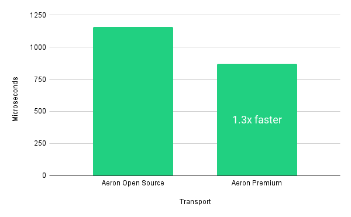
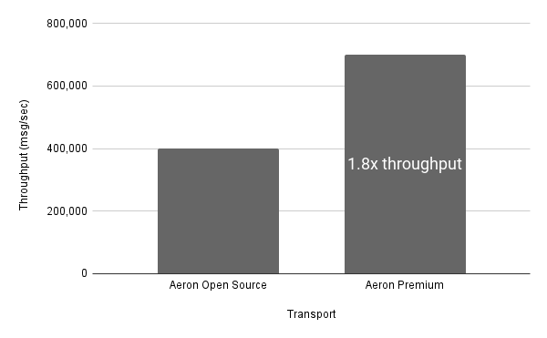

## **Accelerating Cloud Adoption: Aeron achieves sub-20 microsecond performance on Google Cloud**

Capital markets organisations are in a race to deploy workloads to the cloud that demand high performance and zero downtime fault tolerance, such as order matching and real-time trading, having solved for less demanding workloads already. Requirements for such workloads are increasingly driving the need for cloud-native solutions that meet the stringent resiliency and performance demands of capital markets. Aeron’s high-performance message transport and cluster technology is uniquely suited to help move front-office trade execution & risk systems, trading venues and market data distribution into the public cloud.

The Aeron team at [<u>Adaptive</u>](https://weareadaptive.com/?__hstc=17412070.0dbcc929f20aa4f11e7bebcf947f21e4.1716974579491.1716974579491.1716974579491.1&__hssc=17412070.1.1716974579491&__hsfp=1715226203) and Google Cloud have worked in partnership to conduct cloud performance testing of Aeron Open Source and Aeron Premium and illustrate the performance and resilience that can be achieved. The benchmark results demonstrate that the cloud is ready for demanding high-performance, fault-tolerant trading workloads. This post outlines what Aeron does, our benchmarking process, and results.

Our results show that [<u>Aeron Premium</u>](https://aeron.io/aeron-premium/) achieves sub-20 microsecond latency and throughput of 4.7 million messages per second. It’s almost 3 times faster and has 6 times the throughput at the 99th percentile than the open-source edition of Aeron. For clustered state replication, Aeron Premium is 3 times faster while achieving up to 9x throughput compared to Aeron Open Source.

### **Aeron: Revolutionising Cloud-Native Financial Technology**

Aeron is the cloud-native, open-source, low-latency message transport and clustered service technology developed by Adaptive and used by financial services firms globally to build high-performance trading systems and exchanges with microsecond latency and millisecond recovery.

Open-source Aeron consists of Aeron Transport for messaging, and Aeron Cluster for sequenced, persisted, state replication. Aeron Premium provides a set of components to enhance performance, security and resilience. Aeron is widely used in electronic trading and is relied upon for mission-critical systems. A list of public users can be found at [<u>https://www.aeron.io/</u>](http://www.aeron.io/).

### **What problems does Aeron solve?**

Aeron Transport and Aeron Cluster solve two key challenges for capital markets systems in the cloud:

1.  Performance: Low-latency, high-throughput data transport and dissemination

2.  High-availability: Zero downtime and 24/7 systems

### **Performance: Low-latency, high-throughput data transport and dissemination**

#### **The Challenge:**

Ensuring reliable and low-latency data transmission is a critical aspect of systems engaged in low-latency trading. This includes operations such as order entry and market data distribution. When it comes to distributing market data in the cloud, the challenge is greater, as we need to find alternatives to the hardware-based multicast solutions that were effective before the advent of cloud technology. These solutions were instrumental in addressing data fan-out challenges. However, in the cloud environment, multicast requires certain compromises, which impacts the performance that capital markets firms are accustomed to.

#### **The Solution:**

There are very few solutions available today that are able to effectively address this challenge. Aeron Transport is able to reliably and predictably transport data across inter-process communication (IPC), local and wide area networks. It adds single-digit microsecond overhead to the latency of the underlying network and uses flow and congestion control to allow for effective use in today’s multi-tenant high-capacity networks.

Aeron Transport is especially well-suited to message transport in the cloud, with features such as:

- User Datagram Protocol (UDP)-based messaging with capital markets-tuned flow- and congestion-control algorithms.

- Multi-destination cast, which provides a high throughput multicast-like pattern for the cloud.

- Data Plane Development Kit (DPDK) kernel bypass in the Aeron Premium edition, which provides much faster network throughput rates and low latencies, by directly accessing the underlying physical network card.

- Natural batching, which enables asynchronous message passing to reach incredibly high throughput.

- For reliable messaging, Aeron Transport records and replays your data to storage. This enables users to create fast, complex messaging topologies tuned for their requirements, including large-scale, reliable market data distribution.

These features come together with Google Cloud’s latest developments in C3 instance types and [<u>DPDK</u>](https://cloud.google.com/compute/docs/networking/use-dpdk) to allow Aeron Transport to transmit data reliably at sub-20 microsecond rates, with minimal jitter at the 99th percentile. This unlocks a wealth of opportunities for capital markets organisations making the strategic move to the cloud.

### **High Availability: 24/7, ‘always on’ systems**

#### **The Challenge:**

Capital markets systems demand consistency, performance, and sequencing as well as recovery time objectives (RTO) and recovery point objectives (RPO) in the order of milliseconds. Traditional cloud approaches to resilience have adopted a scaled architectural approach that makes trade-offs between data consistency and availability. To meet performance demands, firms often run entire markets on one or two machines, making high-risk sacrifices with data consistency or availability in the process.

In outage scenarios where data consistency or the ordering of transactions has been traded for performance, recovery entails extremely complex reconciliations and, ultimately, some of the costliest payouts in compensation to impacted customers, not to mention the associated legal, regulatory and brand impact.

In addition, while the cloud engineering pattern offers the convenience of fast provisioning and scalability, the use of underlying hardware can change at any time; network interfaces are patched, processes are migrated between machines, and local storage can disappear. Providing 24×7 ‘always-on’ services in this context is a hard challenge to solve.

#### **The Solution:** 

Aeron Cluster provides developers with a resilient low-latency platform that can process over two million messages per second with a 99th percentile latency of 36 microseconds (detailed results are in the Benchmark section).

A cluster leader node handles all active workloads, while follower nodes reliably replicate the leader and seamlessly continue operations in the event of a failure or planned downtime of the leader node.

When underlying cloud services are restarted or migrated, Aeron Cluster continues operation with seamless recovery. Google’s C3 Advanced Maintenance can also notify you up to 7 days in advance of maintenance needed on a given node, allowing for millisecond failover to a follower node. Using Aeron Cluster and Google’s C3 together, organisations can gracefully manage changes to the stack irrespective of the source of change. This includes hot upgrades of software or infrastructure, enabling new features, and adding or removing nodes without any service interruptions.

Using this architecture, developers are able to build highly-available, resilient systems with a minimum of infrastructure and achieve outstanding throughput and performance. Developers concentrate on the logic of their business domain, relying on the resilience guarantees provided by Aeron Cluster for their RTO and RPO needs.

### **Benchmark Methodology**

Our testing has shown that Aeron is a global leader in predictable throughput and latency on Google Cloud. We believe that open, transparent, replicable performance tests are the only ones worth reviewing, so we have made the source code of the benchmarks that we ran open-source, and published a testing set-up guide for readers to set-up and run these tests themselves – see the end of this post for links. We also have a set of infrastructure provisioning modules that help with the set-up and deployment of the benchmark tests – please get in touch if you are interested in using these to help with test set-up on Google Cloud.

Our first phase of testing with Aeron Transport pushed the limits of the Google Cloud network for throughput and latency. In this phase, we also tested Aeron Transport Security (ATS), an Aeron Premium component that uses industry-standard cryptography. In the second phase, we tested Aeron Cluster which is built on top of Aeron Transport, to show the throughput and latency that a highly available system using Aeron Cluster could achieve.

We tested both open-source Aeron and Aeron Premium which uses DPDK kernel bypass to access the network card. Open-source Aeron, on the other hand, uses BSD sockets. The Aeron DPDK kernel bypass allows applications to directly access network interfaces and hardware resources on virtual and physical instances. This reduces the overhead associated with traditional kernel-based networking and improves messaging latency and throughput. Testing was done using Aeron 1.43.0. in Google Cloud’s US Central Zone.

### **Aeron Transport – Cloud Performance Testing Results**

In this phase we tested Aeron Transport without persistence to find the latency of the round trip of a message between a measurement client and a receiver that echoes the message back on the Google Cloud network. We also tested Aeron Transport Security (ATS), an Aeron Premium component that uses industry-standard cryptography to encrypt messages sent using Aeron Transport. We used the Google Cloud compact placement policy to specify that the Google Cloud instances be physically placed closer to each other within a Google Cloud Zone.

***Figure 1: Aeron Transport Test Set-up in a Google Cloud Zone***

#### **Latency Test Results**

To measure latency, we performed three test runs of our test case: an echo test of a 288-byte message at 100,000 messages per second. The results were as follows:

- Latency of 57 microseconds, dropping to 18 microseconds with Aeron Premium kernel bypass\* at 100k messages/second.

- For encrypted transport, using Aeron Premium Transport Security (ATS) and kernel bypass, a latency of 41 microseconds\* was measured. This compares to 146 microseconds without kernel bypass.

***Figure 2 (above): Latency of Aeron Transport Open Source compared with Aeron Premium***

***Figure 3 (above): Latency of Aeron Transport Security compared with Aeron Transport Security with Kernel bypass***

#### **Throughput Test Results**

For throughput, we wanted to understand the maximum while still meeting a given latency within a Zone. We chose a latency ceiling of one millisecond at the 99th percentile, discarding test runs at throughputs with latency results above this threshold.The results were as follows:

- Throughput of 800,000 messages/second with Aeron open source. With Aeron Premium, throughput leapt six-fold, to over 4,700,000 messages/second.

***Figure 4: Throughput of Aeron Transport Open Source compared with Aeron Premium***

### **Aeron Cluster – Cloud Performance TestingResults**

In the Aeron Cluster phase of testing, we benchmarked the performance a round-trip message where the message is replicated and persisted across a three node Aeron Cluster deployment. We tested two types of deployment, the first leveraging Google Cloud “compact” placement policy, the second deploying cluster nodes across three Google Cloud Zones. For more information on how Aeron Cluster works, please refer to [<u>Aeron.io/docs</u>](https://aeron.io/docs/).

#### **Deployment Set-up 1: Using “Compact” placement policy to optimise for performance**

Here, we deployed Aeron Cluster nodes in the same Google Cloud Zone using a “compact” placement policy. This means that all of the Cluster nodes and the measurement client node were all located in the same Zone.

This configuration gives latency benefits but it comes with a redundancy trade-off when compared to deploying nodes across Zones. When deployed across Zones, if the primary Zone is lost, the system can be brought back up from the messages replicated to a cluster node in a secondary Zone (appendix).

For this configuration, where nodes are deployed in the same Zone, if the Zone is lost, the system can be brought back up through the use of Aeron Premium Cluster Standby.

***Figure 5: Aeron Cluster Test Set-up using Google Cloud placement policy to deploy all cluster nodes in a Primary Zone and Aeron Cluster Standby in a Secondary Zone.***

As with the Aeron Transport tests, our Aeron Cluster testing covered latency and throughput.

#### **Latency Test Results**

For latency, we tested the performance of Aeron Cluster with a 288-byte message at 100,000 messages per second. The results of the testing were as follows:

- A round trip time of 109 microseconds when using Aeron open source. Aeron Premium, is 3 times faster at 36 microseconds at the 99th percentile for 100,000 messages per second of a 288-byte message.

***Figure 6: Latency of Aeron Cluster Open Source compared with Aeron Premium***

#### **Throughput Test Results**

For throughput, we wanted to understand the maximum throughput of a 288-byte message while still meeting a given latency within a Zone. We chose a latency ceiling of one millisecond at the 99th percentile, stopping at throughputs that gave results above this threshold. The results of the testing were as follows:

- Throughput of over 250,000 messages a second with Aeron open source while staying under our one millisecond threshold. This compares with over 2,200,000 million messages a second with Aeron Premium. This is an 8.8 fold improvement over already incredibly impressive results.

***Figure 7: Throughput of Aeron Cluster Open Source compared with Aeron Premium***

#### **Deployment Set-up 2: Deploying cluster nodes across three Google Cloud Zones**

In the second set of Aeron Cluster tests, we deployed Aeron Cluster nodes across different Zones within the same region. That means that messages sent to the cluster are replicated to a quorum of other nodes across at least two other Zones. This setup gives enhanced reliability, but comes with a trade-off in performance. The latency of transmitting data to nodes in other Zones is higher than within a single Zone.

***Figure 8: Aeron Cluster Test Set-up deployed across 3 Google Cloud Zones***

#### **Latency Test Results**

For latency, we tested the performance of Aeron Cluster with a 288-byte message at 100,000 messages per second. The results of the testing were as follows:

- A round trip of 1,159 microseconds using Aeron open source, at the 99th percentile. With Aeron Premium the latency was 872 microseconds, again at the 99th percentile.

***Figure 9: Latency of Aeron Cluster Open Source compared with Aeron Premium***

#### **Throughput Test Results**

For the throughput tests, we increased the acceptable latency threshold before we disregarded our test results. This was to account for the increased network latency from having the cluster nodes deployed across Zones. The latency threshold was set to 10 milliseconds, at the 99th percentile. The results of the testing were as follows:

- Aeron open source sustained 400,000 288-byte messages per second while staying under our 10 millisecond threshold. Using Aeron Premium, throughput improved nearly 2x, to over 700,000 messages per second.

***Figure 10: Throughput of Aeron Cluster Open Source compared with Aeron Premium***

### **Open, transparent and repeatable test results**

The Aeron team at Adaptive believe in performance results that are straightforward to understand and can be independently repeated and verified. We hope this post has provided you with a transparent and clear understanding of how Aeron works and the impressive performance it can achieve on Google Cloud.

We have made our performance [<u>benchmarks project open source</u>](https://github.com/real-logic/benchmarks) so you can run these performance tests yourself and confirm the above results are reliable and repeatable (please get in touch if you wish to discuss access to Aeron Premium). We will happily talk about the results with you and have published a [<u>step-by-step testing guide</u>](https://hub.aeron.io/aeron-performance-testing-google-cloud) to walk you through how to set up your infrastructure to achieve the same results with the best performance for your application.

We also have a set of infrastructure provisioning modules that help with the set-up and deployment of the benchmark tests – [<u>please get in touch</u>](https://eu1.hubs.ly/H077Kdx0) if you are interested in using these to help with test set-up on Google Cloud.

### **Cloud Performance Testing: Summary**

Our testing has shown that Aeron is a global leader in predictable throughput and latency on Google Cloud.

Aeron Transport comes together with Google Cloud’s latest developments in C3 instance types to allow the open-source edition to achieve round trip times of sub-60 microseconds. When combined with [<u>DPDK</u>](https://cloud.google.com/compute/docs/networking/use-dpdk) in Aeron Premium, Aeron Transport is able to transmit data reliably and at sub-20 microsecond rates on Google Cloud and achieve throughput of around 5 million messages per second.

Using Aeron Cluster and Google Cloud together, organisations can achieve millisecond-level recovery with zero data loss while maintaining latency of around 100 microseconds and throughput of multiple million messages per second. Aeron Premium improves the latency of Aeron Cluster by 3 fold and throughput by almost 9 fold.

Aeron is a clear leader when considering the foundational infrastructure to deploy for a technology investment that will have a lifespan of 10 years or more. The Aeron team are looking forward to working together with Google Cloud on forthcoming releases of Aeron and planned investments by Google Cloud in areas such as time synchronization, multicast, and observability to further satisfy the resiliency and performance demands of capital markets in the cloud.

If you are interested in using Aeron to move your trading infrastructure to the cloud, please [<u>get in touch</u>](https://eu1.hubs.ly/H077Kdx0). If you want to run these performance tests in your own environment, you can request the [<u>Aeron Performance Testing guide</u>](https://hub.aeron.io/aeron-performance-testing-google-cloud). We run regular community meet-ups; if you’d like to meet and discuss your needs, you can [<u>register here</u>](https://eu1.hubs.ly/H077Kdx0).

### **Further Aeron & Cloud Performance Testing Resources**

- **Step-by-Step guide to benchmarking Aeron in your Google Cloud environment. [<u>Download \>\></u>](https://hub.aeron.io/aeron-performance-testing-google-cloud)**

- **Open-source benchmark project. [<u>Read on \>\></u>](https://github.com/real-logic/benchmarks)**

- **Aeron Community MeetUps – London & New York. [<u>More information \>\></u>](https://hub.aeron.io/aeron-community-meetup-spring-roadshow-2024)**

- **Contact us for access to Aeron Premium and our infrastructure provisioning modules that help with the set-up and deployment of the benchmark tests. [<u>Chat to us \>\></u>](https://eu1.hubs.ly/H077Kdx0)**
