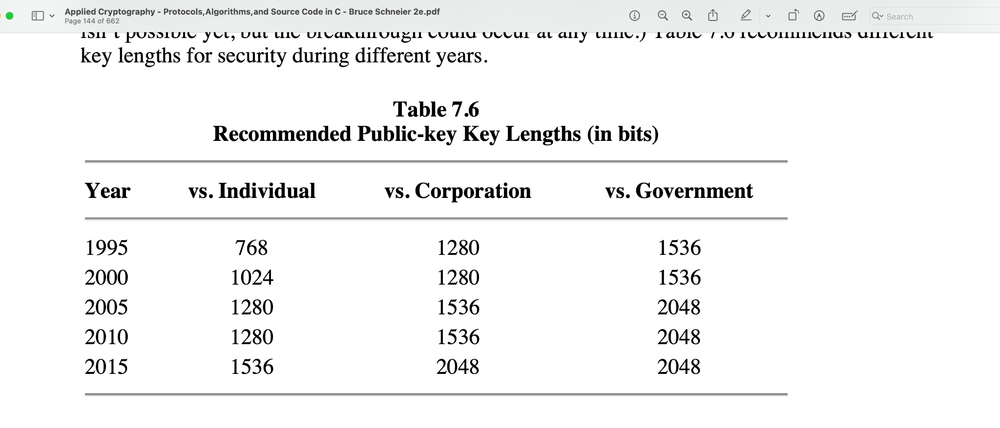
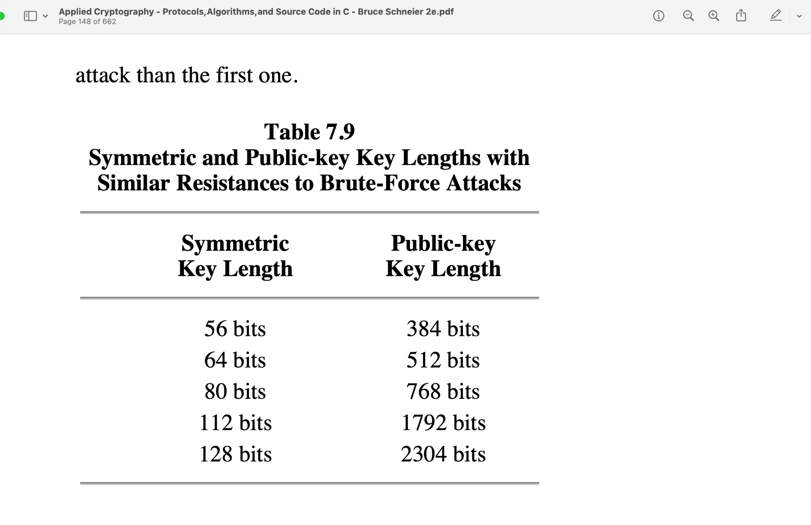
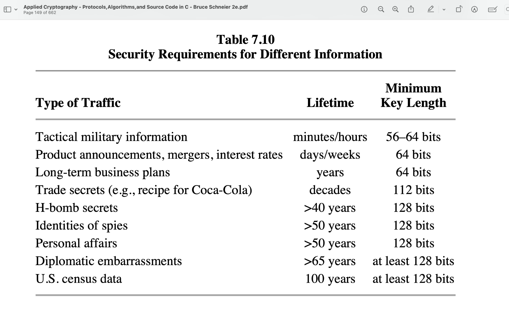
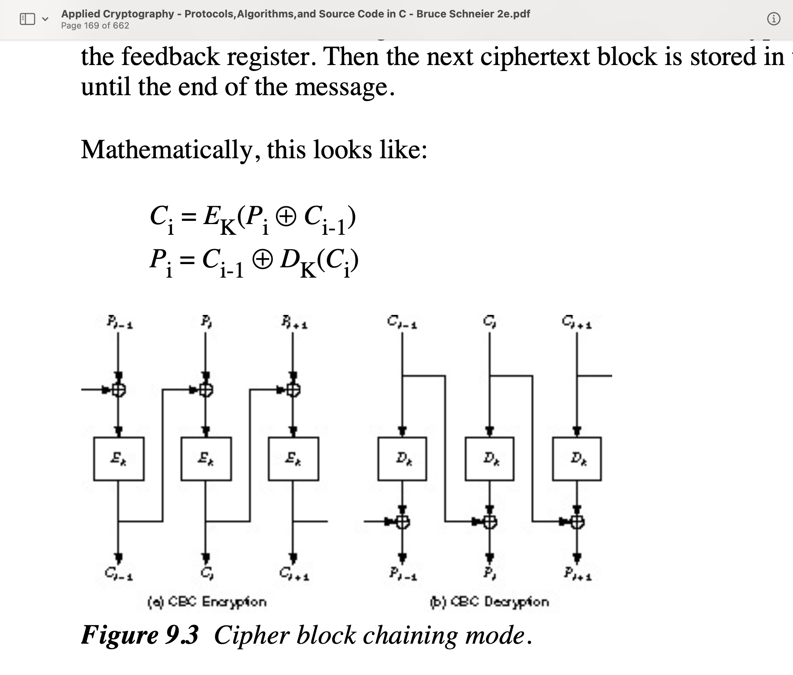
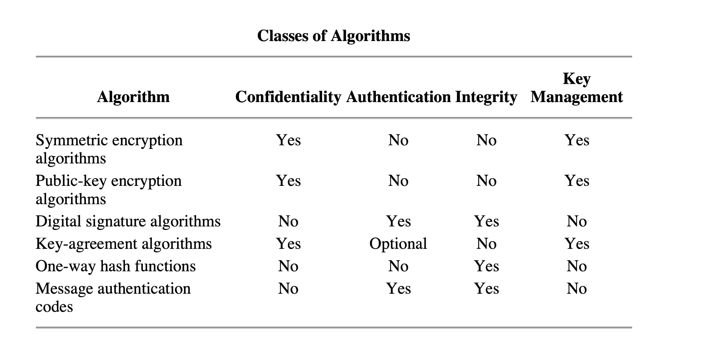
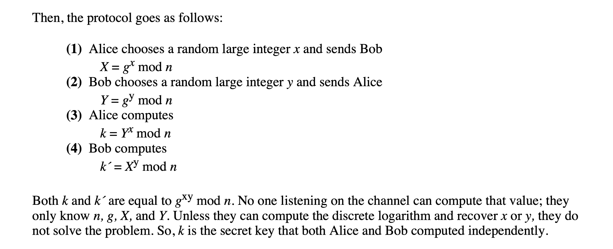

## Asymmetric cryptograph

- Asymmetric cryptograph is base on trapdoor one-way hash function

given x, calculate f(x) is easy given f(x), calculate x is hard but if we have f(x) and y \[private-key\], calculate x is easy

This is how Alice can send a message to Bob using public-key cryptography: (1) Alice and Bob agree on a public-key cryptosystem. (2) Bob sends Alice his public key. (3) Alice encrypts her message using Bob’s public key and sends it to Bob. (4) Bob decrypts Alice’s message using his private key.

Notice how public-key cryptography solves the key-management problem with symmetric cryptosystems.

In the real world, public-key algorithms are not a substitute for symmetric algorithms. They are not used to encrypt messages; they are used to encrypt keys. There are two reasons for this:

1.  Public-key algorithms are slow. Symmetric algorithms are generally at least 1000 times faster than public-key algorithms. Yes, computers are getting faster and faster, and in 15 years computers will be able to do public-key cryptography at speeds comparable to symmetric cryptography today. But bandwidth requirements are also increasing, and there will always be the need to encrypt data faster than public-key cryptography can manage.

2.  Public-key cryptosystems are vulnerable to chosen-plaintext attacks. If C = E(P), when P is one plaintext out of a set of n possible plaintexts, then a cryptanalyst only has to encrypt all n possible plaintexts and compare the results with C (remember, the encryption key is public). He won’t be able to recover the decryption key this way, but he will be able to determine P.

A chosen-plaintext attack can be particularly effective if there are relatively few possible encrypted messages. For example, if P were a dollar amount less than \$1,000,000, this attack would work; the cryptanalyst tries all million possible dollar amounts. (Probabilistic encryption solves the problem; see Section 23.15.) Even if P is not as well-defined, this attack can be very effective. Simply knowing that a ciphertext does not correspond to a particular plaintext can be useful information. Symmetric cryptosystems are not vulnerable to this attack because a cryptanalyst cannot perform trial encryptions with an unknown key.

In most practical implementations public-key cryptography is used to secure and distribute session keys; those session keys are used with symmetric algorithms to secure message traffic \[879\]. This is sometimes called a hybrid cryptosystem.

\(1\) Bob sends Alice his public key. (2) Alice generates a random session key, K, encrypts it using Bob’s public key, and sends it to Bob. E (K) B (3) Bob decrypts Alice’s message using his private key to recover the session key. D (E (K))=K BB (4) Both of them encrypt their communications using the same session key.

上面就是HTTPS/TLS 原理

## Merkle’s Puzzles

## Signing Documents with Public-Key Cryptography and One-Way Hash Functions

In practical implementations, public-key algorithms are often too inefficient to sign long documents. To save time, digital signature protocols are often implemented with one-way hash functions \[432,433\]. Instead of signing a document, Alice signs the hash of the document. In this protocol, both the one-way hash function and the digital signature algorithm are agreed upon beforehand. (1) Alice produces a one-way hash of a document. (2) Alice encrypts the hash with her private key, thereby signing the document. (3) Alice sends the document and the signed hash to Bob. (4) Bob produces a one-way hash of the document that Alice sent. He then, using the digital signature algorithm, decrypts the signed hash with Alice’s public key. If the signed hash matches the hash he generated, the signature is valid.

## 2.7 Digital Signatures with Encryption

By combining digital signatures with public-key cryptography, we develop a protocol that combines the security of encryption with the authenticity of digital signatures. Think of a letter from your mother: The signature provides proof of authorship and the envelope provides privacy. (1) Alice signs the message with her private key. S (M) A (2) Alice encrypts the signed message with Bob’s public key and sends it to Bob. E (S (M)) BA (3) Bob decrypts the message with his private key. D (E (S (M))) = S (M) BBA A (4) Bob verifies with Alice’s public key and recovers the message. V (S (M))=M

In electronic correspondence as well, signing before encrypting is a prudent practice \[48\]. Not only is it more secure—an adversary can’t remove a signature from an encrypted message and add his own—but there are legal considerations: If the text to be signed is not visible to the signer when he affixes his signature, then the signature may have little legal force \[1312\]. And there are some cryptanalytic attacks against this technique with RSA signatures (see Section 19.3).

## Resending the Message as a Receipt

------ Mallory hacking

## Foiling the Resend Attack

In general, then, the following protocol is secure as the public-key algorithm used: (1) Alice signs a message. (2) Alice encrypts the message and signature with Bob’s public key (using a different encryption algorithm than for the signature) and sends it to Bob. (3) Bob decrypts the message with his private key. (4) Bob verifies Alice’s signature.

## Man-in-the-Middle Attack

break the public-key algorithm

\(1\) Alice sends Bob her public key. Mallory intercepts this key and sends Bob his own public key. (2) Bob sends Alice his public key. Mallory intercepts this key and sends Alice his own public key. (3) When Alice sends a message to Bob, encrypted in "Bob’s" public key, Mallory intercepts it. Since the message is really encrypted with his own public key, he decrypts it with his private key, re-encrypts it with Bob’s public key, and sends it on to Bob. (4) When Bob sends a message to Alice, encrypted in "Alice’s" public key, Mallory intercepts it. Since the message is really encrypted with his own public key, he decrypts it with his private key, re-encrypts it with Alice’s public key, and sends it on to Alice.

## Interlock Protocol

The interlock protocol, invented by Ron Rivest and Adi Shamir \[1327\], has a good chance of foiling the man-in-the-middle attack. Here’s how it works: (1) Alice sends Bob her public key. (2) Bob sends Alice his public key. (3) Alice encrypts her message using Bob’s public key. She sends half of the encrypted message to Bob. (4) Bob encrypts his message using Alice’s public key. He sends half of the encrypted message to Alice. (5) Alice sends the other half of her encrypted message to Bob. (6) Bob puts the two halves of Alice’s message together and decrypts it with his private key. Bob sends the other half of his encrypted message to Alice. (7) Alice puts the two halves of Bob’s message together and decrypts it with her private key.

## Public Key Length

## 10.2 Public-Key Cryptography versus Symmetric Cryptography

Public-key cryptography and symmetric cryptography are different sorts of animals; they solve different sorts of problems. Symmetric cryptography is best for encrypting data. It is orders of magnitude faster and is not susceptible to chosen-ciphertext attacks. Public-key cryptography can do things that symmetric cryptography can’t; it is best for key management and a myriad of protocols discussed in Part I.

Chapter 22

Key-Exchange Algorithms

## 22.1 Diffie-Hellman

Diffie-Hellman was the first public-key algorithm ever invented, way back in 1976 \[496\]. It gets its security from the difficulty of calculating discrete logarithms in a finite field, as compared with the ease of calculating exponentiation in the same field. Diffie-Hellman can be used for key distribution—Alice and Bob can use this algorithm to generate a secret key—but it cannot be used to encrypt and decrypt messages.

The math is simple. First, Alice and Bob agree on a large prime, n and g, such that g is primitive mod n. These two integers don’t have to be secret; Alice and Bob can agree to them over some insecure channel. They can even be common among a group of users. It doesn’t matter.

