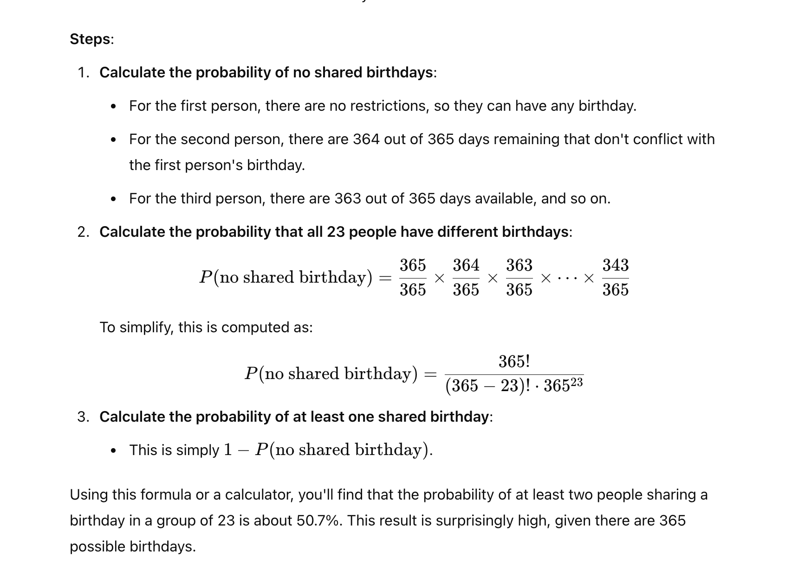

Certainly! The birthday problem demonstrates how counterintuitive probabilities can be. Let’s look at a simple example:

**Scenario**: Imagine you have a group of 23 people, and you want to determine the probability that at least two of them share the same birthday.

**Steps**:

1.  **Calculate the probability of no shared birthdays**:

    - For the first person, there are no restrictions, so they can have any birthday.

    - For the second person, there are 364 out of 365 days remaining that don't conflict with the first person's birthday.

    - For the third person, there are 363 out of 365 days available, and so on.

2.  **Calculate the probability that all 23 people have different birthdays**:

> \[ P(\text{no shared birthday}) = \frac{365}{365} \times \frac{364}{365} \times \frac{363}{365} \times \cdots \times \frac{343}{365} \]
>
> To simplify, this is computed as:
>
> \[ P(\text{no shared birthday}) = \frac{365!}{(365-23)! \cdot 365^{23}} \]

3.  **Calculate the probability of at least one shared birthday**:

    - This is simply (1 - P(\text{no shared birthday})).

Using this formula or a calculator, you'll find that the probability of at least two people sharing a birthday in a group of 23 is about 50.7%. This result is surprisingly high, given there are 365 possible birthdays.

**Why It’s Surprising**: The key insight is that we’re not comparing each person to a specific birthday but rather checking the chance of any two people having the same birthday among all possible pairs. With 23 people, there are 253 possible pairs ((\frac{23 \times 22}{2})), which makes it quite likely that at least one pair will have the same birthday.

