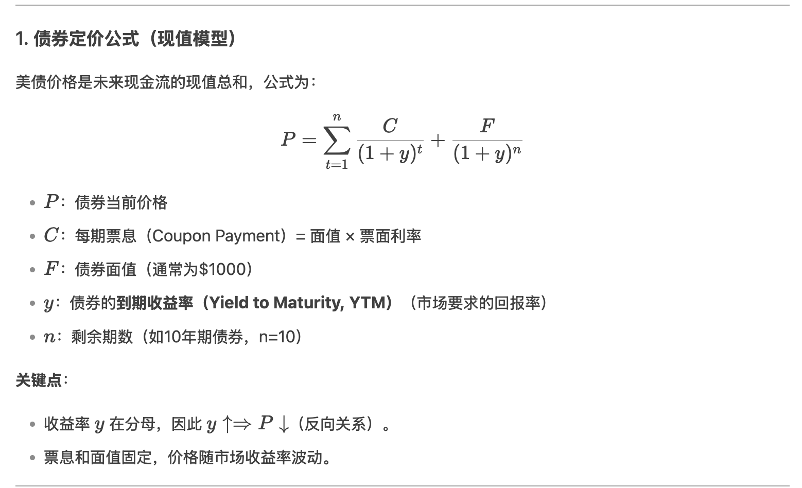
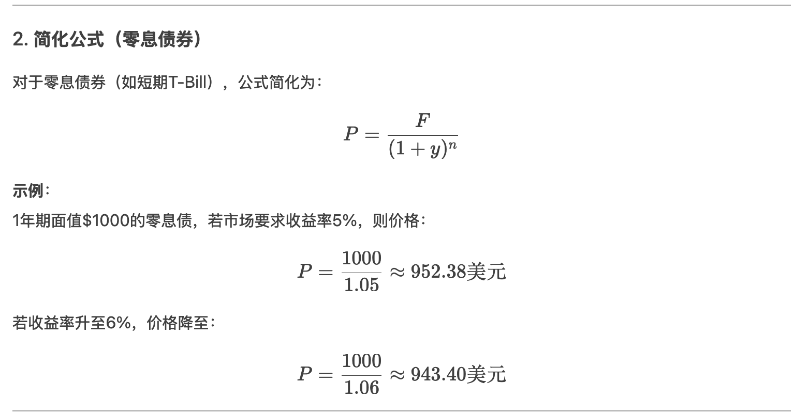
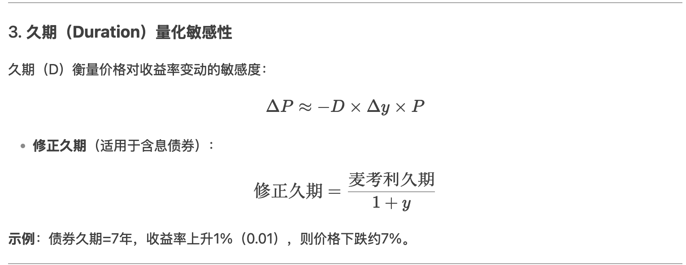
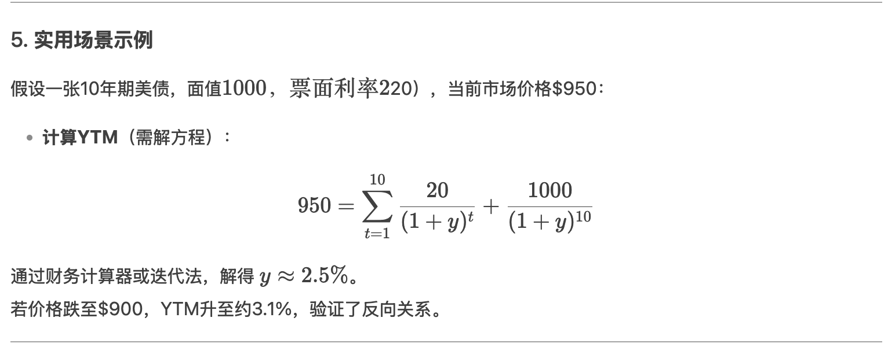

# **如何解读美债**

美国国债（美债）是全球金融市场的重要指标，其价格、收益率、供需变化等数据反映了市场对美国经济、货币政策及全球资本流动的预期。以下是解读美债的几个关键维度：

### 1. **美债的基本机制**

- **价格与收益率的关系**：美债价格与收益率呈**反向变动**。当市场抛售美债导致价格下跌时，收益率会上升（例如美联储加息时）；反之，若避险需求推高价格，收益率会下降。

- **期限差异**：短期国债（如1年期）对货币政策敏感，长期国债（如10年期）则更多反映经济长期预期（通胀、增长等）。

### 2. **核心指标解读**

- **收益率曲线**：

  - **正常向上倾斜**：长期收益率高于短期，反映经济扩张预期。

  - **倒挂**（短期高于长期）：通常预示经济衰退风险（如2019年倒挂后2020年衰退）。

  - **平坦化**：可能暗示政策紧缩或增长放缓。

- **实际收益率**：名义收益率减去通胀预期（如TIPS收益率），反映真实资金成本。若实际收益率攀升，可能抑制风险资产（如股市）估值。

### 3. **影响美债的因素**

- **美联储政策**：

  - 加息周期：短端收益率上升，曲线可能扁平化。

  - 量化紧缩（QT）：减少购债需求，推高长期收益率。

- **经济数据**：

  - 通胀超预期 → 债券抛售 → 收益率飙升（如2022年CPI触9%时10年期美债破4%）。

  - 就业疲软或GDP下滑 → 避险买入 → 收益率下降。

- **全球资本流动**：

  - 海外投资者（如日本、中国）增持或减持美债会影响供需。

  - 地缘危机（如俄乌战争）推高避险需求，压低收益率。

- **财政赤字**：发债规模扩大可能加剧供给压力，抬升收益率。

### 4. **美债与市场的联动**

- **股市**：美债收益率上升（尤其实际利率）可能打压高估值科技股（贴现率上升）。

- **美元**：收益率走高常伴随美元走强（利差优势）。

- **黄金**：实际利率上升利空黄金（无息资产机会成本增加）。

- **新兴市场**：美债收益率飙升可能引发资本外流（如2013年“缩减恐慌”）。

### 5. **当前关注点（2023-2024年）**

- **政策转向预期**：美联储何时结束加息？市场博弈“higher for longer”还是提前降息。

- **期限溢价**：长期美债是否因债务可持续性担忧要求更高风险补偿。

- **替代货币**：去美元化趋势下，部分央行减持美债的影响（如中国持仓降至8000亿美元以下）。

### 6. **分析工具**

- **数据来源**：美联储FRED数据库、美国财政部（TIC报告）、CME FedWatch工具（利率概率）。

- **关键指标**：10年期收益率、2年-10年利差、TIPS盈亏平衡通胀率。

### **总结**

美债不仅是美国融资工具，更是全球资产定价的“锚”。解读时需结合宏观政策、市场情绪与跨境资本流动。例如，2023年10年期美债收益率破5%的背后，是强韧经济+高赤字+QT的叠加效应，而2024年回落则反映降息预期。投资者需动态分析多重信号。

# **美债价格与收益率的关系公式**

美国国债的价格与收益率之间存在明确的数学关系，可通过**债券定价公式**和**收益率计算公式**来量化。以下是关键公式及逻辑解析：

### 1. **债券定价公式（现值模型）**

美债价格是未来现金流的现值总和，公式为：  
\[ P = \sum\_{t=1}^{n} \frac{C}{(1 + y)^t} + \frac{F}{(1 + y)^n} \]

- **( P )**：债券当前价格

- **( C )**：每期票息（Coupon Payment）= 面值 × 票面利率

- **( F )**：债券面值（通常为\$1000）

- **( y )**：债券的**到期收益率（Yield to Maturity, YTM）**（市场要求的回报率）

- **( n )**：剩余期数（如10年期债券，n=10）

**关键点**：

- 收益率 ( y ) 在分母，因此 **( y \uparrow \Rightarrow P \downarrow )**（反向关系）。

- 票息和面值固定，价格随市场收益率波动。

### 2. **简化公式（零息债券）**

对于零息债券（如短期T-Bill），公式简化为：  
\[ P = \frac{F}{(1 + y)^n} \]  
**示例**：  
1年期面值\$1000的零息债，若市场要求收益率5%，则价格：  
\[ P = \frac{1000}{1.05} \approx 952.38 \text{美元} \]  
若收益率升至6%，价格降至：  
\[ P = \frac{1000}{1.06} \approx 943.40 \text{美元} \]

### 3. **久期（Duration）量化敏感性**

久期（D）衡量价格对收益率变动的敏感度：  
\[ \Delta P \approx -D \times \Delta y \times P \]

- **修正久期**（适用于含息债券）：  
  \[ \text{修正久期} = \frac{\text{麦考利久期}}{1 + y} \]  
  **示例**：债券久期=7年，收益率上升1%（0.01），则价格下跌约7%。

### 4. **市场中的反向关系逻辑**

- **需求驱动**：若市场抛售美债（需求↓），价格下跌 → 买方要求更高收益率补偿风险（( y \uparrow )）。

- **政策影响**：美联储加息 → 新发债券收益率更高 → 旧债吸引力下降 → 价格下跌。

### 5. **实用场景示例**

假设一张10年期美债，面值\$1000，票面利率2%（年付\$20），当前市场价格\$950：

- **计算YTM**（需解方程）：  
  \[ 950 = \sum\_{t=1}^{10} \frac{20}{(1 + y)^t} + \frac{1000}{(1 + y)^{10}} \]  
  通过财务计算器或迭代法，解得 ( y \approx 2.5% )。  
  若价格跌至\$900，YTM升至约3.1%，验证了反向关系。

### 总结

美债价格与收益率的数学关系本质是**折现现金流模型**的体现，市场供需和政策变化通过影响收益率（折现率）来驱动价格波动。交易中常用久期来管理利率风险。

# **为什么金融市场，金融新闻讨论美债，总是关注收益率而不是价格**

金融市场和金融新闻通常更关注美债的**收益率**而非**价格**，主要原因在于收益率更能直接反映市场情绪、经济预期和政策走向，且具有更强的可比性和实用性。以下是具体原因分析：

### 1. **收益率是资金成本的直接指标**

- **影响借贷利率**：美债收益率（尤其是10年期）被视为**无风险利率**的基准，直接影响房贷、企业债、股票估值等各类资产的定价。例如：

  - 10年期美债收益率上升 → 抵押贷款利率跟涨 → 抑制房地产需求。

  - 企业发债成本上升 → 压制美股盈利预期（尤其成长股）。

- **价格需反向解读**：价格上涨=收益率下降，但市场更习惯直接讨论“资金变贵还是便宜”。

### 2. **收益率反映经济预期**

- **通胀预期**：长期国债收益率隐含市场对通胀的看法（如10年期与TIPS利差反映盈亏平衡通胀率）。

- **增长预期**：收益率上升可能预示经济过热，下降可能暗示衰退担忧。

- **政策信号**：短端收益率（如2年期）对美联储利率政策敏感，是加息/降息预期的“温度计”。

### 3. **价格受债券特性干扰，收益率更标准化**

- **票息与期限差异**：不同美债的票面利率和到期日不同，价格无法直接比较。例如：

  - 一张票面利率2%的旧债和5%的新债，价格差异大，但收益率可直接对比。

- **久期影响**：长期债价格对收益率变化更敏感，但市场更关心收益率变动本身而非绝对价格。

### 4. **收益率曲线的信息量更大**

- **期限利差**（如10年-2年利差）是预测经济衰退的关键指标，需通过收益率计算：

  - 利差倒挂（短端\>长端）≈ 衰退信号。

- **价格无法构建此类信号**。

### 5. **交易与定价的便利性**

- **市场报价惯例**：债券交易员通常以收益率报价（如“10年期美债收益率4.3%”），而非价格（如“98.5美元”）。

- **衍生品挂钩**：利率期货、期权等工具直接跟踪收益率，而非价格。

### 6. **国际资本流动的核心参考**

- **利差驱动外汇**：美债收益率 vs. 德债/日债的差异影响美元汇率（如美债收益率上升 → 美元升值）。

- **价格无法跨国比较**：日本投资者关心的是“美债收益率是否高于日债”，而非美债本身的价格。

### 例外情况：何时关注价格？

- **极端波动时期**：如2020年3月流动性危机，美债价格暴跌导致基金爆仓，此时价格变动成为焦点。

- **特定策略需求**：对冲基金做空债券价格时，需计算价格波动带来的盈亏。

### 总结

收益率是美债的“语言”，它直接链接货币政策、经济周期和资产定价，而价格只是这一逻辑的衍生结果。正如讨论油价时关注“每桶美元价格”而非“一桶油的体积”，收益率是金融市场更高效的信息载体。

# **美债收益率上涨，代表资金利息高了，资金变贵了是吗？**

是的，**美债收益率上涨确实意味着资金成本上升，市场中的“钱变得更贵了”**。这一变化会通过多种渠道影响经济、金融市场和政策决策。以下是具体逻辑和影响的拆解：

### 1. **核心逻辑：收益率=无风险资金成本**

- **美债（尤其是10年期）被视为全球无风险利率的基准**，其收益率上涨直接反映借贷成本的上升：

  - **政府融资成本**：美国财政部发行新债时需支付更高利息，财政赤字压力加大。

  - **市场定价锚**：企业债、房贷、消费贷等利率通常以“美债收益率+风险溢价”定价，跟随上涨。

### 2. **传导链条示例**

| **环节** | **具体影响** |
|----|----|
| **企业融资** | 发债成本上升 → 减少投资或推迟扩张（尤其高负债行业如房地产、科技）。 |
| **房地产市场** | 30年期抵押贷款利率跟踪10年期美债 → 月供增加 → 购房需求降温。 |
| **股票估值** | 贴现率（DCF模型中的分母）上升 → 高成长股未来现金流折现值下降 → 股价承压。 |
| **新兴市场** | 美元资金成本上升 → 资本回流美国 → 新兴市场货币贬值、债务压力加剧。 |

### 3. **为什么“钱变贵”会抑制经济？**

- **需求端**：贷款成本上升 → 企业和个人减少借贷和消费 → 经济增速放缓。

- **供给端**：高融资成本挤压企业利润 → 裁员或缩减生产 → 失业率可能上升。

- **典型案例**：2022年美联储激进加息，10年期美债收益率从1%飙升至4%，直接导致美国房贷利率破7%，房地产市场迅速降温。

### 4. **谁受益于收益率上升？**

- **储户与保守投资者**：银行存款、货币基金收益率提高。

- **保险与养老金机构**：长期负债的贴现率上升，资金缺口压力减轻。

- **做空债券者**：通过押注收益率上涨（价格下跌）获利。

### 5. **关键例外：实际收益率才是“真成本”**

- **名义收益率 vs. 实际收益率**：  
  若收益率上涨由通胀推动（如2022年），**实际收益率=名义收益率-通胀率**可能并未上升，资金成本实际未变。

  - **例如**：10年期美债收益率4%，通胀率3% → 实际成本仅1%。

### 6. **当前语境（2024年）的启示**

- **美联储政策**：若经济韧性持续，高收益率可能成为“新常态”，迫使市场适应更贵的资金。

- **债务可持续性**：美国政府利息支出占GDP比例已超1.5%（历史高位），收益率长期高企将加剧财政风险。

### 总结

美债收益率上涨本质是“资金价格”上涨，其影响如同水涨船高：

- **短期**：抑制通胀、打压风险资产；

- **长期**：可能重塑全球资本配置逻辑。  
  投资者需区分名义与实际收益率，并观察美联储对“贵”的容忍度。
