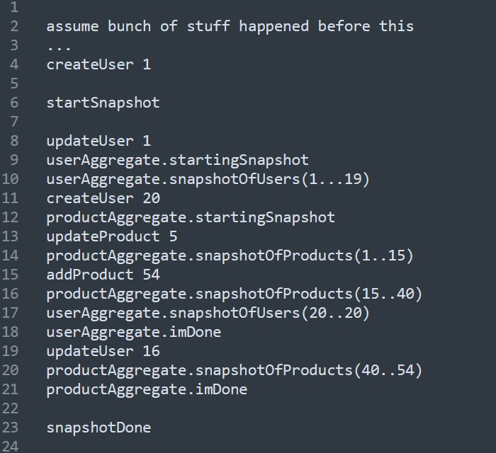

АЛ Р, \[Oct 25, 2024 at 22:09:35\]:

Who is the cheapest liquidity provider ? for basic coins ? BTC ETH

Vachagan Balayan, \[Oct 25, 2024 at 23:47:34\]:

**since i've dealt with market markers pretending to do that for new coins**

**i'd advise you do it yourself with less money but real liquidity**

**you will end up paying them 10k for starters for them to "pretend" to provide liquidity**

**but as soon as someone slightly hits their orders all of a sudden they disappear**

**if its a legit coin, do it yourself, do it on DEX for sure**

**and if there is real demand it wont be hard to get to centralized exchanges**

**some so called crypto exchanges entirly survive on listing business and liquidity providing... while their real business should be trade fees**

**(most of it is scam, avoid it, do it yourself even if its not much liquidity)**

Sahil Agarwal, \[Nov 12, 2024 at 03:57:44\]:

Hey guys! I have been working on trying to understand and learn from the exchange-core library, and how Disruptor works in general. Been lurking on this group as well, and read a lot of great stuff.

I had a question that I was hoping someone could clear my understanding on. From my understanding of the code it seems that the flow of an order is Risk Engine Preprocessing (R1) -\> Matching Engine -\> Risk Engine Risk Release (R2). However the code seems to suggest that R1 -\> Matching Enginen run on one thread, while R2 runs on its own thread. Regardless, there is some synchronization happening with the TwoStepMaster/Slave logic.

My question is, do I understand this flow correctly? Are R1 and Matching Engine running on their own thread, while R2 runs on a seperate thread. And if so, why is R2 running on a seperate thread, since there seems to be synchronization going on between them? Is this for some journaling effeciency?

Vachagan Balayan, \[Nov 12, 2024 at 08:13:52\]:

yes that is the point of disruptor

its pretty much the most efficient way to pass messages between threads with least overhead/synchronization

typically you pin each thread to a cpu core and let disruptor go as fast as it can

you can share only one message at a time, so once R1 is working with a message no one can touch it

once its done with a message the next thread in the sequence will get the right to do whatever with it..

it also can batch

so if R1 is much faster than everything else

then Matching can see not just one event at a time but batches of events

which means a slow consumer can take advantage of batches and catch up with fast one... you move at the rate of the slowest consumer

disruptor uses many very cool tricks under the hood for ultimate goal of maximum performance

Thank you so much for the answer! I think I see what you mean with how the disruptor is working. This was in line with my intuition as well. I think my question comes more so to how this allows for determinism in the exchange to hold properly?

For example, consider this scenario:

User 1 puts in two back to back IOC orders, Order 1 and Order 2. Both orders are IOC bids for some symbol.

The user has a total balance/margin of 100 dollars in their account.

R1 processes Order 1 and puts 100 dollars as pending hold. Then passes Order 1 to ME.

Now we can branch to two possible scenarios. Slow ME and fast ME.

Say ME is fast, and decides the IOC order does not get matched. It passes the order to R2, which then releases the balance/margin hold.

Now if R1 begins processing Order 2 after R2 has released the balance/margin hold, it will pass the order as Valid for the matching engine.

Now say ME is slow:

then perhaps R1 starts processing Order 2 before Order 1 has been completely processed by ME or R2. In this case, since the balance/margin for the user has not been released by R2 yet, R1 will reject the order as not valid for the ME.

This seems to me as a case that would allow for non-determinism of the exchange, between two different machines, even with the same inputs.

Again, I could totally be missing something with the thread synchronization, so please let me know if so. Thanks again for the help, new to this space of development!

АЛ Р, \[Nov 12, 2024 at 09:38:54 (Nov 12, 2024 at 10:00:25)\]:

I suggest you literally stop speculating on your own scenarios for good and instead read real description of disruptor. Then all questions above will disappear. Until you yourself understand how disruptor works your questions will not stop. Disruptor is based on one processor instruction called CompareAndSwap. CAS.

That assembler instruction is atomic. So if you deal with pointer of the size of 64 bits it is perfectly fits l2 cache and it gives only one thread ownership to extract one pointer from the queue or list or ring. Whatever.

The c++ version of disruptor allows for example different modes like priority or not. But no matter what language the disruptor serialized (stores in organized memory structure -usually ring) all incoming requests. Usually as pointers to the memory chuncks. Not the memory ch6nis themselves.

And when the thread who has at this moment the authority to process those pointers one by one only takes then out of that temporary ring atomically.

Usually in orderbook one thread that takes it out does the processing. But there could be multiple processing threads. For example the limit orders might be waiting for good price for a long time, but market orders are to be executed at the current price as they come into processing.

The point is you really should read and learn the disruptor itself to understand the code. Not other way around. Never

Search for disruptor mechanical sympathy words

Then only after you learn that your questions about the code itself will come to the resolution in your head

Sahil Agarwal, \[Nov 12, 2024 at 10:07:26 (Nov 12, 2024 at 10:08:34)\]:

I have read a decent amount of the write ups on the disruptor and I believe that I have a rudimentry understanding of how it works, though it may not be up to the standard you are implying. I will go ahead and read more.

Although I think my question is actually independant of the disruptor workflow, and I believe that I have found how it works out.

From my understanding, the disruptor facilitates the multithreading, with sequentialism being enforced via each consumers location on the ring buffer. Where they dont have to contend since each consumer can read where the other consumers are. Therefor allowing the batch processing that @vachagan was talking about earlier.

The padding for the l2 cache and those tricks to make disruptor super fast being a bit more low leveled details of course.

I think my question above is more specific to the exchange core implementation, and is not solved simply by the Disruptor itself. I think I have found the solution in the code however

What looks to be happening to solve this is with the TwoStepMasterSlaveProcessor and the GroupingProcessor. The GroupingProcessor assigns a batch of messages a group ID. The Risk engine (R1) then preprocesses all of the messages in that group. When it reaches the end of that group, only then does R2 come live, where it starts processing the output of messages from the Matching Engine.

So it looks like the workflow is like this:

1\. R1 processes a group

2\. R1 pauses

3\. R2 processes that same group

4\. R2 completes

5\. R1 starts on next group

But this is not defined specifically by the disruptor, but found in the exchange core code itself in the TwoStepMasterProcessor.java file

This addresses the non determinism that I was asking about earlier, but is not answered simply by understanding disruptor. But thank you for your response. I will continue to read more about disruptor to understand more

Vachagan Balayan, \[Nov 12, 2024 at 10:50:01\]:

Determinism is entirely outside of disruptor

I'll explain later

But disruptor is just a fancy queue

Determinism comes from the fact that messages are processed in correct orderorder

so there is no luck

If you match then you will match every time

When message are replayed in the same order

Sahil Agarwal, \[Nov 12, 2024 at 10:53:08\]:

Hi yes thank you @vachagan. Thats what I seemed to realize from looking at the code. I was missing how the grouping worked

Vachagan Balayan, \[Nov 12, 2024 at 11:06:12\]:

Look at how they define worker orders

Matching cant process event before risk

That's why it's deterministic

Ruslan, \[Nov 14, 2024 at 08:18:10\]:

Hi all!

I'm reviewing the RiskEngine implementation and trying to understand the interaction between the preProcessCommand (for Risk Hold), processOrder in MatchingEngine, and handlerRiskRelease stages. Specifically, I'd like to clarify the following:

Are these stages handled asynchronously for each order? For example, if multiple orders are submitted, can preProcessCommand (the Risk Hold stage) be executed for subsequent orders before the MatchingEngine completes processOrder and the RiskEngine completes handlerRiskRelease for prior orders?

If the Risk Hold stage can indeed process multiple orders before a release occurs after matching, does this lead to any non-deterministic behavior? For instance, since risk checks rely on certain matching results (such as the lastPrice for a symbol), could this setup introduce timing discrepancies across risk evaluations?

Thank you!

Ruslan, \[Nov 14, 2024 at 08:48:16\]:

Oh, looks like Sahil asked something similar a couple of days ago. I'll go investigate TwoStepMasterProcessor.java

Sahil Agarwal, \[Nov 14, 2024 at 09:30:44\]:

Hey @hegelwin I had the same question. So what it looks like happens is the orders are grouped. Then the risk preprocessing for that entire group is done before any handler risk release stuff can happen. This keeps everything deterministic. And the preprocessing does not move to the next group until the risk release for the current group is complete

I think what this does mean however is if you change the group size. You can get two different outputs for the same input stream

Vachagan Balayan, \[Nov 14, 2024 at 10:42:19\]:

It's part of much more complicated problem

But in a nutshell there are 2 ways to solve it

1\. Multipart snapshots on master

2\. Snapshots on slave nodes that have exact same source

Both are outside of the scope of this project though

2\. Is easier to implement but dirty solution

I personally do both

exchange, \[Nov 14, 2024 at 10:55:20\]:

Can you elaborate on solution 1?

Vachagan Balayan, \[Nov 14, 2024 at 10:56:16\]:

Will do later

In the evening, but if you search history you should find my previous explanation

Search partial or multipart snapshots

exchange, \[Nov 14, 2024 at 10:57:53\]:

The solution I can think of right now is

When an order is replicated, changes from the main process save a copy of the old value set

After the replication, according to the old value set before reverts to the change

ok. I'll try

Rostyslav, \[Nov 14, 2024 at 19:45:31\]:

One more crazy solution is to have thread which does exactly the same - processes all and does a snapshot. That\`s in case we want to keep monolith. For some reason.

Vachagan Balayan, \[Nov 14, 2024 at 19:47:06\]:

That's the same as snapshots on identical node that is slave

Vachagan Balayan, \[Nov 14, 2024 at 21:19:13\]:

making snapshot on a slave is inferior to doing multipart snapshots because of several reasons

\#1 its potential for the snapshot to be incorrect... yes we can make sure that slave and master are of exact same source version, but it still relies on humans not doing stupid things and having 100% deterministic system...

When you dont have it, you dont know yet, in that case its much better if your snapshot is taken on your flawed non deterministic system rather than the copy of it which because of non determinism migh be incorrect...

\#2 you are doing something outside of your golden source of truth, which is the event log, your snapshot is taken as a one huge file and transported around outside of event log guarantees... because its a huge file you need to think how you move it around and your solution might differ compared to what event log is using... (and if you do this naive way then once snapshot starts syncing to other nodes you may see presure on network, not everyone have the foresight to ensure priorities of network trafic)... so in short its technically a hacky way to do it because its done outside of the scope of event log...

regarding solution one, those are called streaming/multipart/partial snapshots you can call it whatever but the point is

your master node instead of doing a stop the world, keeps working like normal, when it wants to take snapshot it writes an event

\<STARTSNAPSHOT\>

once this small event is there it knows that it needs to progressively make short snapshots of things... for example this means that snapshoting your users may be like 1000 small messages each containing few users and their current state...

all these small messages come from individual components of the system which keep track of where they are and how many they have snapshoted...

while all of this is happening your system keeps working like normal, modifications to state are happening...

but because snapshoting is lower priority it can always yield to real event processing and only progress when your system is relatively idle

so essentially you have

STARTSNAPSHOT \| bunch of real events \|mixed with \|partial snapshot events\|ENDSNAPSHOT

sequence number of start and end is your snapshot

including the events that happened during snapshot...

if you replay all that you will have exact same state

replication happens automatically

because its part of the event log

because snapshot happens in small portions you never have a stop the world

each aggregate has its own thread so when it works with its own state no one else needs to wait

to me this is the best way, because it means snapshoting is part of design of your system, its not happening as a hack in the background where event log has no idea bout it

this also means you do not have coordinated ommision, its when your system coordinates/cooperates with your test benchamark, so in benchmark you see rosy things but in reality your snapshot process is choking your network...

exchange, \[Nov 14, 2024 at 21:51:33\]:

I understand what you mean. The general idea is to go back to the state at the beginning of the snapshot by using a series of change logs after the snapshot was taken.

@vachagan Thank you very much.

If you do not support older versions you lie that you have full determinism. Event log is source of truth, not a snapshot. You need to recover and you need to keep it for some time before truncation. Also rolling updates are not possible with such approach. Sure it is requires resources to maintain, but I would say it is a requirement to have at least vision about how to support it.

...n this case it will speedup some things due to balanced resource usage, when you focus on commands and if there is none try to snapshot some parts of data. But you are adding another layer to maintain, and you can not easily just snapshot part of users, I assume it will eat some resources to keep such flexibility and at least we need to serialize collections as fields from services, fully as single, independent data structure.

As I understood after restart you just replay lots of small snapshots instead of single big one. But your snapshots are made not at once. If you take users and products after 5 minutes, then how you able to guarantee consistency/determinism ?

What if you change users after snapshot of users and before snapshot of products ? You will lose data.

And to recover you need to replay something more which looks incorrect. Your solution should have something else. What is this "else" ?

Regarding the network, you also could partially load snapshot from the slave when you have nothing to do. In this case you give up network a bit for hot path processing and disk speed which from my view a bit better and easier.

I would agree if you have multiple event logs, like partitions. When you write user changes to one log and products to another one and do snapshots etc separately. But having single log I do not see how it really can work together

Vachagan Balayan, \[Nov 14, 2024 at 23:07:37\]:

no resources, no restrictions for snapshotting partially, its quite simple

you have an aggregate/worker who is part of the ring buffer

it will process events in same order and exclusively, thats the rings buffers job to ensure when it modifies the message its safe

\+ you have your own aggregate state

which no one except you can touch

i do not know a single usecase where you cannot do instead of 1 big bang snapshot do bunch of small ones

the fact that this state can change because you handle real commands changes nothing because the snapshot events + those commands are part of the overal snapshot...

also i'm not talking about old versions

i'm talking a mistake, lets say you have a bug its not a versioning issue

and because of that bug johns balance is negative

you take this snapshot on master its negative

you take it on another node its not

snapshoting this way is very natural... effectively you need two methods on a given aggregate

handle(whateverEventsThisAggregateSupports)

takePartialSnapshot(time: Int, sink : SomeBufferOrwhateverYouUse)

both should be operations that go very quick

you simply support that and everything works naturally

you do not ever care about concurrency/replication or whatever...

and snapshot taking itself becomes part of your tests... so replaying the log is really actual behaviour of your system

regarding " If you take users and products after 5 minutes" yes you do

because you recorded everything that happened during those 5 minutes

I would not consider myself as stupid (probably). but I did not get it.

Can you please make a list of actions which system does ?

For example:

1\) createUser 1

2\) updateUser 1

3\) snapshot all users

4\) createUser 2

5\) createProduct 1

6\) do something else

7\) snapshot all products

Let\`s assume I restart here.

What system will actually do to recover ? Will it also replay events while having partial snapshot ?

How "6) do something else" will be taken ?

Vachagan Balayan, \[Nov 14, 2024 at 23:18:44\]:

very simple

each agregate keeps track of where they are in taking the snapshot

so because none of them saw that end snapshot event

Vachagan Balayan, \[Nov 14, 2024 at 23:19:48\]:

they will wake up, replay normally and if they process all the way to 7 they are in the same state as before you restarted

its part of event log

if you are deterministic then your inner state saying

hey i snapshoted user1 but not user2 will be in same exact state

but you can also have some sort of discard snapshot event

initially i did that

like if you had something relaly messed up going on and wanted to reset snapshotting counters in each worker

but in practice its never needed

basically think of snapshoting as a command that triggers events over time until its handled

Request -\> Observable\<Reply\>

i could use your events analogy to showcase if you dont see what i mean

the goal is to leverage all that fancy ringbuffer magic all that nice replication and messagage ordering and on business logic simply add one interface method that does a partial snapshot and returns withing millisecond or two

every time system invokes that you need to do small portion of work... and expect it to be called again and again until you return code that means "im done"

something like this

So actually all what is between "startSnapshot" and "snapshotDone" is considered as snapshot. And it should be applied after restart and all will be applied as usual big snapshot.

We do not need to replay what is before "startSnapshot" because we assume that all entities are saved during the snapshot (between start and end).

If new entity is added or is updated we will need to snapshot them again and again until we catch a state when all entities and all types of entities are saved and then we can say snapshot is fully finished. Or until we catch such state for each entity set separately by marking it as "done", but all new commands will be a part of a snapshot without being saved to the snapshot. It means that it may produce a lot of such commands until snapshot is fully done. But we may run additional partial snapshot for newly updated entities, and somehow remove that commands but it looks stupid. So it means we can have a situation when snapshot contains big amount of commands and it eliminates a bit meaning of the snapshot. Or as I said we can wait until all entities are fully snapshotted. And on recovery we will not replay all events but rather apply snapshot as one big snapshot as without partial snapshotting, meaning we can take it continuously, but apply all at once, I guess it is more balanced approach.

"imDone" marker I assume is made to "release" tracking of entity changes, but not clear why it was not marked as done before "createUser20".

would say I understood main concept.

My thoughts: it is good when we have a lot of data and we have enough windows between command processing to allow snapshotting to progress. If there is constant load making a snapshot can take a lot of time, also it may produce increased overall latency and decrease TPS, even if we caught free window, also when data is changing often we can snapshot same data again and again which will introduce waste.

If there is low amount of data and huge load it looks better to do usual snapshots. If state is big it can be beneficial.

—————

Is that correct ?

Vachagan Balayan, \[Nov 15, 2024 at 08:00:38\]:

\> If new entity is added or is updated we will need to snapshot them again and again

absolutely not

if you have 10 users and things are still working realtime

you have 2 possibilities for a given user 5 for example

after start snapshot

your useraggregate will keep track that there are 10 users and it snapshoted 0 of them

now 2 possibilities are

things might happen to your user 5 then you take a napshot

or

you took a snapshot and then things may have happened to user

you do not snapshot it again

its a mini snapshot

becuase updates to user 5 are between start and endsnapshot

you can load your mini snapshot that contained user5 then as you walk trough events in the snapshot you will also apply few updates that happened while you were snapshotting

either way you end up with exact same state

the only difference here is your snapshot work is done by responsible components of your system, these components know when they have full access to the memory they need to snapshot and what they need to snapshot

because your snapshot is no longer stop the world and is bunch of small events you can directly do it on the main event log, and becuase everything that happened during snapshot you do not need to re snapshot anytghing at all

you only make 1 pass

even if user aggregate said "imDone" and new user changes happened

it is still in done state because those changes are still contained before \<end snapshot\>, and thats why you need each one to say "i'mDone" before you do \<endSnapshot\>

this way of doing it simply means your event handlers also need to know how to implement "loadPartialSnapshot() and takePartialSnapshot() : Isdone..."

its much easier to implement than a side thread that stops the world in some hacky way then somehow transports gigabytes worth of snapshot to other nodes without saturating the network...

also this partial snapshot approach is very clean, it does not pollute the main event log, because once you have successfully done start,end snapshot you can discard everything that came before start

basically lots of benefits to doing this

and once you do it you feel feel that this was the proper way to do it, you know like things just fall in their place naturally

\> regarding but not clear why it was not marked as done before "createUser20" it was not marked for simple possible reason that you run out of your time budget to do snapshots, its meant to represent that the snapshoting is secondary thing and it can always happen down the line... no other reason, userAggregate just happened to continue running the snapshot few events later

in practice what really happens is

each of those workers processes real events in realtime and only when they try to poll from disruptor and get nothing they know they are idle

they have full cpu core to themselves so now they can go around and prepare events that they will respond to "takePartialSnapshot" call from the platform (obviously they track if snapshot is started with some bool)

so its essentially free snapshot in terms of cpu... when you ask for the partial snapshot its already ready for you or it returns nothing because a worker was very busy.

this is why if you start snapshot during some crazy peak hours then your snapshot will not finish until this peak hour is finished because ther ewill be one worker that is the bottleneck that is so busy that it was working at 100% non stop

thats why you do the snapshots during the night or whenever...

but no one says you cant do both partial snapshots + do them on a slave node, its just you cant have snapshot data on main event log, you will have to transport it around in some other way (probably some similar way as the main event log)...

you can even do the partial snapshots on demand, like lets say you are bringing up a new node and last snapshot was a day ago

you dont want to wait for a full day replay, so your new node can connect to cluster, signal that it needs a snapshot and one of the slave nodes start doing partial snapshots and streaming the data to it in realtime

once the snapshot is done that new node is already up to date and ready to go and doesnt need a 1 day worth of events...

you can do lots of cool things once you implement both of these approaches

like one of the systems i did had real bad problem with gc, people simply didnt write code to reuse things just amateur stuff

what i did is partial snapshots + slave node and broadcasting over side channels (not main event loop)

then every time the master node was getting close to full GC

have a little controller that tells it to let go of master node to another node, and then does the GC

so in real master you never ever see a gc, even thogh the code is garbage

both approaches are useful and they are not mutually exclusive, they just give you different advantages that can be handy depending on the system... but \#2 approach is hacky, you need to move stuff around with some other connection and its annoying to implement imo...

Rostyslav, \[Nov 15, 2024 at 09:00:24\]:

Thanks for explanations, general Idea is clear. I would say I just need to try to develop something to feel it better. In general it would be good feature to support.

Vachagan Balayan, \[Nov 15, 2024 at 19:16:39\]:

btw partial snapshots are much faster than stop the world, if your system is not super busy... because you have N workers doing snapshots in parallel lock free, while single pass stop the world is one thread usually... at least in this project its one thread if i remember right

Arjun, \[Nov 16, 2024 at 15:20:13\]:

@vachagan if follower/slave nodes does stop the world snapshot then why it will be problematic?

Vachagan Balayan, \[Nov 16, 2024 at 15:21:11\]:

I answered that above yesterday

Stop the world is not a problem if on slave node

It's all the hacks you do to make that work that matter

# Summary

# Summary of Cryptocurrency Exchange Architecture Discussion

This is a chat log discussing distributed exchange architecture, specifically focusing on **determinism, the Disruptor pattern, and snapshot strategies**.

## Key Topics:

### 1. **Liquidity Provision**

- Advice against paying intermediaries for fake liquidity; instead, build real liquidity yourself on DEXs

### 2. **Disruptor Pattern & Order Flow**

- Orders flow through: **Risk Engine Preprocessing (R1) → Matching Engine → Risk Release (R2)**

- Disruptor is a high-performance message queue that ensures atomic message passing between threads using Compare-And-Swap (CAS)

- Each thread processes messages sequentially with minimal synchronization overhead

### 3. **Determinism Challenge**

- Initial concern: Can concurrent order processing lead to non-deterministic behavior?

- Solution: **TwoStepMasterSlaveProcessor + GroupingProcessor** ensures orders are processed in **deterministic groups**

  - All R1 preprocessing completes for a group before R2 (risk release) executes

  - This guarantees consistent results when replaying the same order sequence

### 4. **Snapshot Strategies**

Two approaches for state recovery:

| **Approach** | **Method** | **Pros** | **Cons** |
|----|----|----|----|
| **Partial Snapshots** | Small incremental snapshots as events; mixed with real commands | No stop-the-world; parallel; naturally deterministic; low latency | More complex implementation |
| **Slave Node Snapshots** | Full snapshot on separate node | Simpler | Stop-the-world; network overhead; requires external coordination |

### 5. **Recommended Solution**

- Use **streaming/partial snapshots**: System writes \<STARTSNAPSHOT\> event, then workers incrementally snapshot their state while system continues processing

- Event log remains source of truth

- Recovery replays snapshot events + interim changes to restore exact state
