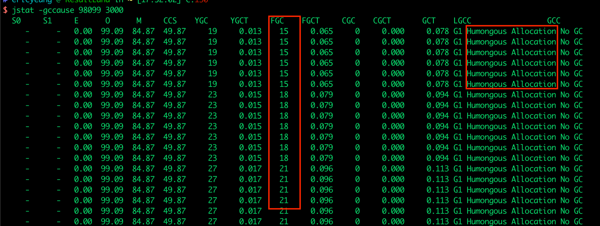
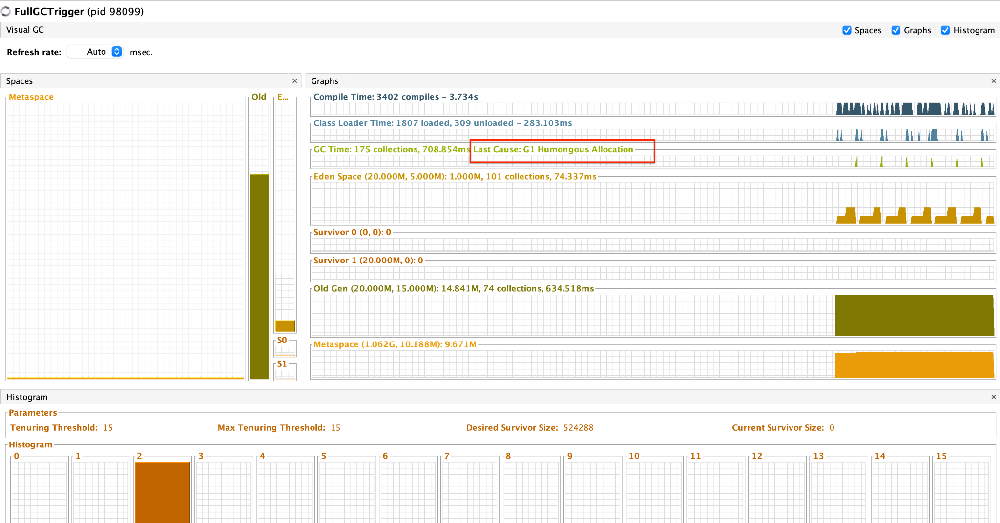

**Jstat工具**

Jstat是JDK自带的一个非常实用的监控工具，它可以提供关于垃圾回收、类加载和编译的信息。为了更精确地监控GC过程，可以使用jstat工具的-gc选项，并指定一个进程ID。并且可以通过设置一个适当的统计间隔和次数，来获取GC的详细信息。

- 优点: 无需安装额外的软件，操作简单。

- 缺点: 无法精确地捕捉到GC的确切时间，主要用于判断GC是否存在问题。

使用 jstat -gccause 跟踪 Full GC

**VisualVM插件**

VisualVM是一个强大的Java性能分析工具，其中包含一个Visual GC插件，可以实时监控Java进程的堆内存结构、变化趋势以及垃圾回收时间的变化趋势。通过这个插件，可以直观地观察到堆内存和GC的变化情况。

- 优点: 适合开发环境使用，能够直观地观察到堆内存和GC的变化趋势。

- 缺点: 对程序运行性能有一定影响，且在生产环境中程序员通常没有权限进行操作。

VisualVM + VisualGC 插件

**Prometheus + Grafana**

这是一个在生产环境中广泛使用的监控解决方案。Prometheus用于收集系统或应用数据，并具备告警功能。Grafana则可以将收集到的数据以可视化的方式展示出来。通过这些工具，可以对GC过程进行更深入的监控和分析。

优点：

- 监控范围广：支持系统级别和应用级别的监控，如Linux操作系统、Redis、MySQL、Java进程等。

- 告警功能：支持告警功能并允许自定义告警指标，通过邮件、短信等方式尽早通知相关人员处理。

缺点：

- 环境搭建复杂：Prometheus和Grafana的环境搭建相对复杂，一般由专业的运维人员来完成。

**GC日志**

GC日志是了解垃圾回收过程的重要途径。通过分析这些日志，可以获取到关于垃圾回收的详细数据，并根据不同的垃圾回收器特点来发现潜在的问题。在JDK 8及以下版本中，可以通过-XX:+PrintGCDetails和-Xloggc:文件名选项来启用GC日志记录。在JDK 9及更高版本中，可以使用-Xlog:gc\*:file=文件名选项来记录日志。

JDK 8及以下版本：

\# 用于打印输出详细的GC收集日志的信息

-XX:+PrintGCDetails

\# 将虚拟机每次垃圾回收的信息写到指定的日志文件中

-Xloggc:文件名

JDK 9及更高版本：

\# 将垃圾回收日志输出到指定的文件中

-Xlog:gc\*:file=文件名

**GCeasy：**

GCeasy是一个使用AI机器学习技术进行GC分析和诊断的工具。除了定位内存泄漏和GC延迟问题外，它还提供JVM参数优化的建议，并支持在线的可视化工具图表展示。
