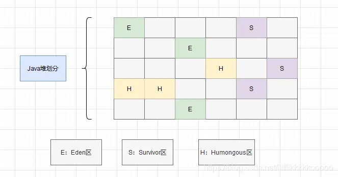
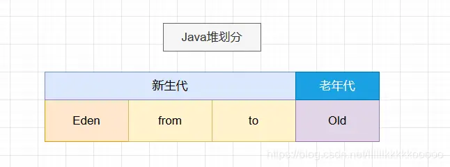
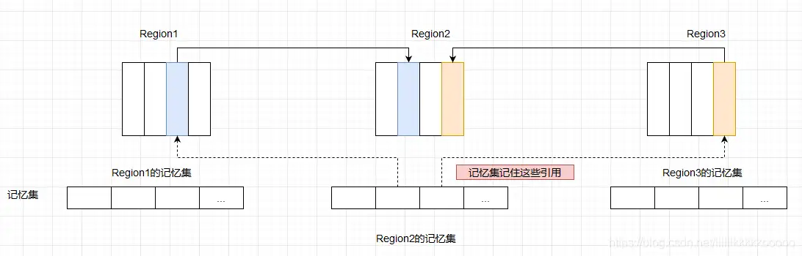

# **JVM面试必问：G1垃圾回收器**

> [华为云开发者联盟](https://www.zhihu.com/org/hua-wei-yun-ji-zhu-zhai-ji-di)[​](https://www.zhihu.com/question/48510028)
>
> 已认证账号

​关注

49 人赞同了该文章

摘要：G1垃圾回收器是一款主要面向服务端应用的垃圾收集器。

本文分享自华为云社区《[JVM面试高频考点：由浅入深带你了解G1垃圾回收器！！！](https://link.zhihu.com/?target=https%3A//bbs.huaweicloud.com/blogs/281945%3Futm_source%3Dzhihu%26utm_medium%3Dbbs-ex%26utm_campaign%3Dother%26utm_content%3Dcontent)》，原文作者：Code皮皮虾 。

## **G1垃圾回收器介绍**

G1垃圾回收器是一款主要面向服务端应用的垃圾收集器。作为垃圾回收器技术发展史上里程碑的成果，G1垃圾回收器不同于以往的垃圾回收器，首先是思想上的转变，如下图：

### **G1对于Java堆的划分**

上面的图，小伙伴们第一次看可能不咋明白，因为各位还不了解G1，看看下面的话，应该就差不多了。

G1垃圾回收器对于Java堆区域的划分不同于以往我们对Java对区域划分的认知

以往对于Java堆区域的划分为：新生代和老年代，新生代又划分为 Eden区和 Survivor区，Survivor区又分为 from区和 to区。

但是现在，G1不再坚持固定大小以及固定数量的分代区域划分，而是把连续的Java堆空间划分为多个大小相等的独立区域（Region），每个Region都可以成为 Eden空间、Survivor空间、老年代空间。

这种思想上的转变和设计，使得G1可以面向堆内存任何部分来组成回收集来进行回收，衡量标准不再是它属于哪个分代，而是哪块内存存放的垃圾最多，回收收益最大，这就是G1收集器的 Mixed GC模式，即混合GC模式。

Region还有一类特殊的 Humongous 区域，专门用来存储大对象。G1认为只要大小超过了一个Region容量一半的对象即可判定为大对象。如果是那些超过了整个Region容量的超大对象，将会放在连续 N 个 Humongous Region区域。

Region的取值范围为 1M ~ 32M

Region的默认个数为 2048个

-XX:G1HeapRegionSize = N

G1这么做看起来是由一种焕然一新的感觉，但细心的小伙伴可能已经发现，如果 Region之间存在跨区引用对象，那这些对象如何解决？

- 不管是G1还是其他分代收集器，JVM都是使用 记忆集(Remembered Set) 来避免全局扫描。

  每个Region都有一个对应的记忆集。

  每次Reference类型数据写操作时，都会产生一个 写屏障（Write Barrier）暂时去终止操作

  然后检查将要写入的引用 指向的对象是否和该Reference类型数据在不同的 Region（其他收集器：检查老年代对象是否引用了新生代对象）

  如果不同，通过 卡表（Card Table）把相关引用信息记录到引用指向对象的所在Region对应的记忆集(Remembered Set) 中

  当进行垃圾收集时，在GC Roots枚举范围加上记忆集；就可以保证不进行全局扫描了。

G1的记忆集可以理解为一个哈希表，Key就是别的Region的起始地址，Value就是卡表的索引号集合。

因为G1将Java堆划分为一个个Region的缘故，而Region数量相比于传统分代数量明显多得多，所以G1相比于传统的垃圾回收器来说，需要消耗相当于Java堆容量 10%~ 20%的额外空间来维持收集器的工作。

## **G1 垃圾回收器工作流程**

- 初始标记(Initial Marking)：这阶段仅仅只是标记GC Roots能直接关联到的对象并修改TAMS(Next Top at Mark Start)的值，让下一阶段用户程序并发运行时，能在正确的可用的Region中创建新对象，这阶段需要停顿线程，但是耗时很短。而且是借用进行Minor GC的时候同步完成的，所以G1收集器在这个阶段实际并没有额外的停顿。

  并发标记(Concurrent Marking)：从GC Roots开始对堆的对象进行可达性分析，递归扫描整个堆里的对象图，找出存活的对象，这阶段耗时较长，但是可以与用户程序并发执行。当对象图扫描完成以后，还要重新处理SATB记录下的在并发时有引用变动的对象。

  最终标记(Final Marking)：对用户线程做另一个短暂的暂停，用于处理并发阶段结束后仍遗留下来的最后那少量的 SATB 记录。

  筛选回收(Live Data Counting and Evacuation)：负责更新 Region 的统计数据，对各个 Region 的回收价值和成本进行排序，根据用户所期望的停顿时间来制定回收计划。可以自由选择多个Region来构成会收集，然后把回收的那一部分Region中的存活对象==复制==到空的Region中，在对那些Region进行清空。

除了并发标记外，其余过程都要 STW

## **G1和CMS的区别**

- G1从整体上来看是 标记-整理 算法，但从局部（两个Region之间）是复制算法。而CMS是 标记-清除算法 所以说，G1不会产生内存碎片，而CMS会产生内存碎片

  CMS使用了 写后屏障来维护卡表，而G1不仅使用了写后屏障来维护卡表，还用了 写前屏障来跟踪并发时的指针变化情况（为了实现原始快照）。

  CMS对Java堆内存使用的是传统的 新生代和老年代划分方法，而G1使用的全新的划分方法。

  CMS收集器只收集老年代，可以配合新生代的Serial和ParNew收集器一起使用。G1收集器收集范围是老年代和新生代。不需要结合其他收集器使用

  CMS使用 增量更新解决并发标记下出现的错误标记问题，而G1使用原始快照解决

四个区别：

有无分代

有无碎片

Inc update/ SATB

有无写前屏障
