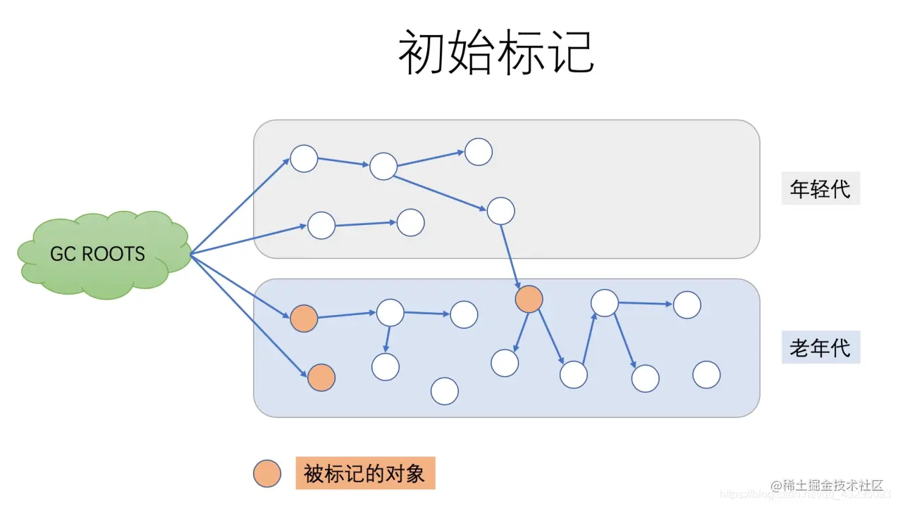
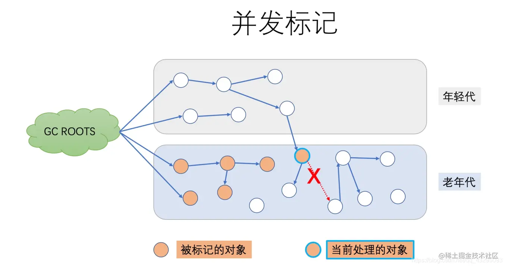
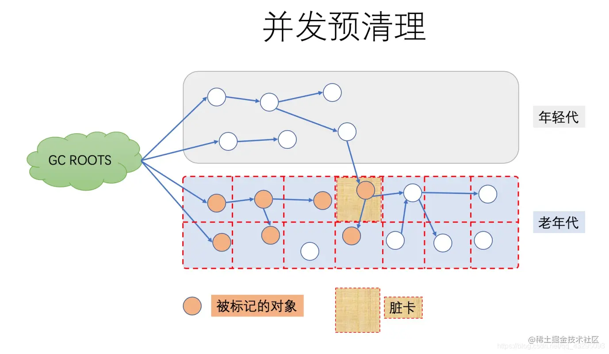
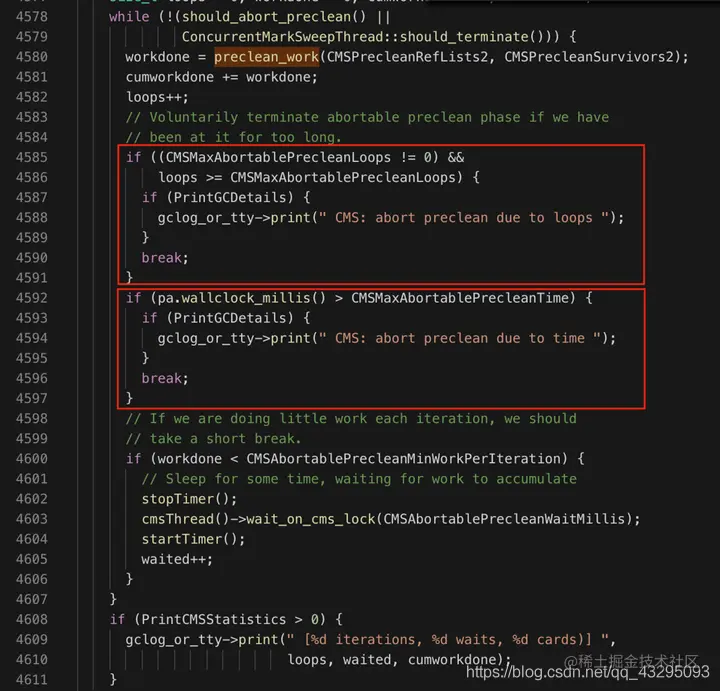
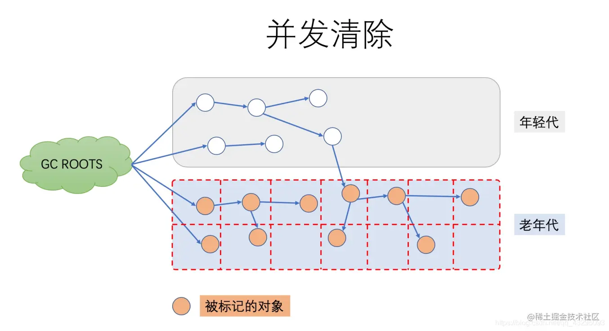

# **终于把CMS垃圾收集器搞懂了~**

壹氿

2021-10-289,594

阅读11分钟

专栏：

JVM

# **相关概念**

CMS GC的官方名称为“**Mostly Concurrenct Mark and Sweep Garbage Collector**”（最大-并发-标记-清除-垃圾收集器）。  
**作用范围：** 老年代  
**算法：** 并发标记清除算法。  
**启用参数：**-XX:+UseConMarkSweepGC  
**默认回收线程数：**（处理器核心数量 + 3）/4  
Java9之后使用CMS垃圾收集器后，默认年轻代就为ParNew收集器，并且不可更改，同时JDK9之后被标记为不推荐使用，JDK14就被删除了。

并发与并行有什么区别？ 并行（Parallel）：并行描述的多条垃圾收集器线程之间的关系，说明同一时间有多条这样的线程在协同工作，通常默认此时用户线程为等待状态。 并发（Concurrent）：并发描述的垃圾收集线程与用户线程之间的关系，说明同一时间垃圾收集线程与用户线程都在工作，由于用户线程并未冻结，因此还能继续相应服务请求，但由于垃圾收集器线程占用了一定的系统资源，此时应用程序处理的吞吐量将受到一定影响。

**设计目标/优点**：避免在老年代垃圾收集时出现长时间的卡顿，主要通过两种手段来达成此目标：

- 第一，不对老年代进行整理，而是使用空闲列表（free-list）来管理内存空间的回收

- 第二，在mark-and-sweep（标记-清除）阶段的大部分工作和应用线程一起并发执行。

**适用场景：**

- **GC过程短暂，低延迟，适合对延迟要求较高的系统**

如果服务器是多核CPU，并且主要调优目标是降低GC停顿导致的系统延迟，那么使用CMS是个很明智的选择。通过减少每一次GC停顿的时间，很多时候会直接改善用户体验。因为多数情况下有部分CPU资源被垃圾回收器线程消耗，所以在CPU资源受限的情况下，CMS GC会比并行GC的吞吐量差一些（对于绝大部分系统，这个吞吐和延迟的差别应该都不明显）  
  
**在实际情况中，进行老年代的并发回收时，可能会伴随多次年轻代的minor GC。在这种情况下full GC的日志中就会掺杂着多次minor GC事件**

# **CMS GC的几个大阶段**

- 1、初始标记（CMS initial mark）

- 2、并发标记（CMS concurrent mark）

- 3、重新标记（CMS remark）

- 4、并发清除（CMS concurrent sweep）

## **阶段1：初始标记**

这个阶段会STW。  
**工作模式：** JDK7之前单线程，JDK8之后多线程  
**目标：** 标记所有的根对象，包括根对象直接引用的对象，以及被年轻代中所有存活的对象所引用的老年代对象（只是标记一下GC Roots能直接关联到的对象，速度很快）  

## **阶段2：并发标记**

此阶段，CMS GC遍历所有的对象，标记存活的对象，从前一阶段“初始标记”找到的根元素开始算起。“并发标记”阶段就是与应用程序同时运行，不用暂停的阶段。**此阶段由于与用户线程并发执行，对象的状态可能会发生变化，如下：**

- **年轻代的对象从年轻代晋升到老年代**

- **有些对象被直接分配到老年代**

- **老年代和年轻代的对象引用关系变化**

JVM会通过Card(卡片)的方式将发生改变的老年代区域标记为“脏”区，这就是所谓的卡片标记（Card Marking）  
  
在上边的图中，“当前处理的对象”的一个引用就被应用线程给断开了，即这个部分的对象关系发生了变化

## **阶段3：并发预清理**

也是用于标记老年代存活的对象，此阶段仍然是与应用线程并发执行的，不需要停止应用线程。  
**目的：** 让最终/重新标记的STW时间尽可能短  
**标记目标：**

- 老年代中在并发标记中被标记为“dirty”的card

- 幸存区（from和to）中引用的老年代对象

**关闭参数：**-XX:-CMSPrecleaningEnabled，**默认开启  **
**  **
​

## **阶段4：可取消的并发预清理**

此阶段也不停止应用程序，本阶段尝试在STW的最终标记阶段之前尽可能多做一些工作。本阶段的具体时间取决于多种因素，因为它循环做同样的事情，直到满足某个退出条件（如迭代次数、有用工作量、消耗的系统时间等等）  
**目标：** 与并发预处理一样，为了使最终/重新标记的STW时间尽可能短  
**价值：** 在进入最终标记前尽量等到一个Minor GC，尽量缩短最终标记阶段的停顿时间  
**触发条件：** 在预清理步骤后，如果满足下面这个个条件，就会开启可中断的预清理，直接进入重新标记阶段

- Eden的使用空间大于-XX:CMSScheduleRemarkEdenSizeThreshold”，这个参数的默认值是2M；

**取消条件：**

- 设置了CMSMaxAbortablePrecleanLoops循环次数，并且执行的次数大于或者等于这个值的时候。**默认为0**

- CMSMaxAbortablePrecleanTime，执行可中断预清理的时间超过了这个值，这个参数的**默认值是5000毫秒**

- Eden的使用率达到-XX:CMSScheduleRemarkEdenPenetration，**这个参数的默认值是50%**。

**问题：** 可能在可取消的并发预处理过程中一直没等到Minor GC，这个时候进行最终标记的话，可能会发生连续停顿，假设新生代在最终标记的时候发生了Minor GC（STW），最终标记又是STW的，因此可能会发生连续停顿，CMS提供了参数CMSScavengeBeforeRemark使最终/重新标记前强制进行一次Minor GC（其实这样也会导致连续停顿，Minor和Remark）。  

## **阶段5：最终标记/重标记**

最终标记是此阶段GC事件中的第二次（也是最后一次）STW停顿。  
**目标：** 重新扫描堆中的对象，因为之前的预清理阶段是并发执行的，有可能GC线程跟不上应用程序的修改速度。  
**扫描范围：** 新生代对象+GC Roots+被标记为“脏”区的对象。**如果预清理阶段没有做好，这一步扫描新生代的时候就会花很多时间。**

## **阶段6：Concurrent Sweep（并发清除）**

此阶段与应用程序并发执行，不需要STW停顿。JVM在此阶段删除不再使用的对象，并回收他们占用的内存空间。因为阶段5已经把所有还在使用的对象进行了标记，因此此阶段可以与应用线程并发的执行。  

**阶段7：Concurrent Reset（并发重置）**

此阶段与应用程序并发执行，重置CMS算法相关的内部数据，为下一次GC循环做准备。  
  
总之，CMS垃圾收集器在减少停顿时间上做了很多复杂的而有用的工作，用于垃圾回收的并行线程执行的同时，并不需要暂停应用线程。

# **动态检测机制**

CMS会根据历史记录，预测老年代还有多长时间会满及进行一次回收所需的时间，可以使用参数\_-XX:+UseCMSInitiatingOccupancyOnly_来关闭，开启这个参数后，配置的回收阈值-XX:CMSInitiatingOccupancyFraction=N会长期生效，否则只会第一次生效  
**​  **

# **缺点**

- **吞吐量降低，** 对处理器资源敏感，执行垃圾收集时会占用一部分线程时程序吞吐量降低

- **占用CPU资源，与CPU核数挂钩，** 开头说到了CMS默认启动的回收线程是（CPU核心数 +3）/4，当CPU核数越多，垃圾回收线程占用的资源就越少，反正CPU核数越少，占用资源就越多。

- **内存碎片问题：** 由于CMS使用的是标记-清除算法，这种算法的弊端就是会产生内存碎片，导致大对象无法分配，就会触发Full GC。

  - CMS收集器提供了一个参数-XX:+UseCMSCompactAtFullCollection(默认开启,JDK9废弃)，在进行Full GC之前进行一次内存整理（**无法并发，Shenandoah和ZGC可以**），

  - 这样空间碎片虽然解决了，但是停顿时间也增长了，CMS还提供了一个参数-XX:CMSFullGCBeforeCompaction=n（默认为0，表示每次进入Full GC时都进行碎片整理），参数作用是当CMS收集器执行过n次不整理内存碎片后，下一次进入Full GC前先进行碎片整理

- **无法处理“浮动垃圾”：** 在并发收集阶段时，当用户线程创建了一个对象年轻代放不下，直接晋升到老年代或者年轻代对象晋升到老年代时老年代，由于存在这种情况，因此CMS垃圾收集器必须要预留一部分空间给用户线程（需要更大的堆空间），不能等到老年代满了才收集（JDK5及之前是68%，JDK6之后调整为92%，可通过 -XX:CMSInitiatingOccupancyFraction\_=数值\_+ -XX:+UseCMSInitiatingOccupancyOnly来设置）

  - 当设置-XX:CMSInitiatingOccupancyFraction过大时，就可能会出现垃圾收集过程中无法分配对象的问题，导致“并发失败”（Concurrent Mode Failure），此时会临时启用Serial Old收集器来重新进行老年代收集，这会导致停顿时间更长

# **异常情况**

- **并发模式失败：** CMS大部分阶段是与用户线程并发执行的，如果在执行垃圾收集时用户线程创建的对象直接往老年代分配，但是没有足够的内存，就会报Concurrent mode failure

- **晋升失败：** 新生代做Minor GC的时候，老年代没有足够的空间用来存放晋升的对象，则会报Concurrent mode failure；如果由于内存碎片问题导致无法分配，就会报晋升失败

- **永久代空间（Java8的元空间）耗尽：** 默认情况下CMS不会对永久代进行收集，一旦永久代空间耗尽，就会触发FullGC

# **调优**

- 硬件方面可以增加CPU核数， CMS是多线程垃圾收集器，默认启动线程个数为（CPU核数+3）/4，CPU核数越多，对用户线程的影响越小

- **停顿时间过长调优**

  - 首先需要判断是哪个阶段慢，CMS引起的停顿有：

    - 年轻代Minor GC停顿

    - 老年代初始、最终标记停顿

    - Serial Old老年代收集停顿

    - Full GC停顿

- **并发失败调优**

  - 增大老年代的空间，增加整个堆的大小

  - 提高CMS垃圾收集频率--\>\>调整CMS收集的阈值

    - -XX:CMSInitiatingOccupancyFraction=数值 + -XX:+UseCMSInitiatingOccupancyOnly，-XX:CMSInitiatingOccupancyFraction调小，但也不能太小，太小了会导致过多无效的收集，浪费资源

      - 《Java性能权威指南》中给出的建议： 对特定的应用程序，该标志的更优值可以根据 GC 日志中 CMS 周期首次启动失败时的值得到。具体方法是，在垃圾回收日志中寻找并发模式失效，找到后再反向查找 CMS 周期最近的启动记录，然后根据日志来计算这时候的老年代空间占用值，然后设置一个比该值更小的值。

  - 增加CPU回收线程个数（(CPU核数+3)/4）

- **永久代调优：** 如果永久代要进行垃圾回收，就会进行Full GC，CMS默认不会处理永久代中的垃圾需要通过参数-XX:+CMSPermGenSweepingEnabled开启对方法区的收集，开启后会有专门的一组线程对永久代进行垃圾回收，同时还需要开启另一个参数-XX:+CMSClassUnloadingEnabled，使得在垃圾收集时可以卸载不用的类。

# **总结**

如果系统追求低延迟，那么可以选择CMS垃圾收集器，只是STW的时间缩短了，但是整个GC的时间相对更长了；  
如果系统追求高吞吐，那么可以选择并行Parallel GC，虽然STW的时间长，但是可以保证非GC时间，整个系统的资源全部被应用线程占用。

# **参考资料**

- 周志明《深入理解Java虚拟机》

- [不可错过的CMS学习笔记](https://link.juejin.cn/?target=https%3A%2F%2Fzhuanlan.zhihu.com%2Fp%2F61944015)

- [详解CMS垃圾回收机制](https://link.juejin.cn/?target=https%3A%2F%2Fwww.cnblogs.com%2FlittleLord%2Fp%2F5380624.html)
