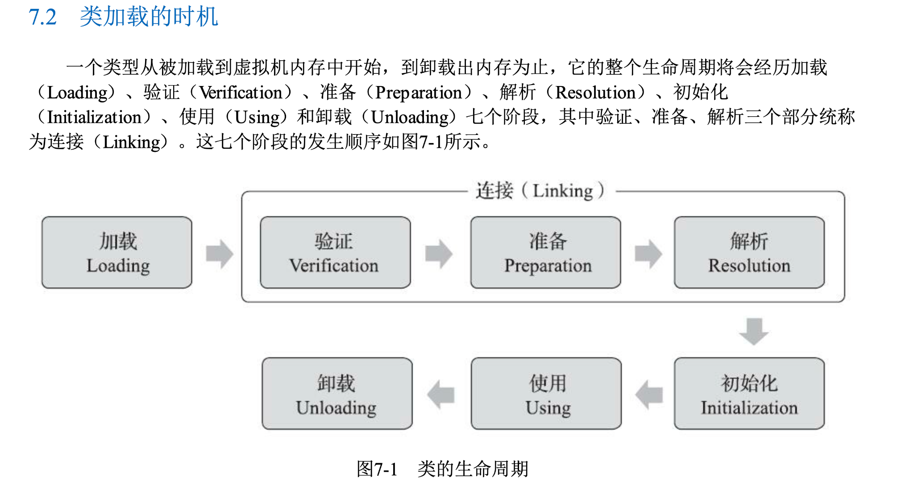
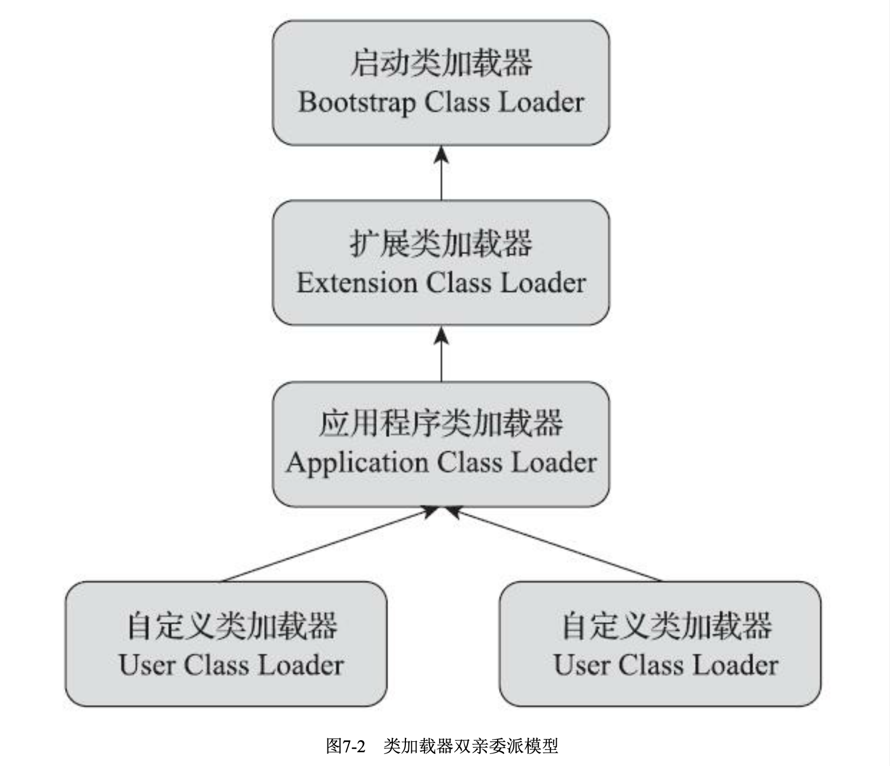
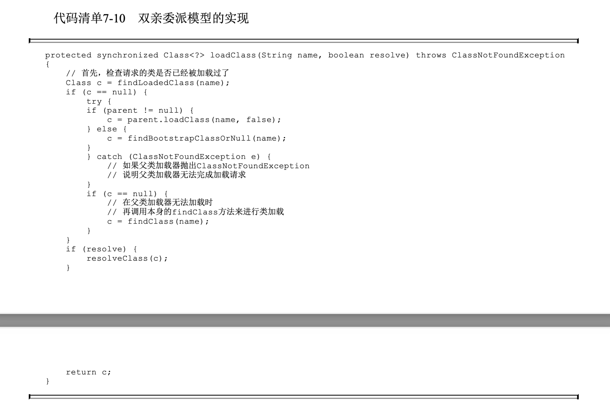
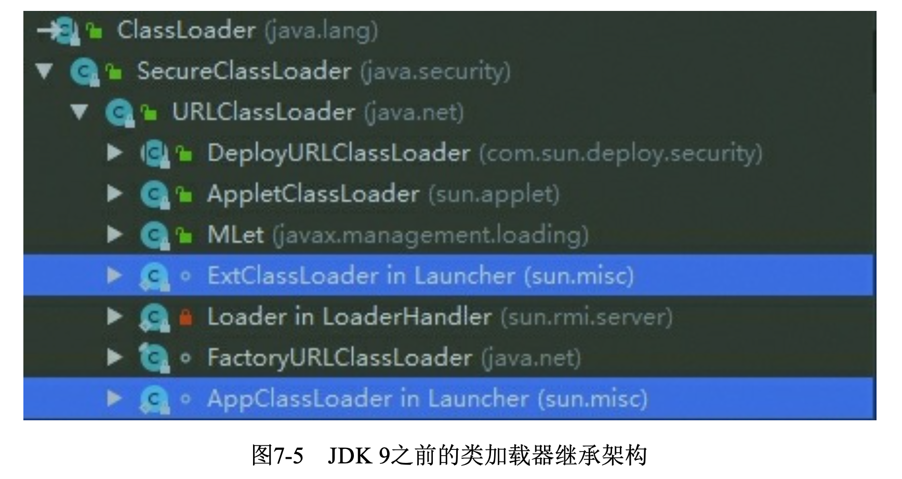
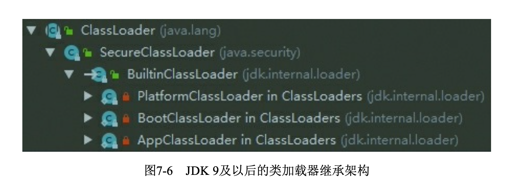
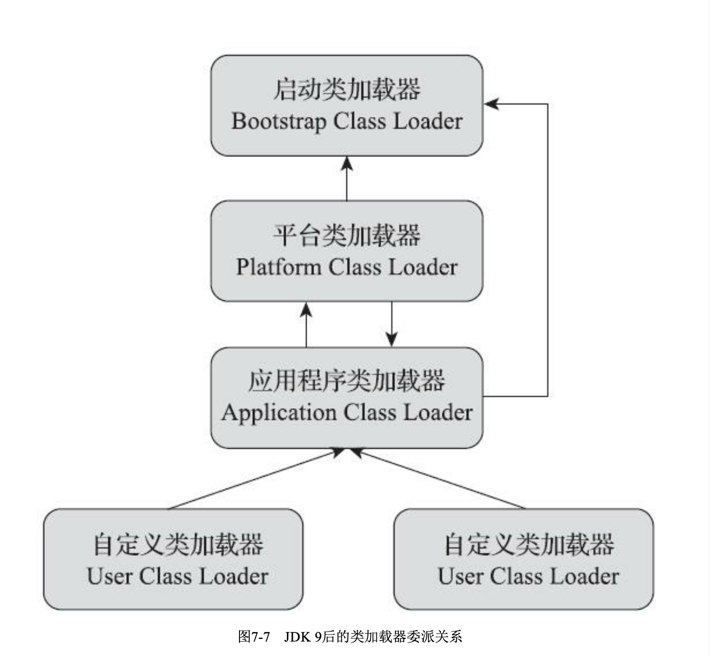
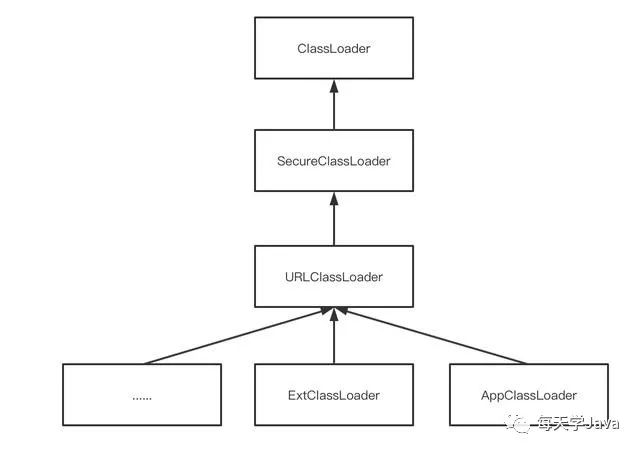

**第7章 虚拟机类加载机制**

本章所提到的“Class文件”也并非特指某个存在于 具体磁盘中的文件，而应当是一串二进制字节流，无论其以何种形式存在，包括但不限于磁盘文件、 网络、数据库、内存或者动态产生等。Java虚拟机把描述类的数据从Class文件加载到内存，并对数据进行校验、转换解析和初始化，最 终形成可以被虚拟机直接使用的Java类型，这个过程被称作虚拟机的类加载机制

所有引用类型的方 式都不会触发初始化，称为被动引用

- 通过子类引用父类的静态字段，不会导致子类初始化

> System.out.println(SubClass.value);
>
> Value是父类静态成员, 这个程序不会导致SubClass初始化

- 通过数组定义来引用类，不会触发此类的初始化

> SuperClass\[\] sca = new SuperClass\[10\];

- 常量在编译阶段会存入调用类的常量池中，本质上没有直接引用到定义常量的类，因此不会触发定义常量的类的初始化

> public class ConstClass {
>
> static {System.out.println("ConstClass init!");}
>
> public static final String HELLOWORLD = "hello world";
>
> }
>
> public class NotInitialization {
>
> public static void main(String\[\] args) {System.out.println(ConstClass.HELLOWORLD);}
>
> }

**接口的加载过程**

与类加载过程稍有不同，针对接口需要做一些特殊说明:接口也有初始化过程， 这点与类是一致的，上面的代码都是用静态语句块“static{}”来输出初始化信息的，而接口中不能使

用“static{}”语句块，但编译器仍然会为接口生成“\<clinit\>()”类构造器\[2\]，用于初始化接口中所定义的 成员变量。接口与类真正有所区别的是前面讲述的六种“ 有且仅有”需要触发初始化场景中的第三种: 当一个类在初始化时，要求其父类全部都已经初始化过了，但是一个接口在初始化时，并不要求其父 接口全部都完成了初始化，只有在真正使用到父接口的时候(如引用接口中定义的常量)才会初始 化。

**3.7.1 加载 (Loading) - 与整体的 Class Loading 不同**

在加载阶段，Java虚拟机需要完成以下三件事情:

1)通过一个类的全限定名来获取定义此类的二进制字节流。

2)将这个字节流所代表的静态存储结构转化为方法区的运行时数据结构。

3)在内存中(heap)生成一个代表这个类的java.lang.Class对象，作为方法区这个类的各种数据的访问入 口。

**数组类**

数组类本身不通过类加载器创建，它是由Java虚拟机直接在 内存中动态构造出来的。但数组类与类加载器仍然有很密切的关系，因为数组类的元素类型(Element Type，指的是数组去掉所有维度的类型)最终还是要靠类加载器来完成加载

- 如果数组的组件类型(Component Type，指的是数组去掉一个维度的类型，注意和前面的元素类 型区分开来)是引用类型，那就递归采用本节中定义的加载过程去加载这个组件类型，数组C将被标 识在加载该组件类型的类加载器的类名称空间上(这点很重要，在7.4节会介绍，一个类型必须与类加载器一起确定唯一性)。

- 如果数组的组件类型不是引用类型(例如int\[\]数组的组件类型为int)，Java虚拟机将会把数组C 标记为与引导类加载器关联。

- 数组类的可访问性与它的组件类型的可访问性一致，如果组件类型不是引用类型，它的数组类的 可访问性将默认为p ublic，可被所有的类和接口访问到。

**7.3.2 验证**

文件格式验证、元数据验证、字节码验证和符号引用验证。

符号引用验证的主要目的是确保解析行为能正常执行，如果无法通过符号引用验证，Java虚拟机将会抛出一个java.lang.IncompatibleClassChangeError的子类异常，典型的如:java.lang.IllegalAccessError、java.lang.NoSuchFieldError、java.lang.NoSuchMethodError等。

**7.3.3 准备**

准备阶段是正式为类中定义的变量(即静态变量，被static修饰的变量)分配内存并设置类变量初始值的阶段 (0, false, null)

**7.3.4 解析**

解析阶段是Java虚拟机将常量池内的符号引用替换为直接引用的过程

符号引用(Symbolic References):符号引用以一组符号来描述所引用的目标，符号可以是任何形式的字面量,引 用的目标并不一定是已经加载到虚拟机内存当中的内容

直接引用(Direct References):直接引用是可以直接指向目标的指针、相对偏移量或者是一个能间接定位到目标的句柄。

**7.3.5 初始化**

直到初始化阶段，Java虚拟机才真正开始执行类中编写的Java程序代码，将主导权移交给应用程序。初始化阶段就是执行类构造器\<clinit \>()方法的过程

Java虚拟机会保证在子类的\<clinit\>()方法执行前，父类的\<clinit\>()方法已经执行完毕。因此在Java虚拟机中第一个被执行的\<clinit\>()方法的类型肯定是java.lang.Object。%

由于父类的\<clinit \>()方法先执行，也就意味着父类中定义的静态语句块要优先于子类的变量赋值 操作

接口: 执行接口的\<clinit \>()方法不需要先执行父接口的\<clinit \>()方法

如果多个线程同 时去初始化一个类，那么只会有其中一个线程去执行这个类的\<clinit \>()方法，其他线程都需要阻塞等待

class DeadLoopClass {

static {

// 如果不加上这个if语句，编译器将提示“Initializer does not complete normally” 并拒绝编译

if (true) {

System.out.println(Thread.currentThread() + "init DeadLoopClass");

while (true) {

}

}

}

}

public class ConcInit {

public static void main(String\[\] args) {

Runnable script = new Runnable() {

public void run() {

System.out.println(Thread.currentThread() + "start");

DeadLoopClass dlc = new DeadLoopClass();

System.out.println(Thread.currentThread() + " run over");

}

};

Thread thread1 = new Thread(script);

Thread thread2 = new Thread(script);

thread1.start();

thread2.start();

}

}

\$ java ConcInit

Thread\[#21,Thread-1,5,main\]start

Thread\[#20,Thread-0,5,main\]start

Thread\[#21,Thread-1,5,main\]init DeadLoopClass

**7.4 类加载器**

Java虚拟机设计团队有意把类加载阶段中的“通过一个类的全限定名来获取描述该类的二进制字节流”这个动作放到Java虚拟机外部去实现，以便让应用程序自己决定如何去获取所需的类。实现这个动 作的代码被称为“类加载器”(Class Loader)。

比较两个类是否“ 相 等”，只有在这两个类是由同一个类加载器加载的前提下才有意义，否则，即使这两个类来源于同一个 Class文件，被同一个Java虚拟机加载，只要加载它们的类加载器不同，那这两个类就必定不相等。

这是因为Java虚拟机中同时存在了两个Class LoaderTest类，一个是由虚拟 机的应用程序类加载器所加载的，另外一个是由我们自定义的类加载器加载的，虽然它们都来自同一 个Class文件，但在Java虚拟机中仍然是两个互相独立的类，做对象所属类型检查时的结果自然为 false。

三层类加载器

- 启动类加载器(Bootstrap Class Loader):前面已经介绍过，这个类加载器负责加载存放在\<JAVA_HOME\>\lib目录，或者被-Xbootclasspath参数所指定的路径中存放的，而且是Java虚拟机能够识别的(按照文件名识别，如rt.jar、tools.jar，名字不符合的类库即使放在lib目录中也不会被加载)类库加载到虚拟机的内存中。启动类加载器无法被Java程序直接引用，用户在编写自定义类加载器时，如果需要把加载请求委派给引导类加载器去处理，那直接使用null代替即可

<!-- -->

- 扩展类加载器(ExtensionClassLoader):这个类加载器是在类sun.misc.Launcher中以Java代码的形式实现的。它负责加载\<JAVA_HOME\>\lib\ext目录中，或者被java.ext.dirs系统变量所指定的路径中所有的类库

<!-- -->

- 应用程序类加载器(Application Class Loader):这个类加载器由sun.misc.Launcher\$AppClassLoader来实现。由于应用程序类加载器是ClassLoader类中的getSystemClassLoader()方法的返回值，所以有些场合中也称它为“ 系统类加载器”。它负责加载用户类路径 (ClassPath)上所有的类库，开发者同样可以直接在代码中使用这个类加载器。如果应用程序中没有 自定义过自己的类加载器，一般情况下这个就是程序中默认的类加载器。

**7.4.2 双亲委派模型**

图7-2中展示的各种类加载器之间的层次关系被称为类加载器的“双亲委派模型(Parents Delegation Model)”。双亲委派模型要求除了顶层的启动类加载器外，其余的类加载器都应有自己的父类加载 器。不过这里类加载器之间的父子关系一般不是以继承(Inherit ance)的关系来实现的，而是通常使用 组合(Composition)关系来复用父加载器的代码。

双亲委派模型的工作过程是:如果一个类加载器收到了类加载的请求，它首先不会自己去尝试加

载这个类，而是把这个请求委派给父类加载器去完成，每一个层次的类加载器都是如此，因此所有的加载请求最终都应该传送到最顶层的启动类加载器中，只有当父加载器反馈自己无法完成这个加载请求(它的搜索范围中没有找到所需的类)时，子加载器才会尝试自己去完成加载。

例如类java.lang.Object，它存放在rt.jar之中，无论哪一个类加载器要加载这个类，最终都是委派给处于模型最顶端的启动类加载器进行加载，因此Object类在程序的各种类加载器环境中都能够保证是同一个类。反之，如果没有使用双亲委派模型，都由各个类加载器自行去加载的话，如果用户自己也编写了一个名为java.lang.Object的类，并放在程序的ClassPath中，那系统中就会出现多个不同的Object类，Java类型体系中最基础的行为也就无从保证，应用程序将会变得一片混乱

双亲委派模型对于保证Java程序的稳定运作极为重要，但它的实现却异常简单，用以实现双亲委 派的代码只有短短十余行，全部集中在**java.lang.ClassLoader的loadClass()**方法之中，如代码清单7-10所 示。

**Why findClass() in java.lang.ClassLoader throw ClassNotFoundException?**

用户类是AppClassLoader来加载,AppClassLoader会覆盖**java.lang.ClassLoader::findClass**

**7.4.3 破坏双亲委派模型**

继承java.lang.ClassLoader 覆盖 loadClass() 就是破坏双亲委托模型

**第一次“被破坏”**

类加载器的概念和抽象类 java.lang.ClassLoader则在Java的第一个版本中就已经存在，面对已经存在的用户自定义类加载器的代 码，Java设计者们引入双亲委派模型时不得不做出一些妥协，为了兼容这些已有代码，无法再以技术 手段避免loadClass()被子类覆盖的可能性，只能在JDK 1.2之后的java.lang.ClassLoader中添加一个新的 protected方法findClass()，并引导用户编写的类加载逻辑时尽可能去重写这个方法，而不是在 loadClass()中编写代码。

**第二次“ 被破坏”**

双亲委派模型的第二次“ 被破坏”是由这个模型自身的缺陷导致的，双亲委派很好地解决了各个类加载器协作时基础类型的一致性问题(越基础的类由越上层的加载器进行加载)，基础类型之所以被 称为“基础”，是因为它们总是作为被用户代码继承、调用的API存在，但程序设计往往没有绝对不变 的完美规则，如果有基础类型又要调用回用户的代码，那该怎么办呢?

这并非是不可能出现的事情，一个典型的例子便是JNDI服务，JNDI现在已经是Java的标准服务， 它的代码由启动类加载器来完成加载(在JDK 1.3时加入到rt.jar的)，肯定属于Java中很基础的类型 了。但JNDI存在的目的就是对资源进行查找和集中管理，它需要调用由其他厂商实现并部署在应用程 序的ClassPath下的JNDI服务提供者接口(Service Provider Interface，SPI)的代码，现在问题来了，启动类加载器是绝不可能认识、加载这些代码的，那该怎么办?

为了解决这个困境，Java的设计团队只好引入了一个不太优雅的设计:线程上下文类加载器 (Thread Context ClassLoader)。这个类加载器可以通过java.lang.Thread类的setContext-ClassLoader()方 法进行设置，如果创建线程时还未设置，它将会从父线程中继承一个，如果在应用程序的全局范围内 都没有设置过的话，那这个类加载器默认就是应用程序类加载器。

有了线程上下文类加载器，程序就可以做一些“舞弊”的事情了。JNDI服务使用这个线程上下文类 加载器去加载所需的SPI服务代码，这是一种父类加载器去请求子类加载器完成类加载的行为，这种行 为实际上是打通了双亲委派模型的层次结构来逆向使用类加载器，已经违背了双亲委派模型的一般性 原则，但也是无可奈何的事情。Java中涉及SPI的加载基本上都采用这种方式来完成，例如JNDI、 JDBC、JCE、JAXB和JBI等。不过，当SPI的服务提供者多于一个的时候，代码就只能根据具体提供 者的类型来硬编码判断，为了消除这种极不优雅的实现方式，在JDK 6时，JDK提供了 java.util.ServiceLoader类，以M ETA-INF/services中的配置信息，辅以责任链模式，这才算是给SPI的加 载提供了一种相对合理的解决方案。

**第三次“ 被破坏”**

由于用户对程序动态性的追求而导致的，这里所说的“ 动态性”指的是一些非常“热”门的名词:代码热替换(Hot Swap)、模块热部署(Hot Deployment)等。说 白了就是希望Java应用程序能像我们的电脑外设那样，接上鼠标、U盘，不用重启机器就能立即使用， 鼠标有问题或要升级就换个鼠标，不用关机也不用重启。对于个人电脑来说，重启一次其实没有什么 大不了的，但对于一些生产系统来说，关机重启一次可能就要被列为生产事故，这种情况下热部署就 对软件开发者，尤其是大型系统或企业级软件开发者具有很大的吸引力。

Extension class loader 被 Platform class loader 取代

**类加载器之URLClassLoader**

通过源码我们可以发现AppClassLoader和ExtClassLoader都是Launcher的静态内部类，继承自URLClassLoader。

那么URLClassLoader和SecureClassLoader具体是做什么的呢？

SecureClassLoader：扩展了ClassLoader，并为定义具有相关代码源和权限的类提供了额外支持，这些代码源和权限默认情况下由系统策略检索。

URLClassLoader：继承自SecureClassLoader，支持从jar文件和文件夹中获取class，继承于classload，加载时首先去classload里判断是否由启动类加载器加载过。

今天这篇文章我们重点要说的就是URLClassLoader，在上面类加载器的真实继承关系图中，我们知道URLClassLoader扩展了ClassLoader，所以它在ClassLoader的基础上扩展了一些功能，这些扩展的功能中，**最主要的一点就是URLClassLoader却可以加载任意路径下的类(ClassLoader只能加载classpath下面的类)。**

如果你未接触URLClassLoader，那么要实现动态加载类都是使用用Class.forName()这个方法，但是这个方法只能创建程序中已经引用的类，如果我们需要动态加载程序外的类，Class.forName()是不够的，这个时候就是需要使用URLClassLoader的时候。

**第8章 虚拟机字节码执行引擎**

局部变量和成员变量的存储位置:

- 局部变量：

局部变量定义在方法、函数或语句块中，只在其作用域内有效。

如果是基本数据类型的局部变量，其值直接存储在栈中。

如果是引用类型的局部变量，例如 String s = new String("hello")，它的对象存储在堆中，而引用（指针）存储在栈中。

- 成员变量（也称为全局变量）：

成员变量属于类，而不是方法或函数。

无论是基本数据类型还是引用类型，成员变量都存储在堆中。

成员变量的生命周期与对象的生命周期相同，当对象被实例化时，成员变量也会被创建在堆内存中1。

总结一下：

基本数据类型的局部变量存储在栈中。

引用类型的局部变量存储在堆中。

成员变量（全局变量）无论是基本数据类型还是引用类型，都存储在堆中。

**字段没有多态性**

/\*

输出两句都是“I am Son”，这是因为Son类在创建的时候，首先隐式调用了Father的构造函数，

而Father构造函数中对showMeTheMoney()的调用是一次虚方法调用，实际执行的版本是 Son::showMeTheMoney()方法，所以输出的是“I am Son”，

这点经过前面的分析相信读者是没有疑问的 了。而这时候虽然父类的money字段已经被初始化成2了，

但Son::showMeTheMoney()方法中访问的却 是子类的money 字段，这时候结果自然还是0，因为它要到子类的构造函数执行时才会被初始化。

main()的最后一句通过静态类型访问到了父类中的money ，输出了2

\*/

public class FieldHasNoPolymorphic {

static class Father {

public int money = 1;

public Father() {

money = 2;

showMeTheMoney();

}

public void showMeTheMoney() {

System.out.println("I am Father, i have \$" + money);

}

}

static class Son extends Father {

public int money = 3;

public Son() {

money = 4;

showMeTheMoney();

}

public void showMeTheMoney() {

System.out.println("I am Son, i have \$" + money);

}

}

public static void main(String\[\] args) {

Father guy = new Son();

System.out.println("This guy has \$" + guy.money);

}

}
