**第2章 Java内存区域与内存溢出异常**

Summary:

- Shared: Heap

- Per thread: Stack (jvm-stack & native-stack) + PC

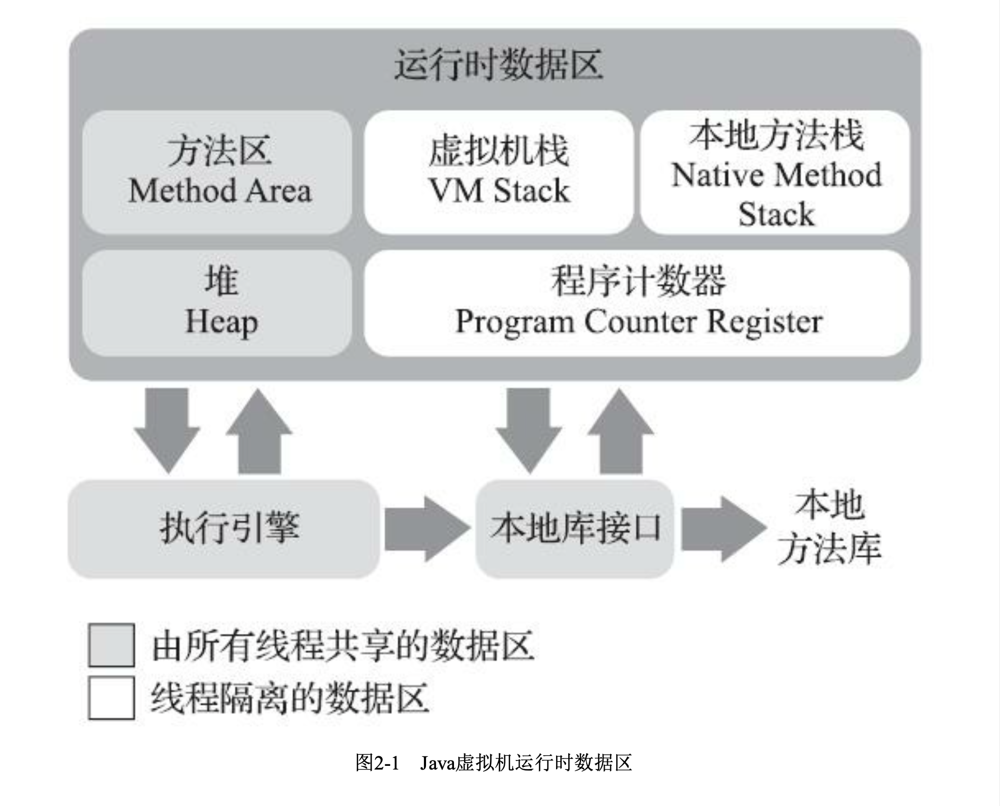

经常有人把Java内存区域笼统地划分为堆内存(Heap)和栈内存(Stack)，这种划分方式直接继承自传统的C、C++程序的内存布局结构，在Java语言里就显得有些粗糙了，实际的内存区域划分要比这更复杂。不过这种划分方式的流行也间接说明了程序员最关注的、与对象内存分配关系最密切的区域是“堆”和“栈”两块。其中，“堆”在稍后笔者会专门讲述，而“栈”通常就是指这里讲的虚拟机栈，或者更多的情况下只是指虚拟机栈中局部变量表部分。

在《Java虚拟机规范》中，对这个内存区域规定了两类异常状况:

- 如果线程请求的栈深度大于虚 拟机所允许的深度，将抛出StackOverflowError异常;

- 如果Java虚拟机栈容量可以动态扩展\[2\]，当栈扩展时无法申请到足够的内存会抛出OutOfMemoryError异常。

本地方法栈(Native M ethod Stacks)与虚拟机栈所发挥的作用是非常相似的，其区别只是

- 虚拟机 栈为虚拟机执行J ava方法(也就是字节码)服务，而

- 本地方法栈则是为虚拟机使用到的本地(N at ive) 方法服务。

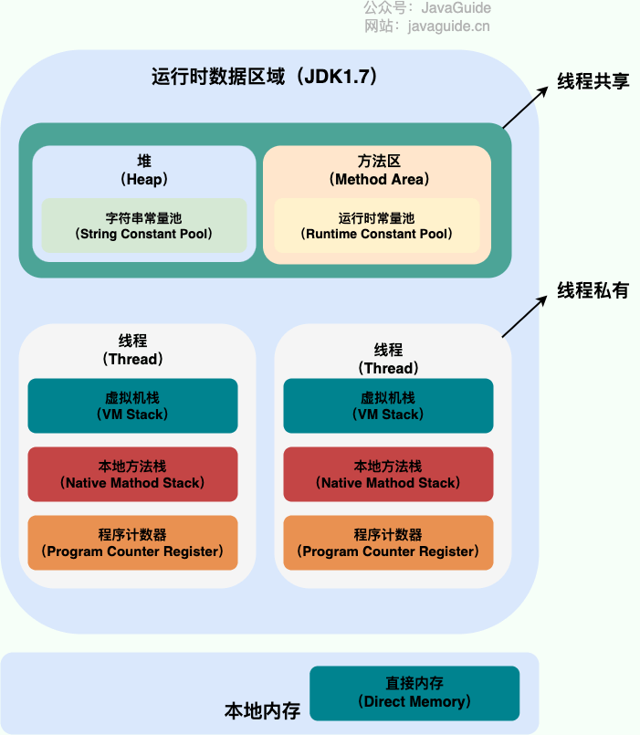

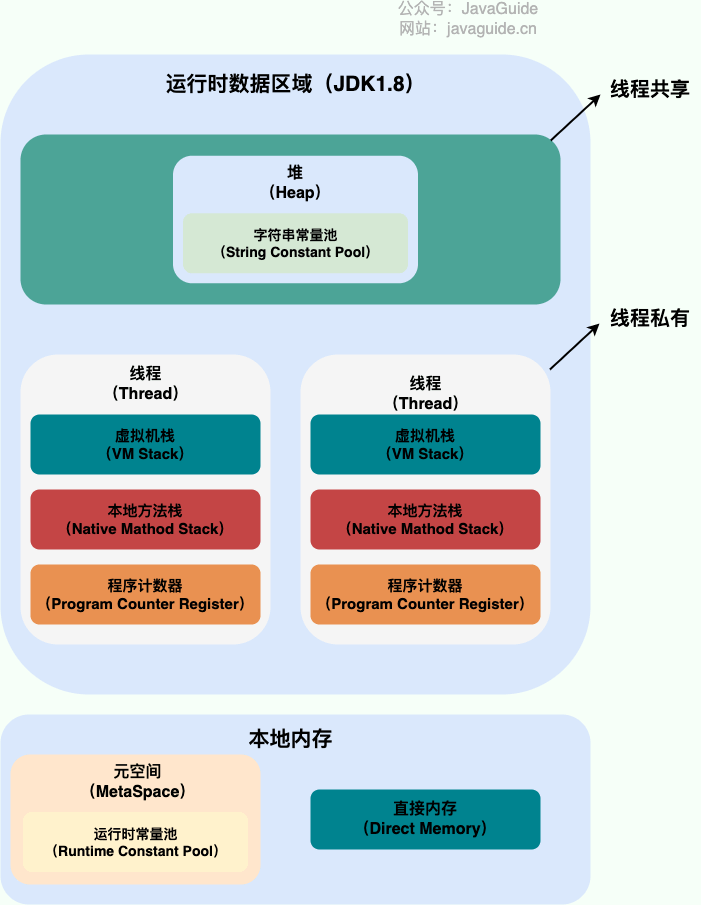

String objects which are in the string pool will not be garbage collected because a reference variable internally is maintained by JVM for each string literal object. Other String objects will be garbage collected if you don't have reference to it in your program execution.

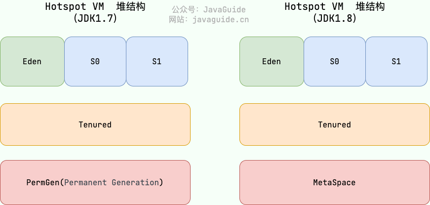

# **精美图文带你掌握 JVM 内存布局**

https://juejin.cn/post/6844904033396719624

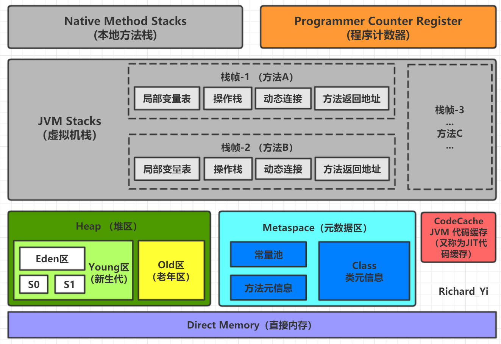

**如果按照线程是否共享来分类的话，如下图所示：**

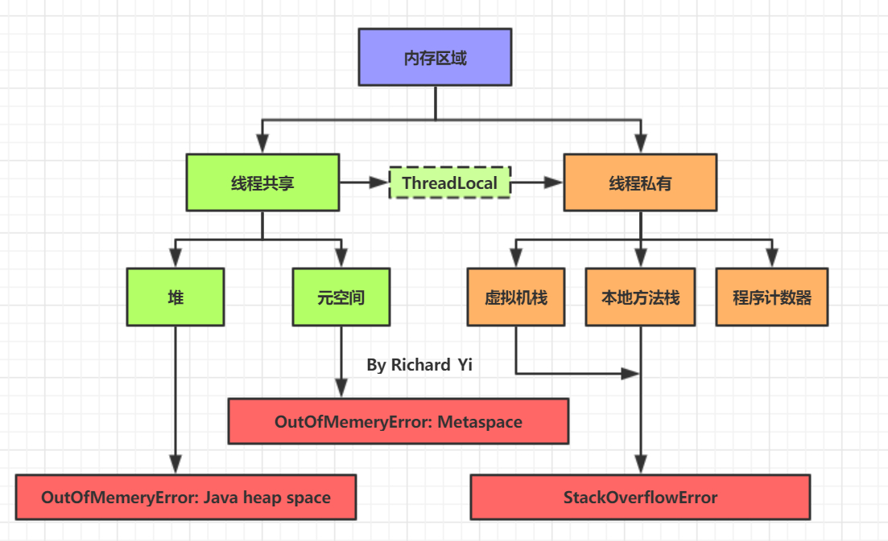

## **创建一个新对象 内存分配流程**

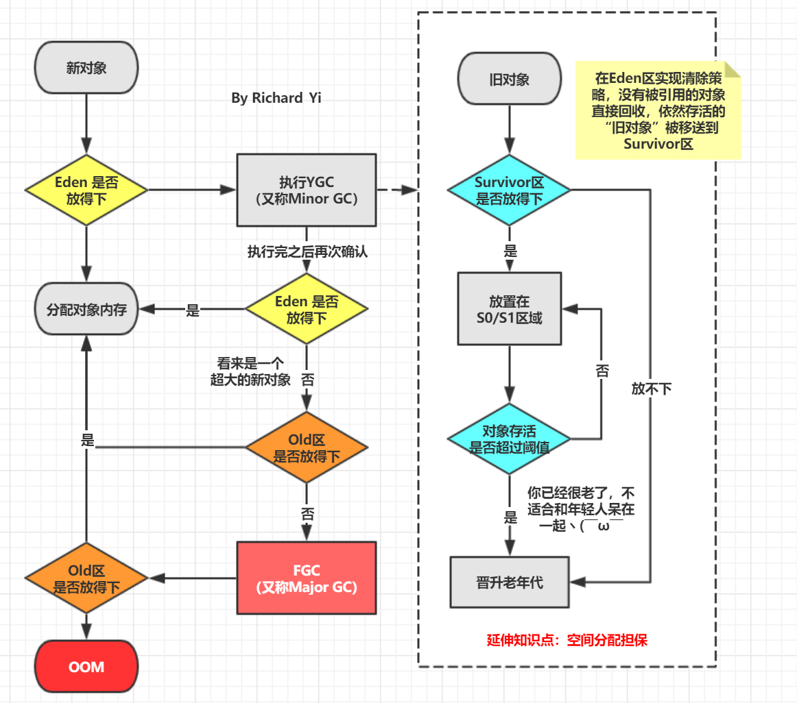

2.3.1 对象的创建

1.  检查类是否加载，解析，初始化

2.  分配内存

3.  设置对象header

4.  执行class文件 \<init\>()方法

对象创建在虚拟机中是非常频繁的行 为，即使仅仅修改一个指针所指向的位置，在并发情况下也并不是线程安全的，可能出现正在给对象 A分配内存，

指针还没来得及修改，对象B又同时使用了原来的指针来分配内存的情况。解决这个问题 有两种可选方案:

- 一种是对分配内存空间的动作进行同步处理——实际上虚拟机是采用CAS配上失败 重试的方式保证更新操作的原子性;

- 另外一种是把内存分配的动作按照线程划分在不同的空间之中进 行，即每个线程在Java堆中预先分配一小块内存，称为本地线程分配缓冲(Thread Local Allocation Buffer，TLAB)，哪个线程要分配内存，就在哪个线程的本地缓冲区中分配，只有本地缓冲区用完 了，分配新的缓存区时才需要同步锁定。虚拟机是否使用TLAB，可以通过-XX:+/-UseTLAB参数来 设定。

2.3.2 对象的内存布局

1.  Header (Mark word)

2.  Instance data

3.  Padding

Java 对象的内存布局

https://www.cnblogs.com/jajian/p/13681781.html

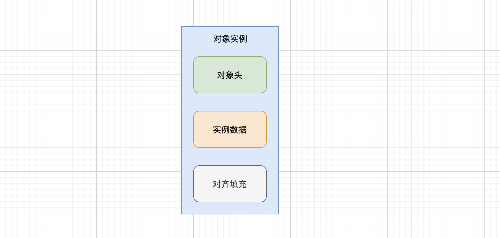

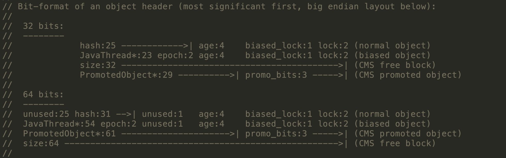

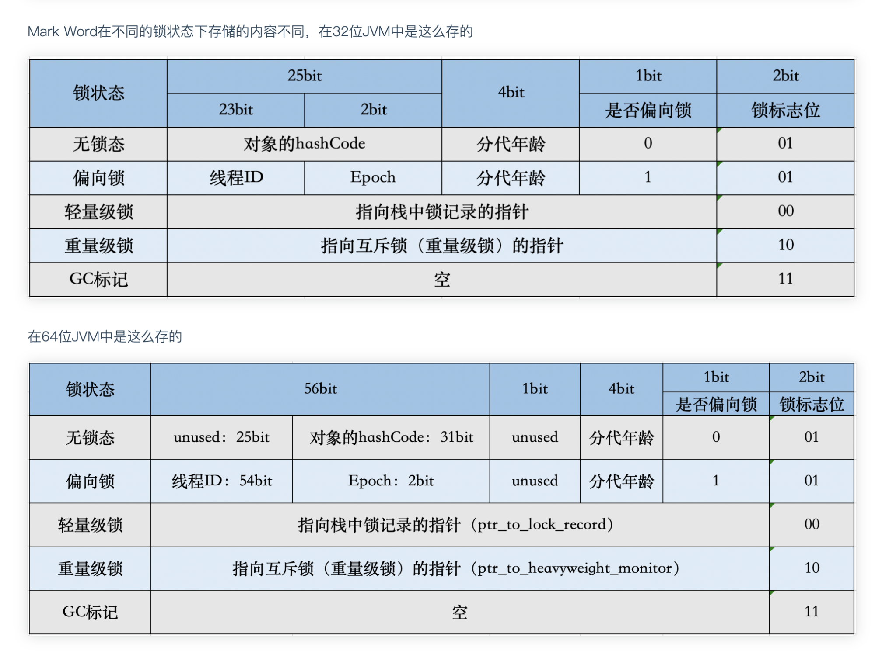

可以用 jol-core 来查看对象信息

\<dependency\>

\<groupId\>org.openjdk.jol\</groupId\>

\<artifactId\>jol-core\</artifactId\>

\<version\>0.8\</version\>

\</dependency\>

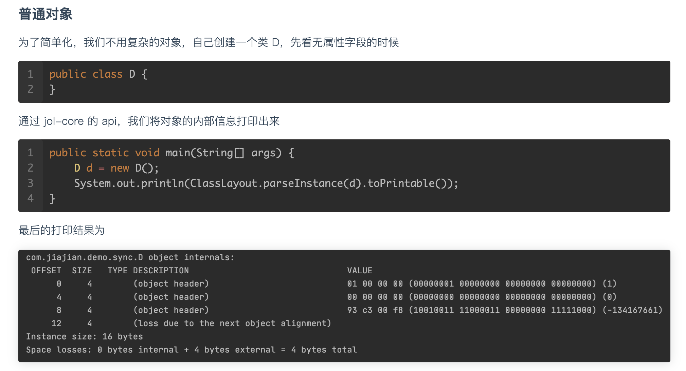

2.3.3 对象的访问定位

- Reference 句柄池 （加多了一层，但是对象移动不修改refererence句柄)

- 指针直接访问

**第3章 垃圾收集器与内存分配策略**

**jvm怎么判断哪些对象应该回收呢?**

- **引用计数算法: 不能解决循环依赖**

- **可达性分析算法:** GC root可达的对象不是垃圾，否则就是垃圾

**GC Algorithms:**

- Mark - sweep: 坏处会造成内存碎片化

- Copying: 把活跃对象复制的集中的预留空间，坏处：会浪费预留空间

- Mark - compact: 整理内存，使可用连续。坏处：效率偏低

重要概念

**普通对象指针(Ordinary Object Pointer，OOP)**

**3.4.4 记忆集和卡表**

在说记忆集和卡表之前，先给大家介绍一下跨代引用的问题。

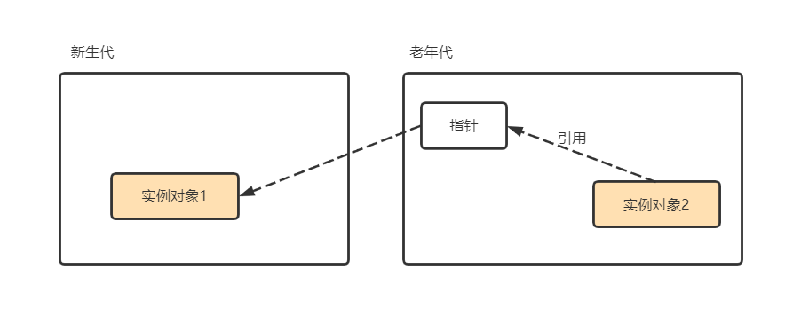

假如要现在进行一次只局限于新生代区域内的收集(Minor GC)，但新生代的实例对象1在老年代中被引用，为了找出该区域(新生代)中所有的存活对象，不得不在固定的GC Roots之外，再额外遍历整个老年代中所有对象来确保可达性分析结果的正确性，反过来也是一样。遍历整个老年代所有对象的方案虽然理论上可行，但无疑会为内存回收带来很大的性能负担。

👉🏻事实上并不只是新生代、老年代之间才有跨代引用的问题，所有涉及部分区域收集（Partial GC)行为的垃圾收集器，典型的如\[G1\]{.blue}、\[ZGC\]{.blue}和\[Shenandoah\]{.blue}收集器，都会面临相同的问题。

那么如何才能解决跨代引用呢？

只需在新生代上建立一个全局的数据结构（该结构被称为 “记忆集” ，Remembered Set)， 这个结构把老年代划分成若干小块，标识出老年代的哪一块内存会存在跨代引用。 此后当发生Minor GC时，只有包含了跨代引用的小块内存里的对象才会被加入到GCRoots进行扫描。虽然这种方法需要在对象改变引用关系(如将自己或者某个属性赋值)时维护记录数据的正确性，会增加一些运行时的开销，但比起收集时扫描整个老年代来说仍然是划算的。

**卡表和记忆集又有什么关系呢？**

**卡表就是记忆集的一种具体实现**，它定义了记忆集的记录精度、与堆内存的映射关系等。 **关于卡表与记忆集的关系，读者不妨按照Java语言中HashM ap 与M ap 的关系来类比理解。**

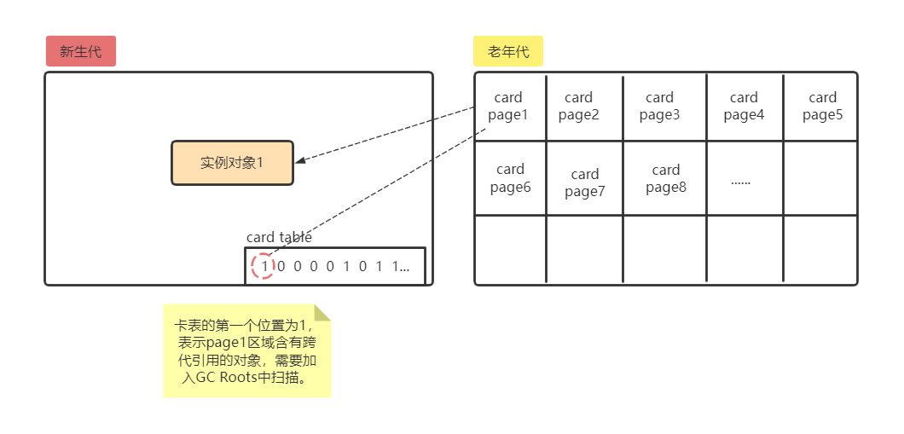

如图所示🍹，因为cardpage1中存在指向新生代的跨代引用，所以对应卡表的第一个位置为1，表明该page区域存在跨代应用的对象。

📍卡表角度： 因为page1中存在跨代饮用的对象，所以卡表对应的第一个位置记为1，表明page1这个元素变脏。

📍内存回收角度： 因为卡表的第一个位置为1，表明该page区域存在跨代应用的对象，垃圾回收的时候需要扫描该区域。

😎一个卡页的内存中通常包含不止一个对象，只要卡页内有一个(或更多）对象的字段存在着跨代指针，那就将对应卡表的数组元素的值标识为1，称为这个\[元素变脏（Dirty)\]{.purple}，没有则标识为0。在垃圾收集发生时， 只要筛选出卡表中变脏的元素，就能轻易得出哪些卡页内存块中包含跨代指针，把它们加入GC Roots中一并扫描。 这样就**不需要扫描整个老年代大大减少GC Roots的扫描范围。**

**3.4.5 写屏障**

写屏障可以看作在**虚拟机层面对“引用类型字段赋值”这个动作的AOP切面**\[2\]，在引用对象赋值时会产生一个环形(Around)通知，供程序执行额外的动作，也就是说赋值的 前后都在写屏障的覆盖范畴内。在赋值前的部分的写屏障叫作写前屏障(Pre-Write Barrier)，在赋值 后的则叫作写后屏障(Post-Write Barrier)

\`\`\`

写后屏障更新卡表

void oop_field_store(oop\* field, oop new_value) {

// 引用字段赋值操作

\*field = new_value;

// 写后屏障，在这里完成卡表状态更新

post_write_barrier(field, new_value);

}

\`\`\`

应用写屏障后，虚拟机就会为所有赋值操作生成相应的指令，一旦收集器在写屏障中增加了更新 卡表操作，无论更新的是不是老年代对新生代对象的引用，每次只要对引用进行更新，就会产生额外 的开销，不过这个开销与Minor GC时扫描整个老年代的代价相比还是低得多的。

CMS: post-write 实现 increment update

G1: pre-write 实现 SATB (Snapshot at the beginning)

**3.4.6 并发的可达性分析**

**三色标记算法**

**三色标记算法**是一种常见的垃圾收集标记算法，通常用于垃圾收集器CMS（Concurrent Mark-Sweep）和G1（Garbage First）。让我详细解释一下这个算法。

三色标记法思想：该算法将对象分为三种颜色：白色、灰色和黑色。

- 白色：表示该对象没有被标记过，即垃圾对象。

- 灰色：表示该对象已经被标记过，但其属性还没有全部被标记完，需要进一步扫描。

- 黑色：表示该对象已经被标记过，且其属性全部都被标记完，是程序所需要的对象。

算法流程：

从根对象（通常是GC Root）开始，沿着引用链向下查找，使用黑、灰、白的规则标记所有与GC Root相连接的对象。

第一次扫描结束后，通常需要进行一次短暂的STW（Stop The World）暂停，然后再次扫描。因为黑色对象的属性已经全部被标记过，所以只需找出灰色对象并继续标记。

最后，GC线程扫描所有内存，找出仍然被标记为白色的对象（垃圾），然后清除它们。

存在问题：

浮动垃圾（应该清理而没有清理，可以容忍）：在并发标记过程中，如果一个已经被标记成黑色或灰色的对象突然变成垃圾，由于不会重新扫描已经标记过的黑色对象，这些浮动垃圾不会被清除。

对象漏标（不应该清理而被清理，不可容忍）：并发标记过程中，一个业务线程将一个未被扫描过的白色对象断开引用成为垃圾，同时黑色对象引用了该对象。因为黑色对象的属性已经被标记过，重新标记也不会从黑色对象中找到，导致该对象被回收，可能导致系统问题。

解决办法：

CMS和G1回收器在使用三色标记法时，都采取了一些措施来应对这些问题。例如，

- CMS使用增量更新方法，而

- G1使用SATB（Snapshot-At-The-Beginning）来处理引用变化。

详情如下:

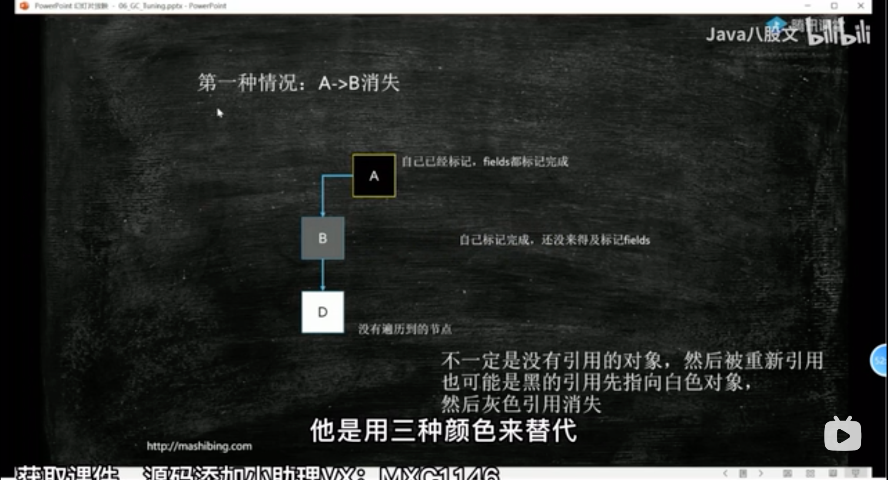

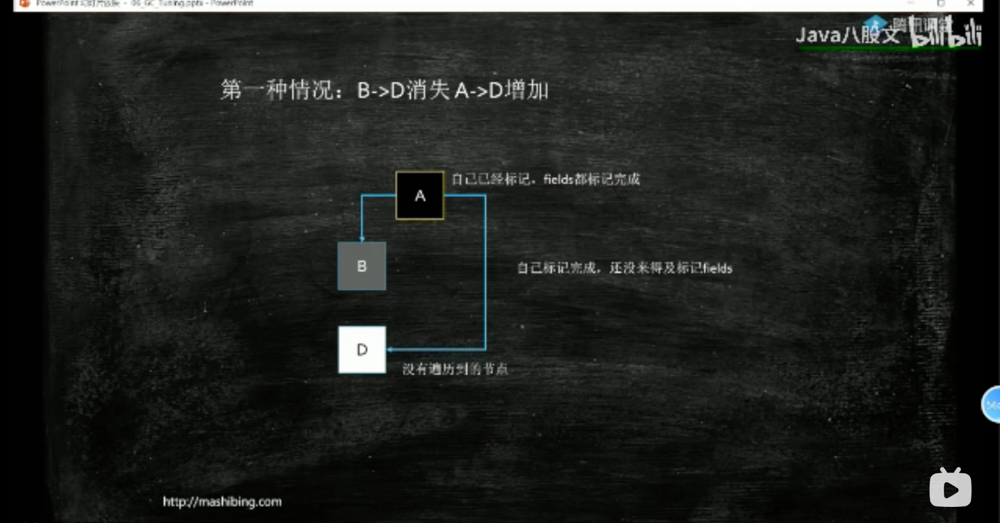

**CMS Incremental Update:**

开始A 是黑色，B是灰色，D是白色， D是B的成员

然后B和D断链， A加上D的链接

在执行 A.x = D时，把A设为灰色，这样GC会再次检查A

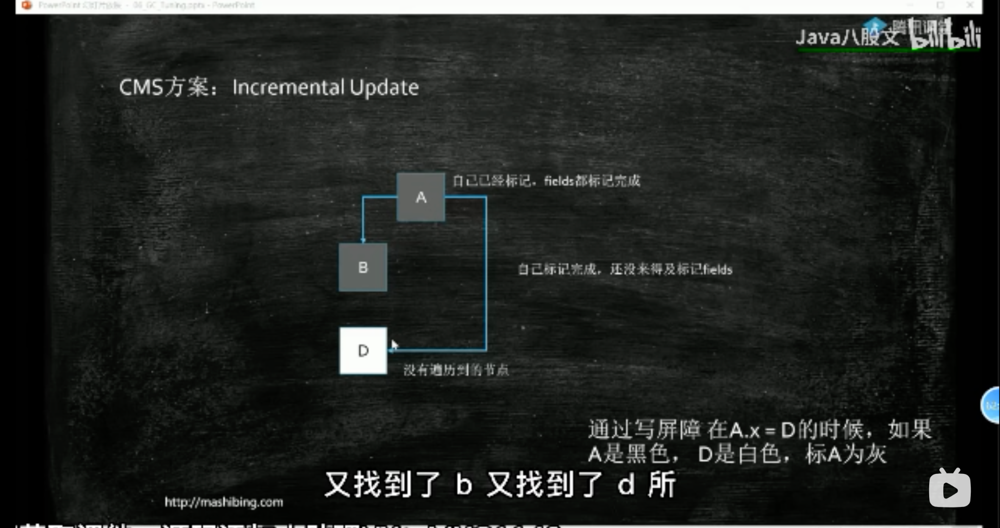

**G1 解决并发标记的问题**

[<u>https://www.bilibili.com/video/BV1Hr4y1t7i5?p=5</u>](https://www.bilibili.com/video/BV1Hr4y1t7i5?p=5)

SATB: 在B和D断链时，把B-D关系保存起来，清理D时特殊处理，看看还有没有人引用D（利用记忆集）

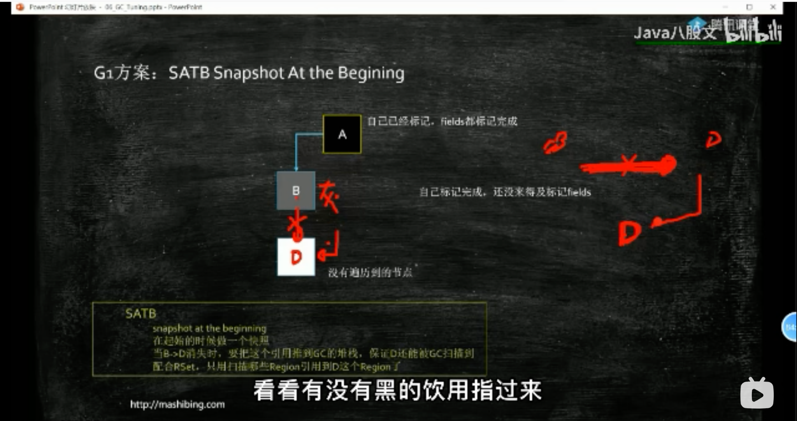

**3.5 经典垃圾收集器**

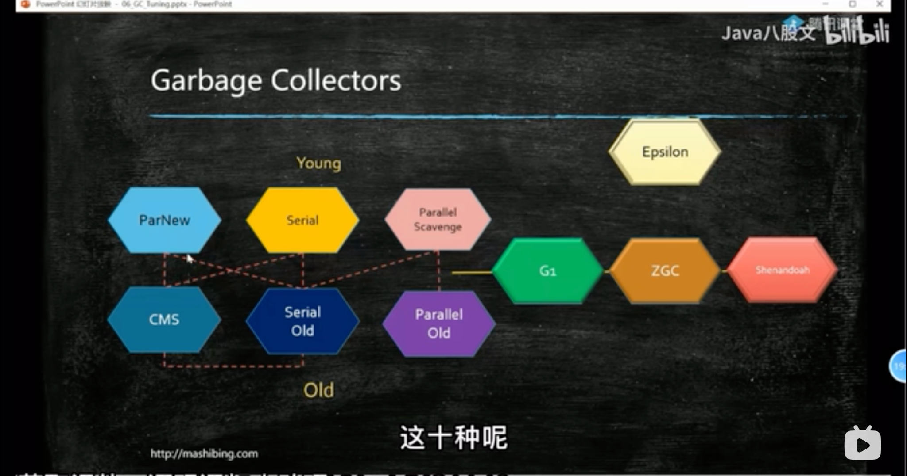

- 分代模型 (两个模型配合)

ParNew - CMS

Serial - Serial Old

Parallel Scavenge - Parallel Old

- 分区模型

Epsilon

G1

ZGC

Shenandoah

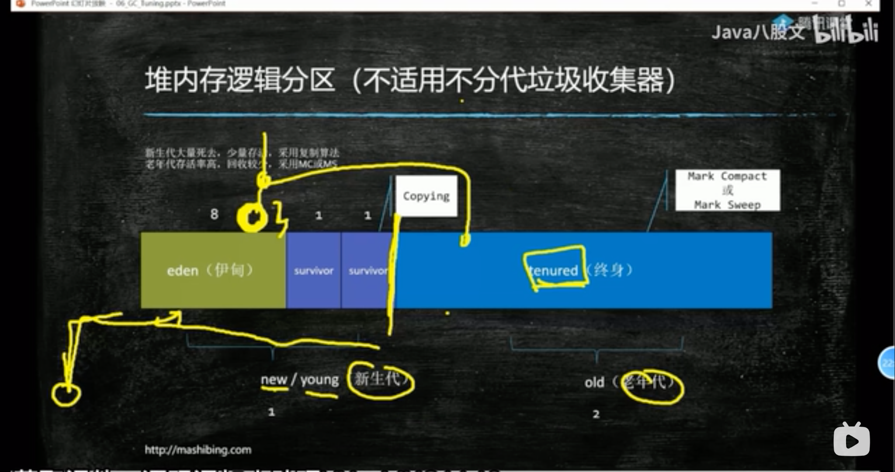

分代算法：年轻代 copying 算法， 老年代用 Mark-compact/ Mark-sweep

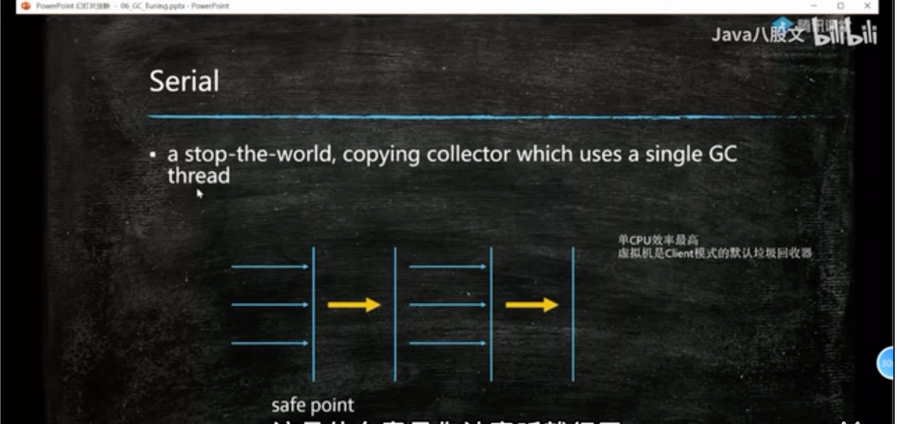

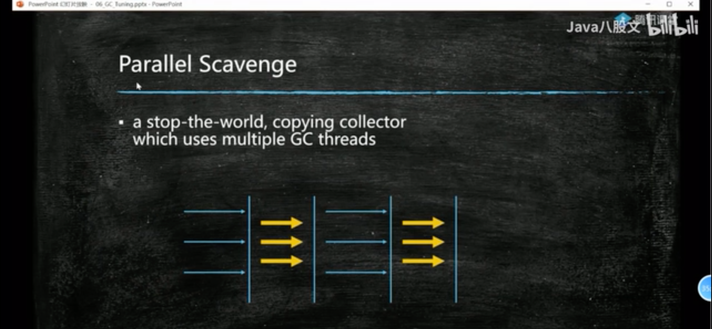

调优目标之一： STW 时间尽量短

**3.5.6 CMS收集器**

1.  初始标记(CMS initial mark) - STW

> 初始标记仅仅只是标记一下GC Roots能直接关联到的对象，速度很快

2.  并发标记(CMS concurrent mark)

> 并发标记阶段就是从GC Roots的直接关联对象开始遍历整个对象图的过程，这个过程耗时较长但是不需要停顿用户线程，可以与垃圾收集线程一起并发运行;

3.  重新标记(CMS remark) - STW

> 而重新标记阶段则是为了修正并发标记期间，因用户程序继续运作而导致标记产生变动的那一部分对象的标记记录(详见3.4.6节中关于增量更新的讲解)，这个阶段的停顿时间通常会比初始标记阶段稍长一 些，但也远比并发标记阶段的时间短

4.  并发清除(CMS concurrent sweep)

> 并发清除阶段，清理删除掉标记阶段判断的已经死亡的对象，由于不需要移动存活对象，所以这个阶段也是可以与用户线程同时并发的。

CMS是一款优秀的收集器，但至少有以下三个明显的缺点:

1.  首先，CMS收集器对处理器资源非常敏感。事实上，面向并发设计的程序都对处理器资源比较敏感。在并发阶段，它虽然不会导致用户线程停顿，但却会因为占用了一部分线程(或者说处理器的计 算能力)而导致应用程序变慢，降低总吞吐量

2.  由于CMS收集器无法处理“浮动垃圾”(FloatingGarbage)，有可能出现“Con-current Mode Failure”失败进而导致另一次完全“Stop The World”的Full GC的产生

3.  在本节的开头曾提到，CMS是一款基于“标记-清除”算法实现的收集器，如果读者对前面这部分介绍还有印象的话，就可能想到这意味着收集结束时会有大量空间碎片产生。空间碎片过多时，将会给大对象分配带来很大麻烦，往往会出现老年代还有很多剩余空间，但就是无法找到足够大的连续空间来分配当前对象，而不得不提前触发一次FullGC的情况。为了解决这个问题，CMS收集器提供了一个-XX:+UseCMS-CompactAtFullCollection开关参数(默认是开启的，此参数从JDK9开始废弃)，用于在CMS收集器不得不进行FullGC时开启内存碎片的合并整理过程，由于这个内存整理必须移动存活对象，(在Shenandoah和ZGC出现前)是无法并发的。这样空间碎片问题是解决了，但停顿时间又会变长，因此虚拟机设计者们还提供了另外一个参数-XX:CMSFullGCsBefore-Compaction(此参数从JDK9开始废弃)，这个参数的作用是要求CMS收集器在执行过若干次(数量由参数值决定)不整理空间的FullGC之后，下一次进入FullGC前会先进行碎片整理(默认值为0，表示每次进入FullGC时都进行碎片整理)

**3.5.7 G1收集器**

它开创了收集器面向局部收集的设计思路和基于Region的内存布局形式 （不再整体分代)

JDK 9发布之 日，G1宣告取代Parallel Scavenge加Parallel Old组合，成为服务端模式下的默认垃圾收集器，而CMS则沦落至被声明为不推荐使用(Deprecate)的收集器

首先要有一个思想上的改变，在G1收集器出现之前的所有 其他收集器，包括CMS在内，垃圾收集的目标范围要么是整个新生代(Minor GC)，要么就是整个老 年代(M ajor GC)，再要么就是整个Java堆(Full GC)。而G1跳出了这个樊笼，它可以面向堆内存任 何部分来组成回收集(Collection Set，一般简称CSet)进行回收，衡量标准不再是它属于哪个分代，而 是哪块内存中存放的垃圾数量最多，回收收益最大，这就是G1收集器的Mixed GC模式。

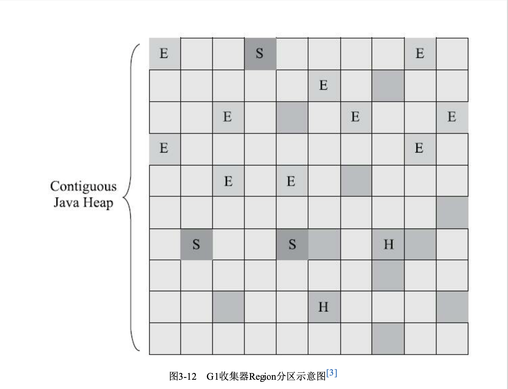

毫无疑问，可以由用户指定期望的停顿时间是G1收集器很强大的一个功能，设置不同的期望停顿 时间，可使得G1在不同应用场景中取得关注吞吐量和关注延迟之间的最佳平衡。不过，这里设置 的“期望值”必须是符合实际的，不能异想天开，毕竟G1是要冻结用户线程来复制对象的，这个停顿时 间再怎么低也得有个限度。它默认的停顿目标为两百毫秒，一般来说，回收阶段占到几十到一百甚至 接近两百毫秒都很正常，但如果我们把停顿时间调得非常低，譬如设置为二十毫秒，很可能出现的结 果就是由于停顿目标时间太短，导致每次选出来的回收集只占堆内存很小的一部分，收集器收集的速 度逐渐跟不上分配器分配的速度，导致垃圾慢慢堆积。很可能一开始收集器还能从空闲的堆内存中获 得一些喘息的时间，但应用运行时间一长就不行了，最终占满堆引发Full GC反而降低性能，所以通常 把期望停顿时间设置为一两百毫秒或者两三百毫秒会是比较合理的。

G1无论是为了垃圾收集产生的内存占用(Footprint)还是程序运行时的额外执行负载 (Overload)都要比CMS要高。

- 内存占用(Footprint): 卡表每个regeon都有，更为复杂

- 执行负载 (Overload): G1写屏障处理post还有pre时额外负担，以致需要消息队列实现

按照笔者的实践经 验，目前在小内存应用上CMS的表现大概率仍然要会优于G1，而在大内存应用上G1则大多能发挥其 优势，这个优劣势的Java堆容量平衡点通常在6GB至8GB之间，当然，以上这些也仅是经验之谈，

**3.6.1 Shenandoah收集器**

- Redhat开发

<!-- -->

- 更像G1继承者

读者可以 从这个官方的测试结果来对Shenandoah的

- 弱项(高运行负担使得吞吐量下降)和

- 强项(低延迟时间) 建立量化的概念，

并对比一下稍后介绍的ZGC的测试结果。

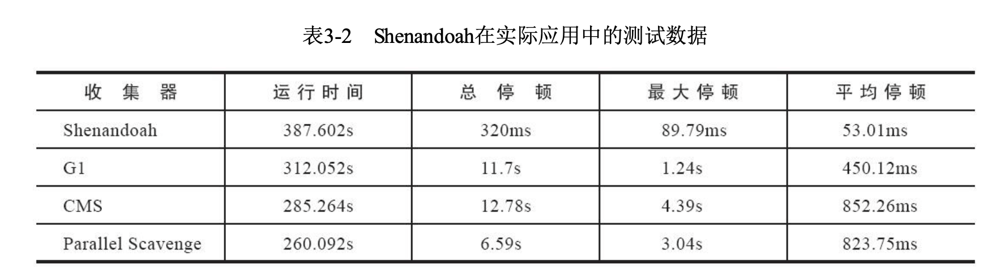

**3.6.2 ZGC收集器**

如果说RedHat公司开发的Shen-andoah像是Oracle的G1收集器的实际继承者的话，

那Oracle公司开发的ZGC就更像是AzulSystem公司独步天下的PGC(PauselessGC)和C4(ConcurrentContinuouslyCompactingCollector)收集器的同胞兄弟

因为ZGC几乎所有 的关键技术上，与PGC和C4都只存在术语称谓上的差别，实质内容几乎是一模一样的.

ZGC收集器是一款基于Region内存布局的，(暂时) 不设分代的，使用了读屏障、**染色指针**和内存多重映射等技术来实现可并发的标记-整理算法的，以低延迟为首要目标的一款垃圾收集器。

HotSpot虚拟机的几种收集器有不同的标记实现方案，

- 有的把标记直接记录在 对象头上(如Serial收集器)，

- 有的把标记记录在与对象相互独立的数据结构上(如G1、Shenandoah使 用了一种相当于堆内存的1/64大小的，称为BitMap的结构来记录标记信息)，

- 而ZGC的染色指针是最 直接的、最纯粹的，它直接把标记信息记在引用对象的指针上，这时，与其说可达性分析是遍历对象图来标记对象，还不如说是遍历“ 引用图”来标记“ 引用”了。

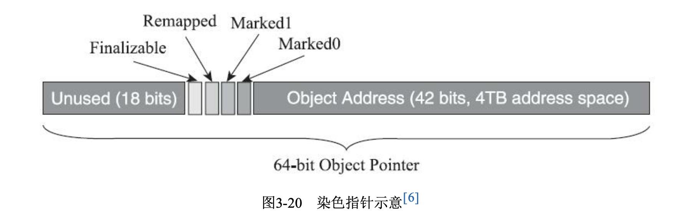

要顺利应用染色指针有一个必须解决的前置问题:Java虚拟机作为一个普普通通的进程， 这样随意重新定义内存中某些指针的其中几位，操作系统是否支持?处理器是否支持?

ZGC设计者就只能采取其他的补救措施了，这里面的解决方案要涉及虚拟内存映射技术，让我们先来复习一下这个x86计算机体系中的经典设计。

从Intel80386处理器开始，提供了“保护模式”用于隔离进程。在保护模式下，386处理器的全部32条地址寻址线都有效，进程可访问最高也可达4GB的内存空间，但此时已不同于之前实模式下的物理内存寻址了，处理器会使用分页管理机制把线性地址空间和物理地址空间分别划分为大小相同的块，这样的内存块被称为“页”(Page)。通过在线性虚拟空间的页与物理地址空间的页之间建立的映射表，分页管理机制会进行线性地址到物理地址空间的映射，完成线性地址到物理地址的转换\[8\]

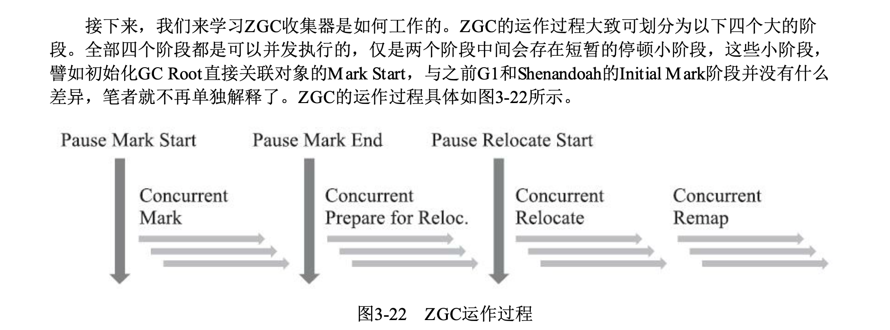

ZGC的设计理念与Azul System公司的PGC和C4收集器一脉相承\[10\]，是迄今垃圾收集器研究的最 前沿成果，它与Shenandoah一样做到了几乎整个收集过程都全程可并发，短暂停顿也只与GC Roots大 小相关而与堆内存大小无关，因而同样实现了任何堆上停顿都小于十毫秒的目标

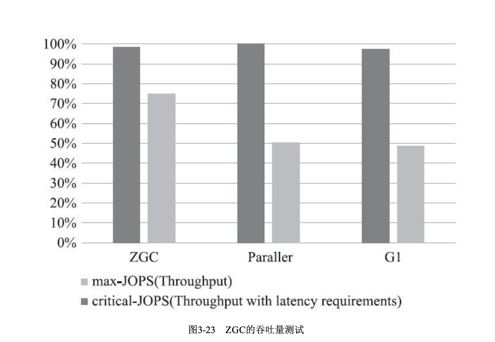

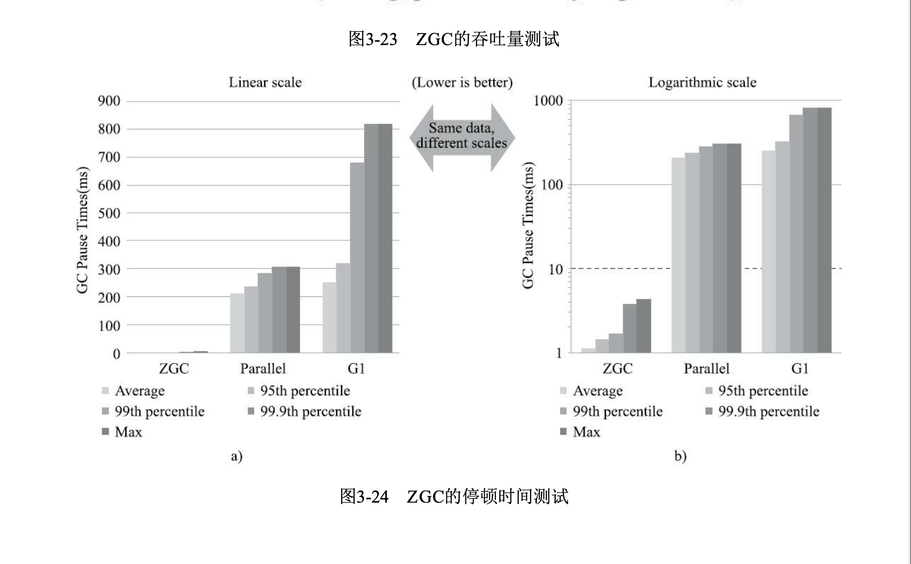

**3.7.2 收集器的权衡**

如果算上Epsilon，本书中已经介绍过十款HotSpot虚拟机的垃圾收集器了，此外还涉及Azul System公司的PGC、C4等收集器，再加上本章中并没有出现，但其实也颇为常用的OpenJ9中的垃圾收 集器，把这些收集器罗列出来就仿佛是一幅琳琅画卷、一部垃圾收集的技术演进史。现在可能有读者 要犯选择困难症了，我们应该如何选择一款适合自己应用的收集器呢?这个问题的答案主要受以下三 个因素影响:

·应用程序的主要关注点是什么?

- 如果是数据分析、科学计算类的任务，目标是能尽快算出结果， 那吞吐量就是主要关注点;

- 如果是SLA应用，那停顿时间直接影响服务质量，严重的甚至会导致事务 超时，这样延迟就是主要关注点;

- 而如果是客户端应用或者嵌入式应用，那垃圾收集的内存占用则是 不可忽视的。

·运行应用的基础设施如何?譬如硬件规格，要涉及的系统架构是x86-32/64、SPARC还是

ARM /Aarch64;处理器的数量多少，分配内存的大小;选择的操作系统是Linux、Solaris还是Windows 等。

·使用JDK的发行商是什么?版本号是多少?是ZingJDK/Zulu、OracleJDK、Open-JDK、OpenJ9抑 或是其他公司的发行版?该JDK对应了《Java虚拟机规范》的哪个版本?

一般来说，收集器的选择就从以上这几点出发来考虑。举个例子，假设某个直接面向用户提供服 务的B/S系统准备选择垃圾收集器，一般来说延迟时间是这类应用的主要关注点，那么:

- 如果你有充足的预算但没有太多调优经验，那么一套带商业技术支持的专有硬件或者软件解决方 案是不错的选择，Azul公司以前主推的Vega系统和现在主推的Zing VM是这方面的代表，这样你就可以 使用传说中的C4收集器了。

- 如果你虽然没有足够预算去使用商业解决方案，但能够掌控软硬件型号，使用较新的版本，同时 又特别注重延迟，那ZGC很值得尝试。

- 如果你对还处于实验状态的收集器的稳定性有所顾虑，或者应用必须运行在Win-dows操作系统下，那ZGC就无缘了，试试Shenandoah吧。

- 如果你接手的是遗留系统，软硬件基础设施和JDK版本都比较落后，那就根据内存规模衡量一 下，对于大概4GB到6GB以下的堆内存，CMS一般能处理得比较好，而对于更大的堆内存，可重点考察一下G1。

当然，以上都是仅从理论出发的分析，实战中切不可纸上谈兵，根据系统实际情况去测试才是选

择收集器的最终依据。

**3.8 实战:内存分配与回收策略**

测试代码

**第4章 虚拟机性能监控、故障处理工具**

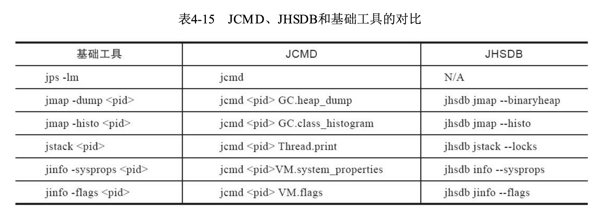
