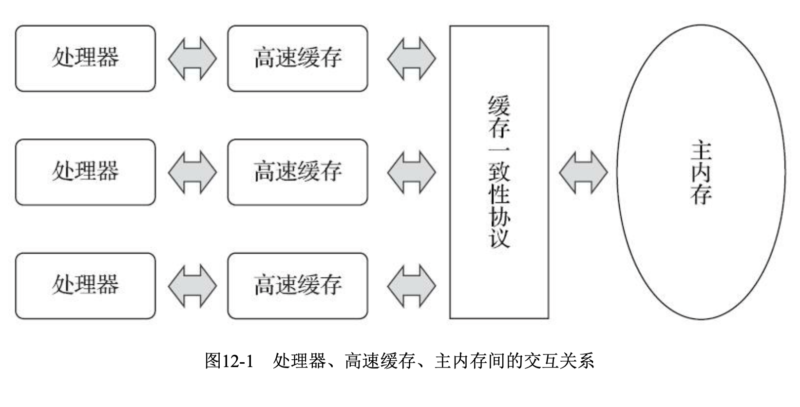
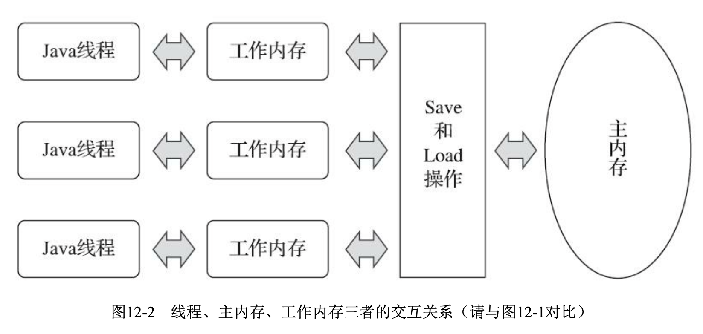
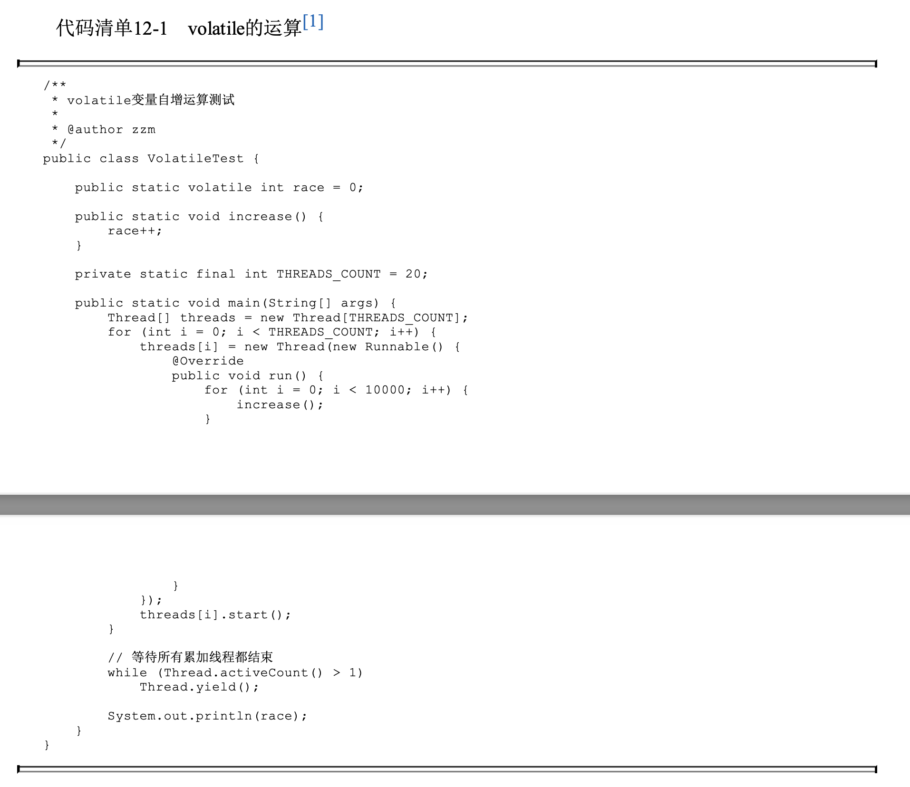
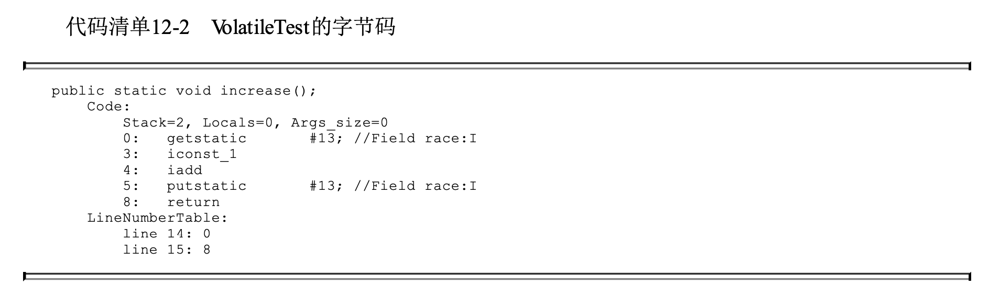
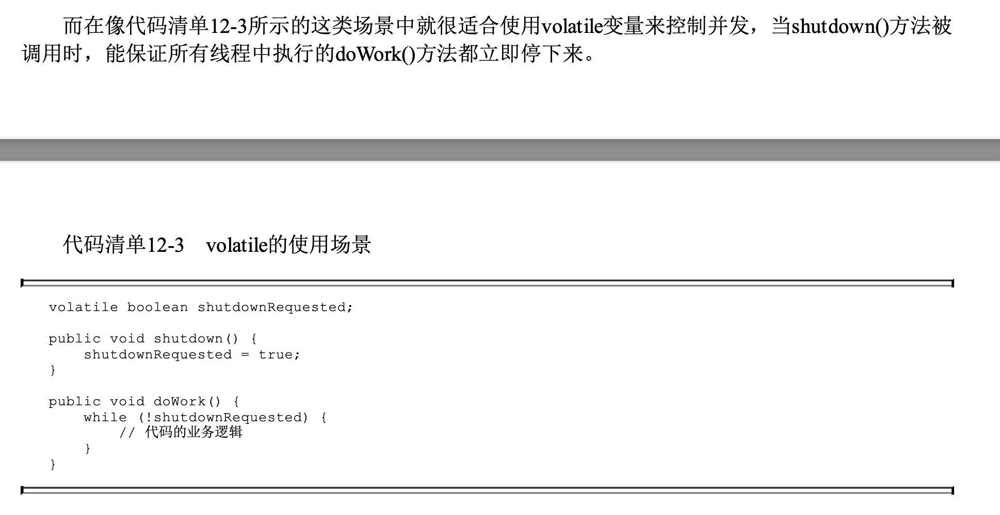

**第12章 Java内存模型与线程**

**12.3 Java内存模型**

定义Java内存模型并非一件容易的事情，这个模型必须定义得足够严谨，才能让Java的并发内存访 问操作不会产生歧义;但是也必须定义得足够宽松，使得虚拟机的实现能有足够的自由空间去利用硬 件的各种特性(寄存器、高速缓存和指令集中某些特有的指令)来获取更好的执行速度。经过长时间的验证和修补，直至JDK 5(实现了JSR-133\[3\])发布后，Java内存模型才终于成熟、完善起来了。

**12.3.1 主内存与工作内存**

Java内存模型的主要目的是定义程序中各种变量的访问规则，即关注在虚拟机中把变量值存储到 内存和从内存中取出变量值这样的底层细节。此处的变量(Variables)与Java编程中所说的变量有所区别，它包括了实例字段、静态字段和构成数组对象的元素，但是不包括局部变量与方法参数，因为后者是线程私有的\[1\]，不会被共享，自然就不会存在竞争问题。为了获得更好的执行效能，Java内存模 型并没有限制执行引擎使用处理器的特定寄存器或缓存来和主内存进行交互，也没有限制即时编译器是否要进行调整代码执行顺序这类优化措施。

Java内存模型规定了所有的变量都存储在主内存(Main Memory)中(此处的主内存与介绍物理 硬件时提到的主内存名字一样，两者也可以类比，但物理上它仅是虚拟机内存的一部分)。每条线程 还有自己的工作内存(Working M emory ，可与前面讲的处理器高速缓存类比)，线程的工作内存中保存了被该线程使用的变量的主内存副本\[2\]，**线程对变量的所有操作(读取、赋值等)都必须在工作内存中进行，而不能直接读写主内存中的数据\[**3\]。不同的线程之间也无法直接访问对方工作内存中的变 量，线程间变量值的传递均需要通过主内存来完成，线程、主内存、工作内存三者的交互关系如图12- 2所示，注意与图12-1进行对比。

此处请读者注意区分概念:如果局部变量是一个reference类型，它引用的对象在Java堆中可被各个线程共享，但是reference本身在Java栈的局部变量表中是线程私有的。

**12.3.2 内存间交互操作**

- lock(锁定):作用于主内存的变量，它把一个变量标识为一条线程独占的状态。

- unlock(解锁):作用于主内存的变量，它把一个处于锁定状态的变量释放出来，释放后的变量 才可以被其他线程锁定。

- read(读取):作用于主内存的变量，它把一个变量的值从主内存传输到线程的工作内存中，以 便随后的load动作使用。

- load(载入):作用于工作内存的变量，它把read操作从主内存中得到的变量值放入工作内存的 变量副本中。

- use(使用):作用于工作内存的变量，它把工作内存中一个变量的值传递给执行引擎，每当虚 拟机遇到一个需要使用变量的值的字节码指令时将会执行这个操作。

- assign(赋值):作用于工作内存的变量，它把一个从执行引擎接收的值赋给工作内存的变量， 每当虚拟机遇到一个给变量赋值的字节码指令时执行这个操作。

- store(存储):作用于工作内存的变量，它把工作内存中一个变量的值传送到主内存中，以便随 后的write操作使用。

- write(写入):作用于主内存的变量，它把store操作从工作内存中得到的变量的值放入主内存的 变量中。

操作注意细节看原书

除了进行虚拟机开发的团队 外，大概没有其他开发人员会以这种方式来思考并发问题，我们只需要理解Java内存模型的定义即 可。12.3.6节将介绍这种定义的一个等效判断原则——先行发生(Happen before) 原则，用来确定一个操作在并发环境下 是否安全的。

**12.3.3 对于volatile型变量的特殊规则**

关键字volatile可以说是Java虚拟机提供的最轻量级的同步机制，但是它并不容易被正确、完整地 理解，以至于许多程序员都习惯去避免使用它，遇到需要处理多线程数据竞争问题的时候一律使用 synchronized来进行同步

当一个变量被定义成volat ile之后，它将具备两项特性:

- 第一项是保证此变量对所有线程的可见 性，这里的“ 可见性”是指当一条线程修改了这个变量的值，新值对于其他线程来说是可以立即得知 的。而普通变量并不能做到这一点，普通变量的值在线程间传递时均需要通过主内存来完成。比如， 线程A修改一个普通变量的值，然后向主内存进行回写，另外一条线程B在线程A回写完成了之后再对 主内存进行读取操作，新变量值才会对线程B可见。

关于volat ile变量的可见性，经常会被开发人员误解，他们会误以为下面的描述是正确的:“ volat ile 变量对所有线程是立即可见的，对volat ile变量所有的写操作都能立刻反映到其他线程之中。换句话 说，volat ile变量在各个线程中是一致的，所以基于volat ile变量的运算在并发下是线程安全的”。这句话 的论据部分并没有错，但是由其论据并不能得出“ 基于volat ile变量的运算在并发下是线程安全的”这样 的结论。volat ile变量在各个线程的工作内存中是不存在一致性问题的(从物理存储的角度看，各个线 程的工作内存中volat ile变量也可以存在不一致的情况，但由于每次使用之前都要先刷新，执行引擎看 不到不一致的情况，因此可以认为不存在一致性问题)，但是Java里面的运算操作符并非原子操作， 这导致volatile变量的运算在并发下一样是不安全的，我们可以通过一段简单的演示来说明原因，请看 代码清单12-1中演示的例子。

问题就出在自增运算“race++”之中，我们用Javap反编译这段代码后会得到代码清单12-2所示，发 现只有一行代码的increase()方法在Class文件中是由4条字节码指令构成(ret urn指令不是由race++产生 的，这条指令可以不计算)，从字节码层面上已经很容易分析出并发失败的原因了:当getstatic指令把 race的值取到操作栈顶时，volatile关键字保证了race的值在此时是正确的，但是在执行iconst \_1、iadd这 些指令的时候，其他线程可能已经把race的值改变了，而操作栈顶的值就变成了过期的数据，所以 putstatic指令执行后就可能把较小的race值同步回主内存之中。

实事求是地说，笔者使用字节码来分析并发问题仍然是不严谨的 (该使用汇编，但bytecode可以说明问题)

**结论： volatile 适合作为flag控制一个读线程和一个写线程的同步。不适合多线程写。**

- 使用volat ile变量的第二个语义是禁止指令重排序优化，普通的变量仅会保证在该方法的执行过程 中所有依赖赋值结果的地方都能获取到正确的结果，而不能保证变量赋值操作的顺序与程序代码中的 执行顺序一致。因为在同一个线程的方法执行过程中无法感知到这点，这就是Java内存模型中描述的 所谓“线程内表现为串行的语义”(Within-Thread As-If-Serial Semantics)。

详情例子看原书

**12.5.2 协程的复苏**

内核线程的调度成本主要来自于用户态与核心态之间的状态转换，而这两种状态转换的开销主要

来自于响应中断、保护和恢复执行现场的成本。

这种保护和恢复现场的工 作，免不了涉及一系列数据在各种寄存器、缓存中的来回拷贝，当然不可能是一种轻量级的操作

**第13章 线程安全与锁优化**

**13.2.2 线程安全的实现方法**

**1.互斥同步: synchronized, 重量级(Heavy-Weight)**

重入锁(ReentrantLock)是Lock接口最常见的一种实现\[2\]，顾名思义，它与synchronized一样是可

重入\[3\]的。在基本用法上，ReentrantLock也与synchronized很相似，只是代码写法上稍有区别而已。不 过，ReentrantLock与synchronized相比增加了一些高级功能，主要有以下三项:等待可中断、可实现公 平锁及锁可以绑定多个条件。

- 等待可中断:是指当持有锁的线程长期不释放锁的时候，正在等待的线程可以选择放弃等待，改为处理其他事情。可中断特性对处理执行时间非常长的同步块很有帮助。

- 公平锁:是指多个线程在等待同一个锁时，必须按照申请锁的时间顺序来依次获得锁(排队上锁);

> 而非公平 锁则不保证这一点，在锁被释放时，任何一个等待锁的线程都有机会获得锁。synchronized中的锁是非公平的，ReentrantLock在默认情况下也是非公平的，但可以通过带布尔值的构造函数要求使用公平锁。不过一旦使用了公平锁，将会导致Reentrant Lock的性能急剧下降，会明显影响吞吐量。

- 锁绑定多个条件:是指一个ReentrantLock对象可以同时绑定多个Condition对象。在synchronized 中，锁对象的wait()跟它的notify()或者notifyAll()方法配合可以实现一个隐含的条件，如果要和多于一个的条件关联的时候，就不得不额外添加一个锁;而Reent rant Lock则无须这样做，多次调用 newCondition()方法即可。

从图13-1和图13-2中可以看出，多线程环境下synchronized的吞吐量下降得非常严重，而

Reent rant Lock则能基本保持在同一个相对稳定的水平上。但与其说Reent rant Lock性能好，倒不如说当 时的synchronized有非常大的优化余地，后续的技术发展也证明了这一点。当JDK 6中加入了大量针对 synchronized锁的优化措施(下一节我们就会讲解这些优化措施)之后，相同的测试中就发现 synchronized与ReentrantLock的性能基本上能够持平。相信现在阅读本书的读者所开发的程序应该都是 使用JDK 6或以上版本来部署的，所以性能已经不再是选择synchronized或者ReentrantLock的决定因素。

**2.非阻塞同步: CAS**

**3.无同步方案**

- 可重入代码(Reentrant Code):这种代码又称纯代码(Pure Code)

- 线程本地存储(Thread Local Storage):

**13.3 锁优化**

适应性自旋(Adaptive Spinning)、锁消除(Lock Elimination)、锁膨胀(Lock Coarsening)、轻量级锁(Lightweight Locking)、偏向锁(Biased Locking)等，这些技术都是为了在线程之间更高效地共享数据及解决竞争问题，从而提高程序的执行 效率。

**这些都是锁优化策略，和synchronized, ReentrantLock不是同一类概念，是指如何实现synchronized等的细节**

- **自旋锁与自适应自旋: (spin locking)**

让后面请求锁的那个线程“ 稍等一会”，但不放弃处理器的执行时间，看看持有锁的线程是否很 快就会释放锁。为了让线程等待，我们只须让线程执行一个忙循环(自旋)，这项技术就是所谓的自 旋锁。

自适应意味着自旋的时间不再是固定的了，而是由 前一次在同一个锁上的自旋时间及锁的拥有者的状态来决定的。(预测,大概率的就等,小概率的不等)

- **锁消除: (lock elimination)**

如果判断到一段代码中，在堆上的所有数据都不会逃逸出去被其他线程访问到，那就可 以把它们当作栈上数据对待，认为它们是线程私有的，同步加锁自然就无须再进行。

- **锁粗化:(inflated)**

如果虚拟机探测到有这样一串零碎的操作 都对同一个对象加锁，将会把加锁同步的范围扩展(粗化)到整个操作序列的外部

- **轻量级锁: (lightweight locking):**

和synchronized不是一类概念

在没有多线程竞争的前提下，减少传统的重量级锁使用操作系 统互斥量产生的性能消耗。

轻量级锁能提升程序同步性能的依据是“ 对于绝大部分的锁，在整个同步周期内都是不存在竞争 的”这一经验法则。

**The key idea is to use the CPU’s Compare-And-Swap (CAS) instruction (also known as the CMPXCHG instruction) to attempt to acquire a lock before resorting to full mutual exclusion.**

但如果确 实存在锁竞争，除了互斥量的本身开销外，还额外发生了CAS操作的开销。因此在有竞争的情况下， 轻量级锁反而会比传统的重量级锁更慢。

其实就是如果存在高度竞争, CAS比synchronized慢

- **偏向锁: (biased lock)**

如果说轻量级锁是在无竞争的情况下使用CAS操作去消除同步使用的互 斥量，那偏向锁就是在无竞争的情况下把整个同步都消除掉，连CAS操作都不去做了。

如果CAS操作成功，持有偏向锁的线程以后每次进入这个锁相关 的同步块时，虚拟机都可以不再进行任何同步操作(例如加锁、解锁及对Mark Word的更新操作 等)。

一旦出现另外一个线程去尝试获取这个锁的情况，偏向模式就马上宣告结束。
