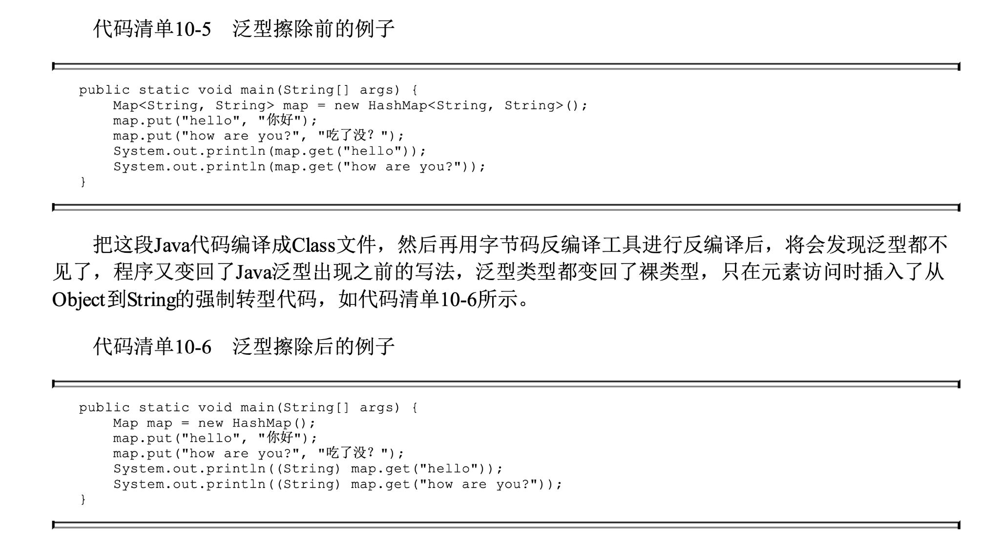
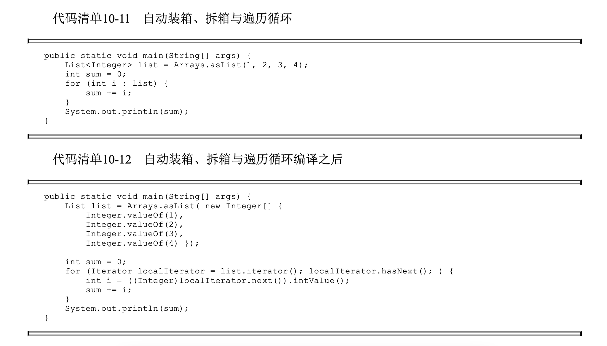

**第10章 前端编译与优化**

**10.3 Java语法糖的味道**

Java的泛型 确实在实际使用中会有一些限制，如果读者是一名C#开发人员，可能很难想象代码清单10-2中的Java 代码都是不合法的。

代码清单10-2 Java中不支持的泛型用法 (instanceof E, new E), 运行时没有E这个类型，C#是有的

public class TypeErasureGenerics\<E\> {

public void doSomething(Object item) {

if (item instanceof E) { // 不合法，无法对泛型进行实例判断

...

}

E newItem = new E(); // 不合法，无法使用泛型创建对象

E\[\] itemArray = new E\[10\]; // 不合法，无法使用泛型创建数组

}

}

性能上的差距则是难以用编码弥补的。C#2.0引入 了泛型之后，带来的显著优势之一便是对比起Java在执行性能上的提高，因为在使用平台提供的容器

类型(如List\<T\>，Dictionary\<TKey，TValue\>)时，无须像Java里那样不厌其烦地拆箱和装箱

**裸类型**

代码清单10-4 裸类型赋值

ArrayList\<Integer\> ilist = new ArrayList\<Integer\>();

ArrayList\<String\> slist = new ArrayList\<String\>();

ArrayList list; // 裸类型

list = ilist;

list = slist;

10.3.2 自动装箱、拆箱与遍历循环

自动装箱的陷阱

public static void main(String\[\] args) {

Integer a = 1;

Integer b = 2;

Integer c = 3;

Integer d = 3;

Integer e = 321;

Integer f = 321;

Long g = 3L;

System.out.println("c == d: " + (c == d));

System.out.println("e == f: " + (e == f)); // no unboxing

System.out.println("e.equals(f): " + (e.equals(f)));

System.out.println("c == (a + b): " + (c == (a + b)));

System.out.println("c.equals(a + b): " + (c.equals(a + b)));

System.out.println("g == (a + b): " + (g == (a + b)));

System.out.println("g.equals(a + b): " + (g.equals(a + b))); // no unboxing?

}

\$ java AutoBoxingIssue

c == d: true

e == f: false

e.equals(f): true

c == (a + b): true

c.equals(a + b): true

g == (a + b): true

g.equals(a + b): false

**第11章 后端编译与优化**

**11.4.5 数组边界检查消除**

为了消除这些隐式开销，除了如数组 边界检查优化这种尽可能把运行期检查提前到编译期完成的思路之外，还有一种避开的处理思路—— 隐式异常处理，Java中空指针检查和算术运算中除数为零的检查都采用了这种方案。举个例子，程序 中访问一个对象(假设对象叫foo)的某个属性(假设属性叫value)，那以Java伪代码来表示虚拟机访 问foo.value的过程为:

if (foo != null) {

return foo.value;

}else{

throw new NullPointException();

}

在使用隐式异常优化之后，虚拟机会把上面的伪代码所表示的访问过程变为如下伪代码:

try {

return foo.value;

} catch (segment_fault) {

uncommon_trap();

}

虚拟机会注册一个SegmentFault信号的异常处理器(伪代码中的uncommon_trap()，务必注意这里是指进程层面的异常处理器，并非真的Java的try-catch语句的异常处理器)，这样当foo不为空的时候，对value的访问是不会有任何额外对foo判空的开销的，而代价就是当foo真的为空时，必须转到异常处理器中恢复中断并抛出NullPointException异常。进入异常处理器的过程涉及进程从用户态转到内核态中处理的过程，结束后会再回到用户态，速度远比一次判空检查要慢得多。当foo极少为空的时候，隐式异常优化是值得的，但假如foo经常为空，这样的优化反而会让程序更慢。幸好HotSpot虚拟机足够聪明，它会根据运行期收集到的性能监控信息自动选择最合适的方案。
