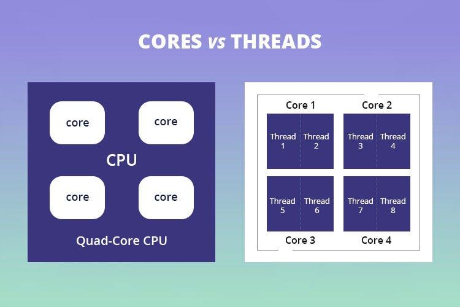

[<u>https://medium.com/@muhammetkurt2012/thread-affinity-in-java-9c2214cda2fa</u>](https://medium.com/@muhammetkurt2012/thread-affinity-in-java-9c2214cda2fa)

## **Thread Affinity in Java**

Java thread affinity is a technique that allows a programmer to control the mapping of threads to processors in a multi-core system. In a multi-core system, there are multiple processors, and each processor has multiple cores. The operating system (OS) typically assigns threads to processors and cores in a way that optimizes overall system performance. However, this may not always be optimal for a specific application. Thread affinity can be used to improve performance in cases where the OS's thread scheduling does not provide optimal performance.

Thread, Core, CPU

Thread affinity is the concept of mapping a thread to a specific processor or core in a multi-core system. When a thread is bound to a specific processor or core, it can only be executed on that processor or core. This can help to reduce cache misses, increase data locality, and reduce context switching overhead. Cache misses occur when data is not present in the processor cache, and the processor has to fetch it from memory, which can be a slow operation. Data locality refers to the concept of keeping data close to the processor that is accessing it. This can help to reduce the number of cache misses and improve performance.

Java thread affinity can be achieved using the Java Native Interface (JNI) or the Java Thread Affinity library. The Java Native Interface is a programming framework that allows Java code to interact with native code written in other programming languages such as C and C++. The Java Thread Affinity library is a Java library that provides a high-level interface for controlling thread affinity.

The Java Thread Affinity library provides a simple API for setting thread affinity. The library uses JNI to call native code to set thread affinity. The library provides a set of methods that can be used to set the affinity of a thread to a specific processor or core. The following code snippet shows an example of setting the affinity of a thread to a specific core:

import org.apache.commons.lang3.SystemUtils;

import org.ballerinalang.jvm.scheduling.Scheduler;

Scheduler scheduler = Scheduler.getScheduler();

int cpu = 2; // set CPU index

if (SystemUtils.IS_OS_LINUX) {

scheduler.bindCurrentThreadToCPU(cpu);

}

This code snippet sets the affinity of the current thread to CPU 2. The Scheduler class provides a method bindCurrentThreadToCPU that can be used to set the affinity of the current thread to a specific CPU. The SystemUtils.IS_OS_LINUX check ensures that the code only runs on Linux systems.

The Java Thread Affinity library can also be used to set the affinity of a thread to a specific set of processors or cores. The library provides a method that can be used to set the affinity of a thread to a set of processors or cores. The following code snippet shows an example of setting the affinity of a thread to a set of cores:

import org.apache.commons.lang3.SystemUtils;

import org.ballerinalang.jvm.scheduling.Scheduler;

Scheduler scheduler = Scheduler.getScheduler();

int\[\] cpus = {0, 1}; // set CPU indexes

if (SystemUtils.IS_OS_LINUX) {

scheduler.bindCurrentThreadToCPUs(cpus);

}

This code snippet sets the affinity of the current thread to CPUs 0 and 1. The Scheduler class provides a method bindCurrentThreadToCPUs that can be used to set the affinity of the current thread to a set of CPUs.

It is important to note that setting thread affinity can have negative effects on system performance if not done properly. Setting thread affinity can cause load imbalances, where one processor or core is heavily loaded while others are underutilized. This can lead to decreased overall system performance. It is important to carefully measure and monitor system performance when using thread affinity to ensure that it is providing the desired performance.
