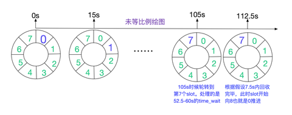

作者：老胡聊Java

链接：https://www.zhihu.com/question/43676479/answer/2774118250

来源：知乎

著作权归作者所有。商业转载请联系作者获得授权，非商业转载请注明出处。

**再说下底层源码究竟对程序员有什么帮助？**

1 比如是针对只需做业务的初级或高级开发，哪怕了解了100个1000个底层类的代码后，其实对开发帮助并不大。

比如看了快速失效的底层源码，顶多就知道别一边用[<u>迭代器</u>](https://www.zhihu.com/search?q=%E8%BF%AD%E4%BB%A3%E5%99%A8&search_source=Entity&hybrid_search_source=Entity&hybrid_search_extra=%7B%22sourceType%22%3A%22answer%22%2C%22sourceId%22%3A2427937300%7D)遍历集合对象一边修改，看了spring boot启动类的底层源码后，该怎么实现业务还怎么实现。**在这个阶段由于无法实际地从底层源码层面得到有效的帮助，而且底层源码大多很复杂，所以基本看了就忘。**

2 而架构师确实要接触到底层源码。比如从如下的大牛文章里，大家能看到通过阅读分析底层源码而解决实际问题的一般步骤。

[<u>无毁的湖光：从Linux源码看TIME_WAIT状态的持续时间11 赞同 · 0 评论文章</u>](https://zhuanlan.zhihu.com/p/286537295)

[<u>无毁的湖光：解Bug之路-记一次JVM堆外内存泄露Bug的查找16 赞同 · 0 评论文章</u>](https://zhuanlan.zhihu.com/p/245401095)

但是在这过程中，是有针对性地，通过查看和debug jar包里的源码来解决实际问题。这其实和大多数认为的，全方位铺开看源码是不同的。比如就是照着教科书把linux底层源码都看一遍，不针对问题去看，依然没用。

从中大家其实已经能看到，学习java底层技能或底层源码，不能说一点用处也没，但帮助还真不大。**再进一步讲，对程序员有帮助的，还真是一些经验，还真不是源码和底层。**

1 比如知道把[<u>线程池</u>](https://www.zhihu.com/search?q=%E7%BA%BF%E7%A8%8B%E6%B1%A0&search_source=Entity&hybrid_search_source=Entity&hybrid_search_extra=%7B%22sourceType%22%3A%22answer%22%2C%22sourceId%22%3A2427937300%7D)的等待队列设成无界的，可能会导致OOM问题。

2 比如知道ArrayList是线程不安全的，在一些极个别需要[<u>线程安全</u>](https://www.zhihu.com/search?q=%E7%BA%BF%E7%A8%8B%E5%AE%89%E5%85%A8&search_source=Entity&hybrid_search_source=Entity&hybrid_search_extra=%7B%22sourceType%22%3A%22answer%22%2C%22sourceId%22%3A2427937300%7D)的场景，可以用锁。

3 比如知道可以通过[<u>dubbo</u>](https://www.zhihu.com/search?q=dubbo&search_source=Entity&hybrid_search_source=Entity&hybrid_search_extra=%7B%22sourceType%22%3A%22answer%22%2C%22sourceId%22%3A2427937300%7D)的优雅停机接口来避免问题，比如知道可以通过[<u>kafka</u>](https://www.zhihu.com/search?q=kafka&search_source=Entity&hybrid_search_source=Entity&hybrid_search_extra=%7B%22sourceType%22%3A%22answer%22%2C%22sourceId%22%3A2427937300%7D)的重发机制能避免消息收不到的问题i。

虽然在看了底层源码后，能进一步理解上述结论，但不看底层，在实际项目里实践多了，解决的问题多了，效果其实还真是一样的。

至于架构师级别通过看底层解决问题，只不过是排查问题的能力和分布式组件方面的能力提到到一定的程度水到渠成而已，并不是说程序员通过看源码能升级到架构师，**因果不能倒置。**

**但是java底层知识如果合理地用在面试场景，一定能提升成功的可能。**

1 初级开发能结合ArrayList+快速失效的底层源码，一定能证明自己熟悉Java核心技能。

2 初级开发还能通过volatile和ConcurrentHashMap源码，高效过面试。具体方式可以看我的如下文章里。

[<u>hsmcomputer：从volatile到ConcurrentHashMap，我通过引导面试官，过了多场技术面试82 赞同 · 3 评论文章</u>](https://zhuanlan.zhihu.com/p/484949283)

3 初级开发可以通过ThreadLocal的底层源码，尤其是其中的Weak引用，高效地展示JVM技能。

4 至于分布式组件方面，通过底层源码展示问题的点就太多了，比如Redis处理失效的源码，Dubbo处理超时和服务暴露的源码，netty半包粘包的源码，只要抛出一些，说难听点，哪怕是不大熟悉分布式组件技能的求职者，也能很好展示[<u>分布组件</u>](https://www.zhihu.com/search?q=%E5%88%86%E5%B8%83%E7%BB%84%E4%BB%B6&search_source=Entity&hybrid_search_source=Entity&hybrid_search_extra=%7B%22sourceType%22%3A%22answer%22%2C%22sourceId%22%3A2774118250%7D)的技能。

也写这么多了，做个总结。

1 Java程序员其实没有必要全面铺开去了解底层技能，有这个时间有这个精力，还真不如去看分布式和[<u>微服务组件</u>](https://www.zhihu.com/search?q=%E5%BE%AE%E6%9C%8D%E5%8A%A1%E7%BB%84%E4%BB%B6&search_source=Entity&hybrid_search_source=Entity&hybrid_search_extra=%7B%22sourceType%22%3A%22answer%22%2C%22sourceId%22%3A2427937300%7D)。

2 一定是有针对性地去看底层技能，比如遇到dubbo问题，通过[<u>debug</u>](https://www.zhihu.com/search?q=debug&search_source=Entity&hybrid_search_source=Entity&hybrid_search_extra=%7B%22sourceType%22%3A%22answer%22%2C%22sourceId%22%3A2774118250%7D)到具体的class包里去分析，这样的问题解决多了，底层技能自然就掌握了。

3 面试时一定得充分利用底层技能展示实力，这比空口说熟悉组件熟悉技能要强得多。
