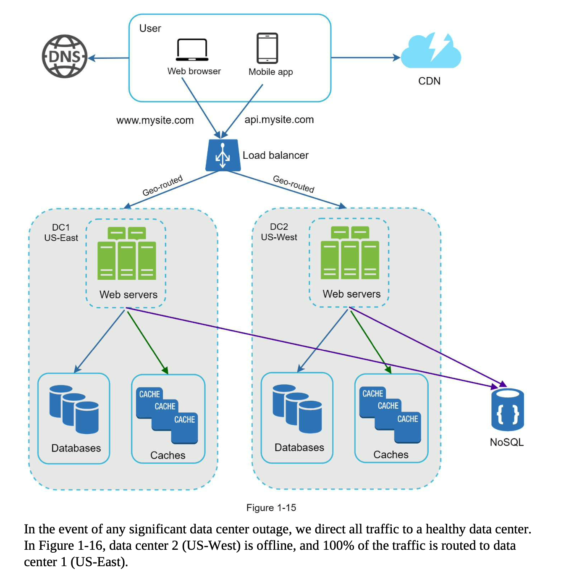

Horizontal scaling (Database sharding)

Cache

CDN

Load balancer

**• Keep web tier stateless  
• Build redundancy at every tier  
• Cache data as much as you can  
• Support multiple data centers  
• Host static assets in CDN  
• Scale your data tier by sharding  
• Split tiers into individual services  
• Monitor your system and use automation tools**
