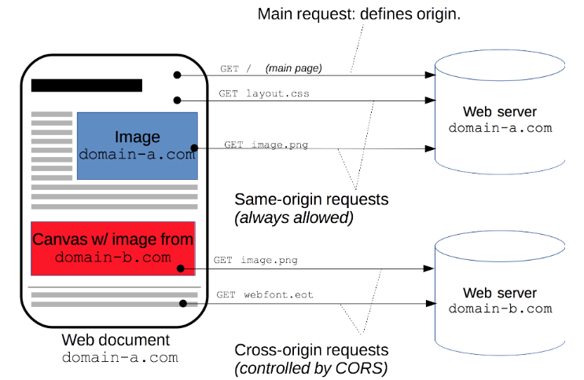

https://vue3js.cn/interview/vue/cors.html#%E4%BA%8C%E3%80%81%E5%A6%82%E4%BD%95%E8%A7%A3%E5%86%B3

## **一、跨域是什么**

跨域本质是浏览器基于同源策略的一种安全手段

同源策略（Sameoriginpolicy），是一种约定，它是浏览器最核心也最基本的安全功能

所谓同源（即指在同一个域）具有以下三个相同点

- 协议相同（protocol）

- 主机相同（host）

- 端口相同（port）

反之非同源请求，也就是协议、端口、主机其中一项不相同的时候，这时候就会产生跨域

一定要注意跨域是浏览器的限制，你用抓包工具抓取接口数据，是可以看到接口已经把数据返回回来了，只是浏览器的限制，你获取不到数据。用postman请求接口能够请求到数据。这些再次印证了跨域是浏览器的限制。

## \#

## **二、如何解决**

解决跨域的方法有很多，下面列举了三种：

- JSONP

- CORS

- Proxy

而在vue项目中，我们主要针对CORS或Proxy这两种方案进行展开

### \#

### **CORS**

CORS （Cross-Origin Resource Sharing，跨域资源共享）是一个系统，它由一系列传输的HTTP头组成，这些HTTP头决定浏览器是否阻止前端 JavaScript 代码获取跨域请求的响应

CORS 实现起来非常方便，只需要增加一些 HTTP 头，让服务器能声明允许的访问来源

只要后端实现了 CORS，就实现了跨域

以koa框架举例

添加中间件，直接设置Access-Control-Allow-Origin响应头

app.use(async (ctx, next)=\> {

ctx.set('Access-Control-Allow-Origin', '\*');

ctx.set('Access-Control-Allow-Headers', 'Content-Type, Content-Length, Authorization, Accept, X-Requested-With , yourHeaderFeild');

ctx.set('Access-Control-Allow-Methods', 'PUT, POST, GET, DELETE, OPTIONS');

if (ctx.method == 'OPTIONS') {

ctx.body = 200;

} else {

await next();

}

})

1

2

3

4

5

6

7

8

9

10

ps: Access-Control-Allow-Origin 设置为\*其实意义不大，可以说是形同虚设，实际应用中，上线前我们会将Access-Control-Allow-Origin 值设为我们目标host

### \#

### **Proxy**

代理（Proxy）也称网络代理，是一种特殊的网络服务，允许一个（一般为客户端）通过这个服务与另一个网络终端（一般为服务器）进行非直接的连接。一些网关、路由器等网络设备具备网络代理功能。一般认为代理服务有利于保障网络终端的隐私或安全，防止攻击

方案一

如果是通过vue-cli脚手架工具搭建项目，我们可以通过webpack为我们起一个本地服务器作为请求的代理对象

通过该服务器转发请求至目标服务器，得到结果再转发给前端，但是最终发布上线时如果web应用和接口服务器不在一起仍会跨域

在vue.config.js文件，新增以下代码

amodule.exports = {

devServer: {

host: '127.0.0.1',

port: 8084,

open: true,// vue项目启动时自动打开浏览器

proxy: {

'/api': { // '/api'是代理标识，用于告诉node，url前面是/api的就是使用代理的

target: "http://xxx.xxx.xx.xx:8080", //目标地址，一般是指后台服务器地址

changeOrigin: true, //是否跨域

pathRewrite: { // pathRewrite 的作用是把实际Request Url中的'/api'用""代替

'^/api': ""

}

}

}

}

}

1

2

3

4

5

6

7

8

9

10

11

12

13

14

15

16

通过axios发送请求中，配置请求的根路径

axios.defaults.baseURL = '/api'

1

方案二

此外，还可通过服务端实现代理请求转发

以express框架为例

var express = require('express');

const proxy = require('http-proxy-middleware')

const app = express()

app.use(express.static(\_\_dirname + '/'))

app.use('/api', proxy({ target: 'http://localhost:4000', changeOrigin: false

}));

module.exports = app

1

2

3

4

5

6

7

方案三

通过配置nginx实现代理

server {

listen 80;

\# server_name www.josephxia.com;

location / {

root /var/www/html;

index index.html index.htm;

try_files \$uri \$uri/ /index.html;

}

location /api {

proxy_pass http://127.0.0.1:3000;

proxy_redirect off;

proxy_set_header Host \$host;

proxy_set_header X-Real-IP \$remote_addr;

proxy_set_header X-Forwarded-For \$proxy_add_x_forwarded_for;

}

}
