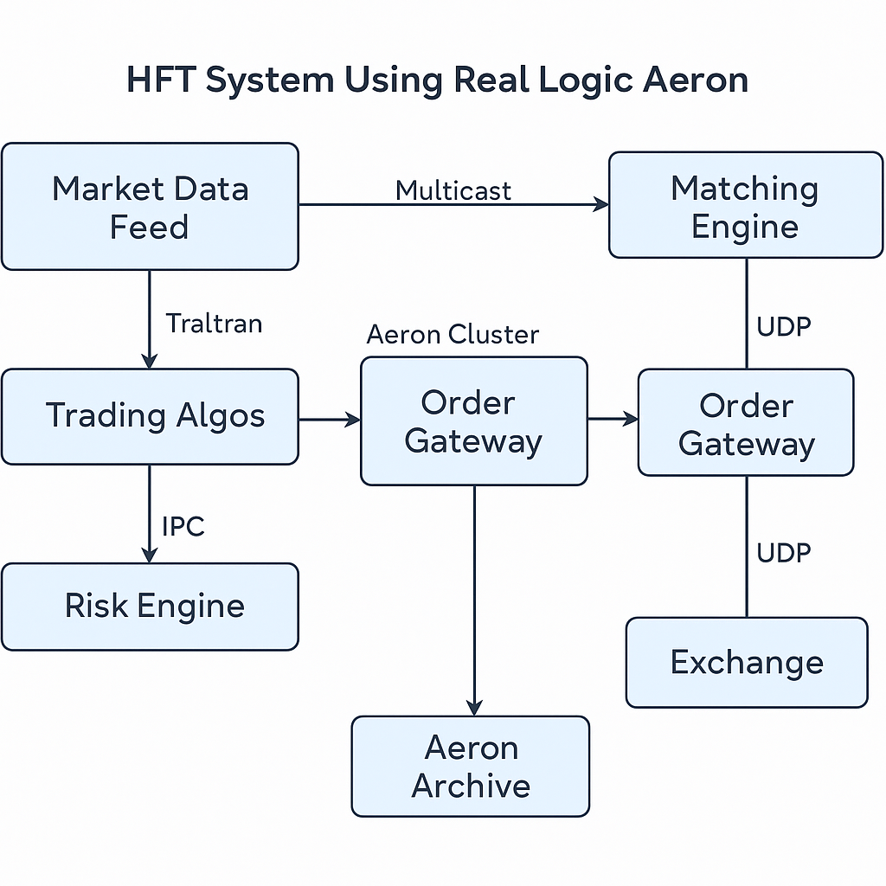

# 

# **Aeron architecture**

# **What real-logic aeron library can offer for HFT trading?**

The [**<u>Real Logic Aeron</u>**](https://github.com/real-logic/aeron) library is a **high-performance messaging system** built for low-latency and high-throughput applications, particularly useful in domains like **high-frequency trading (HFT)**. Here’s a breakdown of what Aeron offers specifically for HFT systems:

## **🚀 Key Benefits of Aeron for HFT Trading**

### **1. Low Latency and High Throughput**

- Aeron is designed for **sub-10 microsecond** latencies and can **saturate 10Gbps+ links**.

- Messages are sent over **preallocated memory** and bypass the kernel where possible (especially with Aeron UDP and IPC).

### **2. Reliable Unicast and Multicast Messaging**

- Supports **UDP-based multicast** (ideal for market data distribution).

- Also supports **IPC (Inter-Process Communication)** for ultra-fast messaging between co-located processes.

### **3. Back-Pressure Handling**

- HFT systems must handle traffic bursts without collapsing. Aeron has **built-in back pressure mechanisms**, ensuring the publisher won’t overwhelm slower consumers.

### **4. Lock-Free, Zero-GC Design**

- Aeron’s key data paths are **lock-free** and **garbage-free**, avoiding Java GC pauses — a major win for latency-sensitive systems.

### **5. Cluster and Consensus (Aeron Cluster)**

- Includes **Aeron Cluster**, a fault-tolerant, replicated state machine built on Raft. Useful for building **resilient matching engines, order books**, or **risk engines** with high availability.

### **6. Custom Transport Flexibility**

- Aeron is extensible and supports **custom media drivers** and **custom protocol framing**, which is helpful for integrating with proprietary trading hardware or optimized network stacks.

## **🧰 Common HFT Use Cases with Aeron**

||
||
||
||
||
||
||

## **⚙️ Integration with HFT Systems**

- **Languages**: Native support in **Java**, with **C and C++** clients.

- Works well alongside **Disruptor**, **Chronicle Queue**, **Netty**, or **LMAX architecture**.

- Easily integrated into **microsecond-tuned trading loops** (e.g., spin loops, pinned threads, NUMA-aware layouts).

## **✋ Caveats**

- Aeron is **not a traditional message broker** (like Kafka or RabbitMQ). It assumes **tight control over system resources**.

- It requires **careful tuning** (threading, buffers, media drivers) for optimal performance.

- Not ideal for **store-and-forward** systems unless paired with **Aeron Archive**.

## **✅ Summary**

Real Logic Aeron offers HFT trading systems:

- Microsecond-level latency

- Reliable, garbage-free messaging

- Multicast and IPC support

- Tools for consensus and high availability

- Customizable and bare-metal-optimized messaging

It's one of the most **HFT-friendly messaging libraries** available today — suitable for **order routing**, **market data dissemination**, **internal messaging**, and **resilient stateful services**.

Would you like an example architecture diagram of an HFT system using Aeron?
