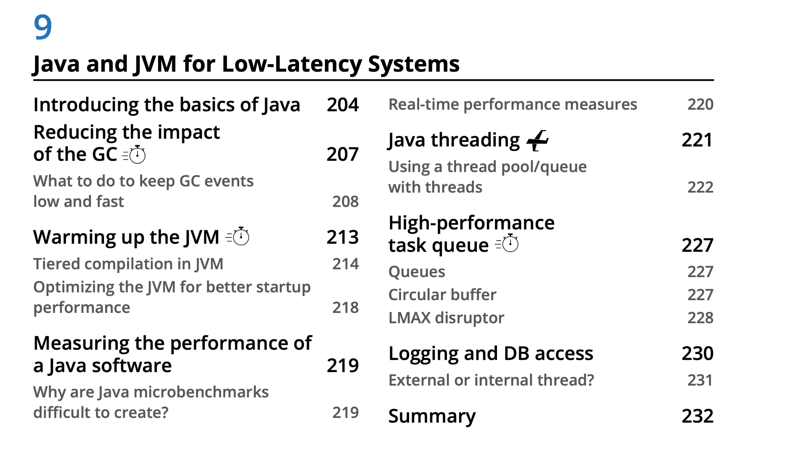
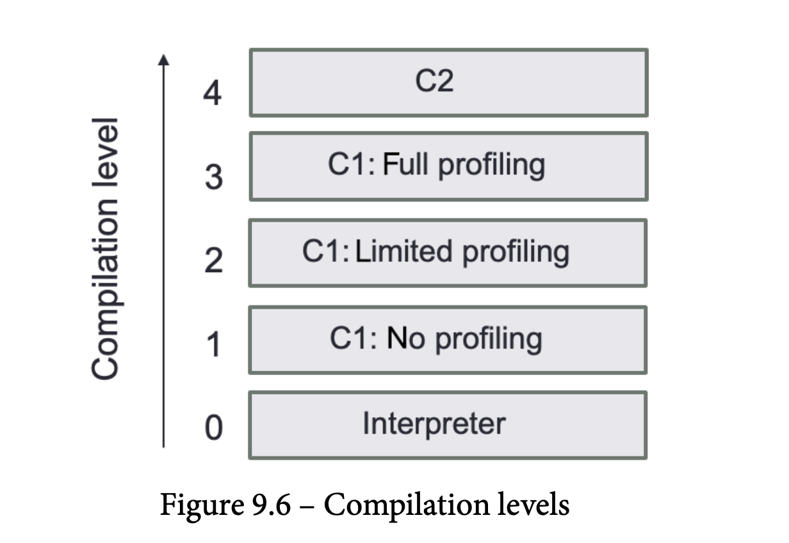

## HFT

## 

## 

## 

## What to do to keep GC events low and fast

The key is to pre-allocate objects that will live during the entire execution of the software to avoid allocation/deallocation triggering the work of the GC.

Your primary goal is to avoid the frequent creation of short-lived objects.

Identity hot path; adding objects to cache pool;

Hot path is single-threaded and spinning on specific core

By caching, we will increase the heap size. It is important to consider the tradeoff between the number of objects created with the heap size.

##  Limiting the autoboxing effect

You can also use some third-party libraries

(https://fastutil.di.unimi.it/ or https://github.com/real-logic/agrona)

that will implement the Java collection using the Java primary type. Depending on your needs this could greatly reduce the object creation in your program.

##  Stop-the-world pause

Azul Zing JVM doesn't have any pause

CMS will resort to STW MSC collection in certain circumstances.

##  Primitive types and memory allocation

\* fitting more data into a single cache line: If the CPU cannot anticipate the memory access,

the retrieval operation might take 10 to 30 nanoseconds.

\* Keep heap size short

\* Primitives decrease the amount of waste generated by a program.

\* Assigning to a primitive is faster than generating a new object on the heap

##  Memory profiling

JProfile

jmap (histo)

## 

## Warming up the JVM

\* JIT complier; Zulu Zing ReadyNow!

\* AOT

## Tiered compilation in JVM

• C1 (client compiler), which optimizes the start-up time

• C2 (server compiler) is tuned for overall performance

# Optimizing the JVM for better startup performance

## Tiered compilation

We can run the JVM with the -XX:-Tiered Compilation option. It disables intermediate compilation tiers (1, 2, and 3) so that a method is either interpreted or compiled at the maximum optimization level (C2):

- ReservedCodeCacheSize

The -XX:ReservedCodeCacheSize=N option specifies the maximum size of the code cache.

- CompileThreshold

The value of the -XX:CompileThreshold=N option triggers standard compilation. Java can run in client or server mode, and the default value will depend on that mode; it is 1,500 for client applications and 10,000 for server applications. Lowering this number could speed up the compilation to native code.

- Warm up your code:

You should focus on the less frequent events such as new orders or execution of code that are called periodically, but you do not want to have them slow down your hot path. You need to be extremely careful about JVM warm-up in a live environment. To warm up the JVM, we can utilize a variety of techniques. The Java Microbenchmark Harness (JMH) is a toolkit that assists us in appropriately implementing Java microbenchmarks.

# Measuring the performance of a Java software

## Why are Java microbenchmarks difficult to create?

Writing a good Java microbenchmark often requires avoiding JVM and hardware optimizations that would not have been done in a genuine production system

The JMH framework helps to reduce the warm-up period of an application

# Real-time performance measures

- revolutions per minute (RPM)

You could keep a simple counter that will increment

on each spin. If for any reason you have some code in that loop that starts misbehaving and it starts to add some drag, you will be able to detect it by observing a change in the RPM behavior.

- Latency

- statistics collector

For this reason, the statistics collector should have very light and basic logic. There must be no lock or object creation at any time in the logic. You should have cumulative, incremental, and descriptive (min, max, avg, and pctXX) statistic collectors, as they will cover most of your needs.

# Java Threading

If we notice that the latency of our trading system has been impacted and the memory usage has sharply increased, monitoring the number of threads will be required.

When employing many CPUs to run a highly parallelized algorithm, cache contention is a critical consideration. There is no magic number for thread count; the goal is to minimize them while achieving the best throughput.

There are simpler alternatives to query the number of threads in an application; for a Linux-based operating system (OS), the best one is htop (https://htop.dev/). It will give you an immediate view of how many threads are running within your Java process. For a Linux-based OS and other useful command-line tools, sending a kill –3 pid command will force the JVM to dump a list of all the threads in your program as well as what they are executing at the time of the call.

## Using a thread pool/queue with threads

It is a good practice to keep two distinct pools of threads: a smaller one in charge of running the short-lived task, and a bigger one for the long tasks (I/O access, DB, and logging, for example), the one that could take multiple seconds or even used in a forever- spinning loop.

## Thread map

When processes are running on the same NUMA domain, they are sharing the same memory cache and avoiding crossing NUMA boundaries, which will cost us more in terms of performance.

We also want to isolate the core at the OS level, which will prevent the OS from scheduling any other process on the reserved core.

On a Linux-based OS, this is done using the \`isolcpu\` functionality. It will exclude the designated cores to be accessed by the OS.

- Thread affinity

A Linux-based OS offers another alternative: we could use htop (please see the previous reference) to manually assign a core for each thread. This is not ideal as it is a manual process and we need to redo the mapping each time the process is restarted. The advantage of this solution is that the assignment of the core is not final, so you could move your thread around to a different core. It is also a quick way to test the performance improvement or changes that your application could achieve when you are binding a thread to a core.

- taskset

Taskset (https://man7.org/linux/man-pages/man1/taskset.1.html) on a Linux-based OS can also be used to limit which cores the Java application-free threads will be allowed to run on

# High-performance task queue

- lock free circular buffer

- LAMX disruptor (circulr buffer + cached line)

It's faster than using ArrayBlockingQueue, which is Java's standard thread-safe class for this purpose.

##  Agrona circular buffer

# Logging and DB access

For instance, log4j zeroGC is a zero object creation logging framework, but it will generate the log message before putting it on the logger thread queue (in this case, the disruptor from LMAX).

## Logging on External or internal thread?

- internal: main program (more GC Pressure)

- external: fast communication technique (UDP or shared memory).

We can send all the information from our main program as byte-encoded messages, which could be done with zero object creation
