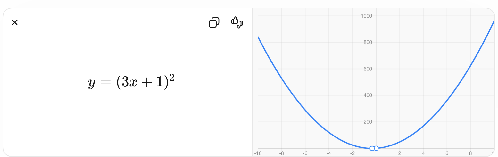

```
已掌握的 9 个基础概念（向量 / 矩阵乘法 / 点积 / 线性变换 / 维度 / 基底 / 投影 / 导数 / 梯度）。
目前是从基础数学走到"手写一个最简 LLM" 还需要补的全部知识，并给出推荐学习顺序。
```

---

你已经跨过最难的一段了。

因为：

> 向量 / 矩阵乘法 / 点积 / 线性变换 / 维度 / 基底 / 投影 / 导数 / 梯度

这套东西已经覆盖了 **LLM 数学核心的 60~70%**。

接下来目标应该从：

> “学数学”

切换成：

> “学会把数学变成一个能跑的 Transformer”

如果目标是：

> **从基础数学 → 手写一个最简 LLM（PyTorch）**

那么后面真正需要补的知识其实不多，但顺序非常重要。

我给你一个“最短路径学习树”。

---

# 0. 先明确最终目标：你要能手写什么？

最终你应该能自己写出：

```python
class TinyTransformer(nn.Module):
    def __init__(self):
        self.embedding = nn.Embedding(...)
        self.attn = SelfAttention(...)
        self.ffn = FeedForward(...)
        self.ln = LayerNorm(...)
```

并理解：

```python
x = embed(tokens)

q = x @ Wq
k = x @ Wk
v = x @ Wv

score = q @ k.T
prob = softmax(score)

out = prob @ v
```

以及：

```python
loss.backward()
optimizer.step()
```

为什么成立。

为了做到这一点，需要补下面这些。

---

# Stage 1 — 线性代数补完（最优先）

你现在已经有基础，但还缺几个“Transformer 必备概念”。

## 1. 张量（Tensor）

必须补。

因为 PyTorch 世界里：

> everything is tensor

理解：

* scalar = 0D tensor
* vector = 1D
* matrix = 2D
* higher dimension tensor = 3D+

例如：

```python
(batch, seq_len, hidden_dim)
=
(32, 128, 768)
```

要做到：

> 一眼看懂 shape 在空间上代表什么。

例如：

```python
Q.shape
=
(batch, seq, d_k)
```

为什么能：

```python
Q @ K^T
```

---

## 2. broadcasting

极重要。

比如：

```python
x + b
```

为什么：

```python
(32,128,768)
+
(768,)
```

能加？

这是 PyTorch 高频机制。

---

## 3. transpose / reshape / view

必须熟。

因为 attention 代码到处都是：

```python
x.transpose(1,2)

x.reshape(...)

x.view(...)
```

你需要形成空间感：

> reshape = 重排观察方式
> transpose = 换坐标轴

---

## 4. batch matrix multiplication

理解：

```python
Q @ K.transpose(-2,-1)
```

不是二维矩阵乘法，而是：

> 一批矩阵同时乘。

这是理解 multi-head attention 的关键。

---

## 5. 概率直觉（很少数学）

只需要：

* 概率分布
* normalize
* expectation（直觉）

因为：

```python
softmax
```

本质：

> 从 score 变成概率权重。

例如：

```python
[2,5,9]
→
[0.001,0.05,0.949]
```

---

# Stage 2 — 微积分补完（训练必备）

你已经学导数、梯度。

下一步是：

## 1. 偏导数

必须。

因为参数很多：

```python
W ∈ R^(4096×4096)
```

loss 对每个参数都有导数。

理解：

> 一个方向一个方向地求变化率。

---

## 2. 链式法则（超级重要）

这是 backprop 的灵魂。

比如：

```math
y = (3x+1)^2
```





为什么：

```math
dy/dx = 2(3x+1)·3
```

因为：

> 外层变化 × 内层变化

Transformer 的反向传播就是：

> 巨大链式法则。

---

## 3. computational graph

理解：

```text
x
↓
linear
↓
relu
↓
linear
↓
loss
```

PyTorch 自动求导在干什么。

核心：

> backward = 沿图反向乘梯度

---

## 4. gradient descent

理解：

```python
W = W - lr * grad
```

为什么参数会越来越好。

以及：

* learning rate
* exploding gradient
* vanishing gradient

先直觉即可。

---

# Stage 3 — 概率 + 信息论（LLM味开始出现）

这阶段很多人跳过，但建议补。

## 1. softmax

你已经碰过。

真正理解：

```math
p_i
=
\frac{e^{x_i}}
{\sum_j e^{x_j}}
```


意义：

> 把任意分数压成概率。

---

## 2. cross entropy

这是语言模型 loss。

```math
L=-\log P(\text{correct token})
```


直觉：

> 模型越自信且正确，loss 越小。

---

## 3. log 概率

理解：

为什么：

```python
logits
→ softmax
→ log
```

以及：

```python
CrossEntropyLoss
```

为什么这么写。

---

## 4. entropy（直觉版）

知道即可。

意思：

> 不确定性。

例如：

```text
天气：
[0.5,0.5]
```

比：

```text
[0.99,0.01]
```

更不确定。

这帮助理解 temperature / sampling。

---

# Stage 4 — Transformer 数学（真正进入 LLM）

这里开始串起来。

顺序非常重要。

## 1. embedding 几何

理解：

* token → vector
* cosine similarity
* semantic direction

例如：

```text
king - man + woman ≈ queen
```

你已经在门口。

---

## 2. attention 几何（重点）

完全理解：

```math
QK^T
```

QK^T

真正意义：

> 在高维空间里找相关方向。

以及：

```math
Attention(Q,K,V)
=
softmax(QK^T)V
```

Attention(Q,K,V)=softmax(QK^T)V

你应该能从：

> projection / dot product / basis

推出来。

---

## 3. normalization

理解：

```math
\frac{x-\mu}{\sigma}
```


为什么需要：

> 防止训练炸掉。

重点：

* mean
* variance
* layer norm

---

## 4. residual connection

理解：

```python
x + f(x)
```

为什么有效：

> 保留原信息 + 小修改。

与梯度传播关系。

---

## 5. positional encoding

理解：

为什么：

> Transformer 不知道顺序。

以及：

```math
\sin,\cos
```

编码位置。

---

# Stage 5 — PyTorch 工程能力（开始写）

这时开始实践。

必须会：

### tensor ops

```python
matmul
transpose
reshape
permute
einsum
masked_fill
softmax
argmax
```

---

### autograd

理解：

```python
loss.backward()
```

---

### nn.Module

会写：

```python
Linear
Embedding
LayerNorm
```

---

### optimizer

理解：

```python
AdamW
```

干什么。

---

# Stage 6 — 手写最简 LLM

建议这个顺序：

1. 手写 Linear regression
2. 手写 MLP
3. 手写 single-head attention
4. 手写 multi-head attention
5. 手写 decoder block
6. 手写 tiny GPT

项目规模：

```text
100~300 行
```

足够。

---

# 最短学习路径（推荐顺序）

按顺序：

```text
1. Tensor / shape
2. transpose / reshape / broadcasting
3. batch matrix multiplication
4. 偏导数
5. chain rule
6. computational graph
7. gradient descent
8. softmax
9. cross entropy
10. normalization
11. attention 几何
12. positional encoding
13. residual
14. PyTorch tensor ops
15. autograd
16. 手写 tiny transformer
```

---

一句话总结：

> 你已经学完“空间几何基础”；剩下的是“训练机制 + attention + PyTorch 工程化”。

再往后其实不是数学，而是：

> **把数学翻译成张量代码。**
