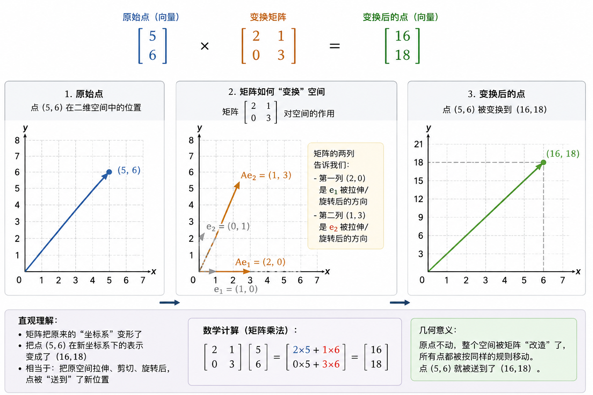
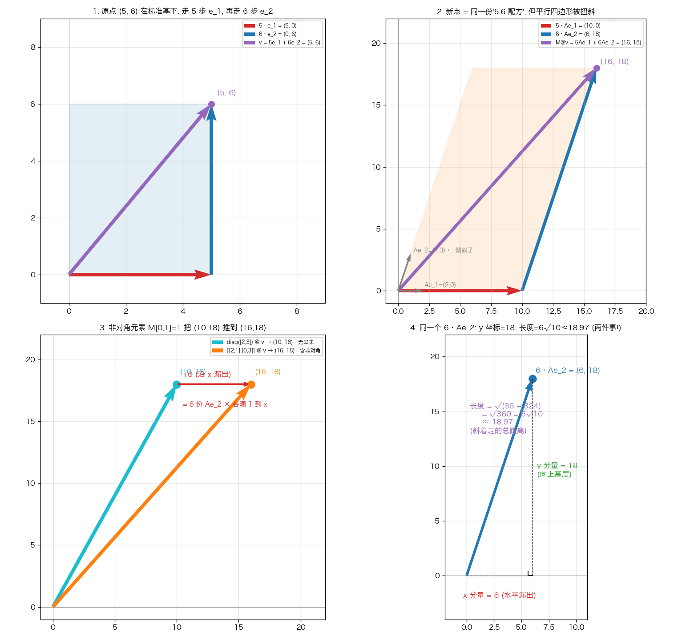

# 矩阵乘法几何直觉

下面这个计算

```math
\begin{bmatrix}
2 & 1 \\
0 & 3
\end{bmatrix}
\begin{bmatrix}
5 \\ 6
\end{bmatrix}
=
\begin{bmatrix}
16 \\ 18
\end{bmatrix}

```


本质是这个点
```math
\begin{bmatrix}
5 \\ 6
\end{bmatrix}
```

被下面这个矩阵进行转换后

```math
\begin{bmatrix}
2 & 1 \\
0 & 3
\end{bmatrix}
```

送到
```math
\begin{bmatrix}
16 \\ 18
\end{bmatrix}
```

画个图解释下

--- 




## Q1: 理解这个图

**用户提问**:
> 理解这个图
>
> （图中三个面板：1. 原始点 (5,6)；2. 矩阵如何"变换"空间，画出 `Ae₁ = (2, 0)` 和 `Ae₂ = (1, 3)`；3. 变换后的点 (16, 18)。底部三个框：直观理解、数学计算（矩阵乘法）、几何意义。）

**回答**:

这张图把"矩阵 = 空间变换"讲得非常清楚。

### 整图讲什么？

一句话：**点 (5, 6) 在被矩阵 `M = [[2,1],[0,3]]` 改造过的空间里，新位置变成 (16, 18)。**

### 三个面板的故事线

| 面板 | 内容 | 关键直觉 |
|---|---|---|
| **1. 原始点** | (5, 6) 是个普通向量 | 在标准坐标系里，"5 个 e₁ + 6 个 e₂" |
| **2. 矩阵如何"变换"空间** | 画 `Ae₁ = (2, 0)` 和 `Ae₂ = (1, 3)` | **矩阵的两列就是 e₁、e₂ 变换后的去向** |
| **3. 变换后的点** | (16, 18) | 注意右图 y 轴尺度变到 21，说明空间被"拉伸"了 |

### 中间面板是核心 ★

矩阵的两列：
```
M = [2  1]    第一列 = Ae₁ = (2, 0)  → e₁ 被变换到这里
    [0  3]    第二列 = Ae₂ = (1, 3)  → e₂ 被变换到这里
```

这正是**矩阵的列就是变换后的新基底**。

### (5,6) 怎么"被送到" (16,18) — 两个视角

#### 几何视角（最重要）
原来 (5, 6) = `5·e₁ + 6·e₂`。

变换是**线性**的，所以变换后：
```
M @ (5,6) = 5·Ae₁ + 6·Ae₂
          = 5·(2,0) + 6·(1,3)
          = (10, 0) + (6, 18)
          = (16, 18)  ✓
```
→ **新点就是用矩阵的两列重新加权组合出来的**。

#### 代数视角（底部中间框）
```
[2  1] [5]   [2×5 + 1×6]   [16]
[0  3] [6] = [0×5 + 3×6] = [18]
```
等价于：**结果的每一行 = 矩阵的某一行 与 原向量 的点积**。

### ⚠️ 一个小坑

图最上方写成 `[5,6] × M = [16,18]` 的顺序（向量在前），其实只是**叙事顺序**（原始 → 变换 → 结果），**不是严格的乘法记法**。

严格写应该是 `M @ v`，也就是底部中间那个标准公式。如果你按 `[5 6] × [[2,1],[0,3]]` 当成"行向量 × 矩阵"来真算，得到的是 `[10, 23]`，**不是 (16, 18)**。所以记住：**乘法的真正顺序在底部那个框里**。

### 把这张图浓缩成一句

> 一个矩阵 = 一份"如何重塑空间"的说明书；它的列告诉你 e₁、e₂ 跑去哪儿了；任何点的新位置 = 用这些新基底按原坐标加权重组出来的。

---

## Q2: 两个问题

**用户提问**:
> 两个问题
> - `5·e₁ + 6·e₂` 这种写法，结果不是一个单数值？ 而是个向量？
> - 新的 e1 = Ae1 = (2, 0)，因为矩阵被扭曲， 那这个不是新的 x 轴吗？所以原来的点在 x 轴是 x=5 个 e1=(5,0), 那么新的点的在 x 轴就是 5 个新 e1 = (10, 0) ?

**回答**:

### Q2a: `5·e₁ + 6·e₂` 结果是向量吗？

**对，是向量**。这里的 "·" 不是数乘数，而是**数乘向量**（标量 × 向量），叫"数乘"。规则：标量逐个乘到向量的每个分量上。

```
5 · 3   = 15           ← 数 × 数 = 数
5 · e₁  = 5 · (1, 0)   = (5, 0)   ← 数 × 向量 = 向量
6 · e₂  = 6 · (0, 1)   = (0, 6)   ← 数 × 向量 = 向量
```

加起来：
```
5·e₁ + 6·e₂ = (5, 0) + (0, 6) = (5, 6)  ✓
```

这就是为什么 `(5, 6) = 5·e₁ + 6·e₂` —— 它把"沿 x 走 5 步、沿 y 走 6 步"这件事写成了代数。

### Q2b: 你的直觉对了一半 ★

> "5 个新 e₁ = (10, 0)" → 这部分**完全正确**

问题在于：**6 个新 e₂ 不是 (0, 18)，而是 (6, 18)** —— 因为新 e₂ 不再是竖直的了！

#### 关键洞察：变换后 e₂ 被"歪"了

```
原来:        变换后 (用 M = [[2,1],[0,3]]):
e₁ = (1, 0)   →  Ae₁ = (2, 0)   仍在 x 轴上, 拉长 2 倍 ✓
e₂ = (0, 1)   →  Ae₂ = (1, 3)   ← 注意!! 不再竖直, 它倾斜了
```

**新 e₂ 的第一个分量是 1，不是 0** —— 也就是说，新 e₂ 自己也带了一份 "x 方向"。

#### 把 (5, 6) 的搬迁拆开看

```
M @ (5, 6)
  = 5 · Ae₁  +  6 · Ae₂
  = 5·(2, 0) +  6·(1, 3)
  = (10, 0)  +  (6, 18)        ← 你算对的那部分  +  新 e₂ 贡献的部分
  = (16, 18)                    ← 注意 x 方向: 10 + 6 = 16
```

```

  图像化（脑补一下）

  原坐标系:                          变换后:
                                     y'
  y                                  ^
  ^                                  |
  | e₂↑                              |          Ae₂ (1,3) 斜着伸
  |     (5,6)                        |          /
  |                                  |         /
  |                                  |        /
  |---e₁→---> x                      |       /         (16, 18)
                                     |      /         /
                                     |     /        /
                                     |    /       /
                                     |---/-Ae₁→→/----> x'
                                         (新 e₁ 仍在 x 轴, 长 2)

  新 e₁ 没变方向, 只变长.
  新 e₂ 整个倾斜了 → 它对 x 也有贡献.
```  

### 一句话总结

> **新点 = 5·(新 e₁) + 6·(新 e₂)** —— 两个新基底各自的贡献都要加，而且新基底可能已经倾斜，所以"y 方向的旧坐标 6"也会泄漏到 x 方向。

矩阵 `[[2,1],[0,3]]` 里那个**右上角的 1**，就是"e₂ 被倾斜后流到 x 方向的量"。

---

## Q3: 直觉上，新点往原 x 轴再倾斜一些 (+6)，对吗？

**用户提问**:
> 直觉上，因为矩阵被扭曲， Ae2 变斜了， 所以新点往`原` x 轴再倾斜一些 (+6)，这样理解对吗？

**回答**:

**完全正确** ✓ 这就是核心几何直觉。

### 对比验证一下

**假想：如果 Ae₂ 没倾斜，还是直直竖着 (0, 3) 呢？**
那矩阵会是 `[[2, 0], [0, 3]]`（纯缩放），新点就是：
```
5·(2, 0) + 6·(0, 3) = (10, 0) + (0, 18) = (10, 18)
                                          ↑
                            x 和 y 互不串味, 各管各的
```

**真实情况：Ae₂ = (1, 3) 向 x 方向"漏"了 1**
```
5·(2, 0) + 6·(1, 3) = (10, 0) + (6, 18) = (16, 18)
                                  ↑
                    "6 份 Ae₂ 各漏 1 到 x" 的总效果 = +6
```

差出来的 **+6 完全归因于 Ae₂ 的倾斜**，跟你的直觉一字不差。

### 把这条直觉升级一下 ★

矩阵的**非对角元素** = "维度间的耦合 / 泄漏系数"：

```
M = [2  1]    ← M[0,1] = 1 : 旧 y 方向往新 x 漏 1
    [0  3]    ← M[1,0] = 0 : 旧 x 方向不往新 y 漏
     ↑   ↑
   对角:这一维"自己缩放自己"的强度
```

由此可推出一组好用的判定：

| 矩阵形态 | 几何含义 |
|---|---|
| **纯对角矩阵** `diag(a, b)` | 各轴独立缩放，**不串味** |
| **非对角不为 0** | 维度间互相"渗透" → 旋转、剪切、扭曲 |
| **对称矩阵** | 漏的方式对称（双向耦合相等） |

这也是为什么注意力机制里的 `Q @ K^T` 能产生"token i 关注 token j"的耦合——**非对角元素就是描述"跨维度连接"的语言**。

---

## Q4: 什么是矩阵的对角元素，非对角元素

**用户提问**:
> 什么是矩阵的对角元素， 非对角元素

**回答**:

### 定义

**对角元素 (diagonal)**：行号 = 列号 的元素，即 `M[i, i]`，位于从左上到右下的那条主对角线上。

**非对角元素 (off-diagonal)**：行号 ≠ 列号 的元素，即 `M[i, j]` 其中 `i ≠ j`，其余所有位置。

### 看图最清楚

#### 2×2 矩阵
```
       列 0   列 1
       ↓     ↓
行 0 → [ a    b ]
行 1 → [ c    d ]

对角元素:   a (位置 [0,0]),  d (位置 [1,1])   ← 主对角线
非对角元素: b (位置 [0,1]),  c (位置 [1,0])
```

#### 3×3 矩阵
```
[ a   b   c ]      对角:   a, e, i   (位置 [0,0] [1,1] [2,2])
[ d   e   f ]      非对角: b, c, d, f, g, h
[ g   h   i ]
```

主对角线就是这条斜线 ↘ ：
```
[ ●   ·   · ]
[ ·   ●   · ]
[ ·   ·   ● ]
```

### 在 PyTorch 里取它们

```python
import torch
M = torch.tensor([[2.0, 1.0, 5.0],
                  [3.0, 4.0, 7.0],
                  [8.0, 9.0, 6.0]])

# 提取对角元素
torch.diagonal(M)       # tensor([2., 4., 6.])
M.diag()                # 同上

# 构造对角矩阵 (非对角元素全部填 0)
torch.diag(torch.tensor([2., 4., 6.]))
# [[2, 0, 0],
#  [0, 4, 0],
#  [0, 0, 6]]
```

### 几何 / 语义含义

| 元素类型 | 几何含义 | 例子 |
|---|---|---|
| **对角 `M[i,i]`** | 第 i 维度**自己对自己**的缩放强度 | `M[0,0] = 2` → x 方向拉 2 倍 |
| **非对角 `M[i,j]` (i≠j)** | 第 j 维度**漏到**第 i 维度的耦合系数 | `M[0,1] = 1` → 旧 y 方向漏 1 到新 x |

由此推出：

- **对角矩阵** (只有对角元素非零) = **纯缩放**，各维度互不串味
  ```
  [2 0]    e₁ → (2, 0)   ← 还在 x 轴
  [0 3]    e₂ → (0, 3)   ← 还在 y 轴
  ```
- **非对角元素非零** = **维度间耦合**，会产生旋转、剪切、扭曲
  ```
  [2 1]    e₁ → (2, 0)
  [0 3]    e₂ → (1, 3)   ← 倾斜了, 漏到 x
  ```

### 补充术语

- **主对角线 (main diagonal)** ↘：左上到右下，就是上面说的"对角"
- **反对角线 / 副对角线 (anti-diagonal)** ↙：右上到左下，平时较少用
- 平时说"对角元素"，**默认指主对角线**

### 一句话

**对角元素管"每个维度自己缩放多少"，非对角元素管"维度之间怎么互相影响"** —— 这是读懂任何矩阵的两把钥匙。

---

## Q5: 为什么新点的 y 轴不是 6 × √10？

**用户提问**:
> 还有个问题， Ae2 的长度是 sqrt(1 + 3^2) = sqrt(10), 为什么新点的 y 轴不是 6 * sqrt(10) ?

**回答**:

这是一个非常关键的混淆点 —— 你把**"新点的 y 坐标"**和**"沿 Ae₂ 方向走的总长度"**搞成了一回事。它们是两件不一样的事 ✗

### 拆开看 `6 · Ae₂` 这一步

```
Ae₂ = (1, 3),  长度 |Ae₂| = √(1² + 3²) = √10
```

**乘以 6 这个操作做的是 —— 把每个分量都乘 6：**
```
6 · Ae₂ = 6 · (1, 3) = (6·1, 6·3) = (6, 18)
                       ↑       ↑
                      x 分量   y 分量
```

所以"6 个 Ae₂"这个向量是 **(6, 18)**：
- **y 坐标 = 18** （向上走多高）
- **长度 = √(6² + 18²) = √360 = 6√10 ≈ 18.97** （斜着走多远）

**y 坐标和长度根本不是一回事。** 6 个 Ae₂ 的"长度"确实是 6√10，但它"上升的高度"只有 18，因为它不是纯竖直走的 —— 它还**斜着往右走了 6**。

### 图解

```
y
^
|        终点 (6, 18)              y 坐标 = 18  ← 这是你问的
|          *                       ↑
|        /                         |  竖直
|       /                          |  方向
|      /  ← 总长度 = 6√10           |  上升
|     /     ≈ 18.97 (斜着走的远)    |  的距离
|    /                             |
|   /        ┐                     |
|  /         │ 这一段在水平         |
| /          │ 上走了 6            ↓
|/___________┴_______________> x
0           6
            └─ x 坐标 = 6  ← 沿 x 轴漏出去的部分
```

**关键**：终点的 y 坐标 = 18，但这条斜线的长度 = 6√10。一条斜线的"长"和"高"当然不等。

### 一般规律

对一个向量 `v = (vₓ, vᵧ)`，做 `k · v`：

| 量 | 公式 | 几何含义 |
|---|---|---|
| **新 x 分量** | `k · vₓ` | 终点的 x 坐标 |
| **新 y 分量** | `k · vᵧ` | 终点的 y 坐标 |
| **新长度** | `k · \|v\|` | 从原点斜着走过的总距离 |

三者**只有当 v 是纯水平或纯竖直的时候才会相等**。Ae₂ = (1, 3) 是斜的，所以三者都不一样。

### 回到原题

新点 (16, 18) 的 **y 坐标 18** 来自哪里？
```
y = 5·Ae₁.y  +  6·Ae₂.y
  = 5·0       +  6·3
  = 0         +  18
  = 18
```
只看 **y 分量** 的贡献，跟"长度"完全没关系。

而 **x 坐标 16** 来自：
```
x = 5·Ae₁.x  +  6·Ae₂.x
  = 5·2       +  6·1
  = 10        +  6
  = 16
```

这两个公式正是矩阵乘法 `M @ v` 的展开：**每个新坐标都是矩阵某一行和原向量的点积**。点积加的是**分量**，从来不是"长度"。

### 一句话总结

> **"长度"** 是斜着走的总距离 → 跟方向耦合在一起的总量。
> **"坐标"** 是向标准 x / y 轴上的投影 → 看的是分量。
>
> 新点的 y 坐标只关心"每个新基底向量竖直方向（y 分量）能贡献多少"，跟它们自身倾斜后总长度多长无关。

---

## 全部讨论的精华浓缩

1. **矩阵 = 空间变换的说明书**；它的**列**告诉你 `e₁`、`e₂` 变换后的去向。
2. **任意点的新位置** = 用矩阵的列做**线性组合**：`M @ (x, y) = x·Ae₁ + y·Ae₂`。
3. **数乘** (`k · v`)：标量逐个乘到每个分量，结果还是个向量。
4. **对角元素** 管"每个维度自己缩放多少"；**非对角元素** 管"维度之间怎么互相耦合 / 泄漏"。
5. **坐标 vs 长度** 是两件事：坐标是分量（投影到坐标轴），长度是从原点的总距离。斜向量上两者不相等。


## 把 `矩阵乘法几何直觉` 里的讨论可视化

```python

"""
point_transform_intuition.py

把 `矩阵乘法几何直觉.md` 里的讨论可视化, 围绕同一个例子:

    M = [[2, 1],
         [0, 3]]    把点 v = (5, 6) 变换到 M@v = (16, 18)

4 个面板分别回答 4 个问题:
  1. 原点 (5, 6) 在旧基底下怎么分解?              → 5·e_1 + 6·e_2
  2. 新点 (16, 18) 在新基底下怎么分解?            → 5·Ae_1 + 6·Ae_2  (同一份"配方")
  3. 非对角元素 1 到底干了啥?                      → 把 (10,18) 推到 (16,18)
  4. y 坐标 = 18 和 6·Ae_2 的长度 6√10 是一回事吗?   → 不是, 一个是高度一个是斜距
"""

import math

import matplotlib.pyplot as plt
import numpy as np
import torch
from matplotlib.patches import Polygon

plt.rcParams["font.sans-serif"] = ["PingFang SC", "Hiragino Sans GB", "Arial Unicode MS"]
plt.rcParams["axes.unicode_minus"] = False


# =================== 绘图小工具 ===================
def arrow(ax, vec, color, label=None, start=(0.0, 0.0), width=0.012):
    ax.quiver(start[0], start[1], float(vec[0]), float(vec[1]),
              angles="xy", scale_units="xy", scale=1,
              color=color, label=label, width=width)


def parallelogram(ax, v1, v2, color, alpha=0.12):
    """画由 v1, v2 张成的平行四边形 (背景填色)。"""
    pts = np.array([
        [0.0, 0.0],
        [float(v1[0]),               float(v1[1])],
        [float(v1[0] + v2[0]),       float(v1[1] + v2[1])],
        [float(v2[0]),               float(v2[1])],
    ])
    ax.add_patch(Polygon(pts, alpha=alpha, color=color))


def fmt(ax, title, xlim, ylim):
    ax.set_xlim(*xlim)
    ax.set_ylim(*ylim)
    ax.set_aspect("equal")
    ax.grid(True, alpha=0.3)
    ax.axhline(0, color="gray", lw=0.5)
    ax.axvline(0, color="gray", lw=0.5)
    ax.set_title(title, fontsize=10)
    handles, labels = ax.get_legend_handles_labels()
    if handles:
        ax.legend(loc="best", fontsize=7)


# =================== 主流程 ===================
def main():
    # 例子里的矩阵和点
    M       = torch.tensor([[2.0, 1.0],
                            [0.0, 3.0]])
    M_diag  = torch.tensor([[2.0, 0.0],     # 同样的对角, 砍掉非对角
                            [0.0, 3.0]])
    v       = torch.tensor([5.0, 6.0])
    e1      = torch.tensor([1.0, 0.0])
    e2      = torch.tensor([0.0, 1.0])

    Ae1     = M @ e1            # (2, 0)
    Ae2     = M @ e2            # (1, 3)  <-- 倾斜
    Mv      = M @ v             # (16, 18)
    Mv_diag = M_diag @ v        # (10, 18)

    print(f"v             = {v.tolist()}")
    print(f"Ae_1 = M @ e_1  = {Ae1.tolist()}")
    print(f"Ae_2 = M @ e_2  = {Ae2.tolist()}   ← 倾斜")
    print(f"M @ v         = {Mv.tolist()}      = 5·Ae_1 + 6·Ae_2")
    print(f"M_diag @ v    = {Mv_diag.tolist()}      (对角矩阵, 无串味)")
    print(f"差异          = {(Mv - Mv_diag).tolist()}   ← x 多出 6, 完全来自非对角元素 1")
    print(f"|6·Ae_2|        = {float(torch.norm(6 * Ae2)):.4f}   (= 6√10)")
    print(f"6·Ae_2 的 y 坐标 = {float((6 * Ae2)[1])}        ← 高度 ≠ 长度\n")

    fig, axes = plt.subplots(2, 2, figsize=(13, 12))

    # -----------------------------------------------------------
    # Panel 1: 原点 (5, 6) = 5·e_1 + 6·e_2
    # -----------------------------------------------------------
    ax = axes[0, 0]
    parallelogram(ax, 5 * e1, 6 * e2, "tab:blue")
    arrow(ax, 5 * e1, "tab:red",   label="5·e_1 = (5, 0)")
    arrow(ax, 6 * e2, "tab:blue",  label="6·e_2 = (0, 6)", start=(5.0, 0.0))
    arrow(ax, v,      "tab:purple", label="v = 5e_1 + 6e_2 = (5, 6)")
    ax.plot(5, 6, "o", color="tab:purple", markersize=8)
    ax.text(5.2, 6.3, "(5, 6)", fontsize=10, color="tab:purple")
    fmt(ax, "1. 原点 (5, 6) 在标准基下: 走 5 步 e_1, 再走 6 步 e_2",
        xlim=(-1, 9), ylim=(-1, 9))

    # -----------------------------------------------------------
    # Panel 2: 新点 (16, 18) = 5·Ae_1 + 6·Ae_2  (同一份 5, 6 配方)
    # -----------------------------------------------------------
    ax = axes[0, 1]
    parallelogram(ax, 5 * Ae1, 6 * Ae2, "tab:orange")
    arrow(ax, 5 * Ae1, "tab:red",    label="5·Ae_1 = (10, 0)")
    arrow(ax, 6 * Ae2, "tab:blue",   label="6·Ae_2 = (6, 18)", start=(10.0, 0.0))
    arrow(ax, Mv,      "tab:purple", label="M@v = 5Ae_1 + 6Ae_2 = (16, 18)")
    # 也把单个 Ae_1、Ae_2 画出来当参考 (灰色细箭头)
    arrow(ax, Ae1, "gray", width=0.006)
    arrow(ax, Ae2, "gray", width=0.006)
    ax.text(2.1, 0.3, "Ae_1=(2,0)", fontsize=8, color="gray")
    ax.text(1.2, 3.1, "Ae_2=(1,3) ← 倾斜了", fontsize=8, color="gray")
    ax.plot(16, 18, "o", color="tab:purple", markersize=8)
    ax.text(16.3, 18.3, "(16, 18)", fontsize=10, color="tab:purple")
    fmt(ax, "2. 新点 = 同一份'5,6 配方', 但平行四边形被扭斜",
        xlim=(-1, 20), ylim=(-1, 22))

    # -----------------------------------------------------------
    # Panel 3: 对角矩阵 vs 非对角矩阵
    # -----------------------------------------------------------
    ax = axes[1, 0]
    arrow(ax, Mv_diag, "tab:cyan",
          label="diag([2,3]) @ v → (10, 18)   无串味")
    ax.plot(10, 18, "o", color="tab:cyan", markersize=10)
    ax.text(10.3, 18.8, "(10, 18)", fontsize=9, color="tab:cyan")

    arrow(ax, Mv, "tab:orange",
          label="[[2,1],[0,3]] @ v → (16, 18)   含非对角")
    ax.plot(16, 18, "o", color="tab:orange", markersize=10)
    ax.text(16.3, 18.8, "(16, 18)", fontsize=9, color="tab:orange")

    # 差异: 从 (10,18) 推到 (16,18) 的水平箭头
    ax.annotate("", xy=(16, 18), xytext=(10, 18),
                arrowprops=dict(arrowstyle="->", color="tab:red", lw=2.5))
    ax.text(10.5, 18.6, "+6 (沿 x 漏出)", color="tab:red", fontsize=10,
            fontweight="bold")
    ax.text(10.5, 16.2, "= 6 份 Ae_2 × 各漏 1 到 x",
            color="tab:red", fontsize=9)

    fmt(ax, "3. 非对角元素 M[0,1]=1 把 (10,18) 推到 (16,18)",
        xlim=(-1, 22), ylim=(-1, 22))

    # -----------------------------------------------------------
    # Panel 4: y 坐标 ≠ 向量长度
    # -----------------------------------------------------------
    ax = axes[1, 1]
    six_Ae2 = 6 * Ae2     # (6, 18)
    arrow(ax, six_Ae2, "tab:blue", width=0.018)
    ax.plot(6, 18, "o", color="tab:blue", markersize=10)
    ax.text(6.3, 18.5, "6·Ae_2 = (6, 18)", fontsize=10, color="tab:blue",
            fontweight="bold")

    # 直角三角形的水平 / 竖直辅助线
    ax.plot([0, 6], [0, 0],  "k--", lw=0.8)
    ax.plot([6, 6], [0, 18], "k--", lw=0.8)
    # 右下角的直角小标记
    ax.plot([5.6, 6.0], [0, 0],   "k", lw=1.2)
    ax.plot([5.6, 5.6], [0, 0.4], "k", lw=1.2)

    length = float(torch.norm(six_Ae2))
    ax.text(3, -2,
            "x 分量 = 6 (水平漏出)",
            fontsize=10, color="tab:red", ha="center", fontweight="bold")
    ax.text(6.4, 9,
            "y 分量 = 18\n(向上高度)",
            fontsize=10, color="tab:green", fontweight="bold")
    ax.text(0.3, 13,
            f"长度 = √(36 + 324)\n     = √360 = 6√10\n     ≈ {length:.2f}\n(斜着走的总距离)",
            fontsize=10, color="tab:purple", fontweight="bold")

    fmt(ax, "4. 同一个 6·Ae_2: y 坐标=18, 长度=6√10≈18.97 (两件事!)",
        xlim=(-2, 11), ylim=(-4, 22))

    plt.tight_layout()
    plt.savefig("point_transform_intuition.png", dpi=120)
    print("图已保存: point_transform_intuition.png")

    print("\n--- 4 个面板对应的 4 条结论 ---")
    print("  1. 原点 (5, 6) = 5·e_1 + 6·e_2          (旧基底下的'配方')")
    print("  2. 新点 (16, 18) = 5·Ae_1 + 6·Ae_2      (同一份配方, 新基底)")
    print("  3. 非对角元素 1 = '旧 y 漏 1 到新 x' 的耦合系数")
    print("  4. y 坐标 (分量) ≠ 长度 (斜距), 只有纯竖直向量才相等")


if __name__ == "__main__":
    main()

```



