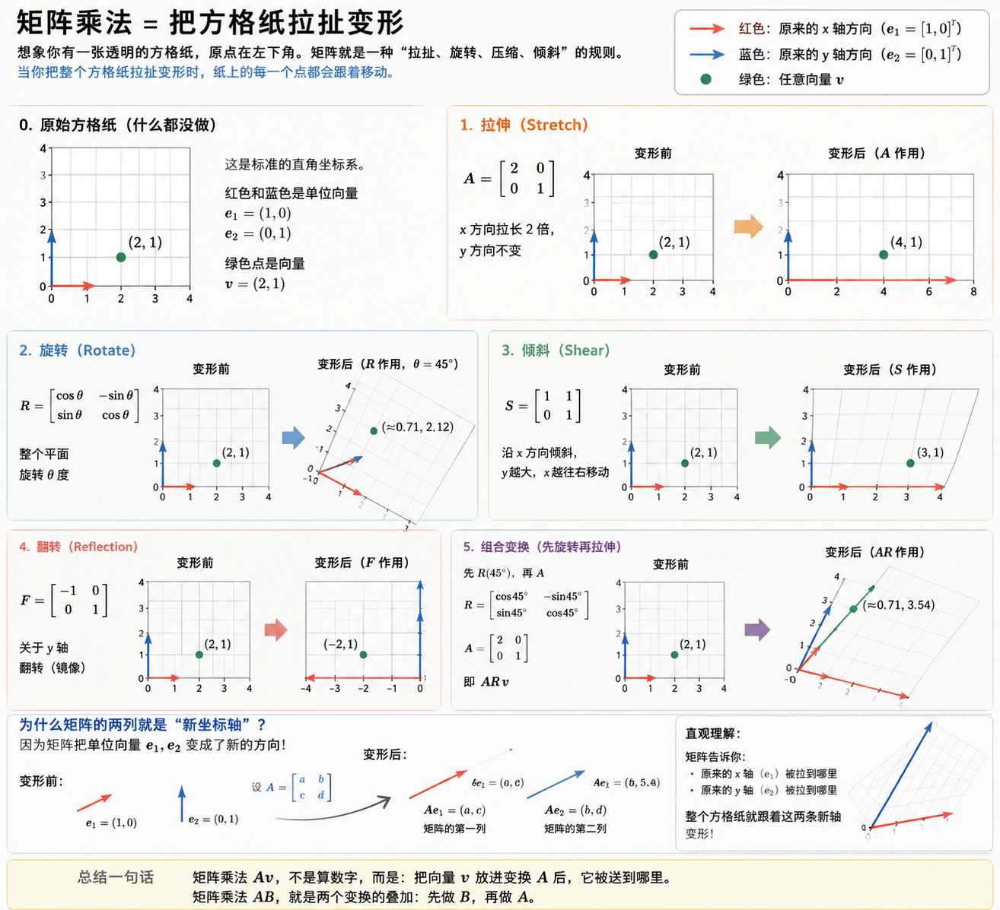

# 如何理解矩阵乘法是空间变换

把“矩阵乘法 = 空间变换”理解透，关键是从 **“数字计算”视角切换到“移动空间中的点/向量”视角**。

一句话：

> **矩阵乘法是在描述：一个向量进入某种空间变换后，被送到哪里。**

---

## 1. 从二维空间开始：向量是空间里的箭头

想象二维平面上的一个点/箭头：

$$
v=
\begin{bmatrix}
x \\
y
\end{bmatrix}
$$

例如：

$$
v=
\begin{bmatrix}
2 \\
1
\end{bmatrix}
$$

意思是：从原点走 `(2,1)`。

---

## 2. 矩阵是什么？

矩阵可以看成：

> **一个“变换规则”**

例如：

```math
A=
\begin{bmatrix}
2 & 0 \\
0 & 1
\end{bmatrix}
```

对向量做矩阵乘法：

```math
Av=
\begin{bmatrix}
2 & 0 \\
0 & 1
\end{bmatrix}
\begin{bmatrix}
2 \\
1
\end{bmatrix}
=
\begin{bmatrix}
4 \\
1
\end{bmatrix}
```

发生了什么？

原来 `(2,1)` → `(4,1)`。

空间意义：

> x 方向被拉长 2 倍，y 不变。

这不是算数字，而是在：

> **把整个平面沿 x 方向拉伸。**

---

## 3. 更直观：矩阵变换的是“整个空间”

很多人误解：

> “矩阵把一个向量改掉了”

更准确：

> **矩阵把整个坐标空间改掉了。**

假设平面是一张橡皮膜：

- 拉伸
- 压缩
- 旋转
- 倾斜（shear）
- 翻转

矩阵是在描述：

> “如何扭曲这张膜”

点只是跟着膜一起移动。

例如旋转矩阵：

它会：

> 把整个平面旋转 $\theta$ 度。

---

## 4. 为什么矩阵列向量代表新坐标轴（核心直觉）

最重要的一步。

考虑：

```math
A=
\begin{bmatrix}
2 & 1 \\
0 & 1
\end{bmatrix}
```

不要急着乘。

看列：

第一列：

```math
\begin{bmatrix}
2 \\
0
\end{bmatrix}
```

第二列：

```math
\begin{bmatrix}
1 \\
1
\end{bmatrix}
```

这代表：

原来的 x 轴单位向量：

```math
e_1=
\begin{bmatrix}
1 \\
0
\end{bmatrix}
```

被送到：

```math
Ae_1=
\begin{bmatrix}
2 \\
0
\end{bmatrix}
```

原来的 y 轴单位向量：

```math
e_2=
\begin{bmatrix}
0 \\
1
\end{bmatrix}
```

被送到：

```math
Ae_2=
\begin{bmatrix}
1 \\
1
\end{bmatrix}
```

意思：

> **矩阵告诉你：坐标轴变成什么样子。**

整个空间就随之扭曲。

所以：

> **矩阵的列 = 基底向量（basis）被变换后的样子。**

这是线性代数最重要的直觉之一。

---

## 5. 为什么矩阵乘法是“组合变换”

如果：

- $A$ = 拉伸
- $B$ = 旋转

那么：

$$
ABv
$$

意思：

先做 $B$，再做 $A$。

即：

$$
A(Bv)
$$

这是：

> **函数组合**

就像：

```text
rotate()
then
stretch()
```

因此矩阵乘法本质是：

> **空间变换的复合**

不是单纯数字乘法。

---

## 6. 为什么一定是线性变换？

矩阵只能表达：

- 旋转
- 缩放
- shear
- reflection

这些保持：

1. 直线仍是直线
2. 原点固定

即：

$$
T(a+b)=T(a)+T(b)
$$

$$
T(cv)=cT(v)
$$

满足线性。

比如：

> 平移 $(x,y)\to(x+1,y+2)$

不能直接用普通矩阵表示（需齐次坐标）。

---

## 7. 一个非常强的脑内模型

以后看到：

$$
Av
$$

不要想：

> “矩阵 × 向量”

而想：

> **“把向量 $v$ 放进变换 $A$ 后，它被送到哪里？”**

看到：

$$
AB
$$

想：

> **“两个空间变换叠加”**

看到矩阵列：

> **“坐标轴被扭曲成什么样”**

---

# “把方格纸拉扯变形”的图像化方式解释

