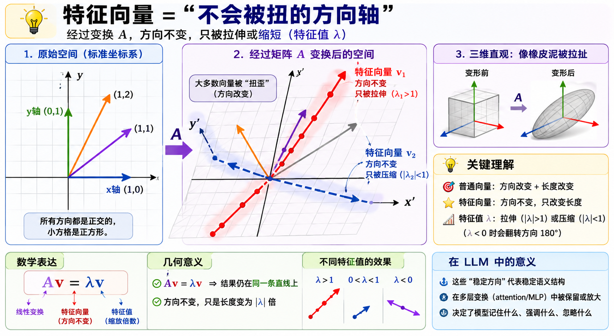

理解“特征值 / 特征向量”，最好的方式不是从公式开始，而是从一句话开始：

> **它们描述的是：一个线性变换中“方向不变，只被拉伸/缩放”的特殊方向。**

---

# 1. 直觉：空间被“变形”了，但有些方向很特殊

想象一个线性变换（矩阵）A在做这件事：

* 把平面上的所有箭头“拉扯、旋转、压缩、剪切”

但在这些复杂变化中，有些特别的箭头：

* 方向完全不变
* 只是长度变长或变短（甚至翻转）

这些“幸运方向”就是：

* **特征向量 eigenvector**
* **缩放倍率 eigenvalue**

---

# 2. 数学定义（只看这一行就够）

A\mathbf{v}=\lambda\mathbf{v}

含义：

* A：线性变换（矩阵）
* v：特征向量
* λ：特征值

👉 关键不是等式，而是语义：

> A作用在v上，只是把它“拉长/缩短”，方向不变

---

# 3. 一个几何比喻（非常重要）

把矩阵 A 想成一个“橡皮泥机器”：

* 普通向量：被随意扭曲方向
* 特征向量：像“钢针”一样穿过橡皮泥

  * 方向不变
  * 只变长/变短

---

# 4. 为什么它在“空间变换”中核心？

因为任何矩阵都可以理解为：

> 在某些“隐藏坐标轴”上做简单缩放

这些“隐藏坐标轴”就是特征向量方向。

所以：

* 原空间：复杂变形
* 特征空间：变成“对角缩放”

---

# 5. 和 LLM 的关系（重点）

在 LLM 里（Machine Learning / Transformer结构），核心都是：

> 高维向量 + 线性变换 + 注意力机制

---

## 5.1 Embedding 空间（语义空间）

token → embedding vector

这个空间里：

* “king - man + woman ≈ queen”
* 语义方向是结构化的

👉 这些“稳定语义方向”，本质上接近：

* **低维子空间 / 主方向**
* 可以用“特征向量思想”理解

---

## 5.2 Attention 本质是线性变换 + 重加权

Attention：

* QKᵀ → 相似性矩阵
* softmax → 权重
* V → 信息混合

最终：

> 每个 token 被重新映射到新向量

这就是一个“动态线性变换”

---

## 5.3 为什么特征向量思想有用？

因为我们关心的是：

### (1) 哪些方向是“稳定语义方向”？

例如：

* 语气
* 主谓结构
* 时间/数量属性

这些在多层网络中“持续存在”

👉 类似“特征向量 = 不容易被破坏的方向”

---

### (2) 为什么 residual stream 能稳定训练？

Transformer residual：

* 不断叠加线性变换
* 但信息不崩

可以理解为：

> 网络在试图保留某些“稳定子空间结构”

---

### (3) 为什么 layer norm / orthogonal init 有效？

因为它们在做：

* 控制“方向塌缩”
* 防止所有向量挤到一个子空间

👉 本质是控制“特征结构退化”

---

# 6. 一个更深的连接：对角化 vs 表达解耦

如果一个矩阵可以对角化：

A=V\Lambda V^{-1}

意味着：

* 在特征向量基底下
* 系统变成“独立维度”

---

## 在 LLM 中对应什么？

可以类比：

> 如果模型内部表示“可解耦”，学习会更容易

例如：

* 一个维度专门编码语法
* 一个维度编码语义
* 一个维度编码指代

现实中不完全成立，但这是理想结构。

---

# 7. 一句话总结

* **特征向量**：线性变换中“不改变方向的稳定语义轴”
* **特征值**：这个轴被放大/缩小的程度
* **LLM中的意义**：理解高维表示中“哪些方向是稳定结构”

---

# 8. 如果你想继续深入（建议路径）

我可以带你继续往三个方向走：

### A. 几何直觉版

👉 为什么“矩阵 = 旋转 + 拉伸 + 剪切”

### B. LLM版

👉 attention 为什么是“内容寻址数据库”

### C. 数学版

👉 SVD vs eigendecomposition 在 embedding 中的作用

只要选一个方向继续就行。

# 几何直觉版——矩阵到底在“干什么”

好，我们走 **A：几何直觉版——矩阵到底在“干什么”**。

目标是把这句话彻底变成画面：

> **矩阵 = 对空间做一次“系统性变形”**

---

# 1. 从一张“方格纸”开始

想象一张二维网格：

* x 轴、y 轴正交
* 小方格都是正方形

每个向量就是一个箭头，比如：

* (1,0)
* (0,1)
* (1,1)

---

# 2. 矩阵做的第一件事：扭曲空间

一个矩阵 A 作用在整个平面上：

结果可能变成：

* 方格 → 平行四边形网格
* 直角 → 斜角
* 长度被拉伸/压缩

👉 关键点：

> 矩阵不是“移动点”，而是“改造整个坐标系统”

---

# 3. 一个具体例子（直觉最重要）

假设：

* x 方向被拉长 2 倍
* y 方向被压扁 0.5 倍
* 再加一点“斜切”

那么：

* 原来的正方形 → 斜的菱形网格

---

# 4. 为什么“基向量”最重要？

任何向量都可以写成：

* x轴方向 + y轴方向组合

所以矩阵只需要告诉你：

> (1,0) 被变成什么
> (0,1) 被变成什么

整个空间就确定了

---

# 5. 关键跳跃：不是所有方向都被“混合”

现在进入特征向量的直觉（关键连接）：

在一般情况下：

* x方向和 y方向会互相“掺杂”

但某些特殊方向：

> 经过变换后，仍然在“同一条直线上”

这就是：

* **特征向量方向**

---

# 6. 用几何语言重新说特征向量

普通向量：

* 被“转向 + 拉伸”

特征向量：

* **只拉伸，不转向**

A\mathbf{v}=\lambda\mathbf{v}

几何意义就是：

> A 作用后，v 仍然在原来的直线方向上

---

# 7. 一个非常关键的直觉（很多人卡在这里）

矩阵变形空间，其实有两种“视角”：

### 视角1：看点怎么动

* 每个点被搬到新位置

### 视角2（更重要）：

* 看“整个空间的坐标轴怎么被扭”

---

# 8. 特征向量 = “不会被扭的方向轴”

可以理解成：

* 大多数坐标轴会被扭歪
* 但有些特殊方向“刚好不被扭”

这些方向：

> 就是空间变形的“骨架”

---

# 9. 为什么这对 LLM 有关系（提前埋一个钩子）

在 LLM 的 embedding 空间里：

* 语义是高维空间的“方向结构”
* attention / MLP 都是在做线性变换

所以：

> 模型其实一直在“扭曲语义空间”

而我们关心的是：

* 哪些方向稳定（类似特征向量）
* 哪些方向被放大（类似特征值大）

---

# 10. 一句话收束

> 矩阵 = 空间的变形器
> 特征向量 = 变形过程中“不改变方向的骨架线”

---

如果你下一步想继续，我可以带你做一个更“视觉冲击”的版本：

👉 **为什么矩阵乘法 = 把整个平面“重新定义坐标系”**
（这个会直接把 linear algebra 打通到 LLM embedding）

# 出个图片展示：特征向量 = “不会被扭的方向轴”

