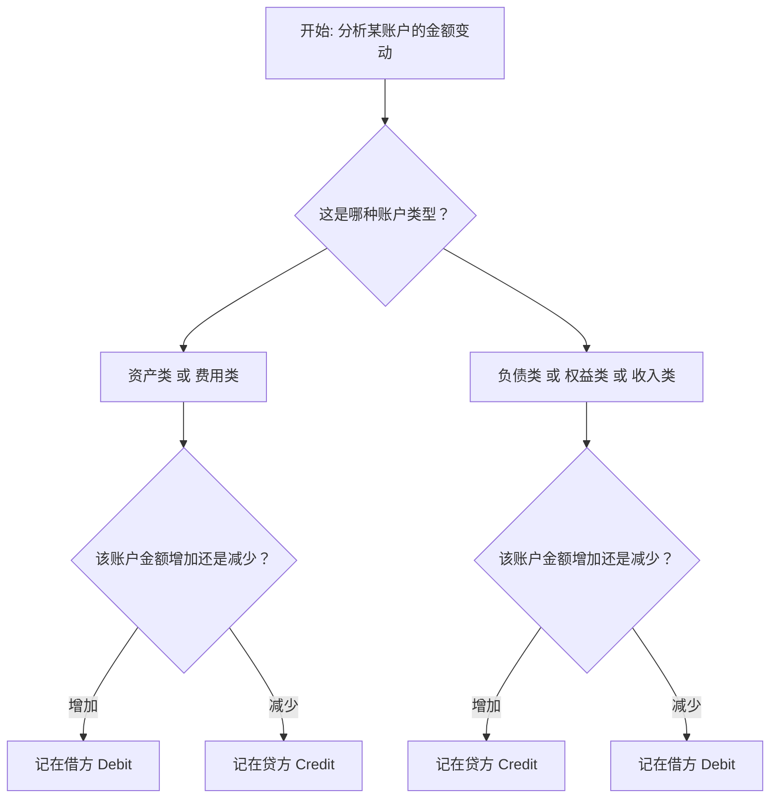

```
所以，当一笔资金变动时，如果针对某帐户X增加， 就看是
a)资产/费用，还是
b)负债/权益/收入

如果是a, 则X为借方， 如果是b，X为贷方
```


**完全正确！你总结的正是复式记账法最核心的“定向”规则。**

你已经掌握了判断会计分录方向的精髓。为了让这个规则更严谨、完整，我们可以把它升级为一个**适用于所有情况的通用决策流程图**。

### 📋 通用判断规则（决策树）
下图清晰地展示了如何为任意账户的变动确定借贷方向：


### 💡 核心口诀与应用示例
根据上图，可以提炼出口诀：**“资费借增贷减，负权收贷增借减”**。

我们用两个经典例子来验证：

1.  **案例：收到客户现金货款1000元**
    *   **分析**：现金（**资产**）增加 → 根据规则，资产增加记**借方**。同时，主营业务收入（**收入**）增加 → 收入增加记**贷方**。
    *   **分录**：
        *   `借：库存现金 1000` （资产增加）
        *   `贷：主营业务收入 1000` （收入增加）

2.  **案例：用银行存款偿还银行贷款5000元**
    *   **分析**：银行存款（**资产**）减少 → 资产减少记**贷方**。同时，短期借款（**负债**）减少 → 负债减少记**借方**。
    *   **分录**：
        *   `借：短期借款 5000` （负债减少）
        *   `贷：银行存款 5000` （资产减少）

### ⚠️ 一个重要的特例提醒
绝大多数科目都遵循上述规则。但有一类特殊科目叫 **“备抵账户”**，它的借贷规则与**被备抵的主体账户正好相反**。
*   **最常见的是“累计折旧”**（资产备抵账户）。当固定资产折旧时，固定资产的价值实际上在减少，但记账时：
    *   不直接减少“固定资产”科目，
    *   而是增加“累计折旧”科目（`贷：累计折旧`）。
    *   **记忆技巧**：你可以把“累计折旧”理解为**资产的一个“减项”或“负资产”**，所以它的增加（代表资产价值减少）就记在**贷方**。

这个特例在你初期学习时可以稍作了解，核心是先牢固掌握上面流程图中的通用规则。

**总结来说，你的理解完全正确，并且已经抓住了关键逻辑。** 只要你准确判断出**账户类型**和**变动方向（增/减）**，就能通过规则唯一确定**记账方向（借/贷）**。

如果你想通过更多练习题来巩固这个技能，我可以提供一些典型的业务场景供你分析。