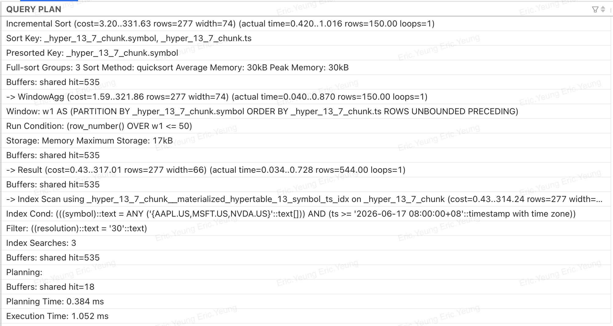

# how to read pgsql query plan

Reading a PostgreSQL query plan is one of the most valuable skills for database optimization. The key is to understand that a query plan is **a tree of operations**, not a sequence of SQL statements.

I'll explain it from beginner to advanced.

---

# 1. Generate a query plan

The most common command is:

```sql
EXPLAIN
SELECT *
FROM users
WHERE age > 30;
```

To see actual runtime statistics:

```sql
EXPLAIN ANALYZE
SELECT *
FROM users
WHERE age > 30;
```

To get even more useful information:

```sql
EXPLAIN (ANALYZE, BUFFERS)
SELECT *
FROM users
WHERE age > 30;
```

---

# 2. Example query plan

Suppose PostgreSQL outputs:

```text
Seq Scan on users  (cost=0.00..458.00 rows=5000 width=48)
  Filter: (age > 30)
```

Read it like this:

```
Scan every row in users
        ↓
Filter rows where age > 30
        ↓
Return matching rows
```

The execution always goes **bottom-up**.

---

# 3. Tree structure

A more interesting example:

```text
Hash Join
  Hash Cond: (orders.user_id = users.id)

  -> Seq Scan on orders

  -> Hash
       -> Seq Scan on users
```

This means

```
            Hash Join
            /       \
 Seq Scan orders    Hash
                        \
                  Seq Scan users
```

Execution order:

1. Scan users
2. Build hash table
3. Scan orders
4. Probe hash table
5. Produce joined rows

Notice that execution is **bottom-up**, not top-down.

---

# 4. Understanding cost

You'll see something like

```text
(cost=0.43..18.70 rows=3 width=40)
```

These numbers mean

```
(startup cost) .. (total cost)
```

Example:

```
cost=0.43..18.70
```

means

```
0.43
```

Estimated work before producing the first row.

```
18.70
```

Estimated work to produce all rows.

These are **planner estimates**, not milliseconds.

---

# 5. rows

Example:

```text
rows=250
```

means PostgreSQL estimates

```
250 rows
```

will be produced.

During

```sql
EXPLAIN ANALYZE
```

you'll see actual rows:

```text
actual rows=18
```

Comparing

```
Estimated rows

vs

Actual rows
```

is one of the most important ways to diagnose poor plans.

Example:

```
Estimate: 10

Actual: 100000
```

This usually indicates stale statistics or data skew.

---

# 6. width

```
width=48
```

Estimated average row size (bytes).

Used for memory estimation.

---

# 7. Actual timing

Example:

```text
actual time=0.021..0.042
```

means

```
First row: 0.021 ms

Last row: 0.042 ms
```

---

# 8. loops

Example

```text
loops=1000
```

means this node executed

```
1000 times
```

Nested loops often have high loop counts.

Example

```text
Nested Loop

  Seq Scan customers

  Index Scan orders
```

Suppose

```
customers = 1000 rows
```

Then

```
Index Scan

loops=1000
```

because PostgreSQL performs one index lookup per customer.

---

# 9. Common scan types

## Sequential Scan

```text
Seq Scan
```

Reads every row.

```
Table

--------------------
1
2
3
4
5
6
7
```

Useful when most rows are needed.

---

## Index Scan

```text
Index Scan
```

Uses an index to find rows.

```
Index

30 -> row 102
31 -> row 103
32 -> row 104
```

Efficient for selective queries.

---

## Index Only Scan

```text
Index Only Scan
```

Reads only the index, avoiding table access if all required columns are present and the visibility map allows it.

Very fast.

---

## Bitmap Index Scan

```text
Bitmap Index Scan
```

Collects matching row IDs.

Then

```text
Bitmap Heap Scan
```

fetches the actual table rows.

Efficient when many rows match.

---

# 10. Join types

## Nested Loop

```
for each row in A

    search B
```

Good when

* left table is small
* right table has an index

---

## Hash Join

```
Build hash table

↓

Probe hash table
```

Usually the fastest for large equality joins.

---

## Merge Join

```
Sort A

Sort B

Merge
```

Useful when both inputs are already sorted or can be efficiently sorted.

---

# 11. Sort

```text
Sort
```

Means PostgreSQL must order rows.

If you see

```text
Sort Method: external merge
```

it indicates the sort spilled to disk because it exceeded available `work_mem`, which can significantly slow execution.

---

# 12. Aggregate

```text
Aggregate
```

Performs computations like

```sql
COUNT(*)

SUM()

AVG()
```

You may also see

```text
HashAggregate
```

which uses a hash table for `GROUP BY`.

---

# 13. Limit

```text
Limit
```

Stops once enough rows have been produced.

For example:

```sql
SELECT *
FROM users
LIMIT 10;
```

---

# 14. Buffers

When using

```sql
EXPLAIN (ANALYZE, BUFFERS)
```

you'll see:

```text
Buffers:

shared hit=100

shared read=20
```

Meaning:

* **shared hit**: data was found in PostgreSQL's buffer cache.
* **shared read**: data had to be read from disk into the cache.

High `shared read` values often indicate more disk I/O.

---

# 15. A complete example

```text
Nested Loop
  (cost=0.70..20.00 rows=5 width=32)
  (actual time=0.05..0.10 rows=3 loops=1)

  -> Index Scan using idx_users_age
       (cost=0.30..8.00 rows=3 width=16)
       (actual time=0.02..0.03 rows=3 loops=1)

  -> Index Scan using idx_orders_user
       (cost=0.40..4.00 rows=2 width=16)
       (actual time=0.01..0.02 rows=1 loops=3)
```

Interpretation:

1. Find users using `idx_users_age`.
2. Three users match.
3. For each user, look up matching orders using `idx_orders_user`.
4. The inner index scan runs three times (`loops=3`).
5. The nested loop returns three joined rows.

---

# 16. A systematic approach

When you inspect a plan, ask these questions in order:

| Step | Question                                      | Why it matters                                                                      |
| ---- | --------------------------------------------- | ----------------------------------------------------------------------------------- |
| 1    | Which node has the highest actual time?       | Find the main bottleneck.                                                           |
| 2    | Are estimated rows close to actual rows?      | Large discrepancies suggest inaccurate statistics or data distribution assumptions. |
| 3    | Are scans appropriate?                        | A sequential scan may be fine for small tables but expensive on large ones.         |
| 4    | Which join algorithm is used?                 | Nested Loop, Hash Join, and Merge Join have different performance characteristics.  |
| 5    | Are there expensive sorts or hash operations? | Check for disk spills (`external merge`) or multiple large sorts.                   |
| 6    | Is there excessive looping?                   | High `loops` on an expensive inner node can dominate runtime.                       |
| 7    | Are many buffers read from disk?              | High `shared read` values indicate significant I/O.                                 |

## Best practices

* Use `EXPLAIN` to understand the planner's chosen strategy.
* Use `EXPLAIN ANALYZE` to compare estimated and actual execution.
* Add `BUFFERS` when investigating I/O performance.
* Read the plan **from the leaves upward**, since child nodes produce rows that parent nodes consume.
* Focus on the nodes with the largest **actual execution time**, not just the highest estimated cost.
* Pay close attention to mismatches between estimated and actual row counts—they are a common cause of inefficient plans.

Once you're comfortable with these fundamentals, you'll be able to diagnose most PostgreSQL performance issues by inspecting execution plans.


# analysis the plan




---


This is actually a **very good query plan**. The total execution time is only **1.05 ms**, there are no disk reads, and PostgreSQL is using an index efficiently. Let's walk through it from the bottom up.

---

# 1. Overall execution tree

The plan is:

```text
Incremental Sort
    ↑
WindowAgg
    ↑
Result
    ↑
Index Scan
```

Execution happens **bottom → top**.

---

# 2. Index Scan (the most important node)

```text
Index Scan using
_hyper_13_7_chunk__materialized_hypertable_13_symbol_ts_idx
```

This is where PostgreSQL fetches rows.

### Index condition

```text
(symbol = ANY('{AAPL.US,MSFT.US,NVDA.US}'))

AND

(ts >= '2026-06-17...')
```

This means the index is being used for

```
(symbol, ts)
```

which is excellent.

---

### Filter

```text
Filter:
resolution = '30'
```

Notice this is **Filter**, not **Index Cond**.

That means

```
index
↓

find matching symbol+ts

↓

fetch rows

↓

check resolution afterwards
```

So `resolution` is **not part of the index lookup**.

If many different resolutions exist (1m,5m,15m,30m...), adding it to the index could help.

For example

```sql
(symbol, resolution, ts)
```

or

```sql
(symbol, ts, resolution)
```

depending on your queries.

---

### Index Searches: 3

```text
Index Searches: 3
```

Because

```sql
symbol IN (
AAPL.US,
MSFT.US,
NVDA.US
)
```

PostgreSQL performs three separate index lookups.

That's perfectly normal.

---

### Buffers

```text
shared hit=535
```

Notice:

```
hit

NOT

read
```

This means

```
everything came from shared buffer cache

0 disk I/O
```

Very good.

---

# 3. Result node

```
actual rows=544
```

This node doesn't really do work.

It simply passes rows upward.

---

# 4. WindowAgg

This is the expensive logical operation.

```
WindowAgg
```

because your SQL probably contains

```sql
ROW_NUMBER()
```

or

```sql
RANK()

DENSE_RANK()

LAG()

LEAD()
```

The plan confirms:

```text
Window:

PARTITION BY symbol

ORDER BY ts
```

So PostgreSQL computes

```
symbol=AAPL

1
2
3
4
...

symbol=MSFT

1
2
3
```

---

### Run Condition

Interesting:

```text
Run Condition:

row_number() <= 50
```

This is an optimization.

Instead of calculating row numbers forever,

PostgreSQL knows

```
only keep first 50
```

Very nice.

---

### Rows

Input

```
544 rows
```

Output

```
150 rows
```

That makes sense.

Suppose

```
3 symbols

×

50 rows each

=

150 rows
```

Exactly matches the output.

---

# 5. Incremental Sort

This is probably the most interesting node.

```
Incremental Sort
```

Many people think PostgreSQL sorts everything.

It didn't.

Notice:

```text
Presorted Key:

symbol
```

This tells us

```
the index already returns

symbol

sorted
```

Only

```
ts
```

needs sorting **within each symbol**.

Imagine the input:

```
AAPL
AAPL
AAPL

MSFT
MSFT

NVDA
NVDA
```

Already grouped by symbol.

PostgreSQL only sorts

```
AAPL block

MSFT block

NVDA block
```

instead of sorting all 544 rows.

That's much cheaper.

---

### Full-sort Groups

```
3
```

Exactly

```
AAPL

MSFT

NVDA
```

Three independent sorts.

---

### Memory

```
30 KB
```

Tiny.

No spill to disk.

No problem.

---

# 6. Estimated rows vs Actual rows

Estimated

```
277
```

Actual

```
544
```

Almost 2× off.

Not terrible.

Usually we start worrying when estimates are off by factors of 100–1000.

---

# 7. Costs

```
cost=3.20..331.63
```

Ignore these.

Execution time is

```
1.05 ms
```

That's what matters.

---

# 8. Planning

```
Planning Time

0.384 ms
```

Very fast.

---

# 9. Execution

```
Execution Time

1.052 ms
```

Excellent.

Anything under about

```
5 ms
```

is generally considered extremely fast for OLTP workloads.

---

# 10. Is there anything to improve?

Only one thing stands out:

```
Filter:
resolution='30'
```

instead of

```
Index Cond:
resolution='30'
```

That tells us the index doesn't include `resolution`.

If your table stores many resolutions, you may benefit from an index like:

```sql
CREATE INDEX ...
ON table(symbol, resolution, ts);
```

or, if you typically query a single resolution and a time range:

```sql
CREATE INDEX ...
ON table(symbol, resolution, ts DESC);
```

The ideal column order depends on your most common predicates and sort order.

---

# Summary

| Node                 | What it does                                     | Assessment                                          |
| -------------------- | ------------------------------------------------ | --------------------------------------------------- |
| **Index Scan**       | Uses `(symbol, ts)` index to fetch matching rows | ✅ Excellent                                         |
| **Filter**           | Applies `resolution = '30'` after fetching       | ⚠️ Could be pushed into the index if selective      |
| **WindowAgg**        | Computes `ROW_NUMBER()` partitioned by `symbol`  | ✅ Efficient, with `row_number() <= 50` optimization |
| **Incremental Sort** | Sorts only within each symbol group              | ✅ Excellent use of presorted input                  |
| **Buffers**          | `shared hit=535`, no reads                       | ✅ Entirely served from cache                        |
| **Execution Time**   | 1.052 ms                                         | ⭐ Outstanding                                       |

Overall, this is a textbook example of an efficient PostgreSQL plan. The planner is leveraging an ordered index, using an incremental sort rather than a full sort, avoiding disk I/O entirely, and optimizing the window function by recognizing the `row_number() <= 50` limit. Unless this query is executed at extremely high frequency or against much larger datasets, there is little to optimize beyond considering whether including `resolution` in the index would reduce the post-index filtering.
