# 比较timescaleDb 和其他时间序列db


如果从你这种 **金融/交易系统、K-line、tick、market data、PostgreSQL 生态**的角度看，TimescaleDB 很值得重点比较。它最大的特点不是“做得最快”，而是：

> **TimescaleDB = PostgreSQL + 专门针对时间序列的存储/查询优化。**

而其他典型 TSDB 更倾向于做成一个独立的、高度专门化的时间序列引擎。

### 核心对比

| DB                  | 定位           |  查询能力 |  写入性能 | SQL          | PostgreSQL 兼容 | 历史数据  | 适合场景                   |
| ------------------- | ------------ | ----: | ----: | ------------ | ------------- | ----- | ---------------------- |
| **TimescaleDB**     | PG 时间序列扩展    | ⭐⭐⭐⭐⭐ |  ⭐⭐⭐⭐ | SQL          | ⭐⭐⭐⭐⭐         | ⭐⭐⭐⭐⭐ | 金融、IoT、业务+时序           |
| **ClickHouse**      | OLAP         | ⭐⭐⭐⭐⭐ | ⭐⭐⭐⭐⭐ | SQL          | ⭐⭐            | ⭐⭐⭐⭐⭐ | Tick、Trade、Kline、大规模分析 |
| **QuestDB**         | 专业 TSDB      |  ⭐⭐⭐⭐ | ⭐⭐⭐⭐⭐ | SQL          | ⭐             | ⭐⭐⭐⭐  | Market data、实时分析       |
| **InfluxDB**        | 专业 TSDB      |   ⭐⭐⭐ | ⭐⭐⭐⭐⭐ | InfluxQL/SQL | ⭐             | ⭐⭐⭐⭐  | Metrics、IoT            |
| **VictoriaMetrics** | Metrics TSDB |   ⭐⭐⭐ | ⭐⭐⭐⭐⭐ | PromQL       | ❌             | ⭐⭐⭐⭐⭐ | Prometheus/Monitoring  |
| **Apache IoTDB**    | TSDB         |  ⭐⭐⭐⭐ | ⭐⭐⭐⭐⭐ | SQL          | ❌             | ⭐⭐⭐⭐⭐ | IoT、大规模设备数据            |
| **Druid**           | 实时 OLAP      | ⭐⭐⭐⭐⭐ |  ⭐⭐⭐⭐ | SQL          | ❌             | ⭐⭐⭐⭐⭐ | 实时 OLAP、聚合分析           |
| **普通 PostgreSQL**   | General DB   |   ⭐⭐⭐ |    ⭐⭐ | SQL          | ⭐⭐⭐⭐⭐         | ⭐⭐⭐   | 低/中规模时序                |

---

# 1. TimescaleDB

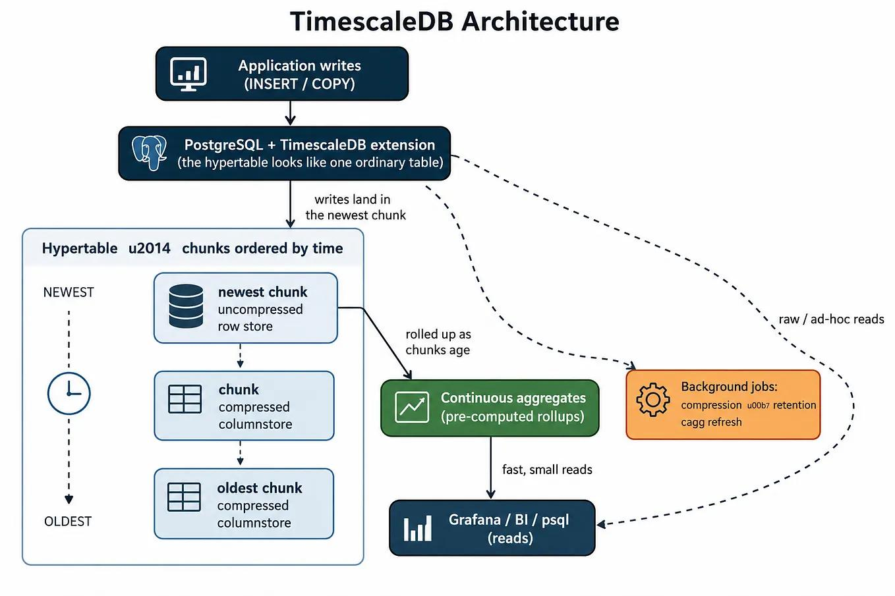

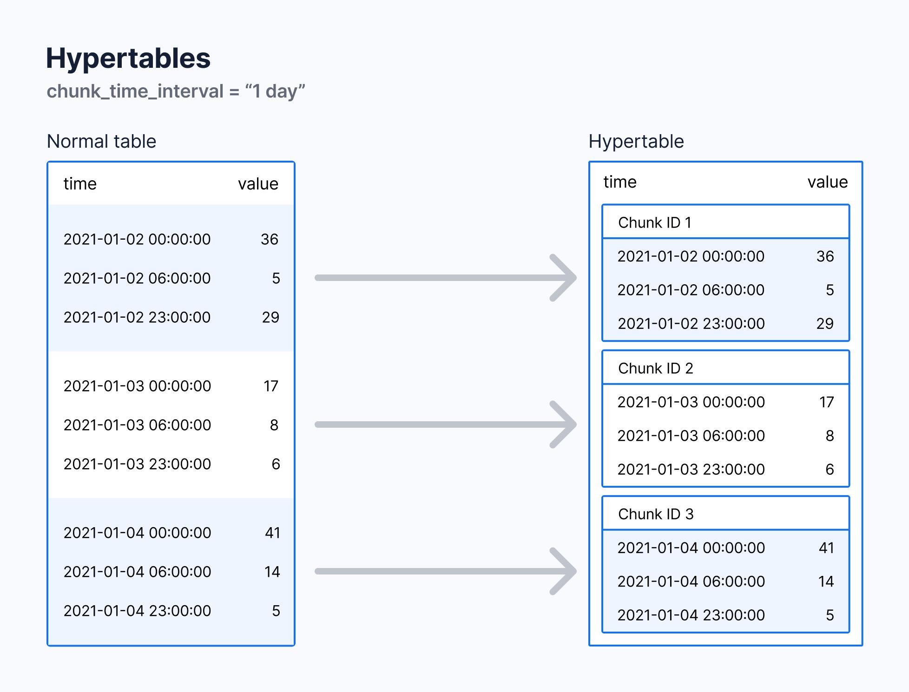

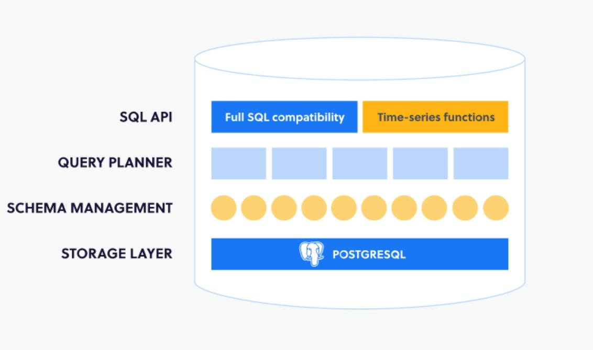

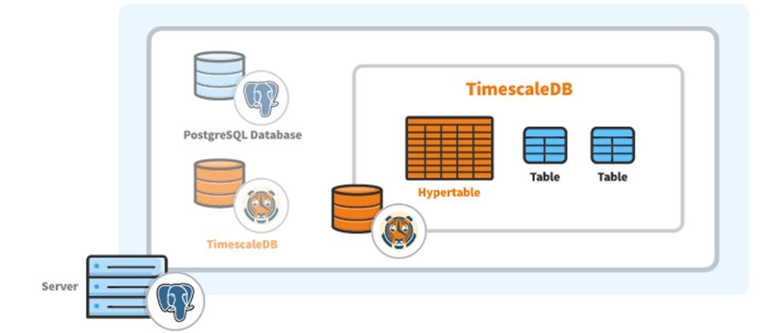

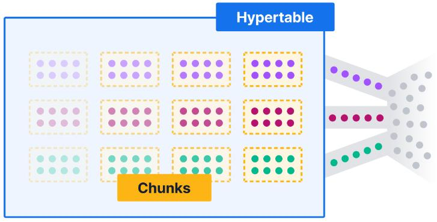

TimescaleDB 的核心 abstraction 是 **Hypertable**。

例如：

```sql
CREATE TABLE trade (
    ts        TIMESTAMPTZ NOT NULL,
    symbol    TEXT NOT NULL,
    price     DOUBLE PRECISION,
    quantity  DOUBLE PRECISION
);

SELECT create_hypertable('trade', 'ts');
```

逻辑上你看到：

```text
trade
```

实际上底层会自动拆成：

```text
trade
 ├── chunk_2026_09_01
 ├── chunk_2026_09_02
 ├── chunk_2026_09_03
 └── ...
```

所以：

```sql
SELECT *
FROM trade
WHERE ts >= '2026-09-01'
  AND ts <  '2026-09-02';
```

TimescaleDB 可以自动进行 **partition pruning / chunk pruning**。

### 最大优势

你仍然是在使用 PostgreSQL：

```sql
JOIN
GROUP BY
CTE
window function
JSONB
GIN
B-tree
PostGIS
transaction
foreign key
```

基本都是 PostgreSQL 的能力。

所以如果你的系统本来就是：

```text
PostgreSQL
    +
users
orders
accounts
symbols
positions
trades
```

然后增加：

```text
tick
kline
market_data
```

TimescaleDB 非常自然。

---

# 2. ClickHouse

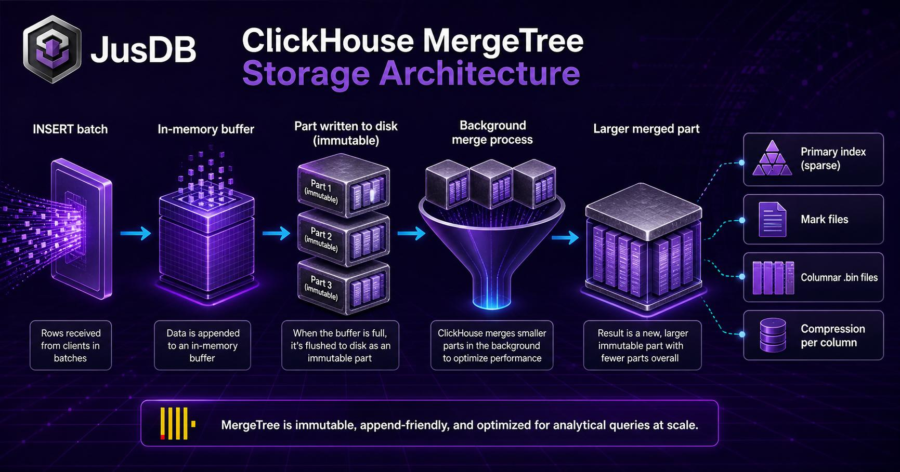

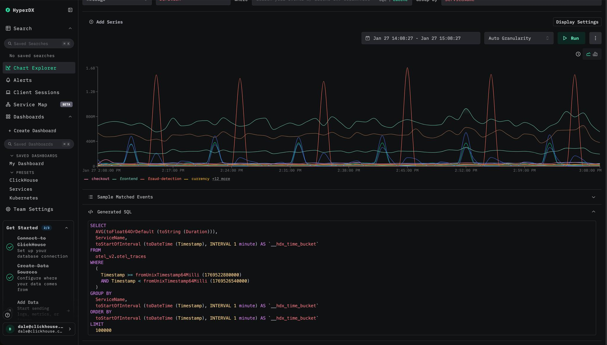

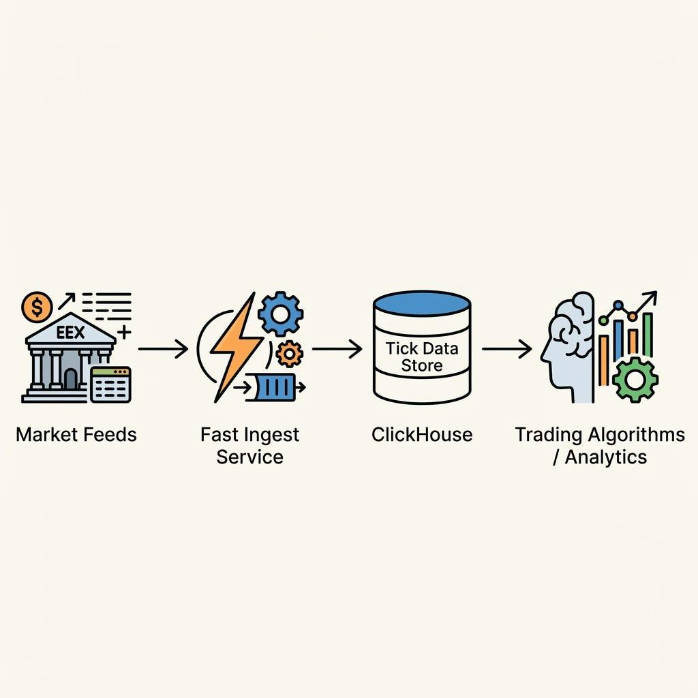

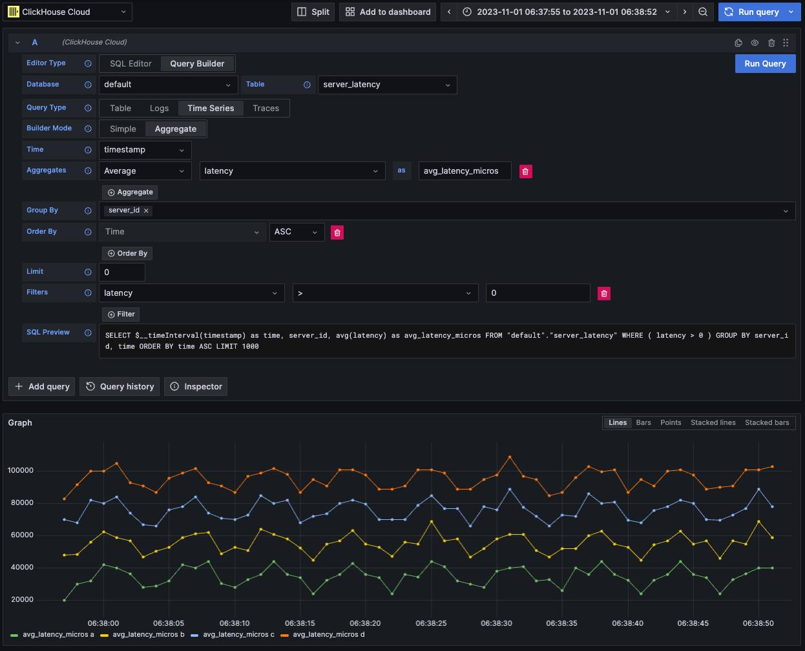

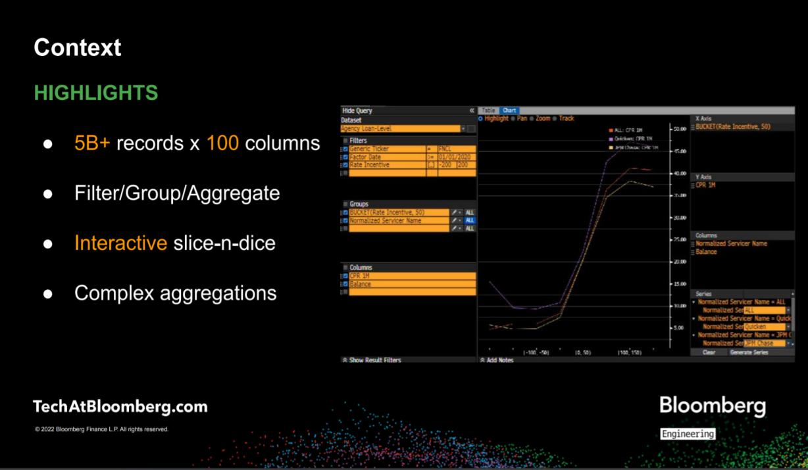

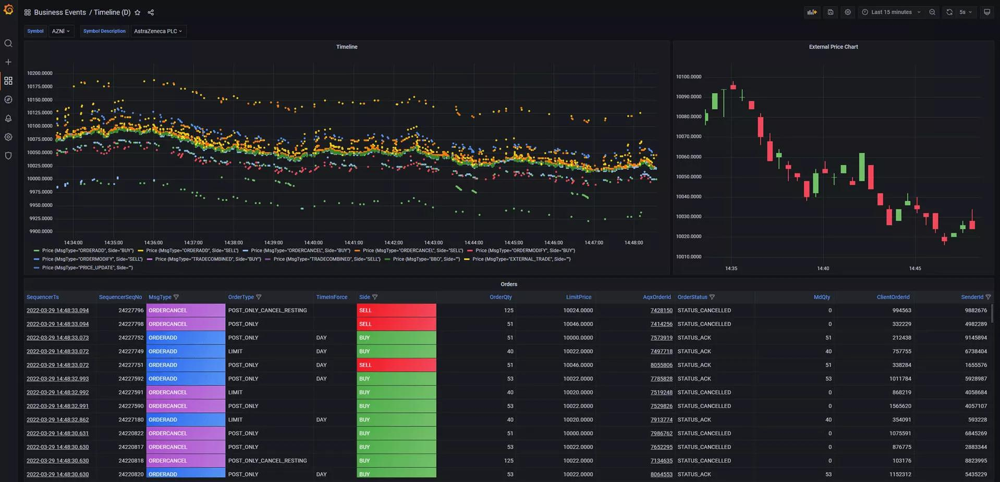

ClickHouse 的定位其实和 TimescaleDB 有很大不同。

它本质是：

> **超高性能 OLAP database**

特别擅长：

```text
100 billion rows
1 trillion rows
```

这种规模的数据分析。

例如：

```sql
SELECT
    symbol,
    toStartOfMinute(ts),
    avg(price),
    max(price),
    min(price)
FROM trades
WHERE ts >= ...
GROUP BY symbol, toStartOfMinute(ts);
```

这种查询 ClickHouse 非常强。

### 金融市场数据

假设：

```text
BTCUSDT
ETHUSDT
AAPL
NVDA
TSLA
...
```

每天：

```text
100M ~ 10B ticks
```

ClickHouse 往往比 TimescaleDB 更适合。

---

# 3. QuestDB

QuestDB 和 TimescaleDB 是非常值得直接比较的。

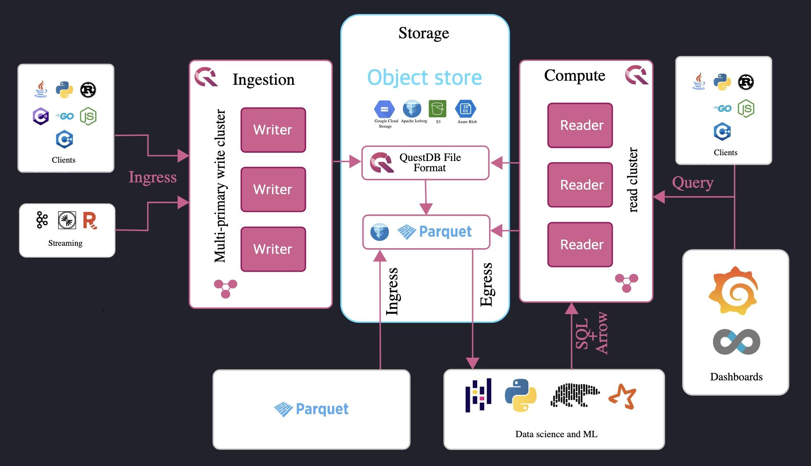

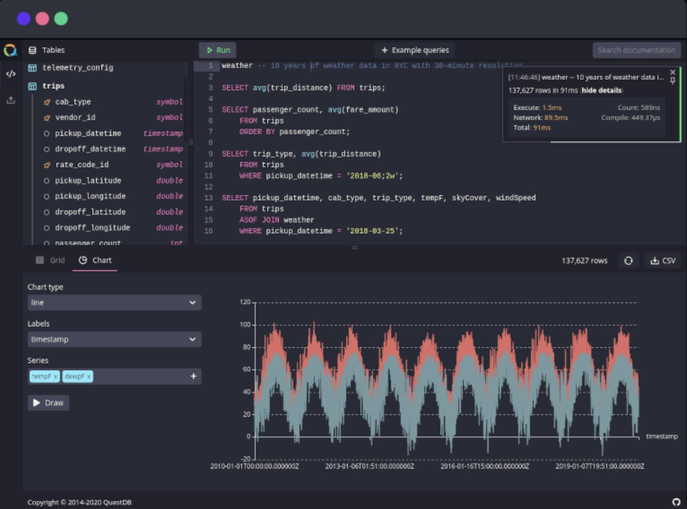

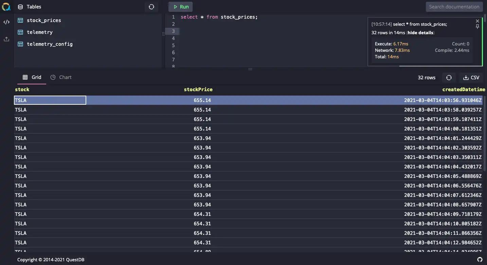

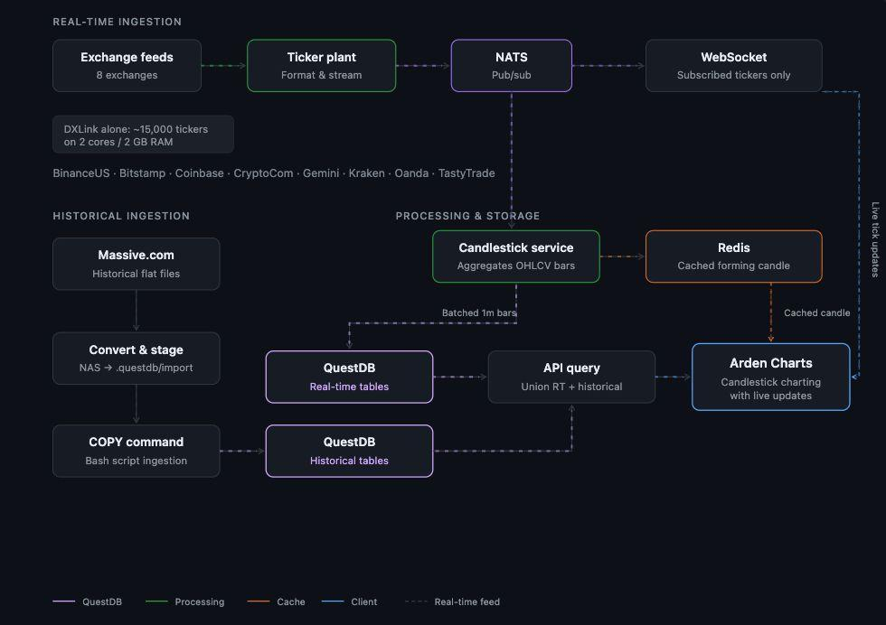

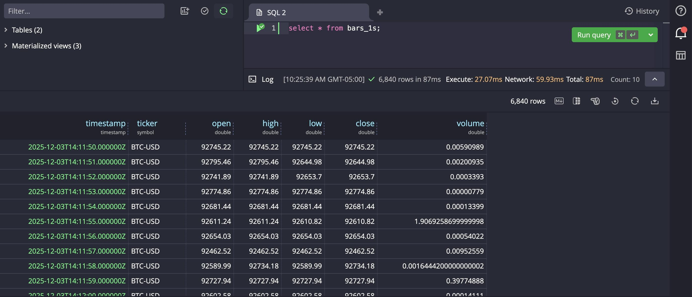

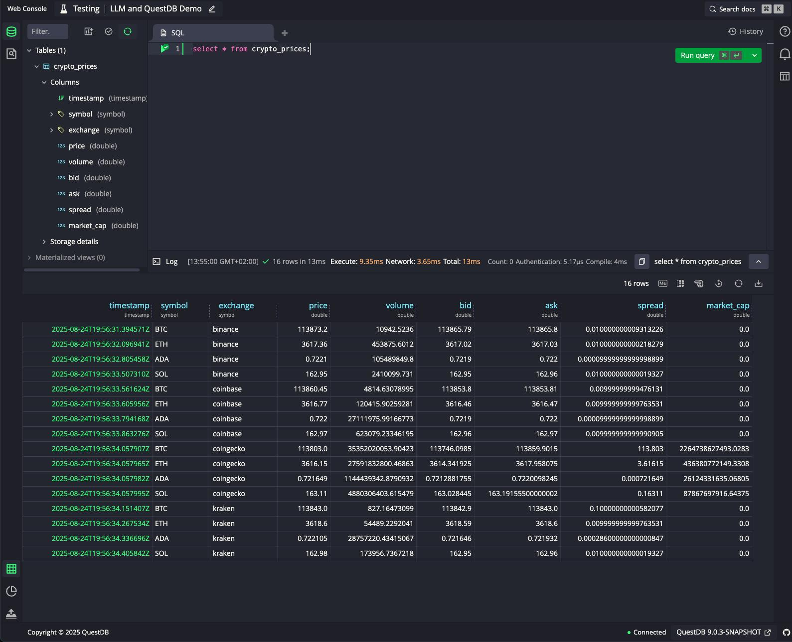

QuestDB 从一开始就是针对：

> **high-throughput time-series ingestion**

设计的。

例如：

```sql
SELECT *
FROM trades
WHERE symbol = 'AAPL'
  AND ts IN '2026-09-01';
```

它对：

```text
timestamp
symbol
price
volume
```

这种数据模型非常友好。

### QuestDB 特别适合

```text
Market Data
    ↓
Tick
    ↓
Trade
    ↓
Order Book
    ↓
Kline
```

尤其是：

```text
高写入
低延迟查询
append-only
时间范围查询
```

---

# 4. InfluxDB

InfluxDB 是比较经典的 TSDB。

传统模型比较接近：

```text
measurement
    +
tags
    +
fields
    +
timestamp
```

例如：

```text
measurement = cpu
tags = host=server01
fields = usage=83.2
timestamp = ...
```

非常适合：

```text
CPU
Memory
Network
IoT
Sensors
Monitoring
```

但是如果你做金融交易系统：

```text
orders
trades
users
accounts
positions
symbols
```

InfluxDB 就没有 TimescaleDB 那么自然。

---

# 5. VictoriaMetrics

VictoriaMetrics 更特殊。

它主要是：

> **Prometheus-compatible Metrics Database**

典型：

```text
Prometheus
      ↓
VictoriaMetrics
      ↓
Grafana
```

例如：

```text
http_requests_total
cpu_usage
memory_usage
latency
```

它不是我会优先考虑用来存：

```text
trade
tick
orderbook
kline
```

的数据库。

---

# 6. 真正重要的区别：OLTP vs OLAP vs TSDB

其实不要简单理解成：

```text
TimescaleDB
vs
ClickHouse
vs
QuestDB
```

更重要的是看它们的定位。

### PostgreSQL / TimescaleDB

```text
                  PostgreSQL
                     │
       ┌─────────────┴─────────────┐
       │                           │
     OLTP                    Time Series
       │                           │
 orders/accounts              ticks/klines
 positions/users               trades
```

属于：

> **General-purpose DB + Time Series**

---

### ClickHouse

```text
                ClickHouse
                    │
                  OLAP
                    │
          ┌─────────┴─────────┐
          │                   │
       massive              analytics
       data                  queries
```

属于：

> **Massive analytical database**

---

### QuestDB

```text
                 QuestDB
                    │
              Time Series
                    │
          ┌─────────┴─────────┐
          │                   │
       ingestion           low latency
```

属于：

> **Specialized high-performance TSDB**

---

# 7. 如果是你的金融交易场景

这个其实是最值得关注的。

假设你的数据：

```text
Symbol
Timestamp
Open
High
Low
Close
Volume
```

也就是你之前讨论的 **1-minute Kline**。

如果规模：

### 方案 A：每天几百万～几千万

我会倾向：

```text
PostgreSQL + TimescaleDB
```

例如：

```text
symbols
orders
positions
accounts
       │
       └──── PostgreSQL / TimescaleDB
                    │
                  klines
                  trades
```

优点是系统非常简单。

---

### 方案 B：每天几十亿 Tick

开始考虑：

```text
ClickHouse
```

架构可能是：

```text
Exchange
   │
   ▼
Kafka
   │
   ▼
ClickHouse
   │
   ├── Tick
   ├── Trade
   ├── OrderBook
   └── Kline
```

尤其是你需要大量：

```sql
GROUP BY symbol
GROUP BY minute
GROUP BY day
VWAP
TWAP
OHLC
statistics
backtest
```

ClickHouse 会越来越有优势。

---

### 方案 C：低延迟 Market Data

如果目标是：

```text
Exchange
   ↓
Feed Handler
   ↓
QuestDB
   ↓
Query
```

QuestDB 值得考虑。

但如果你的系统还有大量：

```text
User
Account
Order
Position
Execution
Risk
```

TimescaleDB 的整体工程体验通常更舒服。

---

# 8. TimescaleDB 最大优势其实不是性能

这是我认为最重要的一点。

很多人会问：

> TimescaleDB 和 ClickHouse 谁快？

其实这个问题本身不太好。

更准确的问题是：

> **我的数据和查询模型是什么？**

比如：

```sql
SELECT
    s.symbol,
    o.order_id,
    p.position,
    t.trade
FROM ...
JOIN ...
```

这种复杂 relational query：

**TimescaleDB / PostgreSQL 非常舒服。**

而：

```sql
SELECT
    symbol,
    toStartOfHour(ts),
    avg(price),
    sum(volume)
FROM ticks
WHERE ts BETWEEN ...
GROUP BY symbol, toStartOfHour(ts);
```

这种：

**ClickHouse 非常舒服。**

---

# 9. 一个简单的选择矩阵

如果你的需求是：

| 需求                 | 推荐                           |
| ------------------ | ---------------------------- |
| PostgreSQL 应用      | **TimescaleDB**              |
| OLTP + Time Series | **TimescaleDB**              |
| 几百万～几亿时序数据         | **TimescaleDB**              |
| 几十亿～万亿数据           | **ClickHouse**               |
| 大规模历史分析            | **ClickHouse**               |
| Tick / Market Data | **ClickHouse / QuestDB**     |
| 极高 ingestion rate  | **QuestDB / ClickHouse**     |
| Prometheus metrics | **VictoriaMetrics**          |
| IoT                | **InfluxDB / IoTDB**         |
| 复杂 JOIN            | **TimescaleDB**              |
| SQL 生态             | **TimescaleDB / ClickHouse** |
| PostgreSQL 生态      | **TimescaleDB**              |
| 交易系统主数据库           | **PostgreSQL + TimescaleDB** |

---

# 10. 如果让我给你的交易系统选

结合你之前讨论的：

```text
Go
+
PostgreSQL
+
Kline
+
Market Data
+
Trading
```

我会优先考虑这种架构：

```text
                   ┌──────────────┐
                   │ PostgreSQL   │
                   │              │
                   │ orders       │
                   │ accounts     │
                   │ positions    │
                   │ symbols      │
                   └──────┬───────┘
                          │
                    TimescaleDB
                          │
              ┌───────────┼───────────┐
              │           │           │
            Kline       Trade        Tick
```

**前期不要为了“性能”过早上 ClickHouse。**

如果未来数据量真的达到：

```text
10B+
100B+
1T+
```

并且开始大量做：

```text
backtest
research
historical analytics
quant queries
```

再演进成：

```text
                    PostgreSQL
                   /          \
                OLTP        metadata
                             
Exchange → Kafka → ClickHouse
                    │
              Tick/Trade/Kline
                    │
              Quant Research
```

这个架构会更合理。

**一句话总结：**

> **TimescaleDB 是“我想继续用 PostgreSQL，但我的数据有明显的时间序列特征”；ClickHouse 是“我的数据量巨大，而且核心任务是分析”；QuestDB 是“我的核心需求是高吞吐、低延迟的时间序列 ingestion/query”。**

如果你现在正考虑用 TimescaleDB 替代你之前的 **PostgreSQL 普通 Kline 表**，那么我会重点比较 **「PostgreSQL partitioning vs TimescaleDB hypertable vs ClickHouse」**——这三个对你的场景最有实际意义。
