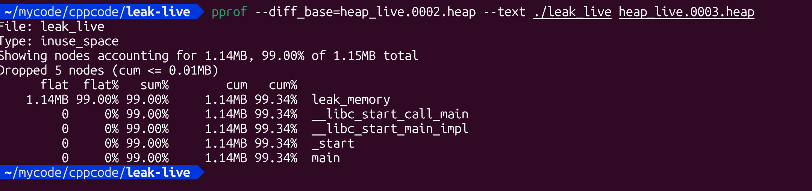

# Live profiling (while app is running) using pprof --base comparison.


Perfect — let’s now extend the demo to show **live profiling of a running C++ process** using **gperftools + pprof** with the `--base` comparison option.

This approach helps you **see what allocations increased between two points in time**, which is ideal for catching *gradual leaks* in long-running applications.

---

## 🧩 1. Setup Recap

You’ll need:

```bash
sudo apt-get install google-perftools libgoogle-perftools-dev
```

and the same code base from before.

---

## 💻 2. Example code with continuous allocation

Here’s an updated version of `leak_live.cpp` that runs indefinitely so we can inspect it while it runs:

```cpp
// leak_live.cpp
#include <iostream>
#include <vector>
#include <thread>
#include <chrono>
#include <gperftools/heap-profiler.h>
#include <unistd.h>


std::vector<int*> global_leaks;

void leak_memory() {
    int* p = new int[1000]; // never freed -> leak
    global_leaks.push_back(p);
}

int main() {
    std::cout << "Starting leak demo (PID: " << getpid() << ")" << std::endl;
    
    // Start heap profiler
    HeapProfilerStart("heap_live");

    // Loop forever to simulate long-running process
    for (int i = 0; ; ++i) {
        leak_memory();
        std::this_thread::sleep_for(std::chrono::milliseconds(200));
        if (i % 50 == 0)
            std::cout << "Allocated " << global_leaks.size() << " blocks\n";
    }

    HeapProfilerStop();
    return 0;
}
```

Compile:

```bash
g++ leak_live.cpp -pthread -o leak_live -lprofiler -ltcmalloc 

# or 

g++ -g leak_live.cpp -o leak_live -ltcmalloc_and_profiler

```

`Must also link tcmalloc to get richer allocation symbols`

---

## 🚀 3. Run with Heap Profiler

```bash
# NOT working: HEAPPROFILE=./heap_live ./leak_live

# Eventually the working command to auto-trigger heap dump (with interval 60 seconds)
HEAP_PROFILE_TIME_INTERVAL=60 ./leak_live

```

It will print its **PID**. Keep it running.

---

## 🔍 4. Take live heap snapshots

**NOT WORKING:**
You can trigger heap dumps **while it’s running** using the environment variable directory path (the profiler automatically writes snapshots periodically), or you can **manually request dumps** via signals.

In most gperftools builds, sending `SIGUSR1` to the process triggers a heap dump:

```bash
# NOT WORKING: kill -USR1 <pid> # notworking
# USE HEAP_PROFILE_TIME_INTERVAL
```


This will produce files like:

```
heap_live.0001.heap
heap_live.0002.heap
heap_live.0003.heap
```

Each corresponds to the heap at different moments.

`View single profile`


### Note: `pprof --diff_base error: profiles have empty common sample type list`
- Only diff profiles with the same sample types.
- Can't compare `Type: inuse_space`(heap_live.0001.heap) and `Type: space` (heap_live.0003.heap)


---

## 🧮 5. Compare snapshots with `pprof --base`

Now, let’s compare *what changed* between two snapshots.

Example:

```bash
pprof --base=heap_live.0002.heap --text ./leak_live heap_live.0003.heap
```

Output example:

```
Using local file ./leak_live.
Using local file heap_live.0001.heap.
Using local file heap_live.0003.heap.
Total: 200.0 kB
     200.0 100.0% 100.0%     200.0 100.0% memory_leak_function
```

Interpretation:

* Shows allocations **added between snapshot 0001 and 0003**.
* Useful for identifying *growing leaks over time*.




`The output show that leak_memory() consume top memory`

---


## 🧾 6. Example workflow summary

| Step           | Action                | Command                                                                   |
| -------------- | --------------------- | ------------------------------------------------------------------------- |
| Start app      | Launch with profiling | `HEAPPROFILE=./heap_live ./leak_live`                                     |
| Snapshot 1     | Send signal           | `kill -USR1 <pid>`                                                        |
| Wait some time | More leaks accumulate | —                                                                         |
| Snapshot 2     | Send another signal   | `kill -USR1 <pid>`                                                        |
| Compare        | Show growth           | `pprof --base=heap_live.0001.heap --text ./leak_live heap_live.0002.heap` |

---

## 🧰 Optional: Automate snapshotting

You can automate taking heap snapshots periodically:

```bash
while true; do
  kill -USR1 $(pidof leak_live)
  sleep 30
done
```

Then use pprof to compare any pair of heap dumps to visualize leak trends.

---

## ✅ Summary

| Tool                             | Purpose                                 |
| -------------------------------- | --------------------------------------- |
| `HeapProfilerStart` / `Stop`     | Start and stop heap profiling           |
| `kill -USR1 <pid>`               | Trigger live heap dump                  |
| `pprof --base=a --text ./prog b` | Compare memory growth between snapshots |
| `pprof --web ./prog file.heap`   | Visualize allocations                   |

---
