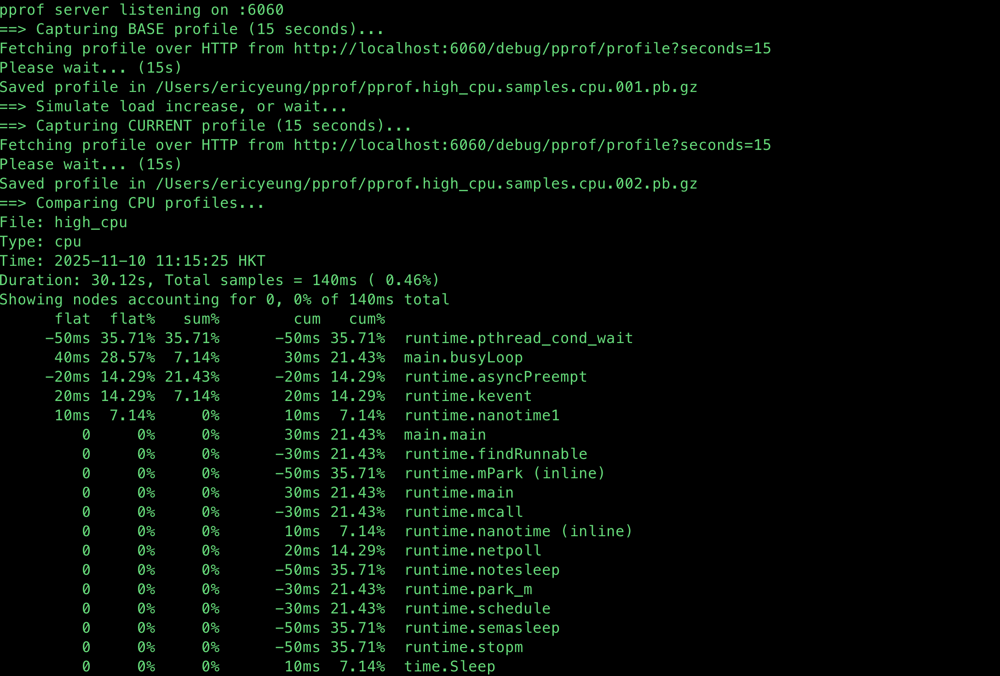

# Golang troubleshoot CPU high load by pprof with example code


Here’s a **complete example** showing how to use Go’s built-in **`net/http/pprof`** to troubleshoot a **CPU high load** issue in a running Go program — including sample code, how to capture a CPU profile, and how to analyze it with `pprof`.

---

## 🧩 Example: Go CPU Profiling with `net/http/pprof`

### 1. Example Code — simulate high CPU usage

```go
// main.go
package main

import (
	"fmt"
	"math"
	"net/http"
	_ "net/http/pprof"
	"time"
)

func busyLoop() {
	for {
		// simulate CPU-heavy computation
		for i := 0; i < 10_000_000; i++ {
			math.Sqrt(float64(i))
		}
		time.Sleep(100 * time.Millisecond)
	}
}

func main() {
	// Start pprof HTTP server on port 6060
	go func() {
		fmt.Println("pprof server listening on :6060")
		http.ListenAndServe("0.0.0.0:6060", nil)
	}()

	// Simulate CPU load
	busyLoop()
}
```

---

### 2. Run the app

```bash
go run main.go
```

You should see:

```
pprof server listening on :6060
```

The `pprof` endpoints are now available at:

* [http://localhost:6060/debug/pprof/](http://localhost:6060/debug/pprof/)
* CPU profile: [http://localhost:6060/debug/pprof/profile](http://localhost:6060/debug/pprof/profile)

---

### 3. Capture a CPU profile (30s sample)

Run this from another terminal:

```bash
go tool pprof http://localhost:6060/debug/pprof/profile?seconds=30
```

This will collect 30 seconds of CPU samples.

Once done, you’ll be dropped into the interactive pprof shell:

```
(pprof)
```

Type `top10` to see which functions consumed the most CPU:

```
(pprof) top10
Showing nodes accounting for 95.67%, 28.65s of 29.95s total
Dropped 12 nodes (cum <= 0.15s)
      flat  flat%   sum%        cum   cum%
    28.65s 95.67% 95.67%     28.65s 95.67%  main.busyLoop
```

---

### 4. Generate a visual flame graph (optional)

```bash
go tool pprof -http=:8080 http://localhost:6060/debug/pprof/profile?seconds=30
```

Then open [http://localhost:8080](http://localhost:8080) in your browser for an interactive flame graph.

---

### 5. Collect CPU profile from file (non-interactive mode)

If you already have a profile file:

```bash
go tool pprof -top ./yourbinary cpu.pprof
```

Or directly from a running service (show only top result):

```bash
go tool pprof -top http://localhost:6060/debug/pprof/profile?seconds=10
```

---

### 6. Optional: Compare CPU profiles (baseline vs current)

You can compare two profiles:

```bash
go tool pprof --base base.pprof current.pprof
```

Then run `top` to see differences in CPU usage per function.

---

### ✅ Summary

| Step | Command                             | Purpose                |
| ---- | ----------------------------------- | ---------------------- |
| 1    | `import _ "net/http/pprof"`         | Enable profiling       |
| 2    | `http.ListenAndServe(":6060", nil)` | Expose pprof endpoints |
| 3    | `go tool pprof http://.../profile`  | Capture CPU profile    |
| 4    | `top`, `web`, `list`                | Inspect CPU hotspots   |
| 5    | `--base`                            | Compare profiles       |

---

Would you like me to show an example of **automating CPU profiling and diff comparison** (e.g., collect two profiles and show top differences automatically)?


# Yes, show automating CPU profiling and diff comparison.

Perfect 👍 — here’s a **practical automation example** that collects CPU profiles from a running Go service twice (e.g. baseline vs. current high-load), then uses `go tool pprof` to show a CPU usage diff **automatically in non-interactive mode**.

---

## 🧩 Goal

We’ll automate these manual steps:

1. Capture baseline profile (normal load)
2. Capture current profile (high load)
3. Compare them with `pprof --base`
4. Print top differences directly to the terminal

---

## 🐚 Bash Automation Script Example

Save as `pprof_diff.sh`:

```bash
#!/usr/bin/env bash
set -e

PPROF_URL=${1:-http://localhost:6060/debug/pprof/profile}
DURATION=${2:-15}   # seconds for each capture

echo "==> Capturing BASE profile ($DURATION seconds)..."
go tool pprof -proto -seconds=$DURATION $PPROF_URL > base.pb.gz

echo "==> Simulate load increase, or wait..."
sleep 5

echo "==> Capturing CURRENT profile ($DURATION seconds)..."
go tool pprof -proto -seconds=$DURATION $PPROF_URL > current.pb.gz

echo "==> Comparing CPU profiles..."
go tool pprof --base base.pb.gz -top current.pb.gz
```

---

### 🧠 How to Use

1. Run your Go app with pprof enabled (from previous example).
2. Run this script:

```bash
chmod +x pprof_diff.sh
./pprof_diff.sh http://localhost:6060/debug/pprof/profile 15
```

---

### 📊 Example Output

```
==> Capturing BASE profile (15 seconds)...
==> Simulate load increase, or wait...
==> Capturing CURRENT profile (15 seconds)...
==> Comparing CPU profiles...
Type: cpu
Time: Nov 10, 2025 at 10:12am (+08)
Duration: 15s, Total samples = 29.95s
Showing nodes accounting for 90.12%, 27.03s of 29.95s total
Dropped 12 nodes (cum <= 0.15s)
      flat  flat%   sum%        cum   cum%
    +26.95s 90.12% 90.12%     26.95s 90.12%  main.busyLoop
```

This shows functions where **CPU usage increased** since the baseline — `+26.95s` means a large rise in CPU time.

---

## ⚙️ Optional: Run automatically during load test

You can integrate it with a test runner or cron job, e.g.:

```bash
#!/usr/bin/env bash
go run main.go &
PID=$!

sleep 3
./pprof_diff.sh &
LOAD_PID=$!
wait $LOAD_PID
kill $PID
```

---

## 🧰 Notes

* You can replace `http://localhost:6060/debug/pprof/profile` with any remote address if profiling a deployed service.
* To capture memory diff instead, change URL to `/debug/pprof/heap`.
* The script outputs directly to terminal, no interactive prompt.

---

`output`

**spot the busyLoop()**


