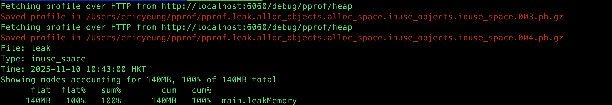

# Golang troubleshoot memory leak by pprof diff base example


Here’s a **step-by-step example** showing how to **troubleshoot a Go memory leak** using **pprof with a diff base (`--base`) comparison** — ideal for identifying *what changed* between two memory snapshots while your app is running.

---

## 🧠 Goal

We'll:

1. Run a Go app with a memory leak.
2. Collect two heap profiles at different times.
3. Compare them with `pprof --base` to see what leaked.

---

## 1️⃣ Example: Leaky Go program

```go
// leak.go
package main

import (
	"fmt"
	"net/http"
	_ "net/http/pprof"
	"time"
)

var leakySlice [][]byte

func leakMemory() {
	for {
		b := make([]byte, 10*1024*1024) // 10 MB
		leakySlice = append(leakySlice, b)
		time.Sleep(time.Second)
	}
}

func main() {
	go leakMemory()
	fmt.Println("Server started at :6060")
	http.ListenAndServe(":6060", nil) // exposes /debug/pprof
}
```

Run it:

```bash
go run leak.go
```

Now the service runs at:
👉 `http://localhost:6060/debug/pprof/`

---

## 2️⃣ Capture heap profiles

Let’s collect two snapshots while it’s running.

```bash
# Snapshot 1 (baseline)
go tool pprof -proto http://localhost:6060/debug/pprof/heap > base.pb.gz

# Wait 20–30s (allow leak to grow)
sleep 30

# Snapshot 2 (after leak)
go tool pprof -proto http://localhost:6060/debug/pprof/heap > current.pb.gz
```

---

## 3️⃣ Compare using `--base`

Now, diff the heap growth between the two snapshots:

```bash
go tool pprof --base base.pb.gz current.pb.gz
```

Then at the `(pprof)` prompt, type:

```
(pprof) top
```

You’ll see something like:

```
Showing nodes accounting for 60MB, 100% of 60MB total
      flat  flat%   sum%        cum   cum%
      60MB 100.00% 100.00%      60MB 100.00%  main.leakMemory
```

This means between the base and current heap captures, **`main.leakMemory`** allocated 60 MB more memory — the likely leak source.

---

## 4️⃣ Visualize the leak

You can open a graph view:

```bash
go tool pprof --base base.pb.gz -http=:8081 current.pb.gz
```

Then open your browser at
👉 [http://localhost:8081](http://localhost:8081)
and look at the diff flame graph.

---

## ✅ Summary

| Step | Command                                         | Description           |
| ---- | ----------------------------------------------- | --------------------- |
| 1    | `go run leak.go`                                | Start leaky service   |
| 2    | `go tool pprof -proto ... > base.pb.gz`         | Take baseline         |
| 3    | `sleep 30` + another capture                    | Let leak grow         |
| 4    | `go tool pprof --base base.pb.gz current.pb.gz` | Compare snapshots     |
| 5    | `(pprof) top` / `-http=:8081`                   | See which code leaked |

---

# Output go tool pprof in non-interactive mode

Yes ✅ — you can run `go tool pprof` in **non-interactive mode** and directly print the `top` output (or any other command) to the terminal, without entering the pprof shell.

Use the `-top` flag or `-command` flag pattern.

---

### ✅ Simplest form

```bash
go tool pprof --base base.pb.gz -top current.pb.gz
```

This runs the equivalent of entering `top` at the pprof prompt and exits immediately.

---

### 📄 Example output

```
Showing nodes accounting for 60MB, 100% of 60MB total
      flat  flat%   sum%        cum   cum%
      60MB 100.00% 100.00%      60MB 100.00%  main.leakMemory
```

---

### 💡 Variations

#### Show more entries (default 10)

```bash
go tool pprof --base base.pb.gz -top=20 current.pb.gz
```

#### Focus on a specific function

```bash
go tool pprof --base base.pb.gz -top -focus=main.leakMemory current.pb.gz
```

#### Output to file

```bash
go tool pprof --base base.pb.gz -top current.pb.gz > diff.txt
```

---

### 🧩 Bonus: other non-interactive commands

You can replace `-top` with:

* `-list=<func>` → show source line allocations
* `-svg` / `-pdf` → generate graphs
* `-tags` / `-traces` → show metadata
* `-web` → auto-open browser with visualization

Example:

```bash
go tool pprof --base base.pb.gz -svg current.pb.gz > diff.svg
```

---

So yes —
✅ `go tool pprof --base base.pb.gz -top current.pb.gz`
is the clean, non-interactive way to print memory leak differences and exit.


# Final heapdump-diff.sh

```bash
#!/bin/bash

# Snapshot 1 (baseline)
go tool pprof -proto http://localhost:6060/debug/pprof/heap > base.pb.gz

# Wait 20–30s (allow leak to grow)
sleep 30

# Snapshot 2 (after leak)
go tool pprof -proto http://localhost:6060/debug/pprof/heap > current.pb.gz

sleep 2

go tool pprof --base base.pb.gz -top current.pb.gz

```

`output`

