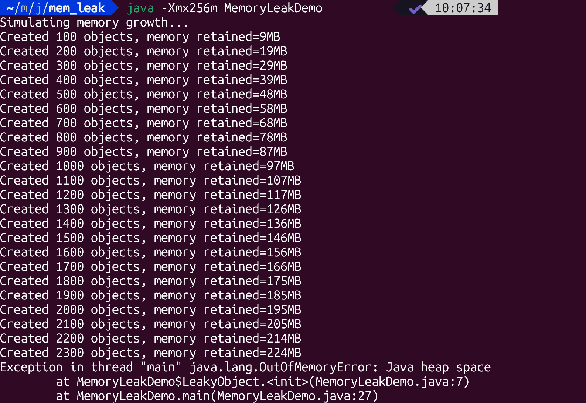

# Java example to troubleshoot memory growth/leak.

Here’s a **step-by-step Java example** that shows how to **simulate and troubleshoot memory growth (potential leak)** — including how to diagnose it using standard tools like **`jmap`, `jstat`, VisualVM, or MAT (Memory Analyzer Tool)**.

---

## 🧩 Step 1. Create a Demo App with Memory Growth

### `MemoryLeakDemo.java`

```java
import java.util.ArrayList;
import java.util.List;

public class MemoryLeakDemo {

    static class LeakyObject {
        private final byte[] memory = new byte[1024 * 100]; // 100 KB
        private final String name;

        public LeakyObject(String name) {
            this.name = name;
        }

        @Override
        public String toString() {
            return name;
        }
    }

    private static final List<LeakyObject> leakyList = new ArrayList<>();

    public static void main(String[] args) throws InterruptedException {
        System.out.println("Simulating memory growth...");

        int count = 0;
        while (true) {
            leakyList.add(new LeakyObject("obj-" + count++));
            if (count % 100 == 0) {
                System.out.printf("Created %d objects, memory retained=%dMB%n",
                        count, (count * 100) / 1024);
            }
            Thread.sleep(100); // Slow growth to observe via tools
        }
    }
}
```

### Compile & Run

```bash
javac MemoryLeakDemo.java
java -Xmx256m MemoryLeakDemo
```

This will **gradually consume heap memory** and eventually trigger a `java.lang.OutOfMemoryError`.





---

## 🧰 Step 2. Observe Memory Usage (Live)

### Option A: Using `jstat`

Monitor heap every second:

```bash
jstat -gcutil <PID> 1000
```

Output example:

```
S0     S1     E      O      M     CCS   YGC   YGCT   FGC   FGCT    GCT
0.00   90.00  99.00  70.00  92.00 85.00  15   0.123   2     0.456   0.579
```

`NOTE`: Look for **“O” (Old generation)** steadily increasing → possible leak.

see [Mem leak monitoring - jstat](Mem_leak_monitoring_jstat.md)

---

## 📊 Step 3. Take a Heap Dump

```bash
jmap -dump:live,format=b,file=heapdump.hprof <PID>
```

Or on OutOfMemoryError, configure JVM to dump automatically:

```bash
java -Xmx256m -XX:+HeapDumpOnOutOfMemoryError -XX:HeapDumpPath=heapdump.hprof MemoryLeakDemo
```

---

## 🧠 Step 4. Analyze Heap Dump

Use **Eclipse MAT (Memory Analyzer Tool)**:

1. Open `heapdump.hprof`
2. Click **“Leak Suspects Report”**
3. You’ll see:

   * Large retained heap by `ArrayList` → static reference `leakyList`
   * Path to GC root shows it’s **never released**

This confirms the leak source.


---

## 🧩 Step 5. Fix the Leak

Replace the static list with a **weak reference or temporary scope**:

```java
while (true) {
    List<LeakyObject> tempList = new ArrayList<>();
    for (int i = 0; i < 100; i++) {
        tempList.add(new LeakyObject("obj-" + i));
    }
    Thread.sleep(100);
}
```

Now, objects can be garbage-collected between iterations.

---

## 🧩 Bonus: Automating Leak Detection

You can use profilers such as:

* **VisualVM** (`jvisualvm`) → Live heap, GC, thread view
* **YourKit**, **JProfiler**, or **Eclipse MAT** for deep analysis
* **Java Flight Recorder (JFR)** + **Mission Control** (built into JDK 11+)

```bash
java -XX:StartFlightRecording=duration=60s,filename=recording.jfr MemoryLeakDemo
```

Then open the `.jfr` file in **JDK Mission Control** to inspect memory allocations and GC pressure.

---

Would you like me to show a **“real-world leak” example**, e.g. with `ThreadLocal`, `Map` cache, or event listeners (which are common causes)?


