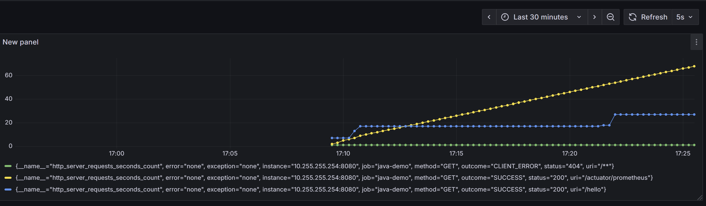
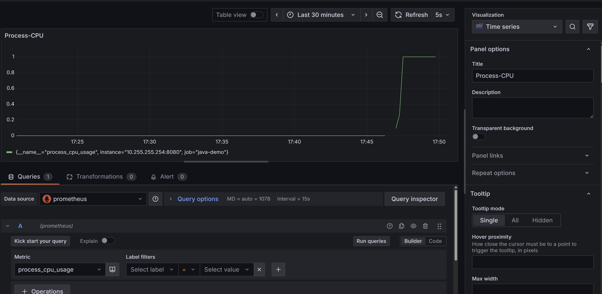
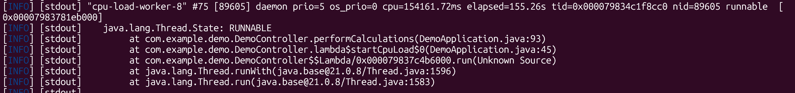

# Java spring-boot + Promethus + Grafana basic setup

Sure! Let's go step by step and put together a **Java service monitored by Prometheus and visualized in Grafana**. I'll give you a minimal working example.

---

## 1️⃣ Java Service with Prometheus Metrics

We'll use **Spring Boot** and **Micrometer**, which integrates with Prometheus easily.

**`pom.xml` dependencies:**

```xml

<project xmlns="http://maven.apache.org/POM/4.0.0"
  xmlns:xsi="http://www.w3.org/2001/XMLSchema-instance"
  xsi:schemaLocation="http://maven.apache.org/POM/4.0.0 http://maven.apache.org/maven-v4_0_0.xsd">
  <modelVersion>4.0.0</modelVersion>
  <groupId>com.example.demo</groupId>
  <artifactId>DemoApplication</artifactId>
  <packaging>jar</packaging>
  <version>1.0-SNAPSHOT</version>
  <name>DemoApplication</name>
  <url>http://maven.apache.org</url>


  <properties>
    <java.version>21</java.version>
    <maven.compiler.source>21</maven.compiler.source>
    <maven.compiler.target>21</maven.compiler.target>
  </properties>


  <!-- Add Spring Boot parent -->
  <parent>
    <groupId>org.springframework.boot</groupId>
    <artifactId>spring-boot-starter-parent</artifactId>
    <version>3.2.0</version>
    <relativePath />
  </parent>


  <dependencies>

    <dependency>
      <groupId>junit</groupId>
      <artifactId>junit</artifactId>
      <version>3.8.1</version>
      <scope>test</scope>

    </dependency>

    <dependency>
      <groupId>org.springframework.boot</groupId>
      <artifactId>spring-boot-starter-web</artifactId>
    </dependency>

    <dependency>
      <groupId>io.micrometer</groupId>
      <artifactId>micrometer-registry-prometheus</artifactId>
    </dependency>


    <!--  key dependencies for actuator/prometheus -->
    <dependency>
      <groupId>org.springframework.boot</groupId>
      <artifactId>spring-boot-starter-actuator</artifactId>
    </dependency>

    <dependency>
      <groupId>io.micrometer</groupId>
      <artifactId>micrometer-registry-prometheus</artifactId>
    </dependency>

  </dependencies>
</project>

```

**`DemoApplication.java`:**

```java
package com.example.demo;

import io.micrometer.core.annotation.Timed;
import org.springframework.boot.SpringApplication;
import org.springframework.boot.autoconfigure.SpringBootApplication;
import org.springframework.web.bind.annotation.GetMapping;
import org.springframework.web.bind.annotation.RestController;

@SpringBootApplication
public class DemoApplication {
    public static void main(String[] args) {
        SpringApplication.run(DemoApplication.class, args);
    }
}

@RestController
class DemoController {

    @Timed(value = "hello.requests", description = "Time spent serving hello")
    @GetMapping("/hello")
    public String hello() {
        return "Hello, world!";
    }
}
```

**Prometheus endpoint configuration (Spring Boot default):**

Make sure `application.properties` contains:

```properties
# Spring Boot automatically exposes metrics at:
# http://localhost:8080/actuator/prometheus


management.endpoints.web.exposure.include=prometheus

```


Spring Boot automatically exposes metrics at:

```
curl http://localhost:8080/actuator/prometheus

Check metrics like 

“http_server_requests_seconds_count”

```


---

## 2️⃣ Prometheus Configuration

### About the host

Network structure: Java app running on host, prometheus and grafana are running on host "monitoring"`

* host addr returned by `ip a`, also 
* `wget -O- http://10.255.255.254:8080/actuator/prometheus` returns correct metrics
* final host: `['10.255.255.254:8080']`


**`prometheus.yml`:**

```yaml
global:
  scrape_interval: 15s

scrape_configs:
  - job_name: 'java-demo'
    metrics_path: '/actuator/prometheus'
    static_configs:
      - targets:['10.255.255.254:8080']  # host addr returned by "ip a", also wget -O- http://10.255.255.254:8080/actuator/prometheus returns correct metrics

```

Run Prometheus:

We need to keep prometheus and grafana on same network

`-- name prometheus` is crucial for grafana to connect to prometheus

```bash
# add docker network if not exists: docker network create monitoring
# -- name prometheus is crucial for grafana to connect to prometheus
docker run -d --network monitoring --name prometheus -p 9090:9090 -v $(pwd)/prometheus.yml:/etc/prometheus/prometheus.yml prom/prometheus
```

* Check metrics via cmd: `docker exec -it prometheus /bin/sh` and then run `wget -O- http://10.255.255.254:8080/actuator/prometheus`
* Check Prometheus web UI at `http://localhost:9090`.

---

## 3️⃣ Grafana Setup

Run Grafana:

```bash
# add docker network if not exists: docker network create monitoring
docker run -d --name grafana --network monitoring -p 3000:3000 grafana/grafana

```

1. Open `http://localhost:3000` (default login: `admin/admin`).
2. Add Prometheus as a data source (`http://prometheus:9090`). # `Important: USE container name 'prometheus' as server name`
3. Create a dashboard and add a panel:

   * **Metric example:** `hello_requests_seconds_count`
   * **Graph type:** Line graph showing request counts or latencies.

---

## 4️⃣ Testing

1. Start the Java app: `mvn spring-boot:run`
2. Hit the endpoint a few times:

```bash
curl http://localhost:8080/hello
```

3. In Prometheus, check if metrics appear:

```
http://localhost:9090/graph
```

4. In Grafana, visualize metrics in a dashboard.




---

✅ You now have a **full stack**: Java → Micrometer → Prometheus → Grafana.

---


## Extra metrics

Micrometer automatically provides:

**JVM Metrics:**

* `jvm_memory_used_bytes`
* `jvm_memory_max_bytes`
* `jvm_threads_live`
* `jvm_threads_daemon`
* `jvm_gc_pause_seconds`

**System Metrics:**

* `process_cpu_usage`
* `process_cpu_seconds_total`
* `system_cpu_usage`
* `system_memory_total_bytes`
* `system_memory_free_bytes`

No extra code is needed—just exposing `/actuator/prometheus` will include all these metrics.


## Test CPU-load monitoring

* add cpu-load logic

* observe CPU high load via grafana



* and thread dump

