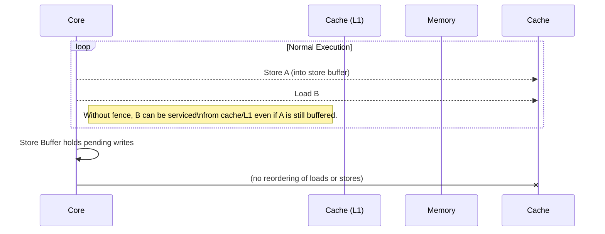

# Relationships between Java volatile and x86 instructions (LFENCE, SFENCE, MFENCE)


`volatile` in **Java** is a **memory visibility + ordering guarantee**.
On **x86**, memory ordering is enforced with **memory fence instructions** like:

* `LFENCE` — Load fence
* `SFENCE` — Store fence
* `MFENCE` — Full memory fence

But the mapping between **Java `volatile`** and **x86 fences** is **not 1:1**, because **x86 already has a strong memory model**.

To understand the relationship, we need three layers:

1️⃣ Java Memory Model (JMM)
2️⃣ x86 Memory Model (TSO)
3️⃣ How the JIT compiler maps one to the other

---

# 1. Java `volatile` semantics (JMM)

The **Java Memory Model** defines:

### Volatile write

Acts as a **release barrier**

Guarantees:

```
normal writes before volatile write
    must become visible
before
volatile write
```

### Volatile read

Acts as an **acquire barrier**

Guarantees:

```
volatile read
    happens before
normal reads after it
```

### Combined rule

```
Thread A                 Thread B

x = 1                    if (flag == 1)
flag = 1 (volatile)          print(x)

```

The JMM guarantees **B prints 1**.

This is the classic **release/acquire synchronization**.

---

# 2. x86 memory model

**Total Store Order** is already strong.

x86 **only allows one type of reordering**:

```
Store → Load
```

Example:

```
store x
load y
```

may execute as

```
load y
store x
```

Everything else is already ordered.

Allowed reorderings on x86:

| Reordering    | Allowed       |
| ------------- | ------------- |
| Load → Load   | ❌ not allowed |
| Load → Store  | ❌ not allowed |
| Store → Store | ❌ not allowed |
| Store → Load  | ✅ allowed     |

This is much stronger than ARM.

---

# 3. x86 fence instructions

| Instruction | Meaning      |
| ----------- | ------------ |
| `LFENCE`    | order loads  |
| `SFENCE`    | order stores |
| `MFENCE`    | full barrier |

Conceptually:

```
LFENCE   : LoadLoad + LoadStore
SFENCE   : StoreStore
MFENCE   : LoadLoad + LoadStore + StoreLoad + StoreStore
```

---

# 4. How JVM implements volatile on x86

HotSpot JIT (in **OpenJDK**) maps volatile operations like this:

| Java operation      | x86 implementation             |
| ------------------- | ------------------------------ |
| volatile read       | normal `mov` load              |
| volatile write      | normal `mov` store             |
| store→load ordering | `MFENCE` or `LOCK` instruction |

Because **x86 already guarantees**:

```
LoadLoad
LoadStore
StoreStore
```

the **only missing barrier is StoreLoad**.

So the JVM inserts a **StoreLoad barrier** after volatile writes.

---

# 5. Real code generated

Example Java:

```java
volatile int flag;
int x;

x = 1;
flag = 1;
```

JIT assembly typically becomes:

```
mov [x],1
mov [flag],1
lock addl $0,(%rsp)   ; memory barrier
```

or

```
mov [x],1
mov [flag],1
mfence
```

`lock` instructions act as **full memory fences**.

---

# 6. Why JVM prefers LOCK instead of MFENCE

`MFENCE` is **very expensive** on older CPUs.

Instead JVM often emits:

```
lock addl $0,(%rsp)
```

Which:

* touches stack
* performs atomic op
* acts as full fence

---

# 7. Summary mapping

| Java concept                   | x86 implementation |
| ------------------------------ | ------------------ |
| volatile read                  | normal load        |
| volatile write                 | normal store       |
| volatile write → read ordering | `MFENCE` or `LOCK` |
| LoadLoad barrier               | already guaranteed |
| StoreStore barrier             | already guaranteed |
| StoreLoad barrier              | must insert fence  |

So:

```
Java volatile ≈ acquire + release
```

but on x86:

```
volatile read  ≈ mov
volatile write ≈ mov + fence
```

---

# 8. Key insight (important for low latency engineers)

On **Intel** / x86 CPUs:

```
volatile read is basically free
volatile write is expensive
```

because of the **StoreLoad barrier**.

That’s why lock-free queues often minimize volatile writes.

---

# 9. Real world example

The **LMAX Disruptor** uses:

```
volatile sequence numbers
```

because:

```
producer: volatile write
consumer: volatile read
```

which maps very efficiently to x86.

---

✅ **One-sentence summary**

```
Java volatile = acquire + release semantics
x86 already guarantees most ordering,
so JVM only needs a StoreLoad fence
(MFENCE or LOCK instruction).
```

---

If you're exploring **low-latency / HFT style Java**, the next topic that becomes extremely interesting is:

**How Java VarHandle maps to x86 instructions (Acquire / Release / Opaque modes)** — which exposes memory ordering almost **directly to hardware semantics**.


# Executive Summary (by deep research)

Java’s `volatile` keyword provides **release-acquire semantics**: a volatile write is a *release* (synchronizes-with subsequent volatile reads) and a volatile read is an *acquire*.  In the Java Memory Model (JMM), every volatile write “happens-before” every subsequent volatile read of that variable【3†L648-L649】.  On x86 (TSO), ordinary loads and stores are already strongly ordered (no Load→Load, Load→Store, or Store→Store reordering【22†L126-L134】).  The only weak ordering is Store→Load.  Thus, to implement the JMM, the JVM emits a **store-load fence** after each volatile store.  In practice, HotSpot uses either the `MFENCE` instruction or a locked operation (e.g. `lock addl $0,(%rsp)`) as this barrier【22†L133-L136】【39†L1341-L1344】. Volatile reads need no extra fence on x86 because TSO already disallows Load→Load reordering【39†L1301-L1307】. 

Intel’s fence instructions have these effects: **LFENCE** orders loads (no later loads/stores can pass earlier loads), **SFENCE** orders stores, and **MFENCE** orders both loads and stores【14†L228-L236】.  A locked instruction (e.g. `lock xchg` or `lock add`) acts like a full fence for write-back memory: it drains the store buffer and enforces Store→Load and Store→Store ordering【14†L228-L236】【39†L1291-L1299】.  Importantly, MFENCE (and LOCK) also flush special buffers (like write-combining buffers), so HotSpot prefers the lightweight `lock add` on the stack pointer to avoid those extra effects【23†L147-L154】.  

On modern Intel/AMD CPUs, a locked no-op provides the needed store-load barrier at lower latency than MFENCE (e.g. ~15–20 cycles vs ~30–40 cycles)【20†L181-L189】.  On AMD, MFENCE formally provides full serialization (even ordering loads), whereas LOCK-ops enforce stores-vis-then-load ordering (enough for volatile)【20†L171-L176】【20†L181-L189】.  In summary, Java volatile maps to “ordinary MOV + store-load fence”.  A typical volatile write on x86-64 looks like `mov [addr],val; lock addl $0,(%rsp)` (or `mfence`), and a volatile read is just `mov reg,[addr]`【39†L1221-L1224】【39†L1341-L1344】. The tables and code examples below detail these mappings and the associated orderings.

## Java Volatile Semantics (JMM)

- **Release/Acquire:** A *volatile write* acts as a *release* (it flushes all prior stores before the write) and a *volatile read* as an *acquire* (it prevents later loads from moving before the read).  In JMM terms: *“A write to a `volatile` field happens-before every subsequent read of that field.”*【3†L648-L649】【5†L85-L89】.  This enforces visibility: if thread A does `x=1; flag=true;` (with `flag` volatile) and thread B later reads `if (flag) print(x);`, then B is guaranteed to see `x==1`.  

- **Happens-Before:** The volatile write/read pair creates a *synchronizes-with* edge (release-acquire) and thus a *happens-before* edge【3†L648-L649】.  All memory operations in thread A before the volatile write become visible to thread B after it does the corresponding volatile read.  No other reordering of the volatile operation itself is allowed (it must appear in program order).  In effect, volatile writes also prevent reordering of adjacent normal stores (a StoreStore barrier), and volatile reads prevent reordering of adjacent normal loads (a LoadLoad barrier)【22†L126-L134】.  

- **Atomicity:** Volatile 32-bit accesses are atomic.  (On 64-bit JVMs, volatile `long/double` are also atomic.)  No partial reads/writes occur.  (Non-volatile `long/double` might be non-atomic【2†L63-L71】, but volatiles fix that.)  

- **No Data Races:** If all shared accesses are correctly ordered by happens-before, execution appears sequentially consistent【3†L671-L679】. Volatile enforces enough ordering to avoid data races for those accesses.  

**Table 1. JMM volatile operations and ordering guarantees**

| Java Action    | JMM Semantics                                | Effect (happens-before)       |
|---------------|----------------------------------------------|------------------------------|
| `volatile` **write** (`store-release`) | Release; synchronizes-with subsequent volatile read of same var【3†L648-L649】 | All previous loads/stores in this thread happen-before the write; the write happens-before any later volatile read of that variable. |
| `volatile` **read** (`load-acquire`)   | Acquire; pairs with preceding volatile write | The read happens-before any later loads/stores in this thread; it observes at least the effects visible to the prior volatile write. |
| Normal **write**   | No special sync (except program order)    | Only ordered with respect to the same thread (no cross-thread guarantee unless later synchronized). |
| Normal **read**    | No special sync (except program order)    | Same as above. |

## x86 TSO Model and Allowed Reorderings

- **TSO Guarantees:** x86-TSO (Total Store Order) ensures *Load→Load*, *Load→Store*, and *Store→Store* pairs cannot be reordered【22†L126-L134】.  In other words, older loads are seen before newer ones, and older stores become globally visible in program order.  The *only* allowed reordering on x86 is a *Store followed by a Load* (the Load may execute “ahead” of the Store)【22†L126-L134】.  

- **Implication for Volatile:** Because of TSO, most JMM reordering concerns are already impossible on x86.  In fact, as Shipilëv notes: *“Loads are not reordered with other loads (LoadLoad no-op), writes are not reordered with older reads (LoadStore no-op), and writes are not reordered with other writes (StoreStore no-op)”*【22†L126-L134】.  Thus the only JMM-mandated ordering that x86 does not provide by default is *Store→Load*.  

- **Store Buffer:** x86 CPUs use a **store buffer**: stores retire into a buffer and become visible to other CPUs only when drained.  (This lets the CPU continue executing without waiting for memory writes.)  A subsequent load in the same thread can sometimes read past an older store (not yet globally visible) only if it misses in the store buffer, leading to the Store→Load reordering effect.  Fences or locked instructions drain this buffer【13†L193-L202】【14†L214-L221】.

**Figure 1. Memory Order on x86 (TSO)**  

*Figure 1:* On x86 TSO, the only reordering is that a Load may pass a prior Store (due to the store buffer). Fences and LOCK drain this buffer, ensuring stores complete before subsequent loads.  

## LFENCE, SFENCE, MFENCE and LOCK Semantics

x86 provides special instructions to enforce ordering explicitly:

- **LFENCE (Load Fence):** Ensures that *no subsequent load or store* is executed before the LFENCE completes【14†L228-L236】.  It orders all earlier loads (and prior loads in the pipeline) before any later load/store.  In effect, it provides a LoadLoad and LoadStore barrier.  (LFENCE does *not* necessarily drain the store buffer【14†L228-L236】, so it is not a Store→Load fence.)  Mainly used for streaming loads or precise timing; not needed for volatile on normal memory.  

- **SFENCE (Store Fence):** Ensures that *no subsequent store* is executed before the SFENCE completes【14†L228-L236】.  It orders all earlier stores before later stores (StoreStore barrier) and drains the store buffer【14†L214-L221】.  (On Intel, SFENCE is only strictly needed if using weakly-ordered (“non-temporal”) stores; normal cached stores already follow program order for Store→Store.)  

- **MFENCE (Memory Fence):** A full fence. It orders *all* prior loads and stores before any subsequent load or store【14†L228-L236】.  It drains the store buffer (like SFENCE) and also prevents later loads from passing it.  In other words, MFENCE provides LoadLoad, LoadStore, StoreStore, and StoreLoad barriers【14†L228-L236】.  

- **LOCK prefix:** Any instruction with a LOCK prefix (e.g. `lock xchg`, `lock addl`) is treated as a full fence for write-back memory【14†L228-L236】【39†L1291-L1299】.  On modern x86, a LOCK-op forces all earlier stores to become visible (drains the store buffer) and prevents reordering of earlier memory ops with later ones.  The Intel manual states: *“Reads or writes cannot be reordered with I/O instructions, locked instructions, or serializing instructions.”*【22†L138-L146】.  Thus `lock addl $0,(%rsp)` after a store acts like an MFENCE for normal memory, but without affecting special buffers (MFENCE also serializes things like write-combining writes【14†L228-L236】【23†L147-L154】).

**Table 2. x86 Fence Instructions vs. Orderings**

| Instruction          | Orders (prevent)            | Notes                                                   |
|----------------------|-----------------------------|---------------------------------------------------------|
| **LFENCE**           | Older **loads** before newer loads/stores (LoadLoad, LoadStore)【14†L228-L236】 | *Does not* drain stores; mainly for serializing loads or timing. |
| **SFENCE**           | Older **stores** before newer stores (StoreStore)【14†L228-L236】; drains store buffer【14†L214-L221】 | Needed to order non-temporal stores; normal stores already follow StoreStore. |
| **MFENCE**           | Older loads/stores before newer loads/stores (all: LoadLoad, LoadStore, StoreStore, StoreLoad)【14†L228-L236】 | Full barrier, drains store buffer; affects all memory types.      |
| **LOCK (e.g. `lock addl`)** | Like MFENCE on write-back memory【22†L138-L146】【39†L1291-L1299】 | Atomic RMW or no-op operation with LOCK acts as full fence for WB memory (drains store buffer for preceding stores). Lock is slightly lighter than MFENCE as it doesn’t order loads before it beyond stores. |

In summary: on x86, LFENCE=acquire-fence, SFENCE=release-fence, MFENCE=full-fence. A LOCK-prefixed instruction provides full (store-load) fence semantics for normal memory.  

## HotSpot/JIT: Volatile → x86 Mapping

HotSpot’s JIT emits ordinary loads/stores for volatile access and adds an explicit fence **only after a volatile store** (to fix the Store→Load gap)【22†L133-L136】【39†L1301-L1307】.  The typical pattern is:

```java
volatile int v;
…
v = 42;   // volatile write
```

compiles on x86-64 to something like:

```
    movl    $42, [v]        ; normal store
    lock addl $0,(%rsp)     ; StoreLoad fence (volatility barrier)
```

On x86-32 it uses `%esp`:

```
    movl    $42, [v]        ; store value 42
    lock addl $0,(%esp)     ; fence (LOCK is treated as a prefix here)
```

These fences ensure that the store to `v` is globally visible before any subsequent loads (matching the Java volatile semantics).  Disassembly examples:

- **32-bit HotSpot** (JDK 8 server VM) for `someField = 5;`【39†L1221-L1224】:  
  ```
      movl  $5, [someField]
      lock addl $0,(%esp)   ; *volatile store barrier*
  ```
- **64-bit HotSpot** for `someField = 10L;`【39†L1341-L1344】:  
  ```
      ; (compute/store 10 into classVar)
      movabs $10, %rdi
      movq   %rdi, 0x20(%rsp)
      vmovsd 0x20(%rsp), %xmm0
      vmovsd %xmm0, 0x68(%rsi)   ; actual store to volatile field
      lock addl $0,(%rsp)        ; *volatile store barrier*
  ```

In both cases, the locked `addl` is a no-op arithmetic on the stack pointer, chosen as a safe, thread-local address.  The LOCK prefix enforces atomicity and ordering without altering program state. Shipilëv notes that using `lock addl $0,(%rsp)` avoids MFENCE’s heavier effects and benefits from the stack pointer likely being in cache【23†L147-L154】. However, this can introduce a tiny read-after-write dependency on `%rsp`; later HotSpot work even explored moving the locked address slightly away to reduce that dependency for tight loops【23†L147-L154】.

- **Volatile Read:** A volatile read compiles to a plain load (no fence). On x86, this is safe because the architecture already prevents Load→Load or Load→Store reorderings【39†L1301-L1307】. (The JMM requires a Read barrier only relative to the matching write, which is provided by the write’s fence.)  

**Table 3. Volatile Access → x86 Code Patterns**

| Java Operation     | JMM Effect       | x86 Code (HotSpot)                          | Fence Type   |
|--------------------|------------------|---------------------------------------------|--------------|
| `r = v;` (volatile read)  | Acquire; depends on prior volatile write | `mov r, [v]` (normal load)                   | *none* (ordering guaranteed by hardware) |
| `v = val;` (volatile write) | Release; establishes barrier to readers  | `mov [v], val` (normal store); **then** `MFENCE` or `lock addl $0,(%rsp)`【39†L1221-L1224】【39†L1341-L1344】 | Store→Load fence |

## Why Only Store→Load Needs Fencing on x86

On x86 the only JMM-required reordering not already prevented by hardware is the *Store→Load* case.  Consider a volatile write followed by an ordinary load in program order.  The JMM demands that the store completes before the load can see any value.  On x86, however, normal loads **can bypass** an earlier store that is still in the buffer, so a fence is needed to enforce visibility【22†L126-L134】.  All other reorders (Load→Load, Load→Store, Store→Store) are already forbidden by TSO【22†L126-L134】, so no extra fences are required for volatile reads, nor for ordering normal stores around a volatile store.  

In JSR-133 terms, compilers insert a *StoreStore* barrier before a volatile store (to prevent reordering earlier stores after it) and a *LoadStore* barrier after it (to prevent reordering later loads before it)【22†L126-L134】.  On x86, the StoreStore barrier is redundant (Store→Store already ordered), so only the StoreLoad barrier is emitted【22†L133-L136】.  This is why HotSpot does **not** put a fence *before* a volatile store – it only puts one *after*【22†L133-L136】.

The microarchitectural effect of the fence is to *drain the store buffer*. Intel’s documentation confirms that SFENCE, MFENCE, and serializing instructions cause the store buffer to empty【14†L214-L221】.  In particular, a locked instruction flushes all earlier stores to the cache before proceeding【14†L228-L236】【39†L1291-L1299】.  This ensures that any thread doing a volatile read (acquire) will see the completed store.  In summary: **only the Store→Load ordering gap needs fixing on x86**, so volatile writes carry a one-time barrier and reads are plain.

## Performance and Microarchitectural Implications

- **Fence Latency:**  MFENCE can be costly (tens of cycles).  Benchmarks and experts report MFENCE around ~30–40 cycles on modern Intel, whereas a locked no-op costs ~15–20 cycles【20†L181-L189】.  Therefore, using a LOCK prefix is faster and has become HotSpot’s default for StoreLoad fences.  

- **Pipeline Effects:** The fence (or LOCK) may serialize certain parts of the pipeline.  LFENCE/SFENCE/MFENCE each stall instructions of the fenced type; LOCK additionally uses the cache coherence mechanism (causing a pause for outstanding memory ops)【14†L228-L236】【39†L1291-L1299】.  However, ordinary ALU ops not dependent on the locked memory can continue.  (In fact, on Skylake+, LOCK without the bus lock bit acts like a cache-level lock, lightly stalling only the cache line involved【36†L448-L455】.)

- **Store Buffer:** As noted, fences/LOCK drain the store buffer.  Without a fence, a store might linger in the core’s buffer while a load after it is serviced from cache, effectively seeing stale data.  The LOCK (or MFENCE) forces the buffer to commit all pending stores to L1 cache, making them visible to other cores【13†L194-L202】【27†L1291-L1299】.

- **Write-Combining (WC) and Non-Temporal:** For special memory types (WC, etc.), MFENCE is recommended to flush write-combining buffers.  A LOCK-prefixed instruction *also* flushes WC buffers【32†L193-L202】.  In normal JVM use, memory is write-back, so either works.  

- **OrderViolations:** If the JVM omitted the fence after a volatile store, a *StoreLoad reordering* could occur, breaking JMM.  JCStress tests and reasoning confirm that on real hardware this reordering *can* be observed if no fence is used【23†L147-L154】【25†L1221-L1224】.  Conversely, adding an unnecessary fence before loads or after reads would only slow down code without adding guarantees on x86.  

## Intel vs AMD and Platform Notes

- **Intel vs AMD:** Both Intel and AMD CPUs honor x86/TSO ordering for normal memory.  In both, LOCK and MFENCE serialize stores (draining the buffer)【20†L171-L176】【20†L181-L189】.  The AMD manual explicitly states that `MFENCE` fully serializes loads and stores, whereas LOCK-ops serialize stores (sufficient for volatile)【20†L171-L176】.  On Intel, MFENCE and LOCK are effectively equally strong for write-back memory, although some Intel errata note subtle issues only with specialized instructions on weak memory types【20†L181-L189】.  In practice, JVMs rely on the common behavior: a LOCK addl after a volatile store correctly provides the needed ordering on both vendor CPUs.  

- **CPU Microarchitecture:** Across generations, no mainstream x86 CPU has reintroduced weaker ordering for normal reads/writes; TSO has been stable since the 486/Pentium era【22†L126-L134】.  The exact cost of fences can vary by microarchitecture (e.g. Skylake vs Zen), but the qualitative behavior does not: fences stall memory ordering, and locks flush buffers.  

- **OS/ABI Constraints:** In 64-bit, the stack pointer `%rsp` is 16-byte aligned by System V ABI.  Using `(%rsp)` is safe (always aligned to at least cache-line boundary or at worst cause a split-lock on older CPUs, but that only stalls that CPU, not others【36†L444-L452】). HotSpot’s choice of `%rsp` (stack top) is deliberate for per-thread isolation.  In 32-bit, `%esp` is used similarly. Other registers (like a global counter) could also be used with LOCK, but HotSpot favors the stack pointer for minimal cross-thread interference【23†L147-L154】.

## Tables & Code Examples

**Table 4. Mapping JMM Barriers to x86 Fences**

| JMM Barrier         | Ensures                            | x86 Instruction   | Prevents Reordering of   |
|---------------------|------------------------------------|-------------------|--------------------------|
| StoreStore (A→B)    | A’s stores before B’s stores       | *None* on x86 (hardware orders) | Store→Store |
| StoreLoad (A→B)     | A’s stores before B’s loads        | `MFENCE` or `lock` | Store→Load |
| LoadLoad (A→B)      | A’s loads before B’s loads         | *None* on x86 (hardware orders) | Load→Load |
| LoadStore (A→B)     | A’s loads before B’s stores        | *None* on x86 (hardware orders) | Load→Store |
| Volatile write (release)→ subsequent volatile read (acquire) | StoreLoad + StoreStore | `lock addl $0,(%rsp)` or `mfence` | as above |

**Example Java and Assembly:** (HotSpot on x86-64 server VM)

```java
class VolatileTest {
    static volatile int v;
    static volatile long L;
    static int x;

    public void writer(int newX) {
        x = newX;           // ordinary store
        v = 1;              // volatile store
    }
    public void reader() {
        if (v != 0) {
            // after reading volatile, x must see newX
            System.out.println(x);
        }
    }
}
```

Disassembled (approximate, with fences):

```
; writer():
movl    %esi, [x]           ; store x = newX (normal)
movl    $1,   [v]           ; volatile write v=1
lock addl $0,(%rsp)         ; <-- StoreLoad fence (volatile barrier)

; reader():
movl    [v], %eax          ; volatile read into %eax
testl   %eax, %eax
je      skip
movl    [x], %ecx          ; read x (ordinary)
; ...
```

Here the `lock addl` after storing `v` guarantees the store to `x` (and all others) becomes visible before any subsequent loads in this thread (such as another core’s load of `x` after seeing `v`).  No fence is emitted in `reader()` because the hardware already orders reads as needed.

**Memory-Ordering Diagram (Mermaid):**

```mermaid
sequenceDiagram
    participant T1 as Thread1
    participant T2 as Thread2
    Note over T1: // Thread1 executes
    T1->>Memory: x = 1 (normal store)
    T1->>Memory: v = 1 (volatile store, release)
    T1->>T1: fence after volatile store (StoreLoad)
    Note over T2: // Thread2 executes later
    T2->>Memory: r = v (volatile load, acquire)
    alt (r == 1)
        T2->>Memory: print(x)  ; must print 1
        Note right of T2: Happens-before ensures x’s store is visible
    end
```

*Figure 2:* The volatile write (`v=1`) on T1 releases any prior stores (to `x`), and the volatile read on T2 acquires them. The fence after `v=1` makes sure T2’s load of `x` cannot occur before `v` is globally visible.

**Instruction Ordering with Fences (Mermaid):**


*Figure 3:* A fence (`D`) separates instructions that may otherwise be reordered. A `lock` or `mfence` will drain the store buffer before the arrow to “After fence”. 

## Primary References

- Java Language Specification, Section 17.4 (Memory Model)【3†L648-L649】.  
- JSR-133 “Cookbook” (Pragmatics for Compiler Writers).  
- Intel® 64 and IA-32 Architectures Software Developer’s Manual, Vol. 3A, §8.2 (memory ordering)【22†L126-L134】【14†L228-L236】.  
- OpenJDK HotSpot source/JVM expert blogs: Shipilëv *“On The Fence With Dependencies”*【22†L126-L134】【23†L147-L154】; Oracle *Concurrency Tutorials*.  
- HotSpot assembly (hsdis) studies of volatile (e.g. StackOverflow answers【39†L1221-L1224】【39†L1341-L1344】).  
- AMD64 Architecture Programmer’s Manual, Vol.2, §7.4.2 (ordered stores)【20†L171-L176】.  
- Intel Community/StackOverflow discussions (fences vs locks)【14†L228-L236】【20†L181-L189】.  

