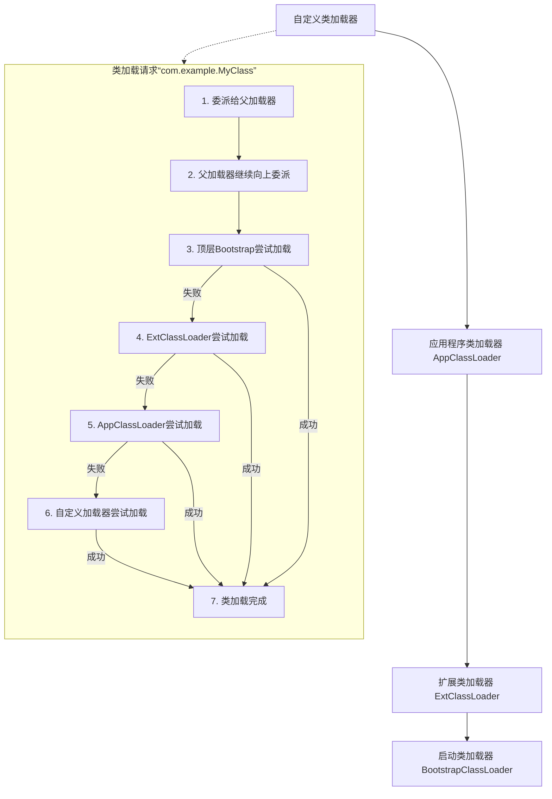

# 总结Java双亲委派机制

好的，我们来总结一下 Java 中的**双亲委派机制**。

这是一个关于 **JVM 如何加载类** 的核心机制。理解它对于掌握 Java 的类加载体系、安全性以及解决一些类冲突问题至关重要。

---

### 一、什么是双亲委派机制？

**双亲委派模型** 是 Java 类加载器在加载类时遵循的一种工作原则。它的核心思想可以概括为：

> **当一个类加载器收到了类加载的请求，它首先不会自己去尝试加载这个类，而是把这个请求委派给父类加载器去完成。每一层的类加载器都是如此，因此所有的加载请求最终都应该传送到最顶层的启动类加载器。只有当父类加载器反馈自己无法完成这个加载请求（它的搜索范围中没有找到所需的类）时，子加载器才会尝试自己去加载。**

简单来说，就是 **“先让爸爸找，爸爸找不到，儿子再自己找。”**

### 二、工作机制与流程

Java 中有三个核心的类加载器，它们形成了一个父子关系层级：

1.  **启动类加载器**：由 C++ 实现，是 JVM 的一部分。负责加载 `JAVA_HOME/lib` 目录下的核心类库（如 `rt.jar`）。
2.  **扩展类加载器**：负责加载 `JAVA_HOME/lib/ext` 目录下的类库。
3.  **应用程序类加载器**：也叫系统类加载器，负责加载用户类路径（ClassPath）上指定的类库。我们自己写的代码就是由它加载的。

**工作流程图：**



**流程详解：**

1.  **收到请求**：应用程序类加载器收到了加载 `com.example.MyClass` 的请求。
2.  **向上委派**：应用程序类加载器不会立即加载，而是将这个请求委派给它的父加载器——扩展类加载器。
3.  **继续向上委派**：扩展类加载器收到请求后，同样委派给它的父加载器——启动类加载器。
4.  **顶层尝试**：启动类加载器在自己的加载路径（`lib/rt.jar` 等）中查找并尝试加载 `com.example.MyClass`。显然，它找不到这个用户自定义的类，所以加载失败。
5.  **向下传递**：启动类加载器返回失败信息，扩展类加载器开始在自己的路径（`lib/ext`）中尝试加载。同样也找不到，失败。
6.  **子加载器接手**：扩展类加载器返回失败信息，应用程序类加载器开始在 ClassPath 路径下查找。成功找到了 `com.example.MyClass` 这个类，于是将其加载到 JVM 中。
7.  **加载完成**：类被成功加载。

如果应用程序类加载器也找不到，并且用户自定义了类加载器，那么请求会继续向下传递。如果最终所有加载器都找不到，则会抛出 `ClassNotFoundException`。

---

### 三、双亲委派机制的优势（为什么要这么设计？）

这种机制的设计带来了三个至关重要的好处：

1.  **避免类的重复加载**
    通过委派链，一个类只会被一个加载器加载。这确保了在 JVM 中，一个类由其全限定类名和加载它的类加载器共同构成唯一的标识。这可以防止核心类（如 `java.lang.Object`）被重复加载，从而造成混乱。

2.  **保护程序安全，防止核心API被篡改**
    这是最关键的安全特性。因为核心 Java 类（如 `java.lang.String`）总是由最顶层的启动类加载器加载，即使用户自己写了一个同名的 `java.lang.String` 类并放在 ClassPath 下，根据双亲委派原则，这个请求会最终委派到启动类加载器，而启动类加载器会加载核心库里的那个真正的 `String` 类。这样就**防止了恶意代码冒充核心类库的类**，保证了 Java 运行环境的安全。

3.  **保证类的唯一性和一致性**
    确保了 Java 核心库的类型安全。例如，你在代码中使用的 `java.lang.Object`，无论在哪个加载器的视角看，都是同一个类。如果不是这样，就会出现多个不同版本的 `Object` 类，导致类型转换等问题。

---

### 四、如何打破双亲委派机制？

虽然双亲委派模型是默认的，但它并不是一个强制性的约束。在某些场景下，我们需要“打破”它。

**打破方式：**
重写 `ClassLoader` 类的 `loadClass()` 方法。因为双亲委派的逻辑就封装在这个方法里。如果希望打破，可以重写这个方法，不再委派给父加载器，而是直接由自己或指定其他加载器来加载。

**需要打破的场景：**

1.  **历史原因：JDBC SPI**
    Java 核心库的接口（如 `java.sql.Driver`）由启动类加载器加载，但其具体实现（如 MySQL Connector/J 的驱动类）是由第三方提供的，位于 ClassPath 下，应由应用类加载器加载。这就产生了一个悖论：父加载器（启动类加载器）加载的接口，需要调用子加载器（应用类加载器）加载的实现类。为了解决这个问题，JDK 引入了**线程上下文类加载器**，它可以将父加载器的线程上下文设置为子加载器，从而“逆向”委托类加载动作，这是一种对双亲委派的破坏。

2.  **热部署、热替换**
    像 Tomcat 这样的 Web 服务器或 OSGi 这样的框架，需要支持应用在不重启的情况下重新加载类。如果严格遵循双亲委派，一个类被加载后，同一个加载器无法再次加载它。因此，它们会为每个 Web 应用或模块创建一个独立的类加载器。当需要重新加载时，丢弃旧的加载器实例，创建一个新的，并直接由这个新的加载器去加载新的类文件，绕过了双亲委派。

3.  **实现应用隔离**
    Tomcat 需要部署多个 Web 应用，这些应用可能依赖不同版本的同一个类库（例如 Spring 4 和 Spring 5）。为了不让它们冲突，Tomcat 会为每个 Web 应用创建一个单独的类加载器。在加载自己应用的类时，这些加载器会首先自己尝试加载，而不是先委派给父加载器（通常是共享的 Common ClassLoader），这同样打破了双亲委派。

---

### 总结

| 方面 | 核心要点 |
| :--- | :--- |
| **定义** | 类加载请求优先委派给父加载器，父加载器无法完成时子加载器才自己加载。 |
| **流程** | `自定义加载器 -> AppClassLoader -> ExtClassLoader -> BootstrapClassLoader`，然后逐级返回失败，再逐级向下尝试。 |
| **优点** | 1. **避免类重复**<br>2. **保证安全（防核心API篡改）**<br>3. **保证类唯一性** |
| **打破** | 重写 `loadClass()` 方法。常见于 **SPI（如JDBC）**、**热部署**、**OSGi/Tomcat应用隔离** 等场景。 |

双亲委派机制是 Java 体系稳定和安全的一块基石，理解它有助于你更深入地理解 JVM 的类加载过程和各种框架的设计原理。

# 感觉支持热加载，系统类指定只能系统加载就可以， 为什么要双亲委派机制

你提出了一个很好的问题！确实，如果**仅仅**为了支持热加载，似乎没有必要设计这么复杂的双亲委派机制。但双亲委派机制解决的远不止热加载这一个问题。

让我从几个层面来深入解释**为什么需要双亲委派机制**：

---

## 一、双亲委派的核心价值：解决**基础性问题**

### 1. **类型安全与一致性**（最重要）
```java
// 如果没有双亲委派，可能发生这种情况：
java.lang.String myString = new java.lang.String(); // JDK核心String
java.lang.String evilString = new EvilClassLoader().loadClass("java.lang.String"); 
// 这可能是被篡改的String类！

// 两个"String"实际上是完全不同的类，会导致：
// - 类型转换异常
// - 方法调用不一致  
// - 系统完全崩溃
```

**现实场景**：黑客可以写一个恶意的 `java.lang.String` 类，在其中植入病毒代码。如果没有双亲委派，这个恶意类可能被加载，替代真正的String类。

### 2. **避免类重复加载和内存浪费**
```java
// 如果没有双亲委派：
ClassLoader loader1 = new MyClassLoader();
ClassLoader loader2 = new MyClassLoader();

Class<?> classA1 = loader1.loadClass("com.example.A");
Class<?> classA2 = loader2.loadClass("com.example.A");

// classA1 != classA2，同一个类在内存中有多份副本
// 造成内存浪费，且 instanceof 等操作会失败
```

### 3. **保证核心库的行为一致性**
所有Java程序都依赖 `java.lang.*`, `java.util.*` 等核心类。如果每个类加载器都加载自己的版本，那么：
- `HashMap` 在不同地方行为可能不同
- `Integer` 的缓存机制可能不一致
- 整个Java生态系统会崩溃

---

## 二、热加载只是"特殊情况"

热加载、模块化隔离等需求确实是打破双亲委派的**合理场景**，但这些是**应用层面的特殊需求**，而不是**语言基础层面的普遍需求**。

### 设计哲学对比：

| 场景 | 需求特点 | 解决方案 |
|------|----------|----------|
| **基础运行环境** | 稳定、安全、一致 | **双亲委派**（默认机制） |
| **热部署/模块化** | 灵活、隔离、动态 | **打破双亲委派**（特殊机制） |

---

## 三、现实世界的类比

这就像**国家的法律体系**：

- **宪法和法律**（双亲委派）：
  - 为整个社会提供基础框架
  - 保证基本秩序和安全
  - **所有人都必须遵守**

- **特殊经济区政策**（打破双亲委派）：
  - 在特定区域允许特殊规则
  - 支持创新和特殊需求
  - **有严格的边界和条件**

你不能因为"特殊经济区需要灵活政策"就废除整个国家法律体系。

---

## 四、技术实现的角度

### 如果没有双亲委派，Java会变成这样：

```java
// 混乱的局面：
public class ClassLoadingChaos {
    public static void main(String[] args) {
        // 同一个类，不同加载器，不同行为
        Class<?> util1 = new Loader1().loadClass("com.example.Util");
        Class<?> util2 = new Loader2().loadClass("com.example.Util");
        
        // util1和util2不是同一个类！
        // 单例模式失效、静态变量多份、类型系统混乱...
    }
}
```

### 而有了双亲委派，热加载可以这样优雅实现：

```java
public class ElegantHotDeployment {
    // 为每个版本创建独立的类加载器
    private Map<String, ClassLoader> versionLoaders = new HashMap<>();
    
    public void hotDeploy(String version, String classPath) {
        // 创建不遵循双亲委派的加载器（仅对特定包）
        ClassLoader newLoader = new HotDeployClassLoader(classPath);
        versionLoaders.put(version, newLoader);
        
        // 新版本的类由新加载器加载，与旧版本隔离
        Class<?> newClass = newLoader.loadClass("com.example.MyService");
        // 旧版本继续运行，平滑过渡
    }
}
```

---

## 五、总结：为什么需要双亲委派

1. **安全基石**：防止核心API被篡改，这是Java安全的生命线
2. **稳定性保证**：确保基础类库行为一致，避免不可预见的错误
3. **资源优化**：避免类的重复加载，节省内存
4. **生态系统**：为整个Java世界提供统一的基础

**热加载等特殊需求**是在这个**稳定基础**之上建立的**高级特性**，而不是替代基础的理由。

就像你不能因为"赛车需要在赛道上高速行驶"就要求所有汽车都拆除安全带和交通规则一样——**特殊场景的特殊需求不应该破坏普遍场景的安全保障**。

双亲委派提供了"安全默认值"，而在确实需要的时候，Java也给了我们打破它的能力，这是一种很好的**平衡设计**。

# 如果Java没有双亲委派机制会怎么样 (GPT5)

如果 Java 没有双亲委派（Parent Delegation）类加载机制，整体运行时行为会变得更脆弱、更难以维护，主要体现在以下几个方面：

1) 安全性大幅下降
- 核心类被“假冒”：应用类加载器可以加载自定义的 java.lang.String、java.lang.Object 等同名类，导致核心 API 被替换或污染，形成“类替换攻击”。
- 沙箱边界削弱：JRE/核心库与应用库的信任边界变得模糊，安全管理器（已逐步废弃）、模块系统等的保护效果降低。

2) 类冲突与“地狱”式调试
- 同名类多份并存：不同类加载器各自加载同名类，且不再统一向上查找，出现 ClassCastException、NoSuchMethodError 等难以定位的问题（A 类加载器下的 Foo 与 B 类加载器下的 Foo 互不兼容）。
- 不可预期的类来源：同一个类名可能来自任意 JAR，调试时难以判断“究竟加载了哪一个版本”。

3) 行为不一致、可移植性差
- 库的假设被打破：许多库默认核心类由引导类加载器加载，从而基于“同一性”做缓存或比较；一旦这个假设失效，逻辑出现分叉。
- 不同运行环境结果不同：同一个应用在不同的容器/启动脚本下加载顺序不同，行为出现不可重复性。

4) 版本控制和依赖隔离更糟
- 依赖树更混乱：缺少向上委派导致“就近加载”，容易把本地附带的老版本核心/第三方类误当作系统类使用，触发运行时兼容问题。
- 容器/插件框架更难做：像 OSGi、Tomcat、Spring Boot、Hadoop/YARN 等都基于精心设计的类加载层次结构；没有委派机制，隔离与共享策略更难实现，插件之间相互污染更频繁。

5) 热替换与工具链风险增加
- Agent/Instrumentation 更不稳定：工具通常假设系统类具有唯一性和较高的优先级；如果可以被轻易“遮蔽”，探针的可预期性降低。
- 监控/诊断困难：堆栈中同名不同加载器类增多，定位问题成本上升。

6) 性能影响
- 查找开销不再“快速失败”：双亲委派让“核心类优先”快速命中；没有它，加载器可能遍历更多路径或重复解析，增加启动和加载时延。
- 缓存命中率下降：类唯一性不再保证，某些缓存策略（按类标识）命中率降低。

7) 规范与生态的一致性受破坏
- JVM 规范的期望被破坏：虽然规范允许自定义，但主流实现和生态都围绕委派建立惯例（如“系统类不可覆盖”）。
- 教程与最佳实践失效：大量关于类路径、模块路径、ClassLoader 边界的知识将失去适用性。

需要注意的细节与反驳点
- 现实中并非“绝对的”双亲委派：JDK 自身在某些场景打破过委派，比如：
  - Ext/ClassLoader（JDK 9 前）与 AppClassLoader 之间的特殊查找；
  - Java SPI 使用线程上下文类加载器（TCCL）反向委派，解决“下层调用上层接口实现”的问题；
  - 模块系统（JPMS）引入可读性与导出规则，也改变了传统树状结构。
  但这些“突破”都是有边界和约束的设计，不是完全取消委派。
- 某些框架需要“非标准”加载：例如 OSGi/容器插件化往往采取“父优先/子优先”可配置策略，或局部破坏委派以实现隔离。但它们仍依赖核心类由更“高”层加载，保持基线安全和一致性。

总结
- 没有双亲委派，Java 会在安全、稳定性、可维护性与可移植性上全面退步。核心类可能被覆盖，类冲突更频繁，调试与运维困难，框架生态需要大量额外机制来弥补。不采用绝对的刚性委派是可以的，但完全取消将带来明显负面影响。最佳实践是：保持“核心类父优先”，在确需隔离或插件化的场景下以受控方式局部打破委派（如 TCCL、子优先策略、独立 ClassLoader 沙箱等）。

# 给个打破双亲委派机制的例子

好的，这里给出一个通过**重写 `loadClass()` 方法**来打破双亲委派机制的具体代码示例。

### 场景描述

假设我们有一个自定义的类 `com.example.MyClass`。按照默认的双亲委派机制，它应该由应用程序类加载器加载。但我们现在想**强制使用我们自己的类加载器来加载它**，即使父加载器能够找到这个类。

---

### 代码示例

#### 1. 首先，创建一个简单的类用于加载测试

```java
// 文件：com/example/MyClass.java
package com.example;

public class MyClass {
    public MyClass() {
        System.out.println("MyClass 被加载了！");
        System.out.println("加载我的类加载器是：" + this.getClass().getClassLoader());
        
        // 打印父加载器
        ClassLoader parent = this.getClass().getClassLoader().getParent();
        System.out.println("父类加载器是：" + parent);
    }
    
    public void sayHello() {
        System.out.println("Hello from MyClass!");
    }
}
```

编译这个类：`javac com/example/MyClass.java`

#### 2. 创建打破双亲委派的自定义类加载器

```java
// 文件：BreakParentDelegateClassLoader.java
import java.io.*;

public class BreakParentDelegateClassLoader extends ClassLoader {
    
    private String classPath;
    
    public BreakParentDelegateClassLoader(String classPath) {
        this.classPath = classPath;
    }
    
    /**
     * 打破双亲委派：重写 loadClass 方法，而不是 findClass
     * 对于指定包名下的类，我们直接自己加载，不委派给父加载器
     */
    @Override
    public Class<?> loadClass(String name) throws ClassNotFoundException {
        // 如果是我们指定的包下的类，就打破双亲委派，自己加载
        if (name.startsWith("com.example.")) {
            System.out.println("=== 打破双亲委派，自己加载类: " + name + " ===");
            return findClass(name);
        }
        
        // 对于其他类（如java.lang.*, java.util.*等），还是遵循双亲委派
        System.out.println("遵循双亲委派加载类: " + name);
        return super.loadClass(name);
    }
    
    /**
     * 自定义查找类的逻辑
     */
    @Override
    protected Class<?> findClass(String name) throws ClassNotFoundException {
        System.out.println("自定义加载器正在查找类: " + name);
        
        try {
            // 将包名转换为文件路径
            String fileName = name.replace('.', '/') + ".class";
            String fullPath = classPath + File.separator + fileName;
            
            // 读取类文件的字节
            InputStream is = new FileInputStream(fullPath);
            ByteArrayOutputStream baos = new ByteArrayOutputStream();
            
            int bufferSize = 1024;
            byte[] buffer = new byte[bufferSize];
            int bytesNumRead;
            while ((bytesNumRead = is.read(buffer)) != -1) {
                baos.write(buffer, 0, bytesNumRead);
            }
            
            byte[] classBytes = baos.toByteArray();
            is.close();
            
            // 将字节数组转换为Class对象
            return defineClass(name, classBytes, 0, classBytes.length);
            
        } catch (IOException e) {
            throw new ClassNotFoundException("找不到类: " + name, e);
        }
    }
}
```

#### 3. 测试类，演示打破双亲委派的效果

```java
// 文件：TestBreakParentDelegate.java
public class TestBreakParentDelegate {
    public static void main(String[] args) throws Exception {
        // 指定类文件所在的目录（确保包含 com/example/MyClass.class）
        String classPath = "/path/to/your/classes"; // 请替换为实际的类文件路径
        
        // 创建打破双亲委派的自定义类加载器
        BreakParentDelegateClassLoader myClassLoader = 
            new BreakParentDelegateClassLoader(classPath);
        
        System.out.println("=== 测试开始 ===");
        
        // 使用自定义类加载器加载 MyClass
        Class<?> myClass = myClassLoader.loadClass("com.example.MyClass");
        
        System.out.println("加载的Class对象: " + myClass);
        System.out.println("类的加载器: " + myClass.getClassLoader());
        System.out.println("类的加载器的父加载器: " + myClass.getClassLoader().getParent());
        
        // 创建实例并调用方法
        Object instance = myClass.newInstance();
        myClass.getMethod("sayHello").invoke(instance);
        
        System.out.println("=== 测试结束 ===");
        
        // 对比：用系统类加载器加载同一个类
        System.out.println("\n=== 对比：使用系统类加载器 ===");
        Class<?> systemLoadedClass = ClassLoader.getSystemClassLoader()
            .loadClass("com.example.MyClass");
        System.out.println("系统加载的Class对象: " + systemLoadedClass);
        System.out.println("系统加载的类的加载器: " + systemLoadedClass.getClassLoader());
        
        // 注意：这两个Class对象不是同一个！
        System.out.println("两个Class对象是否相同: " + (myClass == systemLoadedClass));
    }
}
```

---

### 运行结果分析

当你运行测试程序时，你会看到类似这样的输出：

```
=== 测试开始 ===
=== 打破双亲委派，自己加载类: com.example.MyClass ===
自定义加载器正在查找类: com.example.MyClass
MyClass 被加载了！
加载我的类加载器是：BreakParentDelegateClassLoader@xxxxxx
父类加载器是：sun.misc.Launcher$AppClassLoader@xxxxxx
加载的Class对象: class com.example.MyClass
类的加载器: BreakParentDelegateClassLoader@xxxxxx
类的加载器的父加载器: sun.misc.Launcher$AppClassLoader@xxxxxx
Hello from MyClass!
=== 测试结束 ===

=== 对比：使用系统类加载器 ===
遵循双亲委派加载类: com.example.MyClass
系统加载的Class对象: class com.example.MyClass
系统加载的类的加载器: sun.misc.Launcher$AppClassLoader@xxxxxx
两个Class对象是否相同: false
```

### 关键点解析

1. **打破双亲委派的证据**：
   - 输出中出现了 `"=== 打破双亲委派，自己加载类: com.example.MyClass ==="`
   - `MyClass` 是由我们的 `BreakParentDelegateClassLoader` 加载的，而不是由父加载器 `AppClassLoader` 加载

2. **两个不同的Class对象**：
   - 最后一行显示 `两个Class对象是否相同: false`
   - 这证明同一个类被不同的类加载器加载后，在JVM中会被视为**两个完全不同的类**
   - 这就是类加载器隔离的效果

3. **选择性打破**：
   - 我们的自定义加载器只对 `com.example.` 包下的类打破双亲委派
   - 对于其他类（如 `java.lang.String`、`java.util.List` 等），仍然遵循双亲委派，确保核心类的安全

---

### 实际应用场景

这种打破双亲委派的机制在实际中常用于：

1. **热部署**：像Tomcat这样的服务器为每个Web应用创建独立的类加载器，当应用重新部署时，直接创建新的类加载器并加载新版本的类。

2. **模块隔离**：OSGi框架使用复杂的类加载器体系来实现模块间的类隔离和动态依赖。

3. **SPI机制**：JDBC等SPI服务通过线程上下文类加载器实现"父加载器请求子加载器加载类"的逆向委派。

通过这个例子，你可以清楚地看到如何通过代码实现打破双亲委派机制，以及这种机制的实际效果。