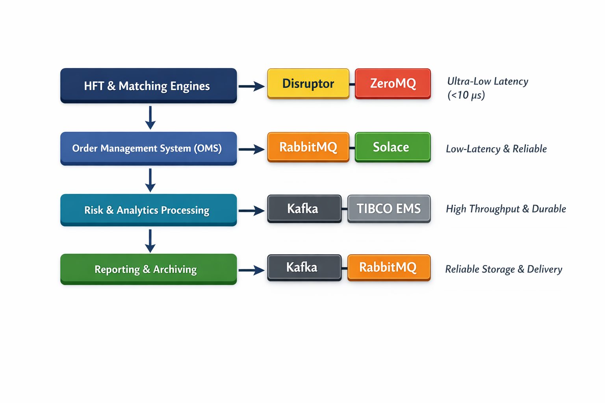

# Compare message queues used in financial system.

In financial systems, message queues are critical for **low-latency, high-throughput, and reliable delivery** of events like market data, trade orders, and risk alerts. Different message queue technologies have different trade-offs in latency, throughput, reliability, and features. Here’s a detailed comparison of the most common ones:

---

## 1. **Kafka (Apache Kafka)**

**Type:** Distributed log / pub-sub
**Use Cases in Finance:** Market data feeds, trade event streaming, post-trade processing, analytics pipelines.

**Pros:**

* Very high throughput (millions of messages/sec per cluster)
* Durable, persistent storage with replication
* Partitioning enables horizontal scaling
* Stream processing integration (Kafka Streams, ksqlDB)
* Exactly-once semantics for critical workflows

**Cons:**

* Latency is usually **ms-level**, may not meet ultra-low latency (<100 μs) requirements for HFT order routing
* Operational complexity for clusters

**Typical Latency:** 1–10 ms (tunable with batch size and flush settings)
**Reliability:** High (replication + acknowledgment)
**Ordering:** Guaranteed per partition

---

## 2. **RabbitMQ**

**Type:** AMQP broker / traditional message queue
**Use Cases in Finance:** Order routing, trade confirmations, alerting, microservice communication.

**Pros:**

* Supports multiple messaging patterns (pub-sub, request-reply, work queues)
* Mature ecosystem, many client libraries
* Flexible routing via exchanges and queues
* Good for **reliable message delivery** with acknowledgment and persistence

**Cons:**

* Not optimized for extremely high throughput (>100k msg/sec per node may need clustering)
* Latency is higher than specialized low-latency systems

**Typical Latency:** 1–10 ms
**Reliability:** High (ack + persistence)
**Ordering:** Per-queue

---

## 3. **Solace / PubSub+**

**Type:** Enterprise-grade message broker (pub-sub, queue, streaming)
**Use Cases in Finance:** Market data distribution, inter-dealer trade messaging, risk alerts.

**Pros:**

* Ultra-low latency (<100 μs in some setups)
* Hybrid support: pub-sub, queue, streaming
* Built-in replay and guaranteed delivery
* Supports TCP, MQTT, AMQP, JMS
* Enterprise-grade monitoring and security

**Cons:**

* Proprietary (license cost)
* Operational complexity for small teams

**Typical Latency:** <100 μs
**Reliability:** Very high (hardware-assisted failover, message replay)
**Ordering:** Per topic

---

## 4. **TIBCO EMS / Rendezvous**

**Type:** Enterprise messaging (pub-sub, queue)
**Use Cases in Finance:** Market data feeds, trade distribution, clearing systems.

**Pros:**

* Very mature in financial institutions
* Low latency (sub-ms possible)
* Strong reliability and persistence
* Advanced topics, selectors, and guaranteed delivery

**Cons:**

* Proprietary, expensive
* Not horizontally scalable in same way as Kafka

**Typical Latency:** ~200 μs–1 ms
**Reliability:** High
**Ordering:** Per subject / queue

---

## 5. **ZeroMQ / nanomsg**

**Type:** Lightweight messaging library (brokerless)
**Use Cases in Finance:** HFT, market data multicast, low-latency event streaming.

**Pros:**

* Extremely low latency (microsecond-level)
* Very flexible patterns (pub-sub, request-reply)
* Brokerless → minimal overhead
* Can be embedded directly into trading applications

**Cons:**

* No built-in persistence (application must handle reliability)
* Harder to scale and monitor compared to brokered solutions

**Typical Latency:** <50 μs (LAN), can be <10 μs with optimized setup
**Reliability:** Depends on app
**Ordering:** Depends on socket pattern

---

## 6. **Disruptor (LMAX Disruptor)**

**Type:** In-memory ring-buffer / event processing
**Use Cases in Finance:** HFT engines, order matching, low-latency event queues.

**Pros:**

* Ultra-low latency (<10 μs typical)
* Zero GC design (minimizes pauses)
* High throughput (millions/sec per core)
* Lock-free, cache-friendly architecture

**Cons:**

* In-memory only, not distributed (no cross-machine delivery)
* Application-level reliability and persistence must be handled separately

**Typical Latency:** 1–10 μs
**Reliability:** Only in-memory
**Ordering:** Guaranteed in ring buffer

---

## ✅ **Summary Table**

| Queue / Broker         | Latency    | Throughput        | Durability | Typical Use Case                  |
| ---------------------- | ---------- | ----------------- | ---------- | --------------------------------- |
| Kafka                  | 1–10 ms    | Millions/sec      | High       | Market data, analytics            |
| RabbitMQ               | 1–10 ms    | 100k–1M/sec       | High       | Trade routing, alerts             |
| Solace / PubSub+       | <100 μs    | High              | Very High  | Market data, inter-dealer comm    |
| TIBCO EMS / Rendezvous | 200 μs–1ms | High              | High       | Market data, clearing, risk       |
| ZeroMQ / nanomsg       | <50 μs     | Very High         | App-level  | HFT, multicast events             |
| LMAX Disruptor         | 1–10 μs    | Millions/sec/core | In-memory  | HFT matching engines, order queue |

---

### **Key Takeaways for Financial Systems**

1. **Ultra-low latency HFT** → use **Disruptor** or **ZeroMQ** (in-memory, brokerless).
2. **Persistent market data / downstream analytics** → **Kafka**, **TIBCO**, or **Solace**.
3. **Trade routing & microservices** → **RabbitMQ** (AMQP) or **Solace** for hybrid scenarios.
4. **Reliability vs speed tradeoff** → in-memory is fastest, brokered systems provide persistence and monitoring.

---

If you want, I can make a **diagram showing which queues are suitable for which financial system layer**, from HFT engines → OMS → risk analytics → reporting. That visual usually makes the trade-offs crystal clear.

Do you want me to make that diagram?

# make a diagram showing which queues are suitable for which financial system layer

