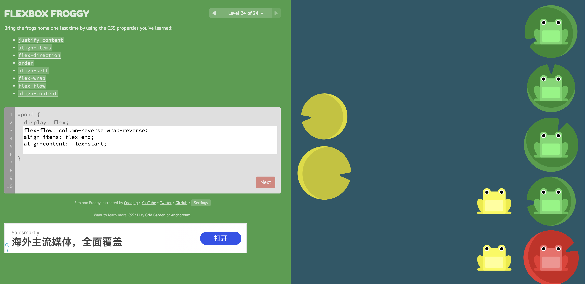

# #How to learn CSS layout/positioning as a former C# winform developer?

As a former **C# WinForms developer**, the fastest way to learn **CSS layout/positioning** is to **map familiar desktop UI layout concepts to web layout primitives**. The mental model is the biggest shift.

Below is the **translation guide + learning path** that usually works best for desktop engineers.

---

# 1. Map WinForms Concepts → CSS Concepts

| WinForms           | CSS Equivalent                   | Notes                            |
| ------------------ | -------------------------------- | -------------------------------- |
| `Control.Left/Top` | `position: absolute`             | Rarely used in modern web layout |
| `Dock`             | `flex` / `grid`                  | Primary layout tools             |
| `Anchor`           | `flex` alignment / `margin:auto` | Responsive positioning           |
| `Panel`            | `<div>` container                | Basic layout container           |
| `FlowLayoutPanel`  | Flexbox                          | One-dimensional layout           |
| `TableLayoutPanel` | CSS Grid                         | Two-dimensional layout           |
| Z-order            | `z-index`                        | Same stacking idea               |

**Key realization:**

Desktop UI → **pixel based**
Web UI → **flow based**

Elements **flow like text paragraphs by default**.

---

# 2. The Most Important CSS Layout Systems

You only need **3 positioning systems**.

### 1️⃣ Normal Flow (default)

Elements stack vertically.

```css
div {
  display: block;
}
```

Equivalent mental model:

```
Label
Textbox
Button
```

---

### 2️⃣ Flexbox (MOST IMPORTANT)

Equivalent to **FlowLayoutPanel**.

```css
.container {
  display: flex;
}
```

Example:

```css
.container {
  display: flex;
  gap: 10px;
}
```

```
[Button] [Textbox] [Button]
```

Alignment:

```css
justify-content: center;
align-items: center;
```

Think:

```
main-axis   = horizontal layout
cross-axis  = vertical layout
```

90% of modern UI uses **Flexbox**.

---

### 3️⃣ CSS Grid

Equivalent to **TableLayoutPanel**.

```css
.container {
  display: grid;
  grid-template-columns: 200px 1fr;
}
```

Layout:

```
Sidebar | Content
```

Example:

```
| 200px | fill remaining |
```

This is extremely powerful.

---

# 3. Positioning System

Use only when necessary.

### Relative

```css
position: relative;
```

Just **offset slightly**.

---

### Absolute

```css
position: absolute;
top: 10px;
left: 20px;
```

Equivalent to:

```
Control.Left
Control.Top
```

But usually avoided in modern layouts.

---

### Fixed

Pinned to screen.

```css
position: fixed;
bottom: 0;
```

Example: floating chat button.

---

### Sticky

Hybrid scroll behavior.

```css
position: sticky;
top: 0;
```

Example: sticky navbar.

---

# 4. The Modern Layout Recipe (90% of sites)

Typical page layout:

```
Header
Sidebar | Content
Footer
```

CSS:

```css
.page {
  display: grid;
  grid-template-rows: auto 1fr auto;
  height: 100vh;
}

.main {
  display: grid;
  grid-template-columns: 250px 1fr;
}
```

This replaces complex WinForms nesting.

---

# 5. The Biggest Mental Shift

WinForms:

```
Place controls manually
```

CSS:

```
Describe layout rules
Let browser compute positions
```

Example:

Instead of:

```
button.Left = 200
```

You say:

```
justify-content: space-between
```

---

# 6. The Only CSS Properties You Really Need

Learn these **10 first**:

```
display
flex
flex-direction
justify-content
align-items
gap
grid-template-columns
width
height
margin
```

After that:

```
position
z-index
overflow
```

---

# 7. The Best Way for Desktop Engineers to Learn

Do **visual experiments**.

Use:

### CSS Flexbox Froggy

Interactive flexbox game.

### CSS Grid Garden

Interactive grid learning.

You will understand layout **in 30 minutes**.

---

# 8. The Best Debugging Tool

Use **Chrome DevTools layout inspector**.

Open:

```
Right click → Inspect
```

Chrome shows:

```
Flex layout
Grid lines
Spacing
Alignment
```

This makes CSS much easier.

---

# 9. The Fastest Learning Path (for backend engineers)

Day 1:

```
HTML basics
Box model
Flexbox
```

Day 2:

```
Grid
Responsive layout
```

Day 3:

```
Positioning
Sticky
Z-index
```

That's enough for **90% of frontend work**.

---

# 10. Senior Engineer Insight

Most modern frontend frameworks:

* React
* Vue.js
* Next.js

**do NOT change CSS layout fundamentals.**

They only change **component structure**.

---

✅ **Good news for you:**
As a backend engineer, **CSS layout is actually the only hard part of frontend**.

Once you understand:

```
Flexbox + Grid
```

you're basically done.

---

💡 If you want, I can also show you:

**“CSS Layout in 20 minutes for backend engineers”**

It’s the **cheat sheet many senior engineers use**, covering **95% of real-world layouts**.


# #Show CSS Layout in 20 minutes for backend engineers

Here is the **“CSS Layout in ~20 minutes” cheat sheet** I give to backend engineers (especially people coming from WinForms/WPF/Qt).
You only need **4 concepts** to build almost every modern layout.

---

# 1. Everything Is a Box (The Box Model)

Every element is a rectangle.

```
+-----------------------+
|       margin          |
|  +-----------------+  |
|  |     border      |  |
|  |  +-----------+  |  |
|  |  | padding   |  |  |
|  |  | +-------+ |  |  |
|  |  | |content| |  |  |
|  |  | +-------+ |  |  |
|  |  +-----------+  |  |
|  +-----------------+  |
+-----------------------+
```

Important properties:

```css
width
height
padding
border
margin
```

**Pro tip (always do this):**

```css
* {
  box-sizing: border-box;
}
```

This makes layout predictable.

---

# 2. Default Layout = Normal Flow

By default elements stack vertically.

```html
<div>A</div>
<div>B</div>
<div>C</div>
```

Result:

```
A
B
C
```

This is called **document flow**.

---

# 3. Flexbox (Your Main Tool)

Flexbox = **FlowLayoutPanel from WinForms**.

```
[ item ][ item ][ item ]
```

Enable flex:

```css
.container {
  display: flex;
}
```

Example:

```html
<div class="toolbar">
  <button>Save</button>
  <button>Cancel</button>
</div>
```

```css
.toolbar {
  display: flex;
  gap: 10px;
}
```

Result:

```
[Save] [Cancel]
```

---

## Flex Direction

```css
flex-direction: row;
```

```
A B C
```

```css
flex-direction: column;
```

```
A
B
C
```

---

## Horizontal Alignment

```css
justify-content: center;
```

Options:

```
flex-start
center
flex-end
space-between
space-around
```

Example:

```css
.navbar {
  display: flex;
  justify-content: space-between;
}
```

```
Logo            Login
```

---

## Vertical Alignment

```css
align-items: center;
```

Example:

```css
.toolbar {
  display: flex;
  align-items: center;
}
```

---

# 4. Flex Grow (Fill Remaining Space)

Equivalent to **Dock=Fill**.

```css
flex: 1;
```

Example:

```
Sidebar | Content
```

```css
.layout {
  display: flex;
}

.sidebar {
  width: 200px;
}

.content {
  flex: 1;
}
```

Result:

```
|200px| remaining width |
```

---

# 5. CSS Grid (Two-Dimensional Layout)

Grid = **TableLayoutPanel**.

Enable grid:

```css
.container {
  display: grid;
}
```

Example layout:

```
Header
Sidebar | Content
Footer
```

```css
.page {
  display: grid;
  grid-template-rows: auto 1fr auto;
  height: 100vh;
}
```

Main area:

```css
.main {
  display: grid;
  grid-template-columns: 250px 1fr;
}
```

Result:

```
+-------------------+
| Header            |
+---------+---------+
|Sidebar  |Content  |
+---------+---------+
| Footer            |
+-------------------+
```

---

# 6. Positioning (Use Sparingly)

### Relative

```css
position: relative;
```

Offset slightly.

---

### Absolute

Equivalent to **manual pixel placement**.

```css
position: absolute;
top: 20px;
left: 10px;
```

Works relative to nearest **positioned parent**.

---

### Fixed

Pinned to screen.

```css
position: fixed;
bottom: 20px;
right: 20px;
```

Used for:

```
chat button
floating UI
```

---

### Sticky

Hybrid scroll behavior.

```css
position: sticky;
top: 0;
```

Used for sticky headers.

---

# 7. The 90% Real-World Layout Pattern

Almost every site is:

```
Header
Sidebar | Content
Footer
```

Example:

```css
body {
  margin: 0;
}

.page {
  display: grid;
  grid-template-rows: auto 1fr auto;
  height: 100vh;
}

.main {
  display: grid;
  grid-template-columns: 250px 1fr;
}
```

---

# 8. Centering Things (Classic CSS Problem)

Modern solution:

```css
.container {
  display: flex;
  justify-content: center;
  align-items: center;
}
```

Result:

```
perfect center
```

---

# 9. Spacing Between Elements

Do **NOT** use margin hacks.

Use:

```css
gap: 10px;
```

Example:

```css
.container {
  display: flex;
  gap: 10px;
}
```

---

# 10. Debugging Layout

Use **Chrome DevTools**.

Right click → Inspect

You will see:

* Flexbox overlays
* Grid lines
* spacing visualization

This is the fastest way to learn.

---

# 11. Minimal Layout Template

Here is a **simple modern layout skeleton**:

```html
<body>
  <header>Header</header>

  <div class="main">
    <aside>Sidebar</aside>
    <main>Content</main>
  </div>

  <footer>Footer</footer>
</body>
```

```css
body {
  margin: 0;
  display: grid;
  grid-template-rows: auto 1fr auto;
  height: 100vh;
}

.main {
  display: grid;
  grid-template-columns: 220px 1fr;
}
```

Done.

---

# 12. The Only CSS Layout Rules to Remember

If you remember **just this**, you can build most layouts:

```
display: flex
display: grid
flex: 1
gap
justify-content
align-items
```

Avoid using:

```
position: absolute
float
```

except for special cases.

---

# Mental Model for Backend Engineers

Think of CSS layout like **constraint solving**:

Instead of:

```
x = 200
y = 50
```

you define rules:

```
items arranged horizontally
space between them
center vertically
```

The browser computes the final layout.

---

✅ If you'd like, I can also show you:

**“5 CSS layout patterns every engineer should memorize”**

These cover **95% of real UI layouts** (navbar, dashboard, cards, forms, modals).


# #Flexbox Froggy (Level 24).




This is the final level of **Flexbox Froggy (Level 24)**. You must combine **flex-direction, wrap, justify-content, and align-content** to place the frogs correctly.

The key idea:

* Layout direction must be **reversed column**
* Rows must **wrap in reverse**
* Frogs must be **centered on the main axis**
* Wrapped columns must be **spread across the pond**

### ✅ Correct Solution

```css
#pond {
  display: flex;
  flex-flow: column-reverse wrap-reverse;
  justify-content: center;
  align-content: space-between;
}
```

### Why this works

| Property                                 | Purpose                                                     |
| ---------------------------------------- | ----------------------------------------------------------- |
| `flex-flow: column-reverse wrap-reverse` | Combines `flex-direction` and `flex-wrap` to flip both axes |
| `justify-content: center`                | Centers frogs vertically (main axis)                        |
| `align-content: space-between`           | Distributes wrapped columns across the pond                 |

### Mental model for backend engineers

Think of Flexbox like a **2-axis scheduler**:

```
Main axis   -> justify-content
Cross axis  -> align-items / align-content
```

And wrapping creates **multiple lanes**, which `align-content` distributes.

---

✅ **Pro tip:**
For most real-world layouts you only need to remember **3 flexbox patterns**:

```css
/* center everything */
display:flex;
justify-content:center;
align-items:center;

/* horizontal spacing */
display:flex;
justify-content:space-between;

/* responsive wrapping grid */
display:flex;
flex-wrap:wrap;
gap:16px;
```

---

If you want, I can also show a **10-minute mental model of Flexbox that makes CSS layout trivial for backend engineers** (much faster than memorizing properties).
